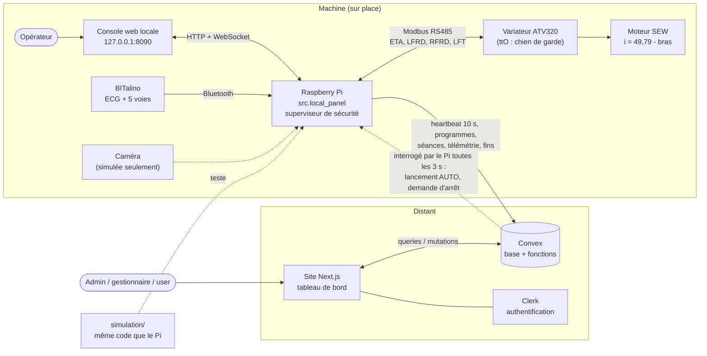

# Documentation Anheart

Anheart est le logiciel d'une **centrifugeuse d'entraînement**. Une personne est
allongée dans une capsule au bout d'un bras qui tourne. Un variateur Schneider
ATV320, commandé en Modbus RS485, entraîne un motoréducteur SEW (rapport 49,79).
Un BITalino mesure l'ECG, plus cinq autres voies en surveillance seulement.

Il existe deux sortes de séance :

- **AUTO** (programmée) : la fréquence cardiaque pilote la vitesse pour tenir une
  zone, par exemple « jog » 145-155 bpm.
- **MANUELLE** : l'opérateur fixe la vitesse, **uniquement depuis la machine**.

> **État réel.** Tout le logiciel du Pi est testé en simulation (3187 tests, 100 %
> des branches sur la chaîne de sécurité, 60 scénarios, 199 pannes, cohorte de
> 30 personnes). Le variateur réel a seulement été lu au banc. **Aucune séance
> avec une personne à bord n'a eu lieu.** Le nouveau code Convex est déployé sur
> le déploiement de **développement** et y a été testé de bout en bout avec une
> console en simulation (1er octobre 2026) ; la **production est inchangée**.
> Les nouvelles pages du site ont été ouvertes dans un navigateur, en local,
> contre ce déploiement de développement (2 octobre 2026) : les captures du
> [guide du tableau de bord](guides/guide-tableau-de-bord.md) sont réelles.
> Détails dans [deploiement.md](deploiement.md) et [securite.md](securite.md).

## Sommaire

| Document | Pour qui | Contenu |
|---|---|---|
| [demarrage-rapide.md](demarrage-rapide.md) | tout le monde | installer, lancer la console en simulation, le site, la simulation 2D ; pièges connus |
| [console-locale.md](console-locale.md) | opérateur | chaque page de la console du Pi, chaque bouton, chaque message ; routes HTTP |
| [tableau-de-bord.md](tableau-de-bord.md) | admin, gestionnaire, user | chaque page du site, rôles, droits de lancement, séance AUTO à distance |
| [convex.md](convex.md) | développeur | schéma, fonctions publiques, routes HTTP machine, déploiement |
| [raspberry-pi.md](raspberry-pi.md) | développeur | modules, boucle de contrôle, superviseur et ses règles, table des défauts variateur, capteurs, configuration, contrat de code |
| [framework-de-test.md](framework-de-test.md) | développeur | tests, gates, simulation, scénarios, cohorte, matrice de pannes, visualiseur |
| [deploiement.md](deploiement.md) | développeur, exploitant | environnements et clés, déployer Convex, le site, la simulation hébergée, le Raspberry Pi (Docker) ; ce qui a été vérifié |
| [securite.md](securite.md) | tout le monde | ce qui est garanti, ce qui ne l'est pas, défauts corrigés, résiduel |
| [menaces.md](menaces.md) | développeur, reviewer, responsable de jalon | modèle STRIDE, protections vérifiées dans le source, menaces ouvertes et tickets Linear |
| [release-threat-review.md](release-threat-review.md) | responsable de release | preuve de revue du modèle exigée à chaque jalon, release et avant pilote |
| [glossaire.md](glossaire.md) | tout le monde | LFT, ETA, LFRD, ttO, STO, CiA402, verdict, latch, xfail… |
| [roadmap.md](roadmap.md) | équipe | jalons et suivi (document tenu à part, rattaché au projet Linear) |
| [suivi-tickets.md](suivi-tickets.md) | développeur | file logicielle ordonnée, préparation du ticket courant et résultats de validation |

## Les quatre couches

| Couche | Dossier | Rôle |
|---|---|---|
| 1. Raspberry Pi | `raspberry-pi/` | **L'admin local.** Pilote le variateur, lit le BITalino, applique la sécurité, sert la console web locale (`python -m src.local_panel`). Il décide de tout ce qui touche au mouvement. |
| 2. Convex | `convex/` | La base de données et les fonctions distantes. Reçoit l'état et les séances du Pi ; garde les comptes, les machines, les droits. |
| 3. Site Next.js | `app/`, `components/`, `lib/`, `messages/` | Le tableau de bord distant (auth Clerk ; rôles admin, gestionnaire, user). Il lit et écrit dans Convex, **jamais** directement dans le Pi. |
| 4. Simulation | `simulation/` | Le banc d'essai logiciel : il fait tourner le **vrai** code du Pi contre un variateur et une physiologie simulés, avec la géométrie tirée de la CAO. |

## Architecture et flux

### Qui décide quoi

| Décision | Qui | Comment |
|---|---|---|
| Faire tourner, accélérer, ralentir, arrêter | **le Pi**, seul | superviseur de sécurité puis régulateur, à chaque cycle |
| Arrêter en dernier recours | **le variateur** | si le Pi cesse d'écrire, son délai ttO arrête le moteur sur rampe |
| Lancer une séance MANUELLE | **l'opérateur, à la console** | aucun chemin ne le permet depuis le site |
| Lancer une séance AUTO | l'opérateur à la console, **ou** un utilisateur autorisé sur le site | Convex vérifie les droits, la FC max et l'âge ; le Pi **revérifie tout** et peut refuser |
| Qui a le droit de lancer | admin et gestionnaire, sur le site | voir [tableau-de-bord.md](tableau-de-bord.md) |
| Afficher l'état, l'historique, les courbes | Convex et le site | à partir de ce que le Pi envoie |

### Ce qui voyage, et ce qui ne voyage jamais

Du Pi vers Convex (le Pi appelle, avec sa clé machine) : un heartbeat toutes les
10 s, les programmes compatibles avec la machine, chaque séance (AUTO ou
MANUELLE), la télémétrie échantillonnée à 1 Hz et envoyée par lots toutes les
5 s, et la fin de chaque séance avec sa raison.

De Convex vers le Pi, **exactement deux choses**, que le Pi va chercher lui-même
toutes les 3 s :

1. un lancement AUTO (programme, passager, FC max, âge), qui repasse par toutes
   les portes de la console ;
2. une demande d'arrêt, exécutée comme un arrêt ordinaire sur la rampe.

**Ce qui ne voyage jamais :**

- une séance **manuelle** n'est **jamais** lancée à distance : rien dans le code
  ne peut en construire une depuis le lien distant ;
- aucune consigne de vitesse, aucun acquittement, aucun réarmement de défaut ne
  vient du site ;
- le site ne parle jamais directement au Pi ;
- une panne réseau ne peut pas arrêter ni perturber une séance : elle rend
  seulement l'image du site périmée (une machine est affichée hors ligne après
  90 s sans heartbeat).

Détails : [raspberry-pi.md](raspberry-pi.md#8-la-synchronisation-avec-le-tableau-de-bord)
et [convex.md](convex.md).

## Par où commencer

- Voir la machine tourner sans matériel : [demarrage-rapide.md](demarrage-rapide.md), section 3.
- Comprendre pourquoi la machine s'est arrêtée : [console-locale.md](console-locale.md) et
  la table des règles dans [raspberry-pi.md](raspberry-pi.md#5-le-superviseur-de-sécurité).
- Modifier du code Python : lire d'abord le contrat strict
  (`.claude/skills/anheart-strict-python/SKILL.md`, résumé dans
  [raspberry-pi.md](raspberry-pi.md#13-le-contrat-de-code-strict-et-la-gate)) et passer la gate.
