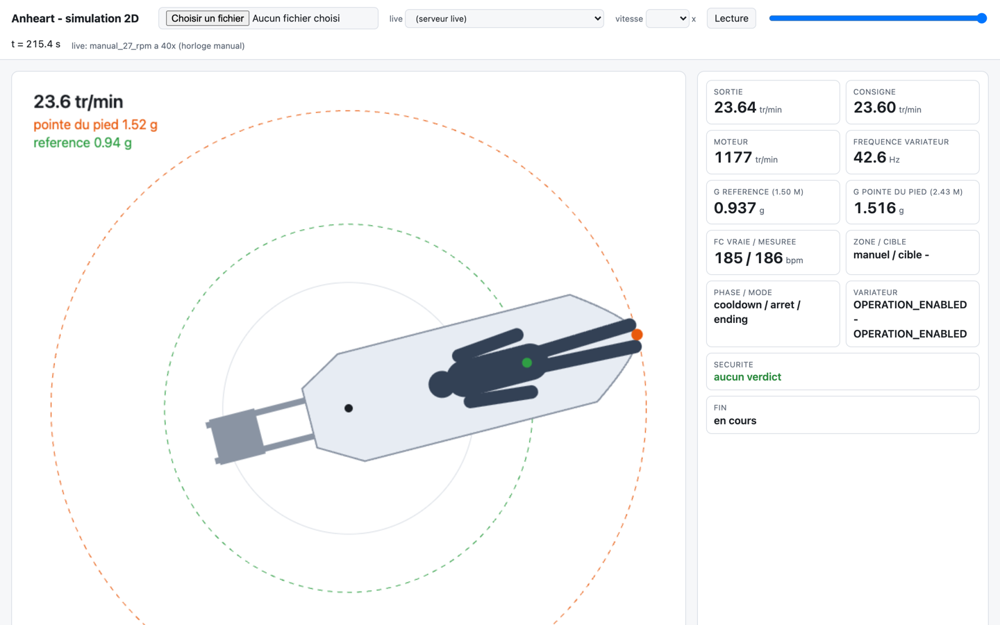

# Déploiement : Convex, site, simulation hébergée, Raspberry Pi

Ce document dit **où tourne quoi**, **comment on le déploie**, et **ce qui a été
réellement vérifié**. Il complète [convex.md](convex.md),
[tableau-de-bord.md](tableau-de-bord.md), [raspberry-pi.md](raspberry-pi.md) et
[framework-de-test.md](framework-de-test.md).

[Retour au sommaire](README.md) · termes : [glossaire](glossaire.md)

> **État réel au 2 octobre 2026.**
>
> - **Convex, développement** : le code de la branche `feat/pi-training-session`
>   est déployé sur le déploiement de développement et a été testé de bout en
>   bout avec une console de Pi en simulation (section 4).
> - **Convex, production** : **inchangé**. La production sert toujours la
>   version précédente. Le nouveau code n'y est pas.
> - **Site** : la production (branche `main`) est inchangée. Les nouvelles pages
>   ont été ouvertes dans un navigateur, en local, contre le Convex de
>   développement, le 2 octobre 2026 (section 5.4).
> - **Simulation hébergée** : en ligne sur Vercel (section 6).
> - **Raspberry Pi** : l'image Docker lance maintenant la console. Elle a été
>   construite et essayée **en simulation** dans un conteneur ARM64. Elle n'a
>   **jamais** tourné sur un vrai Pi, ni avec le vrai variateur, ni avec le vrai
>   BITalino (section 7). Depuis le 7 octobre 2026, un Pi s'installe par un
>   script et un service systemd lance l'image à l'allumage ; la CI exécute
>   cette installation en simulation ([pi-image.md](pi-image.md)).

> **Déploiements Vercel, 7 octobre 2026 (ANH-198).** Le dépôt contient
> maintenant de quoi ne plus rien déployer à chaque push, et deux boutons qui
> déploient à la demande ([section 5.1](#51-comment-il-se-déploie)). **Aucun
> des deux boutons n'a encore été lancé** : ils n'apparaissent dans GitHub
> qu'une fois leurs fichiers arrivés sur `main`, et ils échouent tant que les
> réglages de la [section 5.5](#55-réglages-à-faire-une-fois-à-la-main) ne
> sont pas faits.

## Sommaire

1. [Les environnements](#1-les-environnements)
2. [Les clés et où elles sont rangées](#2-les-clés-et-où-elles-sont-rangées)
3. [Déployer Convex](#3-déployer-convex)
4. [Essai de bout en bout du 1er octobre 2026](#4-essai-de-bout-en-bout-du-1er-octobre-2026)
5. [Le site sur Vercel et en local](#5-le-site-sur-vercel-et-en-local)
6. [Le moteur de simulation hébergé](#6-le-moteur-de-simulation-hébergé)
7. [Le Raspberry Pi](#7-le-raspberry-pi)
8. [Reste à faire](#8-reste-à-faire)

---

## 1. Les environnements

| Brique | Développement | Production |
|---|---|---|
| Convex (équipe `anheartpro`, projet `anheart`) | `standing-jay-887` | `clean-giraffe-153` |
| URL des fonctions (site) | `https://standing-jay-887.convex.cloud` | `https://clean-giraffe-153.convex.cloud` |
| URL des routes machine (Pi) | `https://standing-jay-887.convex.site` | `https://clean-giraffe-153.convex.site` |
| Clerk (émetteur des jetons) | `https://major-macaw-92.clerk.accounts.dev` | `https://clerk.gauratechnologies.com` |
| Site (Vercel, projet `anheart`) | en local : `npm run dev` | `www.gauratechnologies.com`, `www.anheart.ai`, `anheart-wine.vercel.app` |
| Simulation hébergée (Vercel, projet `anheart-simulation`) | - | `https://anheart-simulation.vercel.app` |

Le compte Vercel est celui du client (`anheartpro`, offre Hobby, portée
« Anheart's projects »).

**Chaque déploiement Convex fait confiance à une seule instance Clerk** (variable
`CLERK_JWT_ISSUER_DOMAIN` du déploiement). Un site branché sur le Convex de
développement doit donc utiliser les clés Clerk de développement, et
inversement. Mélanger les deux donne un site où l'on se connecte mais où toutes
les requêtes Convex échouent.

---

## 2. Les clés et où elles sont rangées

Aucune clé n'est dans le dépôt. Tous les fichiers ci-dessous sont ignorés par git.

| Fichier | Clé | Rôle |
|---|---|---|
| `.env.local` (racine) | `CONVEX_DEPLOY_KEY` | Clé du déploiement de **développement**. La CLI Convex la lit toute seule : `npx convex ...` vise donc le développement par défaut. |
| `.env.local` | `CONVEX_DEPLOY_KEY_PROD` | Clé du déploiement de **production**. La CLI **ne lit pas** ce nom : une commande ne touche la production que si on la lui passe à la main (section 3.3). |
| `.env.local` | `CONVEX_DEPLOYMENT`, `NEXT_PUBLIC_CONVEX_URL` | Écrites par `npx convex dev`. Le site lit la seconde. |
| `.env.local` | `NEXT_PUBLIC_CLERK_PUBLISHABLE_KEY` | Clé publique de l'instance Clerk de développement. |
| `.env.local` | `CLERK_SECRET_KEY` | Clé secrète de l'instance Clerk de **développement** (`sk_test_...`). Sans elle le site ne démarre pas en local. |
| `.vercel-cli/` (racine) | connexion de la CLI Vercel | Connexion au compte du client, valable pour ce dépôt seulement : passer `--global-config .vercel-cli` à chaque commande `vercel`. |
| `/etc/anheart/anheart.env` (sur le Pi, lisible par root seul) | `MACHINE_API_KEY`, `CONVEX_URL` | La clé de la machine et l'hôte `.convex.site`. Écrit par `scripts/install.sh`, hors du dépôt ; sur un poste de développement, le même rôle est tenu par `raspberry-pi/.env`. |

Les variables du projet Vercel `anheart` (`NEXT_PUBLIC_CONVEX_URL`,
`NEXT_PUBLIC_CLERK_PUBLISHABLE_KEY`, `CLERK_SECRET_KEY`,
`CLERK_JWT_ISSUER_DOMAIN`) ont **la même valeur** pour la production, les
préversions et le développement : ce sont les valeurs de production. Conséquence
en section 5.2.

Les deux boutons de déploiement lisent quatre secrets rangés dans les réglages
GitHub du dépôt, jamais dans un fichier : `VERCEL_TOKEN`, `VERCEL_ORG_ID`,
`VERCEL_PROJECT_ID_SITE` et `VERCEL_PROJECT_ID_SIMULATION`
([section 5.5](#55-réglages-à-faire-une-fois-à-la-main)).

Une clé de déploiement Convex se génère dans le tableau de bord Convex : choisir
le déploiement (Development ou Production) dans le sélecteur du haut, puis
Settings, « URL & Deploy Key ». La clé « Preview » de la page de réglages **du
projet** ne donne accès à aucun déploiement existant.

---

## 3. Déployer Convex

### 3.1 Vers le développement

Depuis la racine du dépôt :

```sh
npx convex dev --once        # pousse convex/ vers standing-jay-887, puis s'arrête
```

La commande valide le schéma contre les données déjà présentes : si un document
existant ne respecte pas le nouveau schéma, le déploiement est refusé et rien ne
change. Le 1er octobre 2026 elle a ajouté sept index (`machine_profiles`,
`machine_user_permissions`, `sessions.by_machine_and_local_ref`,
`training_telemetry`) sans rien refuser.

`npm run dev` fait la même chose en continu, à côté de `next dev`.

Depuis le multi-organisation (ANH-114), un déploiement qui contient déjà des
données doit recevoir **une fois** la migration, juste après le code :

```sh
npx convex run migrations/multiOrganization:attachExistingRowsToAnheart '{}'
```

Elle n'a encore été lancée sur aucun déploiement.

**Entre le déploiement du code et la fin de la migration**, aucune ligne n'a
encore d'organisation. Pendant cet intervalle :

- tout appel du tableau de bord qui dépend d'une organisation est **refusé,
  pour tout le monde, admin compris** (« Your account does not belong to an
  organization ») : listes, détails, lancement, et aussi **la demande d'arrêt à
  distance d'une séance en cours**. L'arrêt à la console de la machine n'est
  pas concerné ;
- la liste des pratiquants servie à la machine (`/api/machine/roster`) est
  **vide** ;
- une séance démarrée à la console est enregistrée **sans son pratiquant**, et
  la migration ne le rétablit pas ensuite ;
- les autres routes machine (heartbeat, télémétrie, statut, fin de séance)
  répondent comme avant.

**Consigne : déployer quand aucune séance n'est en cours, et lancer la
migration aussitôt.** Procédure complète, variable `ANHEART_ORG_ID` et
réglages Clerk : [convex.md](convex.md#activer-le-multi-organisation).

### 3.2 Vérifier un déploiement sans navigateur

```sh
npx convex function-spec > /tmp/spec.json   # la liste des fonctions déployées
npx convex data machines                    # lire une table
npx convex env list                         # les variables du déploiement
```

Pour appeler une fonction publique **au nom d'un compte**, la CLI accepte une
identité. `subject` est le `clerkId` du compte (colonne `clerkId` de la table
`users`) :

```sh
npx convex run training:listLaunchableMachines '{}' \
  --identity '{"subject":"user_xxx","issuer":"https://major-macaw-92.clerk.accounts.dev"}'
```

C'est ce qui a servi à l'essai de la section 4. Cela ne marche qu'avec une clé de
déploiement : ce n'est pas un contournement de l'authentification du site.

### 3.3 Vers la production

**Pas encore fait.** La production est en service : le déploiement se décide,
il ne se lance pas par habitude.

```sh
CONVEX_DEPLOY_KEY="$(grep '^CONVEX_DEPLOY_KEY_PROD=' .env.local | cut -d= -f2-)" npx convex deploy
```

Avant de le lancer :

1. Le nouveau schéma n'ajoute que des tables et des champs facultatifs, et rend
   `sessions.userId` et `machines.config` facultatifs. Dans sa version d'avant
   le retrait de l'ancien mode ECG, il a été accepté tel quel par les données
   de développement ; la version actuelle n'a été poussée sur aucun
   déploiement. Les données de production peuvent différer : `convex deploy`
   refusera le tout s'il trouve un document non conforme, sans rien modifier.
2. Le site de production (branche `main`) appelle l'ancienne API, et **elle
   n'est plus entièrement là**. Le retrait de l'ancien mode d'enregistrement
   ECG a supprimé trois mutations du module `sessions` (création, fin et
   annulation d'une séance d'enregistrement), et `machines.createMachine` /
   `updateMachine` refusent maintenant l'argument `config` que l'ancien site
   envoie. Tant que l'ancien site tourne contre le nouveau Convex, son bouton
   « Nouvelle session », la fin d'un enregistrement, et la création ou la
   modification d'une machine échouent. Les autres fonctions gardent leur nom
   et leurs arguments ; `sessions.listSessions` renvoie deux champs de plus
   (`kind`, `origin`).
3. Fusionner dans `main` ne déploie plus le site : il se déploie par le bouton
   « Déployer en production (main) » ([§5.1](#51-comment-il-se-déploie)).
   Ordre : fusionner dans `main` ; puis, dans une même fenêtre et quand aucune
   séance n'est en cours, Convex d'abord et le site **aussitôt après** par le
   bouton, à cause du point 2. Dans l'autre ordre, le nouveau site ne trouve
   pas l'heure du serveur (`serverNow`) dans les réponses de l'ancien Convex :
   il affiche toutes les machines « Hors ligne » et toutes les données périmées
   jusqu'au déploiement de Convex
   ([tableau-de-bord.md §6](tableau-de-bord.md#fraîcheur-recalculée-à-lhorloge)).
   Ce changement n'ajoute ni table, ni champ, ni index, ni migration. Une
   exception tant que `main` n'a pas reçu `vercel.json` : un push sur `main`
   qui n'apporte pas ce fichier déploie encore le site de production tout seul
   ([§5.1](#avant-et-après-larrivée-sur-main)).
4. Exécuter les deux mutations de migration du retrait de l'ancien mode ECG
   (voir [convex.md](convex.md#migration-du-retrait-de-lancien-mode-ecg)).
5. Créer le premier admin et la machine (voir [convex.md](convex.md#8-déployer)).
6. Déployer quand aucune séance n'est en cours, et lancer la migration
   multi-organisation aussitôt après : entre les deux, le tableau de bord
   refuse tout, y compris une demande d'arrêt à distance (voir
   [§3.1](#31-vers-le-développement)). Suivre ensuite la
   [procédure d'activation](convex.md#activer-le-multi-organisation).
   `users.getCurrentUser` renvoie deux informations de plus (`organization`, et
   le rôle `org_admin`) : à vérifier sur une préversion du site, comme le
   point 2.

### 3.4 Ordre de mise à jour : les consoles d'abord, Convex ensuite

Le contrat entre une console et Convex est versionné
([convex.md](convex.md#11-versions-et-compatibilité)) : deux côtés qui ne sont
pas au même niveau se refusent. Les deux sens échouent du bon côté (aucun
lancement distant n'est armé), mais pas au même prix.

| Situation | Effet |
|---|---|
| Console à jour, Convex antérieur au contrat | Heartbeat, programmes, séances lancées à la machine, télémétrie et fins de séance fonctionnent. Un arrêt venu du tableau de bord aussi : demande d'arrêt, ou séance que le serveur ne tient plus pour active. Le **lancement distant** est perdu : la console le refuse, parce que la réponse du poll n'annonce pas de version. La fiche machine n'affiche pas les versions, que cet ancien Convex ne stocke pas. |
| Console antérieure au contrat (elle n'envoie pas l'en-tête), Convex à jour | Convex répond 426 à toutes ses requêtes, sauf celle qui porte la demande d'arrêt. La machine est **affichée hors ligne**, ses programmes ne sont plus synchronisés, sa télémétrie et ses fins de séance sont **refusées**, et aucun lancement distant ne lui parvient. Un arrêt venu du tableau de bord lui parvient encore. |

D'où l'ordre :

1. **Les consoles d'abord.** Une console à jour fonctionne avec l'ancien Convex,
   au lancement distant près.
2. **Convex ensuite**, quand toutes les consoles sont à jour.
3. **Jamais pendant une séance.** Une séance en cours au moment où Convex cesse
   de servir la majeure de la console continue sous le seul superviseur local
   et s'arrête normalement à la console ; sa télémétrie et sa fin, refusées,
   sont abandonnées, et elle reste `active` dans Convex.

`scripts/pi/preflight.sh` dit dans quelle situation se trouve une console avant
de la démarrer ([section 7.5](#75-vérifier-puis-démarrer)).

---

## 4. Essai de bout en bout du 1er octobre 2026

Conditions : Convex de développement (`standing-jay-887`), une console de Pi en
**simulation complète** sur un Mac (`MOTOR_BACKEND=sim`, `ECG_SOURCE=sim`,
caméra simulée « capsule occupée »), reliée par une vraie clé machine. Les
fonctions du site ont été appelées par la CLI au nom d'un compte admin
(section 3.2). **Aucun matériel, aucune personne, aucun navigateur.**

Données créées pour l'essai, laissées dans la base de développement : la machine
« Banc de test (simulation) », le patient « Pratiquant Test »
(`pratiquant.test@example.com`, FC max 180, né en 1990, droit de lancement sur
cette machine), et quatre séances. La séance du 2 octobre (section 5.4) y a
ajouté trois comptes de démonstration et quatre séances.

| # | Ce qui a été fait | Résultat |
|---|---|---|
| 1 | La console démarre avec `CONVEX_URL` et la clé | Heartbeat accepté ; la machine passe `online` ; `machines.live` rempli (`runMode: repos`). |
| 2 | Synchronisation des programmes | « 30 min » et « 45 min » arrivent dans `machine_profiles`. Avec des paliers cardiaques différents de ceux des programmes (165/175 au lieu de 148/158), la console n'envoie **aucun** programme : c'est le comportement voulu. |
| 3 | Séance **manuelle** à la console, cible 5 tr/min de sortie | Séance créée dans Convex (`kind: manual`, `origin: local`, sans pratiquant) ; machine `in_session` ; télémétrie à 1 Hz ; après STOP : `completed`, raison `operator_stop: fin du test manuel`. |
| 4 | Manuel déclaré « banc » alors que la caméra simulée voit quelqu'un | Refusé par la console : « une personne est vue dans la capsule alors que BANC est déclaré ». Rien n'est créé dans Convex. |
| 5 | `launchAutoSession` sans physiologie | Refusé : « The rider's max heart rate (or birth year) must be set by a manager before an auto session ». |
| 6 | FC max 150 pour une zone haute de 138 | Refusé : « Zone up to 138 bpm exceeds 90% of this rider's max heart rate (150 bpm → ceiling 135 bpm) ». |
| 7 | FC max 300 | Refusé : « Max heart rate must be within 100-220 bpm ». |
| 8 | Pratiquant né en 2012 | Refusé : « Rider is 13: auto sessions require at least 18 years ». |
| 9 | Programme inconnu | Refusé : « This programme is not on the machine ». |
| 10 | **Lancement AUTO à distance** (programme « 30 min ») | Séance `pending` ; la console la prend au tour d'interrogation suivant, repasse ses propres portes, l'arme ; la séance passe `active` avec le nom du pratiquant, sa FC max, son âge (35) et le nom du lanceur. |
| 11 | Second lancement pendant que le premier attend | Refusé : « A session is already waiting for this machine ». |
| 12 | Télémétrie et état en direct pendant la séance | `getSessionTelemetry` et `getMachineLive` renvoient les points à 1 Hz et un état non périmé. |
| 13 | **Arrêt demandé à distance** (`requestStop`) pendant l'échauffement | La console l'exécute comme un arrêt ordinaire, attribué au tableau de bord ; après la phase de récupération la séance passe `completed`, raison `operator_stop: arret demande depuis le tableau de bord`. |
| 14 | Droits de lancement | Accordé au patient ; listé avec le nom de celui qui l'a accordé ; refusé pour un admin (« Launch rights are granted to users; managers and admins already have them »). |
| 15 | Routes machine sans clé, puis avec une mauvaise clé | 401 dans les deux cas. |
| 16 | `users.getCurrentUser` après réglage de la FC max du compte | Fonctionne. Le défaut n° 3 de [convex.md](convex.md#9-défauts-connus-et-reste-à-faire) est donc corrigé. |

### Ce que l'essai a trouvé

| Constat | Conséquence |
|---|---|
| **Séance orpheline après un arrêt de la console.** Si le processus de la console s'arrête pendant une séance (arrêt du conteneur, coupure de courant), il met bien la consigne à zéro, mais il n'envoie pas la fin de séance à Convex. Au redémarrage il ne la reprend pas non plus. | La séance reste `active` dans Convex indéfiniment. La machine repasse `online` au redémarrage, mais l'historique garde une séance « en cours » qui ne l'est plus. À corriger : soit la console envoie la fin avant de sortir, soit Convex clôt les séances d'une machine passée hors ligne. |
| Avec l'ECG **simulé** de la console, la FC devient par moments « non fiable » : le superviseur lève la règle `hr_stale` (« no fresh trustworthy heart rate »), gèle ou réduit la vitesse. En séance AUTO le moteur n'avait pas démarré après une minute d'échauffement ; en séance manuelle la vitesse a été réduite après le palier. | C'est le superviseur qui fait son travail face à un signal simulé bruité, pas un défaut de Convex ni du site. Mais une démonstration d'une séance AUTO complète n'est pas possible aujourd'hui avec la console en simulation : il faut d'abord comprendre pourquoi son ECG simulé perd la confirmation dès que le bras tourne. |
| Les séances démarrées à la machine n'ont pas de pratiquant (`userId` absent). | Déjà connu (défaut n° 4 de convex.md) ; confirmé. |

### Ce que l'essai ne couvre pas

- Cet essai n'a ouvert aucune page du site. Les pages l'ont été le lendemain
  (section 5.4).
- Les rôles `gestionnaire` et `user` n'ont pas appelé de fonction d'écriture :
  seul un admin l'a fait.
- Rien sur du vrai matériel.

---

## 5. Le site sur Vercel et en local

### 5.1 Comment il se déploie

**Un push ne déploie plus rien dès que son commit contient le `vercel.json` de
la racine du dépôt.** Le projet Vercel `anheart` reste relié au dépôt GitHub
`anheartpro-byte/Anheart`, mais ce fichier coupe les déploiements déclenchés
par Git, pour toutes les branches
(`git.deploymentEnabled: false`,
[documentation Vercel](https://vercel.com/docs/project-configuration/git-configuration#turning-off-all-automatic-deployments)).
Les deux projets Vercel reliés au dépôt, `anheart` (le site) et
`anheart-simulation` ([section 6](#6-le-moteur-de-simulation-hébergé)),
construisent depuis la racine du dépôt : ils lisent ce même fichier.

La règle suit le commit poussé, pas la branche. Constat du 7 octobre 2026 sur
la PR #40, qui apporte ce fichier : son premier commit, poussé sur une branche
de travail, n'a reçu de Vercel ni déploiement ni statut, pour aucun des deux
projets ; un commit d'une autre branche, sans le fichier, poussé quelques
minutes plus tôt, avait reçu les deux statuts. Ce constat vaut pour une branche de
travail : aucun push n'a été fait sur `main` (voir
[plus bas](#avant-et-après-larrivée-sur-main)).

Le site et la simulation se déploient par deux boutons de GitHub, dans l'onglet
**Actions** du dépôt :

| Workflow (colonne de gauche d'Actions) | Branche déployée | Vers | Ce qu'il exige |
|---|---|---|---|
| « Déployer en production (main) » | `main` | la production ([section 1](#1-les-environnements)) | le mot `production` saisi dans le champ de confirmation ; l'environnement GitHub `production` et son approbation |
| « Déployer la préversion (develop) » | `develop` | une préversion Vercel, à une adresse nouvelle à chaque déploiement | l'environnement GitHub `preview` |

Pour lancer un déploiement :

1. **Actions**, cliquer sur le nom du workflow, puis **Run workflow**.
2. « Use workflow from » : laisser `main` pour la production ; **choisir
   `develop`** pour la préversion (GitHub propose `main` par défaut). Sur toute
   autre branche, le bouton refuse avec le message « Mauvaise branche » et rien
   n'est déployé.
3. « Quoi déployer » : `site`, `simulation` ou `site et simulation`.
4. Pour la production, écrire `production` dans le champ de confirmation. Tout
   autre texte est refusé (« Confirmation refusée »).
5. **Run workflow**. Pour la production, approuver l'exécution quand GitHub le
   demande (« Review deployments »).
6. La page de l'exécution donne, dans son résumé, le commit déployé et
   l'adresse obtenue.

Le commit déployé est la tête de la branche au moment du clic, même si
l'approbation vient plus tard. Deux déploiements de la même cible ne se
chevauchent pas : le second attend la fin du premier. Chaque déploiement compte
dans la limite du compte (offre Hobby : 100 déploiements par jour).

**La production du site ne se déploie que dans la fenêtre du déploiement de
Convex, jamais pendant une séance** ([§3.3](#33-vers-la-production)).

Ce que fait le bouton pour le site, sur un runner GitHub
(`.github/workflows/deploy-production.yml` et `deploy-preview.yml`). C'est la
procédure que Vercel documente pour GitHub Actions
([guide Vercel](https://vercel.com/kb/guide/how-can-i-use-github-actions-with-vercel)) :

1. `vercel pull` lit les réglages du projet `anheart` et les variables de
   l'environnement visé (Production ou Preview) ;
2. `vercel build` construit le site : `npm install`, puis `npm run build`, sur
   Node 24, comme le faisait Vercel à chaque push ;
3. `vercel deploy --prebuilt` envoie ce qui a été construit et rend l'adresse.

La CLI Vercel est installée à une version figée (`VERCEL_CLI_VERSION`, en tête
des deux workflows : 62.1.0, celle que l'image de construction de Vercel
utilisait pour le site le 7 octobre 2026). Le jeton n'est remis qu'aux étapes
qui appellent Vercel, jamais à l'installation ni à la construction. Pour la
simulation, le bouton suit une autre procédure, celle de `deploy.sh`
([section 6.4](#64-redéployer)).

Conséquence de la construction hors de Vercel : seules les variables dont
Vercel rend encore la valeur (type « Config ») arrivent à la construction.
`NEXT_PUBLIC_CONVEX_URL` et `NEXT_PUBLIC_CLERK_PUBLISHABLE_KEY`, que le site
fige à la construction, doivent être de ce type. Vercel ne rend plus la valeur
d'une variable de type « Secret » une fois enregistrée
([documentation Vercel](https://vercel.com/docs/environment-variables/sensitive-environment-variables)) :
si `CLERK_SECRET_KEY` est de ce type, elle n'arrive pas sur le runner, la
construction n'en a pas besoin, et Vercel la donne au site à l'exécution. Le
type de ces variables dans le projet n'a pas été relevé.

#### Avant et après l'arrivée sur `main`

Ce qui précède dépend de la présence de trois fichiers sur `main` :
`vercel.json` et les deux workflows. Au 7 octobre 2026 ils n'y sont pas.

- **Les boutons.** GitHub n'affiche « Run workflow » que pour un workflow
  présent sur la branche par défaut du dépôt, `main`. Tant que les deux
  fichiers de workflow n'y sont pas, aucun bouton n'apparaît et rien ne peut
  être déployé depuis GitHub.
- **Les pushs sur `main`.** `main` ne contient pas encore `vercel.json` : un
  push sur `main` qui ne l'apporte pas (une correction faite directement sur
  `main`, par exemple) **déploie encore le site de production tout seul**. Le
  commit qui apporte le fichier sur `main` (la fusion de la première release,
  ou une PR dédiée) ne devrait pas être déployé, puisque la règle suit le
  commit. **Ce n'est pas constaté** : `main` est la branche de production des
  deux projets, et aucun push n'y a été fait. Le vérifier au premier push sur
  `main`, dans Vercel ou sur le commit dans GitHub (aucun statut « Vercel »).
- **Les autres branches.** Une branche partie de `develop` après ANH-198
  contient `vercel.json` : ses pushs ne déploient rien. Une branche plus
  ancienne crée encore deux préversions à chaque push, jusqu'à ce qu'elle
  reprenne `develop`.

Une fois les trois fichiers sur `main` et ce constat fait, plus aucun push ne
déploie : restent les deux boutons, et `deploy.sh` en secours pour la simulation
([section 6.4](#64-redéployer)).

### 5.2 Les préversions pointent sur la production

Comme les variables Vercel sont les mêmes partout (section 2), **une préversion
du site parle au Convex de production et au Clerk de production**. Tant que
c'est le cas, la préversion déployée par le bouton :

- demande un compte de production pour se connecter ;
- **lit et écrit les données de production** (comptes, machines, séances) : ce
  qu'on y fait est fait en production ;
- appelle le Convex de production avec le code de `develop` : toute page qui
  utilise une fonction absente de la production échoue.

Ce n'est donc pas un bac à sable.

Pour qu'une préversion serve à tester, donner à l'environnement « Preview » du
projet Vercel `anheart` ses propres valeurs (**Settings**, **Environment
Variables**) : `NEXT_PUBLIC_CONVEX_URL` du développement, et les deux clés
Clerk de développement. Ne pas toucher aux valeurs « Production ». Les deux
variables `NEXT_PUBLIC_...` sont figées à la construction : après le réglage,
relancer le bouton de préversion pour qu'il prenne effet.

L'adresse d'une préversion est protégée par la connexion Vercel (réglage
« Vercel Authentication » du projet `anheart`, relevé le 7 octobre 2026) : il
faut être connecté au compte Vercel du client pour l'ouvrir.

La simulation hébergée n'est pas concernée : elle ne lit aucune donnée
([section 6.1](#61-ce-que-cest)).

### 5.3 Lancer le site en local sur le Convex de développement

```sh
npm install
npm run dev:frontend         # next dev seul ; npm run dev lance aussi convex dev
```

Il faut dans `.env.local` : `NEXT_PUBLIC_CONVEX_URL` (déjà écrit),
`NEXT_PUBLIC_CLERK_PUBLISHABLE_KEY` (déjà écrit) et `CLERK_SECRET_KEY` de
l'instance Clerk de **développement**. Sans la clé secrète, toute page répond
500 : « Missing secretKey ».

### 5.4 Séance de captures du 2 octobre 2026

Le site a tourné en local (`next dev`, port 3100) contre le Convex de
développement, avec une console de Pi en simulation complète reliée par sa clé.
Un navigateur piloté par script a ouvert les pages et pris les captures du
[guide du tableau de bord](guides/guide-tableau-de-bord.md) (37 fichiers
`docs/guides/img/site-*.png`).

Trois comptes de démonstration ont été créés dans l'instance Clerk de
**développement**, par son API d'administration (l'inscription par le
formulaire est protégée contre les robots) :

| Compte | Rôle | Réglages |
|---|---|---|
| Claire Martin, `claire.martin@example.com` | admin | - |
| Julien Bernard, `julien.bernard@example.com` | gestionnaire | gère la machine « Banc de test (simulation) », et les patients Léa Dubois et Pratiquant Test |
| Léa Dubois, `lea.dubois@example.com` | user | FC max 182, née en 1992, droit de lancement sur la machine de test |

Ces comptes, leurs lignes dans Convex et les séances de démonstration sont
restés dans les données de développement. Les supprimer : dans Clerk
(Development, Users) puis dans la page **Utilisateurs** du site.

Ce que les écrans ont montré, y compris les défauts, est consigné dans le guide,
[§9.4](guides/guide-tableau-de-bord.md#94-ce-que-les-vrais-écrans-ont-montré-2-octobre-2026).
Limites : les formulaires n'ont pas été soumis depuis le navigateur ; les
écritures (rôles, droits, physiologie, lancement, arrêt) ont été faites par la
ligne de commande, au nom des comptes de démonstration.

### 5.5 Réglages à faire une fois, à la main

Rien de ce qui suit n'est fait par le dépôt, et rien n'en a été fait par
ANH-198. C'est au chef de projet, dans cet ordre.

**1. Créer les deux environnements GitHub.** Dans le dépôt : **Settings**,
**Environments**, **New environment**.

| Environnement | Réglages |
|---|---|
| `production` | « Required reviewers » : la ou les personnes qui approuvent un déploiement en production (ne pas cocher « Prevent self-review » si la même personne lance et approuve). « Deployment branches and tags » : « Selected branches and tags », avec la seule branche `main`. |
| `preview` | « Deployment branches and tags » : « Selected branches and tags », avec la seule branche `develop`. Pas d'approbation, sauf décision contraire. |

Le faire **avant** le premier lancement : GitHub crée tout seul, sans aucune
règle, un environnement qui n'existe pas encore.

**2. Créer le jeton Vercel et enregistrer les quatre secrets.**

| Secret | Valeur | Où la trouver |
|---|---|---|
| `VERCEL_TOKEN` | un jeton d'accès du compte Vercel du client | Vercel, **Account Settings**, **Tokens**, créer un jeton : portée « Anheart's projects », avec une date d'expiration. La valeur n'est affichée qu'une fois. |
| `VERCEL_ORG_ID` | l'identifiant de l'équipe (il commence par `team_`) | Vercel, équipe « Anheart's projects », **Settings**, **General**, « Team ID » |
| `VERCEL_PROJECT_ID_SITE` | l'identifiant du projet `anheart` (il commence par `prj_`) | Vercel, projet `anheart`, **Settings**, **General**, « Project ID » |
| `VERCEL_PROJECT_ID_SIMULATION` | l'identifiant du projet `anheart-simulation` | Vercel, projet `anheart-simulation`, **Settings**, **General**, « Project ID » |

Les enregistrer comme **secrets d'environnement**, dans chacun des deux
environnements de l'étape 1 (**Settings**, **Environments**, l'environnement,
« Environment secrets ») : les quatre noms dans `production`, les quatre mêmes
dans `preview`. Un secret d'environnement n'est remis qu'à un job qui passe par
cet environnement, donc par son approbation et par sa restriction de branche.
Les workflows les lisent de la même façon s'ils sont enregistrés comme secrets
du dépôt (**Settings**, **Secrets and variables**, **Actions**) : c'est plus
court, quatre saisies au lieu de huit, mais ils sont alors remis à n'importe
quel workflow du dépôt.

S'il manque un secret, le job échoue aussitôt avec le message « Secret
manquant » et le nom du secret ; aucune valeur n'est jamais affichée. À
l'expiration du jeton, les boutons échouent à la première étape qui appelle
Vercel : créer un nouveau jeton et remplacer la valeur de `VERCEL_TOKEN`.

**3. Faire arriver trois fichiers sur `main`** : `vercel.json`,
`.github/workflows/deploy-production.yml` et
`.github/workflows/deploy-preview.yml`. Soit par la première release
(`develop` vers `main`, [release.md](release.md#3-le-déroulé)), qui apporte
tout ; soit plus tôt, par une PR dédiée vers `main` qui n'ajoute que ces trois
fichiers. Ce qui reste vrai d'ici là est dit dans
[Avant et après l'arrivée sur `main`](#avant-et-après-larrivée-sur-main).

La PR dédiée est la voie prudente. Elle fait constater sur `main` qu'un push
n'y déploie plus rien, avec un commit qui ne change pas le site : si Vercel
déployait quand même, il redéploierait le site tel qu'il est déjà sur `main`.
La première release, elle, apporte le nouveau site : s'il partait en production
à la fusion, il tournerait contre l'ancien Convex
([§3.3](#33-vers-la-production)). Sans ce constat préalable, fusionner la
première release dans la fenêtre du déploiement de Convex. Avec la PR dédiée,
`main` ne contient pas encore la simulation hébergée : le bouton de production
refuse de la déployer (« Simulation absente ») et ne peut déployer que le site,
tel qu'il est sur `main`.

**4. Séparer les variables de l'environnement « Preview » de Vercel**
([section 5.2](#52-les-préversions-pointent-sur-la-production)). Tant que ce
n'est pas fait, une préversion du site lit et écrit les données de production.

Premier essai conseillé, une fois les étapes 1 à 3 faites : le bouton de
préversion avec `simulation`, qui ne touche à aucune donnée.

---

## 6. Le moteur de simulation hébergé

### 6.1 Ce que c'est

Le même moteur que `python -m simulation.live` (voir
[framework-de-test.md](framework-de-test.md#7-le-visualiseur-2d--simulationlive)),
servi par une fonction Vercel : la page du visualiseur 2D, la liste des
scénarios, et un flux qui exécute **un scénario à la demande** avec le vrai code
de `raspberry-pi/src` contre le variateur, la physiologie et l'ECG simulés.

Il ne parle à **aucune machine** : ni port Modbus, ni BITalino, ni Convex.

- En ligne : <https://anheart-simulation.vercel.app>
- Un scénario en direct : `https://anheart-simulation.vercel.app/viewer/index.html?live=manual_27_rpm&speed=20`
- Le rapport de la dernière batterie lancée en local : `/report.html`



*Capture réelle du 1er octobre 2026, prise sur `anheart-simulation.vercel.app`.*

Le lien court `/?live=...` perd ses paramètres sur la version en ligne
aujourd'hui : passer par `/viewer/index.html?live=...`. C'est corrigé dans
`app.py` et prendra effet au prochain déploiement en production.

> L'adresse est **publique** : quiconque la connaît peut lancer un scénario, ce
> qui consomme du temps de calcul sur le compte Vercel du client. Elle ne montre
> ni donnée de patient ni secret. Pour la restreindre, activer la protection des
> déploiements dans les réglages du projet Vercel, ou supprimer le projet.

### 6.2 Différences avec la version locale

| Local (`python -m simulation.live`) | Hébergé |
|---|---|
| 65 scénarios | 61 : les 4 scénarios en mode `dsp` (chaîne BioSPPy) sont refusés avec un message. BioSPPy n'est pas installé, et ces scénarios coûtent environ 50 ms de calcul par seconde simulée. |
| Un scénario peut être donné par son chemin de fichier | Par son **nom** seulement, dans la liste livrée. |
| Vitesse de 0,1x à 200x | De **10x** à 200x : la fonction s'arrête au bout de 300 s, et 45 minutes de scénario à 10x en font 270. |
| `clock=sim` disponible | Ignoré. |
| Relecture d'une trace (`?trace=out/...`) | Indisponible : les traces ne sont pas publiées. |

### 6.3 Les fichiers

L'application et l'assemblage autonome sont dans `deploy/simulation-vercel/` :

| Fichier | Rôle |
|---|---|
| `app.py` | L'application FastAPI : `/`, `/viewer`, `/api/scenarios`, `/api/catalogue`, `/stream`. |
| `bitalino.py` | Un substitut du paquet `bitalino` : `src/bitalino_client.py` l'importe au chargement, et le vrai paquet demande une pile Bluetooth. Il refuse toute connexion. |
| `requirements.txt` | Sous-ensemble de `raspberry-pi/requirements-base.txt` (sans BioSPPy). |
| `vercel.json` | Durée maximale de la fonction : 300 s. |
| `build.sh` | Assemble `dist/` : ce dossier, `simulation/` (modules, scénarios, cohorte, géométrie CAO), `raspberry-pi/src` et `raspberry-pi/config`. |
| `deploy.sh` | `build.sh`, puis `vercel deploy`. |

Le projet Vercel `anheart-simulation` est relié au dépôt et construit depuis sa
racine, avec le preset **FastAPI**. Il lit donc le `vercel.json` de la racine,
qui coupe ses déploiements Git comme ceux du site
([section 5.1](#51-comment-il-se-déploie)) : **un push dont le commit contient
ce fichier ne crée plus de préversion de la simulation.**

Le dépôt garde deux dispositions de la même application :

- **l'assemblage autonome `dist/`**, fait par `build.sh`. C'est ce que
  déploient les deux boutons et `deploy.sh` ;
- **la racine du dépôt**, que Vercel construisait à chaque push. Le
  `pyproject.toml` racine déclare `simulation_app:app` comme point d'entrée, et
  sa table `[project]` porte les dépendances que Vercel installait avec `uv`.
  Elles correspondent au sous-ensemble hébergé ci-dessus ; garder les deux
  listes alignées lors d'une mise à jour (un test les compare).
  `simulation_app.py` charge la même application, les sources Pi et le
  substitut BITalino. Le `requirements.txt` racine renvoie au fichier ci-dessus
  pour les installations pip manuelles ; `.python-version` et le manifeste
  fixent Python 3.12. Plus aucun déploiement ne construit cette disposition :
  elle reste lançable en local ([section 6.4](#64-redéployer)) et couverte par
  les tests de l'adaptateur.

Le site garde son preset **Next.js** et ses commandes npm.

Le visualiseur est monté depuis `simulation/viewer/`. Vercel peut le promouvoir
sur son CDN, et le même fichier reste accessible en HTTP local. `build.sh`
l'embarque aussi dans le paquet autonome, en plus de `public/viewer/`.
Voir la [documentation FastAPI de Vercel](https://vercel.com/docs/frameworks/backend/fastapi).

### 6.4 Redéployer

La voie normale est celle des deux boutons de la
[section 5.1](#51-comment-il-se-déploie), en choisissant `simulation` : une
préversion depuis `develop`, la production (`anheart-simulation.vercel.app`)
depuis `main`. Le bouton reprend la procédure de `deploy.sh` : il lance
`build.sh` sur le commit de la branche, la CLI Vercel envoie `dist/`, et Vercel
construit la fonction. Rien de Python n'est installé sur le runner, et le
moteur hébergé ne lit aucune variable de son projet Vercel. Une préversion est
protégée par la connexion Vercel.

Un déploiement par bouton part d'un checkout propre : il ne publie pas
`/report.html`, que `build.sh` n'embarque que si le rapport a été produit sur
le poste (`python -m simulation.quick --all`).

`deploy.sh` reste la procédure de secours, depuis un poste :

```sh
deploy/simulation-vercel/deploy.sh           # une préversion
deploy/simulation-vercel/deploy.sh --prod    # la production
```

Il faut une connexion de la CLI Vercel dans `.vercel-cli/` :
`npx vercel login --global-config .vercel-cli`. À la différence du bouton,
`deploy.sh` embarque le code **du disque** au moment de `build.sh`, pas un
commit ; il ne passe par aucune approbation ; et il prend la dernière version
de la CLI, pas une version figée.

Dans les deux cas, une modification de `raspberry-pi/src` ou de `simulation/`
ne change pas une version déjà hébergée : il faut redéployer.

> Le **tout premier** déploiement d'un projet Vercel est toujours affecté à la
> production, même sans `--prod`. C'est ce qui s'est passé le 1er octobre 2026.

Essayer en local avant de déployer :

```sh
deploy/simulation-vercel/build.sh
cd deploy/simulation-vercel/dist
python3.12 -m venv /tmp/simvenv && /tmp/simvenv/bin/pip install -r requirements.txt
/tmp/simvenv/bin/uvicorn app:app --port 8765
curl -N "http://127.0.0.1:8765/stream?scenario=manual_27_rpm&speed=200"
```

Depuis la racine, sans assemblage, on peut aussi lancer
`raspberry-pi/.venv/bin/uvicorn simulation_app:app --port 8765`
avec les dépendances hébergées installées dans cet environnement. Les deux
dispositions servent `/viewer/index.html` et le même flux de simulation.

Contrôles de l'adaptateur hébergé, depuis la racine :

```sh
raspberry-pi/.venv/bin/ruff check simulation_app.py deploy/simulation-vercel/app.py deploy/simulation-vercel/tests
raspberry-pi/.venv/bin/ruff format --check simulation_app.py deploy/simulation-vercel/app.py deploy/simulation-vercel/tests
raspberry-pi/.venv/bin/basedpyright --project pyproject.toml
raspberry-pi/.venv/bin/mypy --config-file pyproject.toml
raspberry-pi/.venv/bin/pytest deploy/simulation-vercel/tests
```

---

## 7. Le Raspberry Pi

### 7.1 Ce qui est prêt, et ce qui ne l'est pas

| Prêt | Vérifié comment |
|---|---|
| L'image Docker lance la **console** (`python -m src.local_panel`), et rien d'autre. | Construite pour ARM64 (la même architecture que le Pi 4 et 5) : 1,31 Go, mesuré par la CI sur un runner arm64 (job `pi-install`, run 37610353541). |
| `scripts/anheart.service` : la même image lancée par systemd à l'allumage, périphériques, réseau de l'hôte, relance après une sortie en erreur, délai d'arrêt de 60 s. | Test de bout en bout en CI, en simulation ([pi-image.md](pi-image.md#5-ce-que-la-ci-vérifie)) : service activé, `/healthz`, conteneur « healthy », console au repos après un arrêt du service en pleine séance, après un arrêt brutal, et après l'arrêt puis le rallumage de la machine de remplacement. La liaison avec Convex n'y est pas rejouée (clé de machine vide) ; elle l'avait été avec cette image lancée par Compose, avant ce changement (heartbeat et programmes reçus par le Convex de développement). |
| `scripts/install.sh` : installe un Pi neuf, sans rien réécrire ni redémarrer à la relance. | Même test, et `tests/test_pi_install.py` dans la gate du Pi. |
| Arrêt propre. | `docker stop` pendant une séance manuelle simulée : la console met la consigne à zéro, rend la liaison, sort avec le code 0. |
| Jeton d'accès quand la page n'écoute pas que sur la boucle locale. | 401 sans l'en-tête `x-anheart-token`, 200 avec. |
| `scripts/pi/preflight.sh` : contrôle avant démarrage, en lecture seule. | Lancé avec une bonne clé (accepté) puis une mauvaise (refusé). |

| Pas vérifié | Pourquoi |
|---|---|
| Le variateur réel depuis le conteneur (`/dev/ttyUSB0` ou `ftdi://`). | Pas de Pi ni de variateur sous la main. |
| Le BITalino réel depuis le conteneur (liaison `rfcomm`). | Idem. Le script d'entrée tente `rfcomm bind` ; sans Bluetooth il échoue avec un message clair et la console démarre quand même. |
| Le navigateur en plein écran au démarrage du Pi. | Le fichier est fourni, il n'a jamais été essayé. |
| Le temps de construction de l'image sur un Pi. | Construit sur un Mac, et sur un runner arm64 de la CI. |
| L'installation par `scripts/install.sh` sur un vrai Pi, et le démarrage à l'allumage. | Exécutée seulement dans la machine de remplacement de la CI ([pi-image.md](pi-image.md#6-installer-un-vrai-raspberry-pi)). |

**`PROGRAMS_ENABLED` et `OCCUPANCY_OCCUPIED_ENABLED` restent à `false`** dans le
modèle de configuration : la machine déployée n'offre que le manuel banc, et le
bouton de lancement du site ne l'atteint pas. Les passer à `true` est une
décision de jalon (M5, M6), pas une étape de déploiement.

### 7.2 Préparer le Pi (une fois)

Sur un Raspberry Pi 4 ou 5, flasher l'image Raspberry Pi OS figée (fichier et
empreinte dans [pi-image.md](pi-image.md#le-système-du-pi)). Rien d'autre à
installer à la main : Docker et le service viennent du script de la section 7.3.

Appairer le BITalino (code 1234), une seule fois, quand il est sous la main :

```sh
bash scripts/pair_device.sh <adresse MAC du BITalino>
```

### 7.3 Copier et construire

Depuis le poste de développement, dans `raspberry-pi/` :

```sh
bash scripts/pi/deploy.sh pi@anheart-pi.local
```

Le script copie le dossier dans `~/anheart/raspberry-pi` du Pi, et rien de plus.
Puis, **sur le Pi** :

```sh
cd ~/anheart/raspberry-pi
sudo bash scripts/install.sh
```

`install.sh` installe Docker, crée le compte `anheart` et ses dossiers, écrit la
configuration si elle n'existe pas, construit l'image, installe et démarre le
service `anheart`, puis vérifie que la console répond. Il peut être relancé
sans risque : détail et versions figées dans [pi-image.md](pi-image.md).

### 7.4 Configurer

Sur le Pi, la configuration est `/etc/anheart/anheart.env`, créée par
`install.sh` à partir de `.env.pi.example` et lisible par root seul :

```sh
sudo nano /etc/anheart/anheart.env
```

Une ligne y est `CLÉ=valeur` et rien d'autre : ni guillemets, ni commentaire en
fin de ligne.

À remplir :

| Clé | Valeur |
|---|---|
| `CONVEX_URL` | L'hôte **`.convex.site`** du déploiement visé (section 1). |
| `MACHINE_API_KEY` | La clé de 64 caractères affichée **une seule fois** à la création de la machine sur le site (admin). Vide = aucune liaison au tableau de bord. |
| `MOTOR_PORT` | `/dev/ttyUSB0`, ou `ftdi://schneider:rs485/1` si le noyau ne reconnaît pas le câble Schneider. |
| `BITALINO_MAC` | L'adresse du BITalino appairé. Le conteneur lie `/dev/rfcomm0` à cette adresse au démarrage. |
| `ARM_RADIUS_M`, `LEG_TIP_RADIUS_M` | **À mesurer** sur la machine. Tous les g affichés en dépendent. |
| `MOTOR_MAX_RPM` | Le plafond de banc. 300 par défaut (environ 6 tr/min au bras). |

Toutes les clés sont décrites dans
[raspberry-pi.md](raspberry-pi.md#12-la-configuration-env).

### 7.5 Vérifier, puis démarrer

```sh
sudo bash scripts/pi/preflight.sh
sudo systemctl restart anheart
journalctl -u anheart -f
```

`preflight.sh` contrôle Docker, la configuration (`/etc/anheart/anheart.env`), la présence du câble du variateur,
l'appairage du BITalino, la clé de la machine et le contrat du tableau de
bord. Il ne parle jamais au variateur. Il sort avec le code 1 s'il trouve un
point bloquant.

Pour le tableau de bord, il envoie une seule requête de lecture, celle que la
console envoie elle-même au repos (`GET /api/machine/training/poll`), et n'en
affiche jamais la réponse. Ce qu'il en dit :

| Réponse | Verdict |
|---|---|
| 200 avec une `server_contract_version` de la même majeure | `ok` : clé acceptée, contrat **servi**. C'est le seul cas où il le dit. |
| 200 sans version annoncée (un Convex antérieur au contrat répond ainsi) | `ok` pour la clé, puis `WARN` : le tableau de bord n'annonce pas de contrat, la console refusera tout lancement distant tant qu'il n'est pas mis à jour. Non bloquant : le reste fonctionne. |
| 200 avec une version d'une autre majeure | `ok` pour la clé, puis `WARN` : même conséquence. |
| 426 | `FAIL` : clé acceptée, mais le tableau de bord ne sert pas la majeure de cette console. |
| 401 | `FAIL` : clé refusée. |
| pas de réponse | `FAIL` : tableau de bord injoignable. |

Voir [l'ordre de mise à jour](#34-ordre-de-mise-à-jour--les-consoles-dabord-convex-ensuite)
et [Versions et compatibilité](convex.md#11-versions-et-compatibilité).

La première ligne des journaux résume ce que la console a compris de sa
configuration, par exemple :

```text
Console du banc sur http://127.0.0.1:8090/ - MANUEL BANC (plafond 300 tr/min moteur; paliers 148/158 bpm) - variateur: ... - ECG (serial): ... - rayon 1.5 m, i = 49.79 - tableau de bord: https://standing-jay-887.convex.site
```

La page s'ouvre sur le Pi lui-même : `http://127.0.0.1:8090/`. Pour l'afficher
en plein écran à l'ouverture de session :

```sh
mkdir -p ~/.config/autostart
cp scripts/pi/anheart-kiosk.desktop ~/.config/autostart/
```

### 7.6 Arrêter, mettre à jour

Arrêter la console, sur le Pi :

```sh
sudo systemctl stop anheart     # la console met la consigne à zéro avant de sortir
```

Mettre à jour, console en marche et **au repos** :

```sh
bash scripts/pi/deploy.sh pi@anheart-pi.local   # depuis le poste de développement : nouvelles sources
sudo bash scripts/install.sh                    # sur le Pi : nouvelle image, service redémarré
```

`install.sh` refuse d'agir si la console du Pi n'est pas au repos : on ne
remplace pas le logiciel d'une machine qui tourne. `systemctl status anheart`
montre la version installée.

Un redémarrage (du conteneur, du Pi) **ne relance jamais un mouvement** : la
console revient au repos, en lecture seule. Si elle trouve le variateur activé
au démarrage, elle commande zéro, verrouille, et attend un acquittement de
l'opérateur.

> Arrêter la console **pendant une séance** laisse la séance `active` dans
> Convex (section 4). Terminer la séance à la console avant d'arrêter.

### 7.7 Un seul chemin

Il n'y a plus d'installation sans Docker ni de fichier Compose : un seul chemin
est maintenu, l'image lancée par systemd. Les raisons et ce qui reste à faire
(image publiée et signée par la CI) sont dans
[pi-image.md](pi-image.md#1-le-choix--une-image-docker-lancée-par-systemd).

---

## 8. Reste à faire

| Quoi | Bloqué par |
|---|---|
| Relire [guides/guide-tableau-de-bord.md](guides/guide-tableau-de-bord.md) ligne à ligne contre les vrais écrans, et corriger les défauts du §9.4 (textes en anglais…) | Rien. |
| Soumettre les formulaires depuis le navigateur, dans les trois rôles ; en faire des tests automatiques (ANH-83) | Rien. |
| Comprendre pourquoi l'ECG simulé de la console perd la confirmation quand le bras tourne (section 4) | Rien. |
| Déployer Convex en production, puis le site par son bouton | Une décision (section 3.3). |
| Rendre les deux boutons de déploiement utilisables : environnements GitHub, secrets, fichiers sur `main` | Le chef de projet (section 5.5). |
| Donner aux préversions Vercel les valeurs de développement | Un réglage dans Vercel (section 5.2). |
| Corriger la séance orpheline (section 4) | Un choix de conception : côté Pi ou côté Convex. |
| Premier démarrage sur un vrai Pi, avec le variateur et le BITalino | Le matériel. La marche à suivre est dans [pi-image.md](pi-image.md#6-installer-un-vrai-raspberry-pi). |
| Lancer une première fois chaque bouton, la préversion de la simulation d'abord | Les réglages de la section 5.5 : aucun des deux workflows n'a encore tourné. |
