# Guide d'utilisation de la console locale du Raspberry Pi

Ce guide est un mode d'emploi. Il explique, pas à pas, comment démarrer la console,
lire chaque écran et conduire une séance sur la centrifugeuse Anheart. Il est écrit
pour quelqu'un qui n'a jamais vu le logiciel.

La référence technique complète (toutes les routes HTTP, tous les champs) reste
[console-locale.md](../console-locale.md). Les mots techniques sont expliqués dans le
[glossaire](../glossaire.md). Les limites de sécurité sont dans
[securite.md](../securite.md).

> **Ce qui a été vérifié pour écrire ce guide.** Toutes les captures d'écran et tous
> les messages cités ont été obtenus le 1er octobre 2026 en lançant la vraie console
> sur un Mac, **en simulation complète** : variateur simulé, BITalino simulé, caméra
> simulée, sans tableau de bord distant. Rien dans ce guide n'a été rejoué sur la
> vraie machine. Les parties qui concernent le vrai Pi sont tirées du code et de
> `.env.example`, et sont signalées comme telles.

---

## Sommaire

1. [À qui s'adresse ce guide](#1-à-qui-sadresse-ce-guide)
2. [Ce que fait la console, et ce qu'elle ne fait pas](#2-ce-que-fait-la-console-et-ce-quelle-ne-fait-pas)
3. [Démarrer la console](#3-démarrer-la-console)
4. [Les règles de lecture à connaître avant tout](#4-les-règles-de-lecture-à-connaître-avant-tout)
5. [Visite guidée : barre latérale et pied de page](#5-visite-guidée--barre-latérale-et-pied-de-page)
6. [Visite guidée : page Tableau de bord](#6-visite-guidée--page-tableau-de-bord)
7. [Visite guidée : page Capteurs](#7-visite-guidée--page-capteurs)
8. [Visite guidée : page d'un capteur](#8-visite-guidée--page-dun-capteur)
9. [Visite guidée : page Seance](#9-visite-guidée--page-seance)
10. [Visite guidée : page Configuration](#10-visite-guidée--page-configuration)
11. [Visite guidée : page Securite](#11-visite-guidée--page-securite)
12. [Visite guidée : la vue mobile](#12-visite-guidée--la-vue-mobile)
13. [Procédures pas à pas](#13-procédures-pas-à-pas)
14. [Message affiché, ce qu'il veut dire, quoi faire](#14-message-affiché-ce-quil-veut-dire-quoi-faire)
15. [FAQ et pièges](#15-faq-et-pièges)
16. [Ce qui n'est pas testé sur la vraie machine](#16-ce-qui-nest-pas-testé-sur-la-vraie-machine)

---

## 1. À qui s'adresse ce guide

À **l'opérateur** : la personne qui se tient à côté de la centrifugeuse, devant
l'écran du Raspberry Pi (ou un ordinateur relié au Pi), et qui conduit la séance.
Cette personne :

* démarre et arrête la machine ;
* surveille la vitesse, la fréquence cardiaque et les alertes ;
* a le coup de poing d'arrêt d'urgence câblé à portée de main.

Il n'est pas nécessaire de savoir programmer. Il faut savoir ouvrir un terminal et
copier une commande.

Ce guide ne s'adresse pas aux utilisateurs du site web (le tableau de bord distant) :
ils ont leur propre guide dans ce même dossier.

## 2. Ce que fait la console, et ce qu'elle ne fait pas

La console locale est une **page web servie par le Raspberry Pi**. On l'ouvre
dans un navigateur. Elle fonctionne sans internet.

**Elle fait :**

* lire en permanence le variateur de vitesse (l'ATV320 qui fait tourner le moteur) et
  afficher la vitesse **mesurée** ;
* lire le boîtier BITalino (électrocardiogramme et, si on le demande, cinq autres
  capteurs) et afficher la fréquence cardiaque ;
* conduire une **séance manuelle de banc** : l'opérateur choisit une vitesse cible, la
  machine y va doucement (limites anti nausée) ;
* conduire une **séance programmée** (dite AUTO) où la fréquence cardiaque du passager
  règle la vitesse, **si la configuration l'autorise** (désactivée par défaut) ;
* arrêter la machine : **STOP** (arrêt en douceur) ou **E-STOP** (arrêt d'urgence
  logiciel) ;
* surveiller en continu des règles de sécurité (variateur en défaut, fréquence
  cardiaque trop haute, onglet fermé, caméra) et arrêter la machine si l'une se
  déclenche ;
* garder une trace nommée : chaque démarrage, arrêt, acquittement porte le nom de
  l'opérateur.

**Elle ne fait pas :**

* **ce n'est pas un arrêt de sécurité certifié.** Le bouton E-STOP de la page dépend
  du navigateur, du réseau, du serveur web et du programme. Le seul vrai arrêt de
  sécurité est le **coup de poing câblé**. Sur cette machine, l'entrée STO du variateur
  est pontée (voir [securite.md](../securite.md)) : même l'arrêt d'urgence le plus
  rapide est une rampe, pas une coupure.
* elle ne vérifie pas le câblage : l'attestation « pont STO retiré, coup de poing
  câblé » est une **déclaration humaine**, le logiciel ne mesure rien ;
* elle ne voit pas réellement la capsule : **il n'existe aujourd'hui qu'une caméra
  simulée**, qui ne regarde jamais la vraie machine ;
* elle ne permet pas, depuis la page, de déclarer une personne à bord en séance
  manuelle : seule la déclaration BANC (personne à bord : NON) est proposée ;
* elle n'a pas d'éditeur de profils de séance : les profils se modifient par l'API ou
  par fichier ;
* les capteurs autres que l'ECG (EDA, SpO2, RESP, EMG, LUX) ne commandent **rien** :
  ils sont affichés pour surveillance seulement.

## 3. Démarrer la console

### 3.1 Préparer l'ordinateur (une seule fois)

Il faut Python 3.12. Depuis le dossier du dépôt :

```sh
cd raspberry-pi
python3.12 -m venv .venv
.venv/bin/pip install --upgrade pip
.venv/bin/pip install -r requirements-dev.txt
.venv/bin/pip install pyserial
.venv/bin/pip install --no-deps bitalino
```

(Ces commandes viennent de [demarrage-rapide.md](../demarrage-rapide.md). Le
`venv` utilisé pour ce guide existait déjà ; je ne les ai pas rejouées.)

### 3.2 En simulation complète, sur un Mac (sans aucun matériel)

C'est la façon sûre de découvrir la console : rien n'est branché, rien ne tourne.

Depuis `raspberry-pi/` (**pas** depuis la racine du dépôt), la commande minimale :

```sh
cd raspberry-pi
MOTOR_BACKEND=sim ECG_SOURCE=sim ARM_RADIUS_M=1.5 MACHINE_API_KEY= \
  .venv/bin/python -m src.local_panel
```

La commande complète utilisée pour les captures de ce guide (tous les capteurs, une
caméra simulée, un plafond qui permet 27 tr/min, les séances programmées) :

```sh
cd raspberry-pi
MOTOR_BACKEND=sim ECG_SOURCE=sim ARM_RADIUS_M=1.5 LEG_TIP_RADIUS_M=2.43 \
  MOTOR_MAX_RPM=1380 UI_PORT=8731 MACHINE_API_KEY= \
  SENSORS=ECG,EDA,SpO2,RESP,EMG,LUX PRESENCE_SOURCE=sim_empty PROGRAMS_ENABLED=true \
  .venv/bin/python -m src.local_panel
```

Puis ouvrir dans un navigateur : <http://127.0.0.1:8731/> (ou
<http://127.0.0.1:8080/> si vous n'avez pas mis `UI_PORT`, 8080 étant le port par
défaut).

Pour arrêter la console : **Ctrl C** dans le terminal. L'arrêt est propre : la
console ramène la consigne à zéro et referme la liaison variateur.

Au démarrage, le terminal affiche une ligne de résumé. Celle constatée avec la
commande complète ci-dessus :

```text
WARNING src.local_panel: Console du banc sur http://127.0.0.1:8731/ - MANUEL + PROGRAMMES (plafond 1380 tr/min moteur; paliers 148/158 bpm) - variateur: simulateur - ECG (sim): simulateur - rayon 1.5 m, i = 49.79 - tableau de bord: aucun
```

Lisez cette ligne à chaque démarrage : elle dit si le variateur est le **simulateur**
ou le vrai, quel est le plafond de vitesse, et si la console est reliée au tableau
de bord distant (`aucun` = non).

À l'arrêt, une dernière ligne dit dans quel état la machine a été laissée, par
exemple (constaté) :

```text
WARNING src.local_panel: console stopped: emergency zero ACKNOWLEDGED; the drive link closed cleanly
```

ou, si rien n'a jamais été commandé : `console stopped: runtime never started: drive link released without a write`.

### 3.3 Les variables à connaître

Les variables se mettent soit sur la ligne de commande (comme ci-dessus), soit dans
le fichier `raspberry-pi/.env` (copie de `.env.example`). **La ligne de commande
l'emporte sur `.env`.**

| Variable | Obligatoire ? | Valeurs | Ce que ça change |
|---|---|---|---|
| `MOTOR_BACKEND` | oui | `sim` ou `serial` | `sim` : variateur simulé. `serial` : le vrai ATV320 |
| `ECG_SOURCE` | oui | `sim`, `serial`, `rfcomm` | `sim` : BITalino simulé. `serial` : port série (Pi : `/dev/rfcomm0`). `rfcomm` : Bluetooth sur macOS |
| `BITALINO_ADDRESS` | si `ECG_SOURCE` n'est pas `sim` | `/dev/rfcomm0`, une adresse MAC, ou `rfcomm:98-d3-91-fe-4e-9f` | où trouver le boîtier |
| `ARM_RADIUS_M` | **oui, sans valeur par défaut** | en mètres, par exemple `1.5` | tous les g affichés en dépendent |
| `LEG_TIP_RADIUS_M` | non | en mètres, au moins `ARM_RADIUS_M` (`.env.example` : `2.43`) | là où la limite anti nausée est jugée (les pieds) |
| `MOTOR_MAX_RPM` | non (défaut `300`) | 0 à 1380 tr/min **moteur** | plafond de vitesse sans personne à bord. 300 = environ 6 tr/min au bras |
| `GEAR_RATIO` | non (défaut `49.79`) | | rapport du réducteur |
| `UI_HOST` | non (défaut `127.0.0.1`) | | adresse d'écoute de la page |
| `UI_PORT` | non (défaut `8080`) | jamais `8123` | port de la page |
| `UI_TOKEN` | obligatoire si `UI_HOST` n'est pas `127.0.0.1` | au moins 16 caractères | mot de passe partagé de la page |
| `SENSORS` | non (défaut `ECG`) | liste parmi `ECG,EDA,SpO2,RESP,EMG,LUX` | capteurs affichés ; `ECG` toujours présent |
| `PRESENCE_SOURCE` | non (défaut `none`) | `none`, `sim_empty`, `sim_occupied` | caméra : aucune, ou **simulée** (capsule vide / passager attaché) |
| `PROGRAMS_ENABLED` | non (défaut `false`) | `true` / `false` | autorise les séances programmées (jalon M5) |
| `OCCUPANCY_OCCUPIED_ENABLED` | non (défaut `false`) | `true` / `false` | autorise « personne à bord » (jalon M6, accords ingénierie et médical requis) |
| `MIN_RIDER_AGE` | non (défaut `18`) | | âge minimal du passager en séance programmée |
| `HR_HARD_MAX_BPM`, `HR_CRITICAL_BPM` | non (défaut `148` / `158`) | | paliers cardiaques du superviseur ; chaque profil doit porter les mêmes |
| `MACHINE_API_KEY`, `CONVEX_URL` | non | | liaison au tableau de bord distant. Clé vide = console purement locale |

Si une variable est fausse ou manque, la console **refuse de démarrer**, liste tous
les problèmes d'un coup et sort avec le code 2. Exemple constaté (rayon oublié et
port 8123) :

```text
ERROR __main__: configuration: ARM_RADIUS_M: obligatoire, sans valeur par defaut : rayon mesure de l'axe a l'occupant, en m
ERROR __main__: configuration: UI_PORT: 8123 est le port de scripts/bench_console.py
```

### 3.4 Sur le vrai Raspberry Pi

> Cette partie vient du code et de `.env.example`. **Elle n'a pas été rejouée sur le
> Pi pour ce guide.**

1. Sur le Pi, dans le dossier du dépôt : `cd raspberry-pi`, puis créer le `venv`
   comme au 3.1.
2. Copier le modèle de configuration : `cp .env.example .env`.
3. Ouvrir `.env` et régler au minimum :

   ```sh
   MOTOR_BACKEND=serial
   MOTOR_PORT=/dev/ttyUSB0          # ou ftdi://schneider:rs485/1 si le noyau ne crée pas ttyUSB0
   MOTOR_SLAVE_ID=248               # mesuré au banc : le variateur répond sur 248
   MODBUS_BAUDRATE=19200
   MODBUS_PARITY=E
   ECG_SOURCE=serial
   BITALINO_ADDRESS=/dev/rfcomm0    # ou l'adresse MAC du BITalino
   ARM_RADIUS_M=1.5                 # À MESURER sur la machine, de l'axe à l'occupant
   LEG_TIP_RADIUS_M=2.43            # À MESURER sur le passager réel
   MOTOR_MAX_RPM=300                # monter par paliers délibérés pendant la mise en service
   MACHINE_API_KEY=                 # vide tant qu'on ne veut pas le tableau de bord
   ```

4. Lancer, toujours depuis `raspberry-pi/` :

   ```sh
   .venv/bin/python -m src.local_panel
   ```

5. Lire la ligne de résumé : elle doit dire `variateur: /dev/ttyUSB0 @ 19200 ...`,
   **pas** `simulateur`.

**Ouvrir la page :**

* sur l'écran du Pi : <http://127.0.0.1:8080/> ;
* depuis un autre ordinateur du réseau : mettre dans `.env`
  `UI_HOST=0.0.0.0` et `UI_TOKEN=` suivi d'au moins 16 caractères, relancer, puis
  ouvrir `http://<adresse IP du Pi>:8080/` et saisir le jeton dans la page
  **Configuration** (voir §10). Sans jeton assez long, la console refuse de démarrer.

Ne lancez **jamais** en même temps la console et `scripts/bench_console.py` sur le
même câble : deux programmes parleraient au variateur.

> Le fichier `scripts/anheart.service` (démarrage automatique par systemd) lance
> la console `src.local_panel`. Son installation et son activation restent
> explicites : la présence du fichier ne démarre aucun service sur la machine.

## 4. Les règles de lecture à connaître avant tout

Quatre règles valent sur toutes les pages. Elles ne sont pas décoratives.

1. **« Arrêté ou pas ? » se lit sur la vitesse MESURÉE, jamais sur la consigne.** Une
   consigne à zéro sur un bras qui ralentit n'est pas un bras arrêté. La pastille
   **Rotation** et la carte **Vitesse mesuree** sont les seules qui parlent de l'arbre.
2. **Une vitesse est toujours donnée de cinq façons** : tr/min moteur, tr/min de sortie
   (au bras), fréquence du variateur (Hz), **Gc** (g centripète seul) et **Gr** (g
   résultant, ce que ressent le passager). Le réducteur divise par 49,79 : un seul
   chiffre isolé cacherait une erreur d'un facteur 50. Dans ce guide, « tr/min » sans
   précision veut dire **tr/min de sortie, au bras**.
3. **Rien de figé n'est montré comme vivant.** Si aucune donnée n'arrive pendant 2 s,
   un bandeau rouge `NO LIVE DATA` apparaît en haut et les grands nombres sont barrés.
   Un nombre barré est un nombre **à ne pas croire**.
4. **L'E-STOP ne demande rien** : pas de confirmation, pas de nom. Il part au premier
   clic.

Les pastilles de couleur suivent un code constant :

| Couleur | Sens général |
|---|---|
| vert | normal, sûr (`a l'arret`, `en direct`, `none`, `atteste`, `bon signal`) |
| orange | attention, quelque chose bouge ou est en cours (`EN ROTATION`, `MANUEL`, `running`, `mouvement actif`, `bruite`) |
| rouge | problème ou arrêt (`ARRET`, `hors ligne`, `VITESSE INCONNUE`, `quick_stop`, `fault`, `non atteste`) |
| gris / neutre | information sans alerte (`REPOS`, `idle`, `inactif`), ou capteur périmé |

## 5. Visite guidée : barre latérale et pied de page

La barre latérale (à gauche) et le pied de page (en bas) sont présents **sur toutes
les pages**. On le voit sur la capture du Tableau de bord au repos :

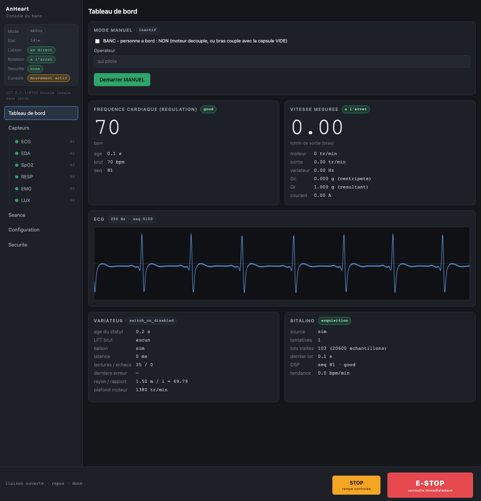

Repères de la capture (barre latérale, de haut en bas) :

1. **AnHeart, Console du banc** : le nom de la console (chaque page a le sien, repris
   dans le titre de l'onglet).
2. **Mode** (`REPOS`) : ce que fait la machine.
3. **Etat** (`idle`) : ce que la console a accepté de faire.
4. **Liaison** (`en direct`) : la page reçoit des données fraîches.
5. **Rotation** (`a l'arret`) : lu sur la vitesse **mesurée**.
6. **Securite** (`none`) : action de sécurité en cours.
7. **Console** (`mouvement actif`) : cette console peut commander le moteur.
8. Ligne `127.0.0.1:8731 boucle locale · sans jeton` : adresse d'écoute et protection.
9. Navigation : **Tableau de bord**, **Capteurs** (avec un point de couleur par
   capteur, et son canal `A1` à `A6`), **Seance**, **Configuration**, **Securite**.
10. Pied de page, à gauche : `liaison ouverte · repos` (liaison et mode). Pendant une
    séance, la phase s'ajoute : par exemple `liaison ouverte · manuel · hold`.
11. **STOP** (orange, « rampe controlee ») et **E-STOP** (rouge, « verrouille
    immediatement »).

### Les pastilles, une par une

| Pastille | Valeurs possibles | Ce que ça veut dire |
|---|---|---|
| **Mode** | `REPOS` | rien n'est commandé ; le variateur est seulement lu |
| | `MANUEL` (orange) | séance manuelle en cours |
| | `SEANCE` (orange) | séance programmée en cours |
| | `ARRET` (rouge) | une séance se termine, la consigne descend. **Pas** « arrêté » : regardez Rotation |
| **Etat** | `idle` | rien de demandé. Seul état où l'on peut démarrer |
| | `starting` | un démarrage vient d'être accepté |
| | `running` (orange) | une séance tourne |
| | `stopping` | un arrêt est en cours. **En rouge** : un E-STOP est verrouillé, il attend un acquittement |
| **Liaison** | `en direct` (vert) | données reçues il y a moins de 2 s |
| | `donnees figees` (rouge) | la connexion est ouverte mais plus rien n'arrive |
| | `hors ligne` (rouge) | la connexion avec la console est coupée |
| **Rotation** | `a l'arret` (vert) | vitesse mesurée inférieure à 0,05 tr/min et variateur lu récemment |
| | `EN ROTATION` (orange) | le bras tourne |
| | `VITESSE INCONNUE` (rouge) | le variateur n'a pas été lu récemment : **ne jamais lire « arrêté »** |
| **Securite** | `none` (vert) | aucune règle ne demande rien |
| | `freeze`, `reduce` (orange) | une règle gèle ou réduit la vitesse |
| | `ramp_down`, `quick_stop`, `go_silent` (rouge) | une règle arrête la machine (en douceur, en urgence, ou définitivement pour ce processus) |
| **Console** | `mouvement actif` (orange) | la console peut commander le moteur (cas normal aujourd'hui) |
| | `LECTURE SEULE` | la console refuse tout mouvement (n'arrive pas avec la console actuelle) |

### STOP : l'arrêt normal

* Termine la séance **sur la rampe de décélération mise en service**, pas plus vite.
  Freiner plus fort ferait déclencher le variateur en surtension (défaut `ObF`) et le
  bras partirait en roue libre, ce qui est plus long.
* Après STOP, la cible manuelle repasse à 0. Le mode passe à `ARRET`, puis à `REPOS`
  une fois l'arbre arrêté. Pour repartir, il faut redémarrer une séance.
* S'il n'y a rien à arrêter, ou si un arrêt est déjà en cours, une fenêtre d'alerte
  s'ouvre : `STOP refuse : ...` (voir §14).

### E-STOP : l'arrêt d'urgence logiciel

* Part au premier clic, sans rien demander, même sans séance.
* Le verrou est posé immédiatement ; la machine décélère à la tick suivante (action
  `quick_stop`).
* Il reste **verrouillé** : aucune séance ne peut repartir tant qu'une personne ne l'a
  pas **acquitté par son nom** dans la page Securite (§13.6).
* Si la demande échoue (console injoignable), une alerte dit :
  `la demande d'arret d'urgence a echoue : ... - UTILISEZ L'ARRET CABLE`. Dans ce cas,
  **frappez le coup de poing**.

> Rappel : le vrai arrêt de sécurité est le coup de poing câblé. Utilisez-le dès que la
> situation l'exige ; l'E-STOP de la page est une commodité.

## 6. Visite guidée : page Tableau de bord

C'est la page qui s'ouvre au démarrage. Elle porte le mode MANUEL (séance de banc)
et l'essentiel des mesures. Capture au repos : voir §5 ci-dessus
(`console-01-tableau-de-bord-repos.png`).

Repères de la capture au repos (zone centrale) :

1. Carte **Mode MANUEL**, pastille `inactif`.
2. Case **BANC - personne a bord : NON (moteur decouple, ou bras couple avec la
   capsule VIDE)**.
3. Champ **Operateur** (« qui pilote »).
4. Bouton vert **Demarrer MANUEL**.
5. Carte **Frequence cardiaque (regulation)**, pastille de qualité `good`, grand
   nombre en bpm, puis `age`, `brut`, `seq`.
6. Carte **Vitesse mesuree**, pastille `a l'arret`, grand nombre en tr/min de sortie,
   puis `moteur`, `sortie`, `variateur`, `Gc`, `Gr`, `courant`.
7. Carte **ECG** : tracé des 6 dernières secondes environ, pastille `250 Hz · seq N`.
8. Carte **Variateur** : pastille d'état (`switch_on_disabled` au repos), puis
   l'état de la liaison.
9. Carte **BITalino** : pastille `acquisition`, puis les compteurs de liaison.

### La carte Mode MANUEL pendant une séance

Une fois la séance manuelle démarrée, la carte change :

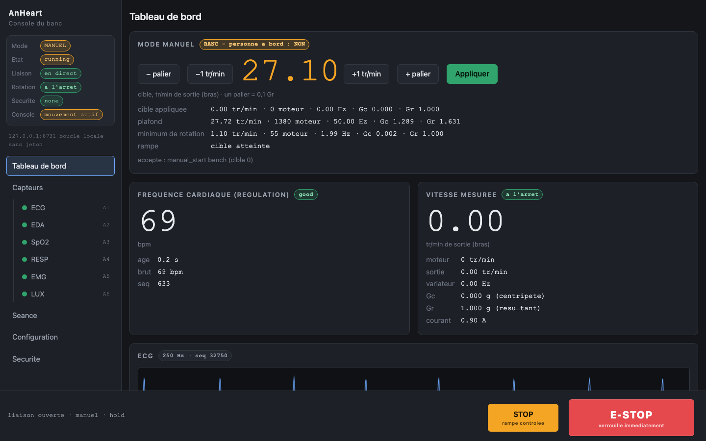

Repères :

1. Pastille `BANC - personne a bord : NON` : l'occupation déclarée, figée pour toute
   la séance.
2. **− palier** / **+ palier** : baisse ou monte le brouillon d'un cran de 0,1 Gr.
3. **−1 tr/min** / **+1 tr/min** : baisse ou monte le brouillon de 1 tr/min au bras.
4. Grand nombre **orange** (`27.10`) : le **brouillon**, autrement dit la valeur que vous
   composez. Orange = pas encore envoyé à la machine.
5. **Appliquer** : envoie le brouillon. **Rien n'est envoyé avant ce clic.**
6. `cible appliquee` : ce que la machine vise réellement (ici encore `0.00`).
7. `plafond` : la vitesse maximale permise (ici 27,72 tr/min = 1380 tr/min moteur =
   50 Hz, Gr 1,631).
8. `minimum de rotation` : la plus petite vitesse non nulle (1,10 tr/min = 55 tr/min
   moteur). Entre 0 et ce minimum, rien n'est accepté.
9. `rampe` : `cible atteinte`, ou `en cours, arrivee ~m:ss`.
10. La note sous la grille : dernier message (ici `accepte : manual_start bench (cible 0)`).
11. Barre latérale : Mode `MANUEL`, Etat `running`.

Règles de la cible :

* La cible est une **destination**. La machine y va aux limites anti nausée
  (accélération du bras et vitesse de variation des g, fichier
  `config/motion_limits.json`). Toute règle de sécurité reste prioritaire.
* Les boutons gardent le brouillon dans le domaine permis : ils ne dépassent jamais le
  plafond, et sautent directement au minimum de rotation en montant depuis 0.
* Après n'importe quel arrêt (STOP, E-STOP, règle de sécurité), la cible vaut 0.
* Une séance manuelle dure au plus 60 minutes (compteur `restant` visible sur la page
  Seance).

### Le bandeau « RAMPE EN COURS »

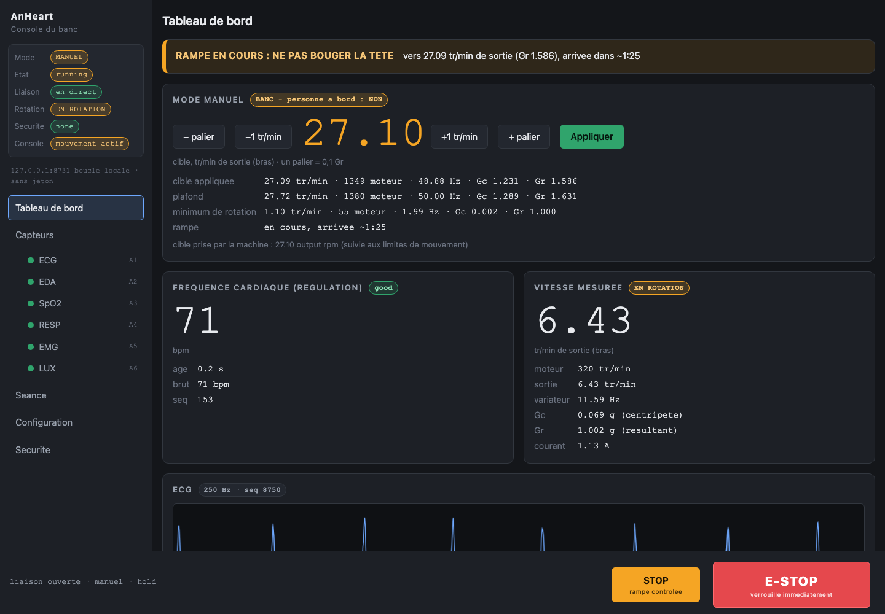

Repères :

1. Bandeau orange **RAMPE EN COURS : NE PAS BOUGER LA TETE**, avec la destination et le
   temps restant (`vers 27.09 tr/min de sortie (Gr 1.586), arrivee dans ~1:25`).
   Bouger la tête pendant un changement de vitesse donne la nausée (effet Coriolis).
2. `cible appliquee` : `27.09 tr/min · 1349 moteur · 48.88 Hz · Gc 1.231 · Gr 1.586`.
3. `rampe` : `en cours, arrivee ~1:25`.
4. **Vitesse mesuree** : `6.49` et pastille `EN ROTATION` : le bras accélère.
5. Barre latérale : Rotation `EN ROTATION`.

Une fois la cible atteinte, le bandeau disparaît et `rampe` affiche `cible atteinte` :

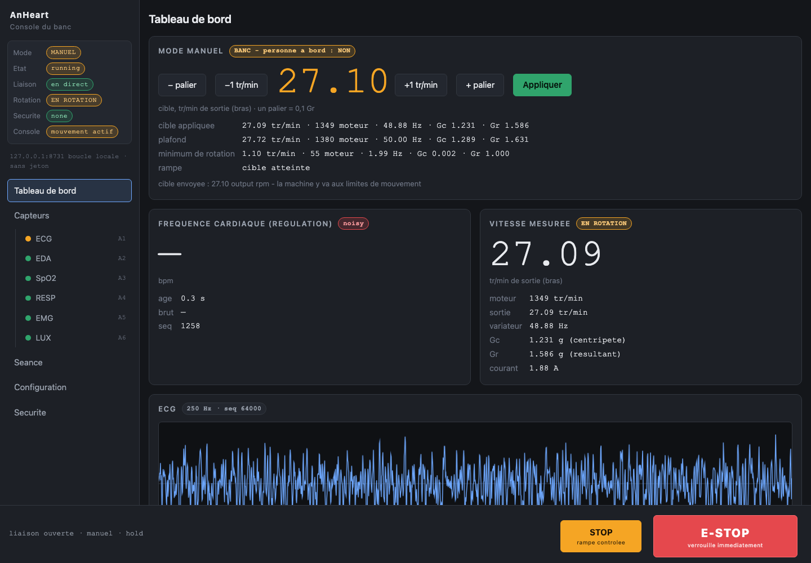

Repères :

1. **Vitesse mesuree** `27.09` : c'est ce chiffre qui compte.
2. Carte **Frequence cardiaque (regulation)** : pastille rouge `noisy` et valeur
   absente. **Constaté en simulation** : à 27 tr/min, le signal ECG simulé devient très
   bruité (voir la carte ECG) et la fréquence n'est plus calculée. En séance manuelle
   de banc cela ne change rien à la vitesse ; en séance programmée, cela compterait.
3. Point orange devant **ECG** dans la barre latérale : la qualité de ce capteur a
   baissé.

### Les autres cartes

**Frequence cardiaque (regulation)** : la fréquence qui **commande** la machine en
séance programmée. `age` = âge de la mesure en secondes (barré si trop vieille, plus
de 4 s environ), `brut` = dernière valeur calculée, `seq` = numéro de la mesure.
Pastille de qualité : `good`, `noisy`, `mains_dominated` (parasite secteur),
`no_signal`, ou `pas de signal`. Dès que la mesure est trop vieille, la pastille
passe à `perime` (grise, comme sur les cartes de la page Capteurs), quelle que soit la
dernière qualité connue.

**Vitesse mesuree** : la vitesse lue sur le variateur, en cinq unités, plus le courant
moteur en ampères.

**ECG** : tracé brut. Une coupure du signal est dessinée comme une coupure (jamais
reliée par un trait, qui ressemblerait à un battement). La pastille devient orange
juste après une coupure.

**Variateur** :

| Ligne | Sens |
|---|---|
| pastille | état du variateur : `switch_on_disabled` ou `ready` (au repos), `operation_enabled` (en marche), `fault` (en défaut, rouge), `comm_lost` (plus de réponse, rouge) |
| `age du statut` | depuis quand le variateur n'a pas été lu |
| `LFT brut` | code de défaut brut du variateur, ou `aucun` |
| `liaison` | `sim`, ou `serial · <port et réglages>` |
| `latence` | temps de réponse du variateur |
| `lectures / echecs` | nombre de lectures réussies et ratées |
| `derniere erreur` | dernière erreur de liaison |
| `rayon / rapport` | `1.50 m / i = 49.79` : la géométrie utilisée pour tous les g |
| `plafond moteur` | `MOTOR_MAX_RPM` |

En cas de défaut, un encadré rouge et un bouton **Reset defaut variateur**
apparaissent (voir §13.9 et la capture `console-14-defaut-variateur.png`).

**BITalino** :

| Ligne | Sens |
|---|---|
| pastille | `acquisition` (vert, tout va bien), `connecte` (branché mais n'acquiert pas), `deconnecte` (rouge) |
| `source` | `sim`, `serial` ou `rfcomm`, et l'adresse |
| `tentatives` | nombre de tentatives de connexion |
| `lots traites` | paquets de données reçus, et nombre d'échantillons |
| `dernier lot` | âge du dernier paquet (doit rester autour de 0,1 s) |
| `DSP` | numéro et qualité du dernier calcul de fréquence |
| `tendance` | évolution de la fréquence, en bpm par minute |
| `trames`, `pertes de synchro`, `octets ignores`, `echantillons combles`, `reconnexions` | avec un vrai boîtier seulement : santé de la liaison série |
| `erreur` | dernière erreur de connexion |

## 7. Visite guidée : page Capteurs

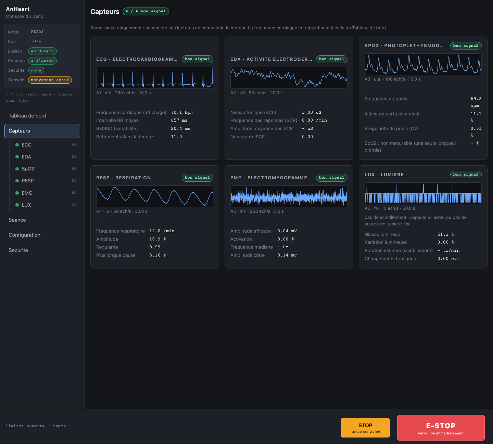

Repères :

1. Titre **Capteurs**, pastille `6 / 6 bon signal` (nombre de voies en bon état sur le
   nombre de voies acquises).
2. Phrase fixe : **surveillance uniquement**, aucune de ces lectures ne commande le
   moteur.
3. Une carte par capteur : nom (`ECG · Electrocardiogramme`), pastille de qualité, mini
   courbe.
4. Sous la courbe : canal (`A1`), unité (`mV`), cadence affichée (`250 ech/s`), durée de
   la fenêtre (`10.0 s`).
5. Une phrase d'état éventuelle (par exemple LUX : `pas de scintillement : capsule a
   l'arret, ou pas de source de lumiere fixe`).
6. Jusqu'à quatre mesures dérivées.
7. **Cliquer une carte** ouvre la page de ce capteur.

Les pastilles de qualité :

| Pastille | Couleur | Sens |
|---|---|---|
| `bon signal` | vert | signal exploitable |
| `bruite` | orange | signal parasité (mouvement, électrode) |
| `parasite secteur` | orange | le 50 Hz du secteur domine |
| `pas de signal` | rouge | rien de mesurable |
| `perime` | gris | aucune nouvelle fenêtre depuis plus de 3,5 s : **ne pas croire** les valeurs |

Si seul l'ECG est configuré (`SENSORS=ECG`, le défaut), la page ne montre que la
carte ECG. Si l'API ne répond plus, la pastille du titre passe à `hors ligne`.

Les six capteurs possibles :

| Capteur | Canal | Ce qu'il mesure | Mesures affichées | Limite honnête |
|---|---|---|---|---|
| ECG | A1 | électrocardiogramme | fréquence (affichage), intervalle RR, RMSSD, battements | second calcul, pour affichage ; la régulation utilise l'autre (carte du Tableau de bord) |
| EDA | A2 | activité électrodermale (sudation) | niveau tonique, réponses | |
| SpO2 | A3 | pouls au doigt | fréquence du pouls, perfusion, irrégularité | **la saturation n'est pas mesurable** (une seule longueur d'onde) : toujours vide |
| RESP | A4 | ceinture respiratoire | fréquence, amplitude, régularité, plus longue pause | |
| EMG | A5 | activité musculaire | amplitude efficace, activation, fréquence médiane, crête | |
| LUX | A6 | lumière | niveau, variation, rotation estimée, changements brusques | la « rotation estimée » suppose une lampe fixe ; en simulation elle ne suit pas le variateur. Ne pas la lire comme une vitesse |

## 8. Visite guidée : page d'un capteur

On y arrive en cliquant une carte de la page Capteurs, ou un capteur dans la barre
latérale.

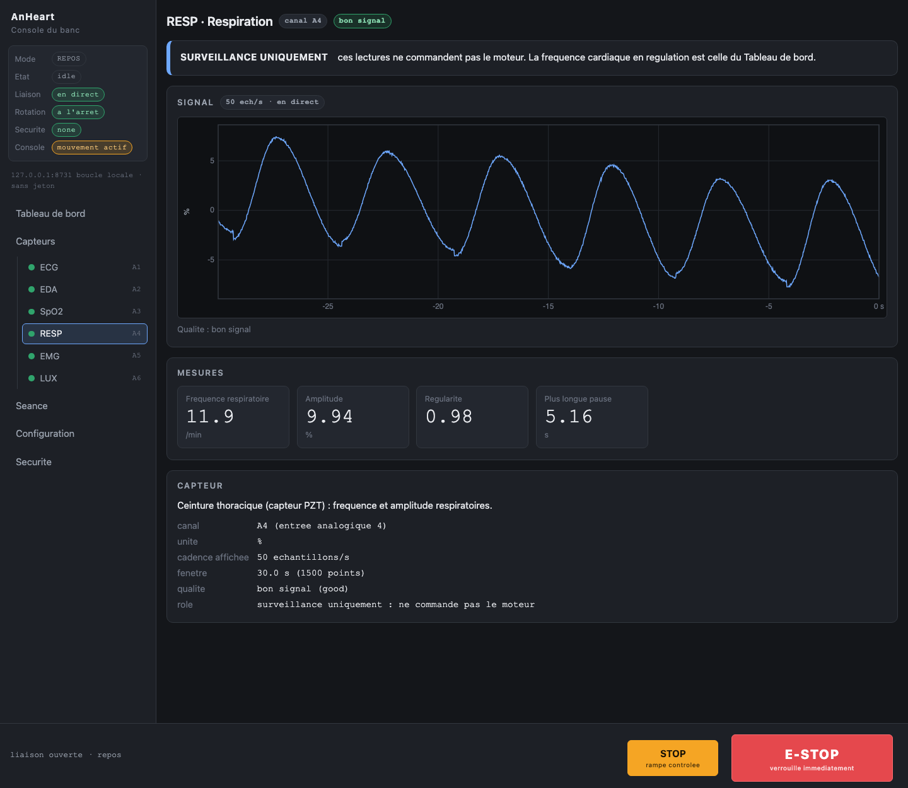

Repères :

1. Titre `RESP · Respiration`, pastilles `canal A4` et `bon signal`.
2. Encadré bleu **SURVEILLANCE UNIQUEMENT**.
3. Carte **Signal** : grand tracé, temps en secondes avant maintenant (`0 s` à droite
   = maintenant), unité sur l'axe vertical. Pastille `50 ech/s · en direct`.
4. Sous le tracé : `Qualite : bon signal`.
5. Carte **Mesures** : une tuile par mesure (valeur grisée si absente).
6. Carte **Capteur** : description du capteur, `canal`, `unite`, `cadence affichee`,
   `fenetre`, `qualite`, `role` (`surveillance uniquement : ne commande pas le moteur`).
7. Barre latérale : l'entrée `RESP` est surlignée.

Si le capteur ne donne plus rien pendant 3,5 s, la pastille devient
`fige depuis N s`, le tracé passe en gris et une inscription barre le graphique :
**DONNEES FIGEES - NE PAS CROIRE CE TRACE**. La capture
`console-17-bitalino-deconnecte.png` (§13.8) montre ce qui se passe dans la barre
latérale : les points des capteurs deviennent creux et gris.

## 9. Visite guidée : page Seance

La page des séances **programmées**, et aussi la page qui rassemble le suivi détaillé
et la liste des événements (y compris pour une séance manuelle).

### Au repos, programme choisi et prévisualisé

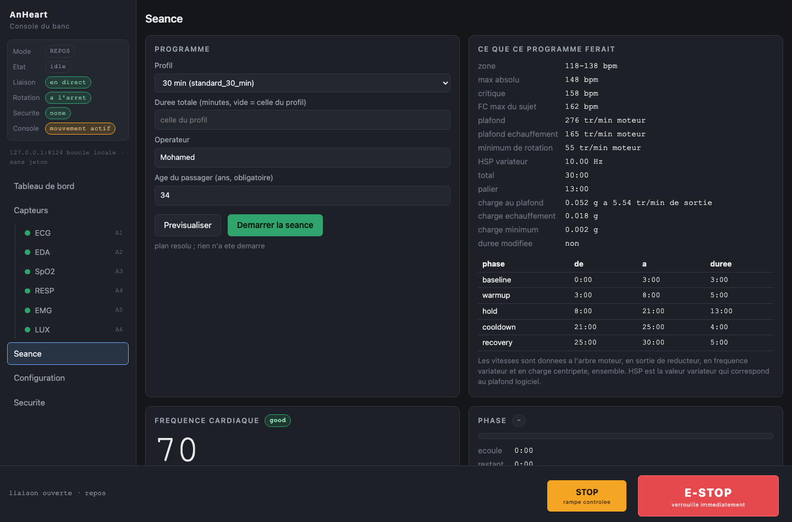

Repères, carte **Programme** (à gauche) :

1. **Profil** : liste des profils enregistrés, affichés `nom (identifiant)`. Livrés :
   `30 min (standard_30_min)` et `45 min (standard_45_min)`.
2. **Duree totale (minutes, vide = celle du profil)** : pour raccourcir ou allonger.
3. **Operateur** : obligatoire.
4. **Age du passager (ans, obligatoire)** : vide ou inférieur à 18 ans = refus.
5. **Previsualiser** : calcule le programme **sans rien démarrer**.
6. **Demarrer la seance** : démarre. Il est actif seulement si `PROGRAMS_ENABLED=true`,
   une fois l'attestation faite et la machine au repos (c'est le cas sur la capture).
7. Notes sous les boutons : la réponse au dernier clic (sur la capture,
   `plan resolu ; rien n'a ete demarre` après **Previsualiser**) et, sur sa propre
   ligne quand les séances programmées sont désactivées,
   `seances programmees desactivees sur cette console (jalon M5) : utiliser le mode MANUEL`.

Repères, carte **Ce que ce programme ferait** (à droite) :

8. `zone` : la plage de fréquence cardiaque visée (118 à 138 bpm).
9. `max absolu` (148) et `critique` (158) : les paliers cardiaques de sécurité.
10. `FC max du sujet` : fréquence maximale supposée du passager (162).
11. `plafond` (276 tr/min moteur), `plafond echauffement` (165), `minimum de rotation`
    (55), `HSP variateur` (10 Hz).
12. `total` (30:00) et `palier` (13:00, durée de la phase de maintien).
13. Après **Previsualiser** : `charge au plafond` (`0.052 g a 5.54 tr/min de sortie`),
    `charge echauffement`, `charge minimum`, `duree modifiee`.
14. Tableau des phases : `baseline` (repos initial), `warmup` (échauffement), `hold`
    (maintien), `cooldown` (retour au calme), `recovery` (récupération), avec début,
    fin et durée.

> **Bouton « Demarrer la seance » grisé.** La page active ce bouton seulement si la
> console dit que les séances programmées sont autorisées (`PROGRAMS_ENABLED=true`).
> Un défaut du code le laissait toujours grisé : il est **corrigé** (1er octobre 2026,
> `src/local_panel.py`). Les captures des séances en cours (`console-10`,
> `console-19`) ont été prises avant : la note « desactivees » y figure encore.

> Le message `plan resolu ; rien n'a ete demarre` affiché après **Previsualiser**
> reste sous les boutons jusqu'au clic suivant : la note « desactivees » ne le
> remplace plus.

Constat sur ce profil : son plafond (276 tr/min moteur = 5,54 tr/min = 0,052 g) est
très bas. En simulation, la fréquence cardiaque reste sous la zone visée (compteur
`en dessous` qui monte, capture suivante). C'est un réglage de profil, pas une panne.

### Pendant une séance programmée

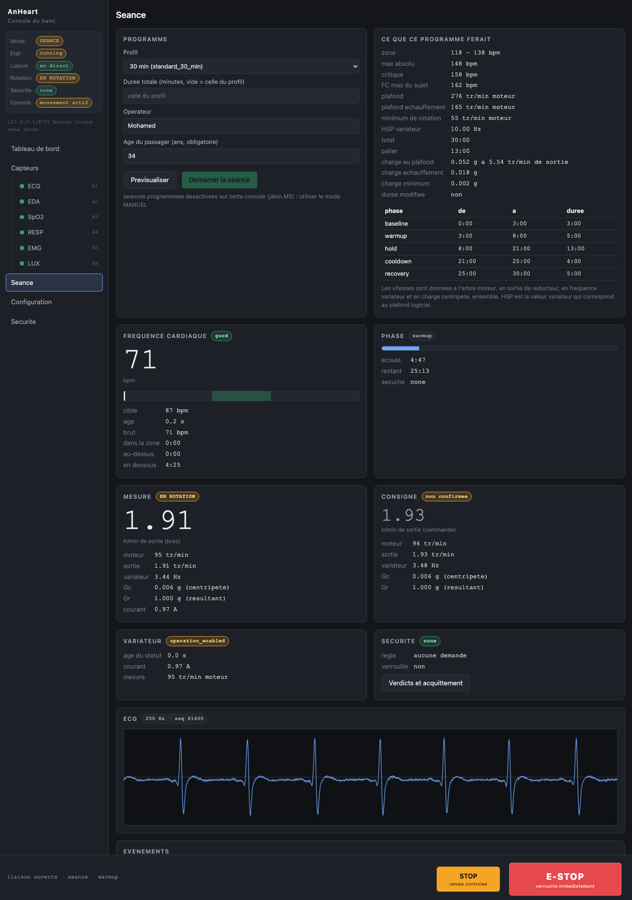

Repères :

1. Barre latérale : Mode `SEANCE`, Etat `running`, Rotation `EN ROTATION`.
2. Carte **Frequence cardiaque** : `71` bpm, pastille `good`, **bande de zone** (le
   rectangle vert = la zone 118 à 138 ; le petit trait blanc = la fréquence actuelle,
   ici à gauche, donc en dessous).
3. `cible` (87 bpm : la fréquence visée à cet instant par le programme), `age`, `brut`,
   temps passé `dans la zone`, `au-dessus`, `en dessous`.
4. Carte **Phase** : pastille `warmup`, barre de progression, `ecoule` (4:47),
   `restant` (25:13), `securite` (`none`).
5. Carte **Mesure** : vitesse **mesurée** en grand (`1.91`), pastille `EN ROTATION`,
   cinq unités et courant.
6. Carte **Consigne** : ce qui a été commandé (plus petit, gris), pastille
   `confirmee par le variateur` (vert) ou `non confirmee` (orange : le variateur n'a
   pas encore renvoyé la même valeur, normal pendant une montée).
7. Carte **Variateur** : état (`operation_enabled`), `age du statut`, `courant`,
   `mesure`.
8. Carte **Securite** : action en cours, règle, verrouillé ou non, et bouton
   **Verdicts et acquittement** qui ouvre la page Securite.
9. Carte **ECG** : même tracé que sur le Tableau de bord.
10. Carte **Evenements** (en bas) : les 40 derniers événements.

### La liste des événements

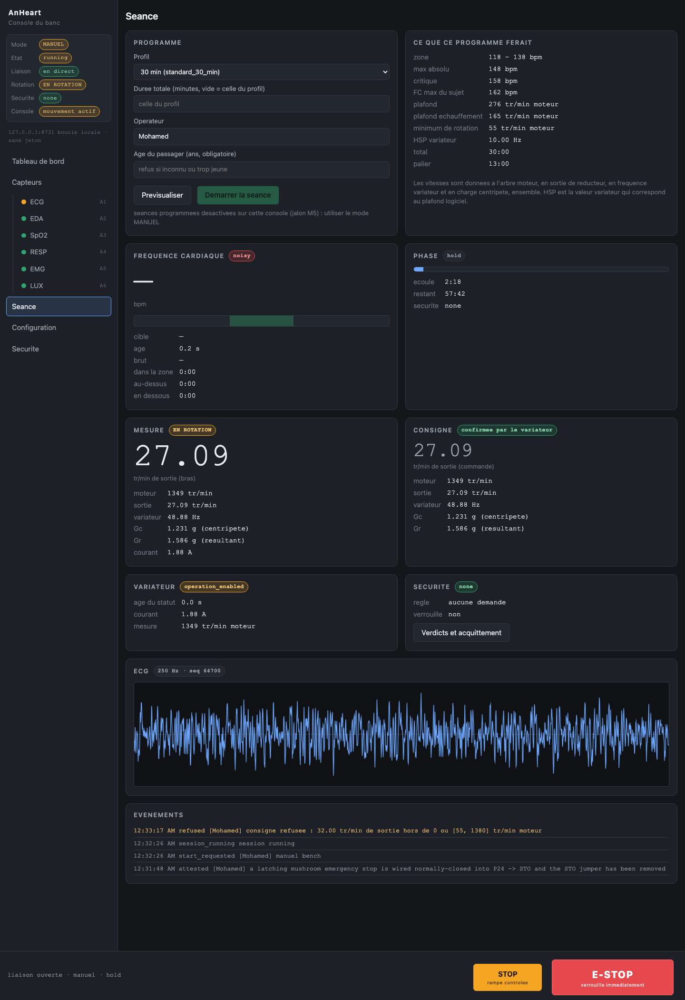

Repères (en bas de la capture, carte **Evenements**, le plus récent en haut) :

1. `attested [Mohamed] ...` : l'attestation du câblage.
2. `start_requested [Mohamed] manuel bench` : le démarrage demandé.
3. `session_running session running` : la machine confirme.
4. En orange : `refused [Mohamed] consigne refusee : 32.00 tr/min de sortie hors de 0 ou [55, 1380] tr/min moteur`.

Les types d'événements :

| Type | Sens |
|---|---|
| `attested` | attestation du câblage enregistrée |
| `start_requested` | démarrage demandé (manuel ou programme) |
| `session_running` | la séance tourne |
| `end_requested` | STOP demandé |
| `emergency_stop` | E-STOP |
| `acknowledged` | verdict acquitté, avec les règles effacées |
| `fault_reset_requested` | reset du variateur demandé |
| `session_idle` | retour au repos |
| `refused` (orange) | la machine a refusé une demande. **C'est souvent le seul endroit où le refus apparaît** : la page avait déjà répondu « accepté » |

Important : une demande « acceptée » (démarrage, cible, reset) veut seulement dire
« reçue ». La machine vérifie ensuite ; si elle refuse, cela n'apparaît **que** dans
cette liste (et parfois dans la note de la carte). Après chaque action, jetez un œil
aux événements.

## 10. Visite guidée : page Configuration

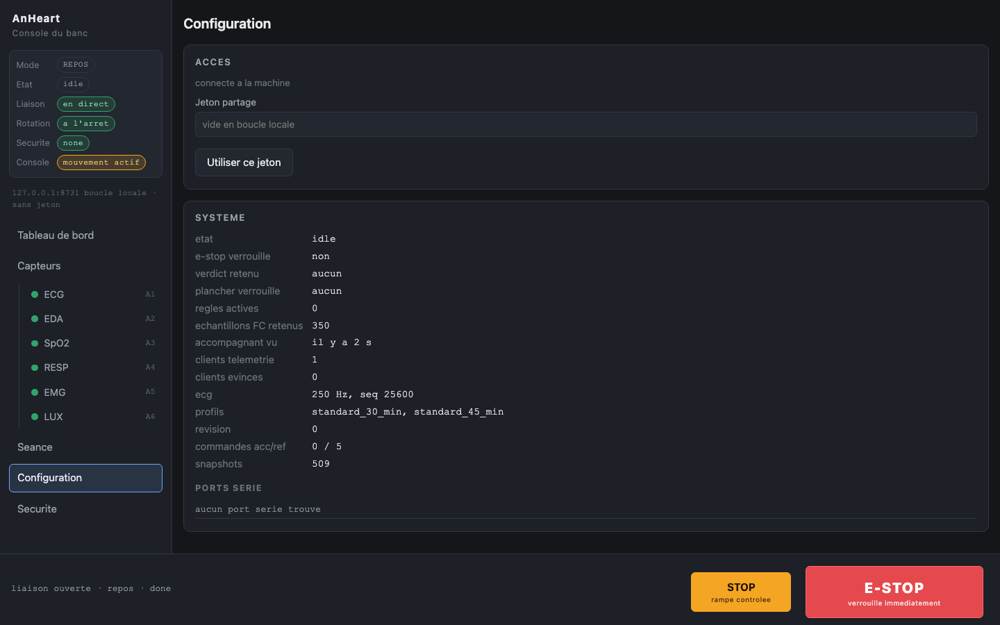

Repères :

1. Carte **Acces**, note `connecte a la machine` (ou l'erreur si l'API ne répond pas).
2. Champ **Jeton partage** : laisser vide quand la console écoute en boucle locale
   (`127.0.0.1`). Sinon, saisir la valeur de `UI_TOKEN`.
3. Bouton **Utiliser ce jeton** : garde le jeton pour cet onglet seulement (il faut le
   ressaisir dans un nouvel onglet).
4. Carte **Systeme** :
   * `etat`, `e-stop verrouille`, `verdict retenu`, `plancher verrouille`,
     `regles actives` : l'état de sécurité (détaillé page Securite) ;
   * `echantillons FC retenus` : mesures cardiaques gardées en mémoire ;
   * `accompagnant vu` : dernier signal de présence de la page (voir §11) ;
   * `clients telemetrie` : nombre d'écrans ouverts sur la console ;
   * `clients evinces` : écrans déconnectés parce qu'ils prenaient du retard ;
   * `ecg` : cadence et numéro du dernier échantillon ;
   * `profils` et `revision` : profils enregistrés et version du fichier ;
   * `commandes acc/ref` : demandes acceptées / refusées depuis le démarrage ;
   * `snapshots` : nombre d'instantanés publiés.
5. **Ports serie** : ports série trouvés. Sur le Mac des captures : `aucun port serie
   trouve` (normal : le câble Schneider n'y crée pas de port, il passe par
   `ftdi://`). Sur le Pi, `/dev/ttyUSB0` et `/dev/rfcomm0` devraient apparaître (non
   vérifié).

Si un jeton est exigé et que celui saisi est faux, toutes les pages affichent des
erreurs `a valid x-anheart-token header is required`.

## 11. Visite guidée : page Securite

### Avant l'attestation

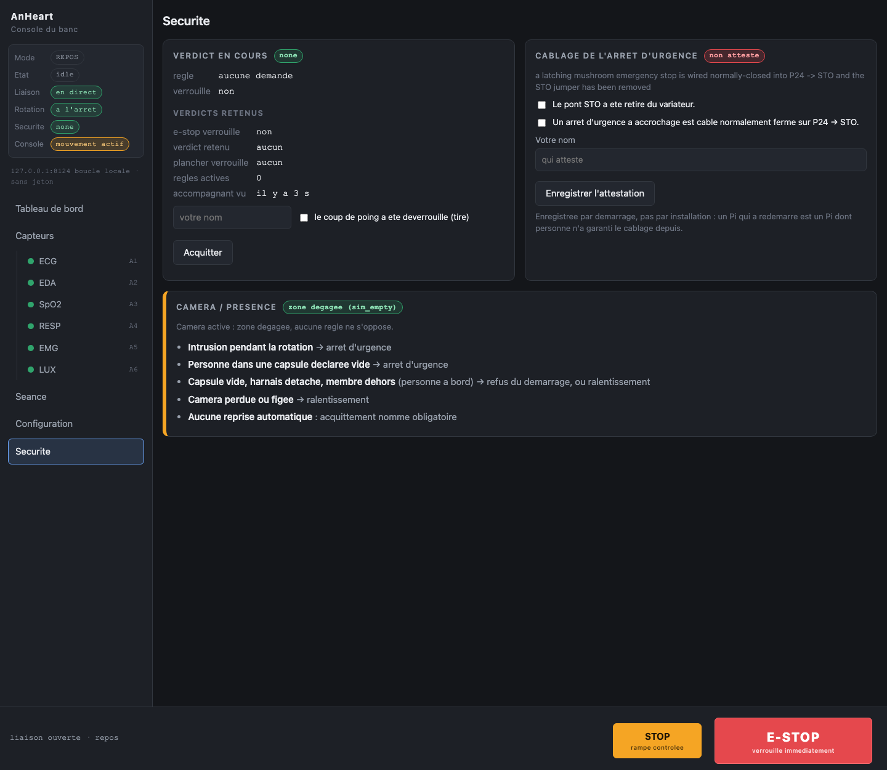

Repères :

1. Carte **Verdict en cours**, pastille `none` : `regle aucune demande`, `verrouille non`.
2. **Verdicts retenus** : `e-stop verrouille`, `verdict retenu`, `plancher verrouille`,
   `regles actives`, `accompagnant vu`.
3. Champ `votre nom`, case `le coup de poing a ete deverrouille (tire)`, bouton
   **Acquitter**.
4. Carte **Cablage de l'arret d'urgence**, pastille rouge `non atteste`.
5. La phrase exacte qui sera enregistrée (en anglais) : `a latching mushroom emergency
   stop is wired normally-closed into P24 -> STO and the STO jumper has been removed`.
6. Case **Le pont STO a ete retire du variateur.**
7. Case **Un arret d'urgence a accrochage est cable normalement ferme sur P24 → STO.**
8. Champ **Votre nom** et bouton **Enregistrer l'attestation**.
9. Carte **Camera / presence**, pastille `zone degagee (sim_empty)` et la liste des
   règles de la caméra.

### Après l'attestation

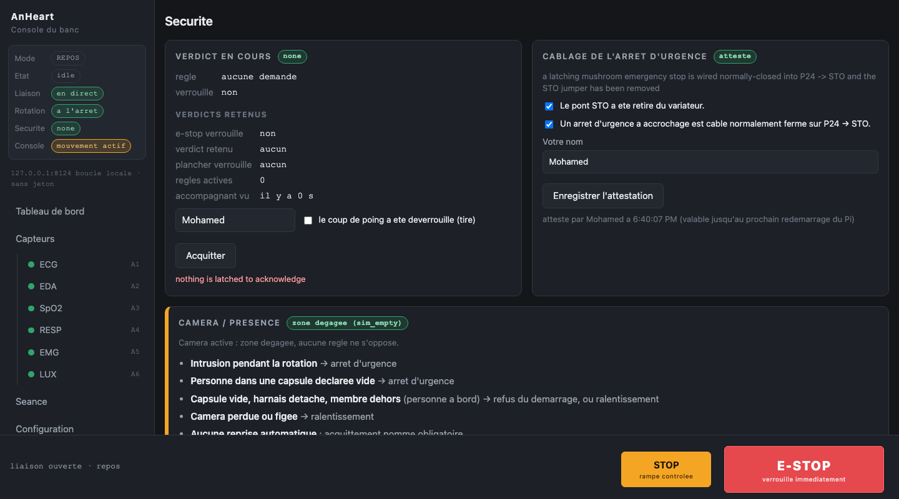

Repères :

1. Pastille verte `atteste`.
2. Sous le bouton : `atteste par Mohamed a 7:23:00 PM (valable jusqu'au prochain redemarrage du Pi)`.
3. Sous **Acquitter**, en rouge : `nothing is latched to acknowledge` (un essai
   d'acquittement alors que rien n'était verrouillé : sans conséquence).

### Avec un verdict verrouillé (après un E-STOP)

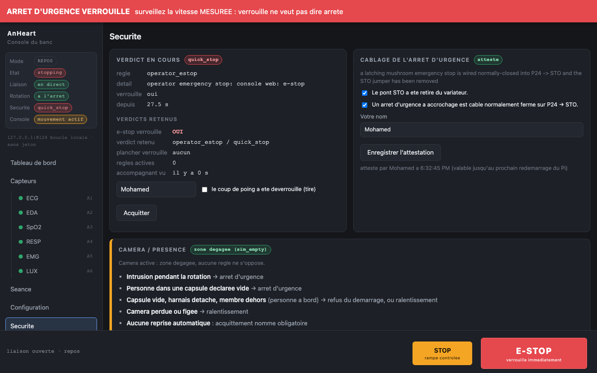

Repères :

1. Pastille rouge `quick_stop`.
2. `regle operator_estop`, `detail operator emergency stop: console web: e-stop`,
   `verrouille oui`, `depuis 27.4 s`.
3. `e-stop verrouille OUI` (en rouge), `verdict retenu operator_estop / quick_stop`.
4. Barre latérale : Etat `stopping` **en rouge** alors que Rotation est `a l'arret` et
   Mode `REPOS` : la machine est arrêtée, mais verrouillée.
5. Le champ nom est rempli, la case du coup de poing **pas encore cochée**.
6. En haut, le bandeau rouge **ARRET D'URGENCE VERROUILLE** : il reste tant que le
   verdict n'est pas acquitté, machine arrêtée ou non (§13.5).

### Les champs de la carte Verdict

| Ligne | Sens |
|---|---|
| `regle` | la règle qui agit (`operator_estop`, `drive_fault`, `attendant_absent`, `presence_intrusion`...) |
| `detail` | la phrase explicative |
| `verrouille` | `oui` : ne s'efface que par un acquittement nommé |
| `depuis` | depuis combien de secondes |
| `e-stop verrouille` | un arrêt d'urgence est verrouillé : E-STOP de la page ou d'un autre écran, ou arrêt déclenché par la caméra. Quand la ligne dit `OUI`, l'acquittement exige la case du coup de poing |
| `verdict retenu` | le verdict qui attend un acquittement |
| `plancher verrouille` | le verdict verrouillé le plus sévère d'une source secondaire (par exemple la caméra) |
| `regles actives` | nombre de règles qui se déclenchent en ce moment, listées en dessous |
| `accompagnant vu` | voir ci-dessous |

### La présence de l'accompagnant

Il n'y a pas de bouton : tant qu'un onglet de la console est ouvert, la page envoie
toutes les 5 s un signal « je suis là ». Si plus aucun signal n'arrive, la règle
`attendant_absent` **gèle** la vitesse après 60 s, puis **termine la séance** après
120 s. Cela prouve qu'un onglet est ouvert, **pas** qu'un humain regarde. Ne fermez
pas l'onglet pendant une séance.

### La carte Camera / presence

| Pastille | Sens |
|---|---|
| `non branchee` | `PRESENCE_SOURCE=none` (défaut) : **rien ne surveille la capsule**, les règles listées ne sont pas actives |
| `en attente` | caméra configurée, aucune image encore jugée |
| `zone degagee (sim_...)` | aucune règle ne s'oppose |
| `demarrage bloque (sim_...)` | au repos, une règle refuse le démarrage (la raison est écrite dessous) |
| `ralentissement` | une règle a demandé un arrêt en douceur (verrouillé) |
| `ARRET D'URGENCE` | une règle a demandé l'arrêt d'urgence (verrouillé) |
| `etat inconnu` | la page n'a pas pu lire l'état de la caméra |

Les règles : intrusion pendant la rotation → arrêt d'urgence ; personne dans une
capsule déclarée vide → arrêt d'urgence ; capsule vide, harnais détaché ou membre
dehors (personne à bord) → refus du démarrage ou ralentissement ; caméra perdue ou
figée → ralentissement ; jamais de reprise automatique.

> **Il n'existe qu'une caméra simulée** (`sim_empty`, `sim_occupied`). Elle ne regarde
> jamais la vraie machine, aucun modèle de vision n'est branché. Sur la vraie machine,
> laissez `PRESENCE_SOURCE=none` : une caméra simulée qui dit « zone dégagée » sans
> regarder serait pire que pas de caméra.

## 12. Visite guidée : la vue mobile

Sur un téléphone ou un écran étroit, la barre latérale se replie.

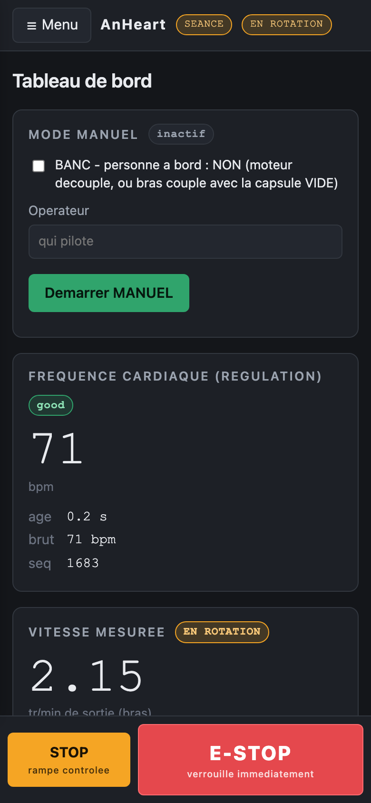

Repères :

1. Bouton **☰ Menu** : ouvre la barre latérale.
2. Deux pastilles toujours visibles : le **mode** (`SEANCE`) et la **rotation**
   (`EN ROTATION`).
3. Les cartes s'empilent les unes sous les autres.
4. **STOP** et **E-STOP** restent fixés en bas de l'écran, sur toutes les pages.

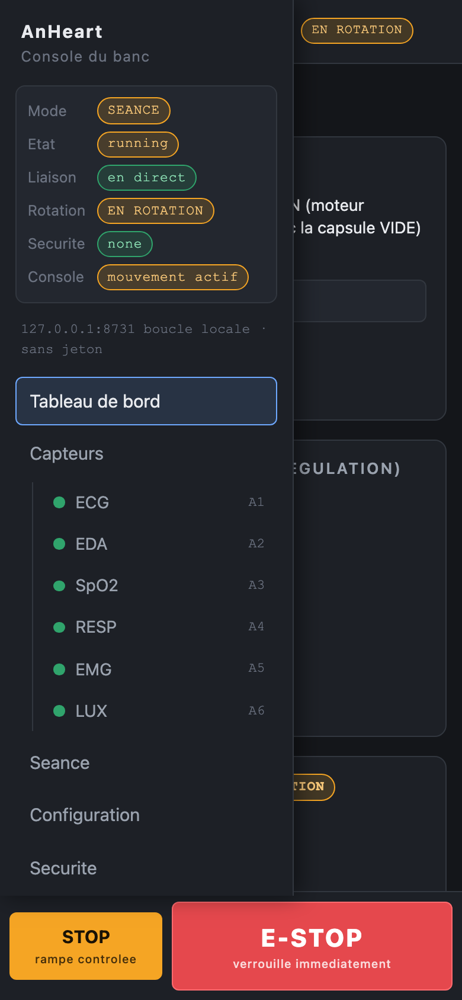

Repères :

1. Les six pastilles d'état.
2. La navigation complète, avec les capteurs.
3. Toucher la zone de droite (le contenu) referme le menu.

Remarque (capture précédente) : pendant la séance programmée, la carte Mode MANUEL
propose encore **Demarrer MANUEL**. Un clic serait simplement refusé
(`the machine is running, not idle`).

## 13. Procédures pas à pas

### 13.1 Première mise en route à chaque démarrage du Pi (attestation)

À faire **à chaque démarrage de la console** : l'attestation vit dans le programme et
disparaît avec lui (constaté : après relance, `attested` repasse à faux).

1. Vérifiez physiquement, **de vos yeux**, que le pont STO est retiré du variateur.
2. Vérifiez physiquement qu'un arrêt d'urgence à accrochage (coup de poing) est câblé
   normalement fermé sur P24 vers STO, et qu'il fonctionne.
3. Lancez la console (§3) et ouvrez la page.
4. Cliquez **Securite** dans la barre latérale.
5. Dans la carte **Cablage de l'arret d'urgence**, cochez **les deux** cases,
   **seulement** si vous êtes sûr des deux faits.
6. Tapez votre nom dans **Votre nom**.
7. Cliquez **Enregistrer l'attestation**.
8. Vérifiez : la pastille passe à `atteste` (vert) et la ligne `atteste par <nom> a
   <heure>` apparaît.

Si une seule case est cochée, rien n'est enregistré et la note affiche
`both confirmations are required, separately: ...`.

> Honnêteté : sur la machine actuelle, **le pont STO est en place** (voir
> [securite.md](../securite.md)). Cocher la première case serait donc faux aujourd'hui.
> Le logiciel ne peut pas le savoir : c'est à vous de ne pas attester ce qui n'est pas
> vrai.

### 13.2 Séance manuelle de banc à 27 tr/min

Condition préalable : **personne dans la capsule**. Soit le moteur est découplé, soit
le bras est couplé avec la capsule **vide**.

Réglage nécessaire : 27 tr/min au bras = environ 1345 tr/min moteur. Avec le plafond
par défaut (`MOTOR_MAX_RPM=300`, environ 6 tr/min), c'est impossible. Il faut
`MOTOR_MAX_RPM=1380` (le maximum, plaque signalétique) et relancer la console. Sur la
vraie machine, montez ce plafond **par paliers délibérés**, pas d'un coup.

1. Faites l'attestation (§13.1).
2. Cliquez **Tableau de bord**.
3. Cochez **BANC - personne a bord : NON ...**.
4. Tapez votre nom dans **Operateur**.
5. Cliquez **Demarrer MANUEL**. La note affiche `accepte : manual_start bench (cible 0)`,
   le mode passe à `MANUEL`, la pastille de la carte à `BANC - personne a bord : NON`.
6. Composez la cible : cliquez **+1 tr/min**. Le premier clic saute au minimum
   (1,10) ; chaque clic suivant ajoute 1. Après 27 clics, le brouillon affiche
   `27.10` en orange (capture `console-07-manuel-brouillon.png`).
   * Avec les boutons, on obtient 27,10 et non 27,00 exactement : c'est normal, on
     part du minimum 1,10. La machine appliquera 27,09 (1349 tr/min moteur, arrondi
     à l'entier).
7. Vérifiez la ligne `plafond` : la cible doit être en dessous.
8. Cliquez **Appliquer**. La note affiche
   `cible envoyee : 27.10 output rpm - la machine y va aux limites de mouvement`.
9. Le bandeau **RAMPE EN COURS : NE PAS BOUGER LA TETE** apparaît. En simulation, la
   montée de 0 à 27 tr/min a pris environ 1 min 45 s.
10. Surveillez **Vitesse mesuree** jusqu'à 27,09 et `rampe : cible atteinte`
    (capture `console-09-manuel-27-atteint.png`).
11. Regardez la liste **Evenements** (page Seance) pour vérifier qu'aucun refus n'est
    apparu.

Pour changer de vitesse en cours de route : composez un nouveau brouillon avec les
boutons, puis **Appliquer**. Pour ralentir jusqu'à l'arrêt, le mieux est **STOP**
(§13.5).

Remarque constatée : après **Appliquer**, le brouillon reste orange (27,10 composé,
27,09 appliqué : la différence d'arrondi suffit). Fiez-vous à la ligne
`cible appliquee`.

### 13.3 Et 32 tr/min ?

**32 tr/min au bras est impossible sur cette machine**, et c'est voulu.
32 tr/min × 49,79 = 1593 tr/min moteur, soit 57,7 Hz : plus que la plaque du
moteur (1380 tr/min) et du réglage HSP du variateur (50 Hz). Le plafond le plus
haut autorisé par la console est 27,72 tr/min.

Ce qui se passe si on essaie :

* **dans la page** : impossible, les boutons **+1 tr/min** et **+ palier** s'arrêtent
  au plafond (27,72) ;
* **par l'API** (constaté) : la demande est « acceptée », puis refusée par la machine,
  qui **garde** 27,09 tr/min. L'événement orange s'affiche :
  `consigne refusee : 32.00 tr/min de sortie hors de 0 ou [55, 1380] tr/min moteur`
  (capture `console-10-seance-evenements-manuel.png`). La valeur n'est jamais arrondie
  au plafond : elle est refusée.

Le scénario de simulation `manual_27_then_32_refused` rejoue exactement ce cas.

### 13.4 Séance programmée (pilotée par la fréquence cardiaque)

> Désactivée par défaut, et **jamais testée avec une personne à bord**. Elle suppose
> une personne dans la capsule, donc le jalon M6 (accords écrits ingénierie et
> médical). Ce qui suit a été rejoué **uniquement en simulation**.

Configuration nécessaire (les trois ensemble) :

```sh
PROGRAMS_ENABLED=true
OCCUPANCY_OCCUPIED_ENABLED=true
# et, en simulation seulement, une caméra qui voit un passager attaché :
PRESENCE_SOURCE=sim_occupied
```

Avec `PROGRAMS_ENABLED=true` mais sans `OCCUPANCY_OCCUPIED_ENABLED=true`, la demande
est acceptée puis refusée (événement constaté) :
`personne a bord refusee : OCCUPANCY_OCCUPIED_ENABLED=false (jalon M6, accords ingenierie et medical requis)`.

Pas à pas :

1. Faites l'attestation (§13.1).
2. Placez les électrodes ECG sur le passager. Vérifiez sur le Tableau de bord que la
   **Frequence cardiaque (regulation)** est affichée, non barrée, pastille `good`.
3. Cliquez **Seance**.
4. Choisissez le **Profil** (par exemple `30 min (standard_30_min)`).
5. Laissez **Duree totale** vide (ou tapez une durée en minutes).
6. Tapez votre nom dans **Operateur**.
7. Tapez l'**Age du passager** (obligatoire, au moins 18 ans par défaut).
8. Cliquez **Previsualiser**. Lisez la carte **Ce que ce programme ferait** : zone,
   paliers cardiaques, plafond **et la charge en g au plafond**. C'est le moment de
   dire non.
9. Cliquez **Demarrer la seance**. Équivalent en ligne de commande, depuis un terminal
   sur la même machine :

   ```sh
   curl -s -X POST http://127.0.0.1:8731/api/session/start \
     -H 'Content-Type: application/json' \
     -d '{"profile_id":"standard_30_min","operator":"Mohamed","subject_age":34}'
   ```

   (remplacez le port, le profil, le nom et l'âge). La réponse
   `{"kind":"start",...}` veut dire « reçu », pas « démarré ».
10. Regardez la liste **Evenements** : `start_requested`, puis `session_running`. Un
    `refused` dit pourquoi la séance n'est pas partie (§14).
11. Suivez la séance sur la page Seance : phase, fréquence cardiaque dans la bande de
    zone, **Mesure** (vitesse mesurée) (capture `console-19-seance-programmee-en-cours.png`).
    En simulation, la phase `baseline` (3 min) se passe à l'arrêt, puis la rotation
    commence doucement en `warmup`.
12. La séance se termine seule à la fin du programme. Pour l'arrêter avant : **STOP**.

Âge du passager, constaté : sans âge,
`demarrage refuse : age du passager requis pour une seance programmee` ; à 15 ans,
`demarrage refuse : passager de 15 ans, minimum 18 ans (MIN_RIDER_AGE)`.

Constaté : après STOP d'une séance programmée, le retour à `REPOS` a pris environ
5 minutes en simulation (la séance passe par ses phases de fin), contre environ 1 min
40 s depuis 27 tr/min en séance manuelle. Prévoyez-le.

### 13.5 Arrêter : STOP ou E-STOP ?

| Situation | Bouton |
|---|---|
| fin normale, changement d'avis, passager qui veut descendre sans urgence | **STOP** |
| danger immédiat, comportement anormal, doute sérieux | **coup de poing câblé**, et **E-STOP** en plus |
| la page ne répond plus (bandeau NO LIVE DATA) | **coup de poing câblé** |

STOP, pas à pas :

1. Cliquez **STOP** (pied de page, n'importe quelle page).
2. Le mode passe à `ARRET` (rouge), l'état à `stopping`, le bandeau
   **RAMPE EN COURS** indique `vers 0.00 tr/min`.
3. Attendez que **Rotation** affiche `a l'arret` et que le mode revienne à `REPOS`.

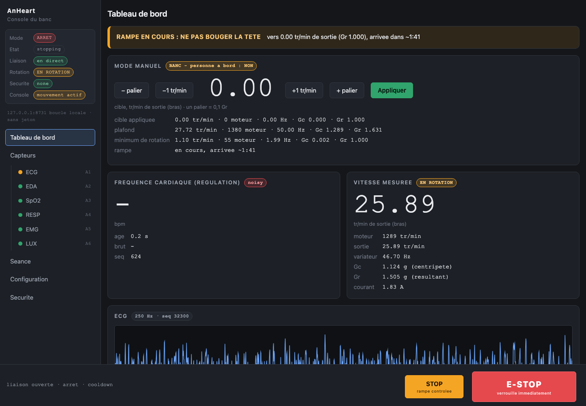

Repères :

1. Mode `ARRET` (rouge), Etat `stopping`, Rotation `EN ROTATION`.
2. Bandeau `vers 0.00 tr/min de sortie (Gr 1.000), arrivee dans ~1:40`.
3. `cible appliquee 0.00` : la cible est déjà à zéro...
4. ...mais **Vitesse mesuree** affiche encore `25.81` : le bras tourne. C'est ce
   chiffre qui dit si c'est arrêté.
5. Pied de page : `liaison ouverte · arret · cooldown`.

E-STOP, pas à pas :

1. En cas de danger : **coup de poing câblé**.
2. Cliquez **E-STOP** (aucune question ne sera posée).
3. La pastille **Securite** passe à `quick_stop` (rouge) et **Etat** à `stopping` en
   rouge. Un bandeau rouge **ARRET D'URGENCE VERROUILLE** apparaît en haut de la page.
4. Surveillez **Vitesse mesuree** : la machine décélère, elle n'est pas arrêtée tout
   de suite (constaté : de 25,8 à 12,5 tr/min en environ 4 s, puis arrêt complet
   quelques secondes plus tard, en simulation).
5. Une fois arrêtée, la machine reste **verrouillée** : acquittez (§13.6).

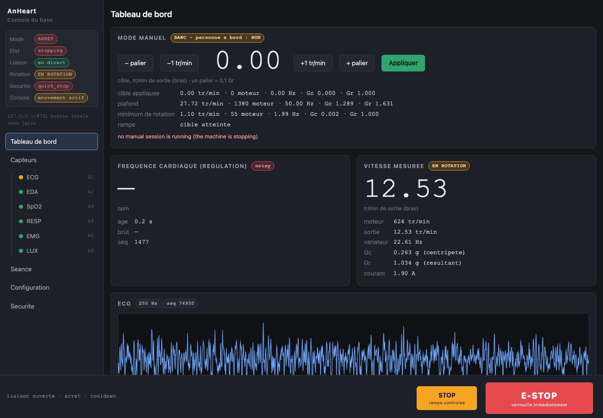

Repères :

1. Securite `quick_stop` et Etat `stopping` en rouge.
2. Vitesse mesurée `12.37`, `EN ROTATION` : ça ralentit.
3. La note de la carte manuelle, `no manual session is running (the machine is stopping)`,
   vient d'un clic sur **Appliquer** pendant l'arrêt : plus aucune cible n'est acceptée.
4. En haut, le bandeau rouge **ARRET D'URGENCE VERROUILLE**.

> Le bandeau rouge du haut,
> `ARRET D'URGENCE VERROUILLE surveillez la vitesse MESUREE : verrouille ne veut pas dire arrete`,
> apparaît sur un écran dès que cet écran apprend qu'un arrêt d'urgence est
> verrouillé : par son propre clic sur E-STOP, par les données qu'il reçoit en continu,
> ou par l'état qu'il relit toutes les 5 s. Il s'affiche donc aussi sur un écran qui
> n'a pas cliqué, et après un arrêt déclenché par la caméra. Il reste, sur toutes les
> pages de cet écran, tant qu'une donnée plus récente n'a pas montré le verdict levé ;
> dans le doute, il reste. Il disparaît après l'acquittement (§13.6).
>
> Il ne dit pas que la machine est arrêtée : seule la vitesse **mesurée** le dit.
>
> À savoir :
>
> * Il s'affiche pour tout verdict `quick_stop` verrouillé, y compris celui d'une
>   règle de sécurité (par exemple `reverse_rotation`). Dans ce cas la ligne
>   `e-stop verrouille` dit `non` et l'acquittement ne demande pas la case du coup de
>   poing : lisez la ligne `regle`.
> * Quand `go_silent` devient le verdict en cours (liaison perdue avec le variateur,
>   par exemple), plus rien ne s'acquitte : un bandeau déjà affiché le reste jusqu'au
>   redémarrage de la console.
> * Limite : un écran ouvert ou rechargé alors que `go_silent` est déjà le verdict en
>   cours ne peut pas savoir qu'un arrêt déclenché par la caméra est verrouillé
>   derrière lui, car la console ne le lui dit pas. Il affiche `go_silent`, sans le
>   bandeau.
>
> Rejoué en simulation : E-STOP de la page, second écran, arrêt caméra, et perte de la
> liaison au variateur au moment du clic (deux écrans). Le cas d'une règle
> (`reverse_rotation`) a été rejoué lors de la revue de cette correction.

### 13.6 Acquitter un verdict de sécurité

Un verdict verrouillé (E-STOP, défaut variateur, caméra, fréquence cardiaque...)
empêche tout nouveau démarrage (constaté :
`a latched safety verdict stands (operator_estop): ... - it must be acknowledged by name first`).
Rien ne l'efface tout seul.

1. Attendez que la machine soit **arrêtée** : Rotation `a l'arret`, Mode `REPOS`.
2. Cherchez et supprimez la cause (lisez `regle` et `detail` dans **Securite**).
3. Si le coup de poing a été frappé : **tirez-le** pour le déverrouiller.
4. Cliquez **Securite**.
5. Tapez votre nom dans `votre nom`.
6. Si le verdict vient d'un arrêt d'urgence (E-STOP de la page, coup de poing, ou
   intrusion caméra), cochez **le coup de poing a ete deverrouille (tire)**. Sans
   cette case, le refus est : `the emergency stop is still latched: confirm the mushroom has been pulled back out (estop_released) before acknowledging`.
7. Cliquez **Acquitter**.
8. Vérifiez la note : `acquitte par <nom> : operator_estop` (liste des règles
   effacées), l'état revenu à `idle` et, après un arrêt d'urgence, le bandeau rouge
   disparu.

Cas particulier : un verdict `go_silent` ne s'acquitte pas. Le message dit
`... demanded GO_SILENT, which is one-way ...`. Il faut vérifier que la machine est
arrêtée, puis **redémarrer la console**.

### 13.7 La caméra détecte une intrusion

> **Uniquement simulé.** Pour ce guide, une intrusion a été injectée dans la caméra
> simulée pendant une séance manuelle à 8 tr/min.

Ce que fait la console : si la caméra voit une personne dans la zone du bras pendant
la rotation, elle déclenche **seule** un arrêt d'urgence (`quick_stop`) et le
verrouille.

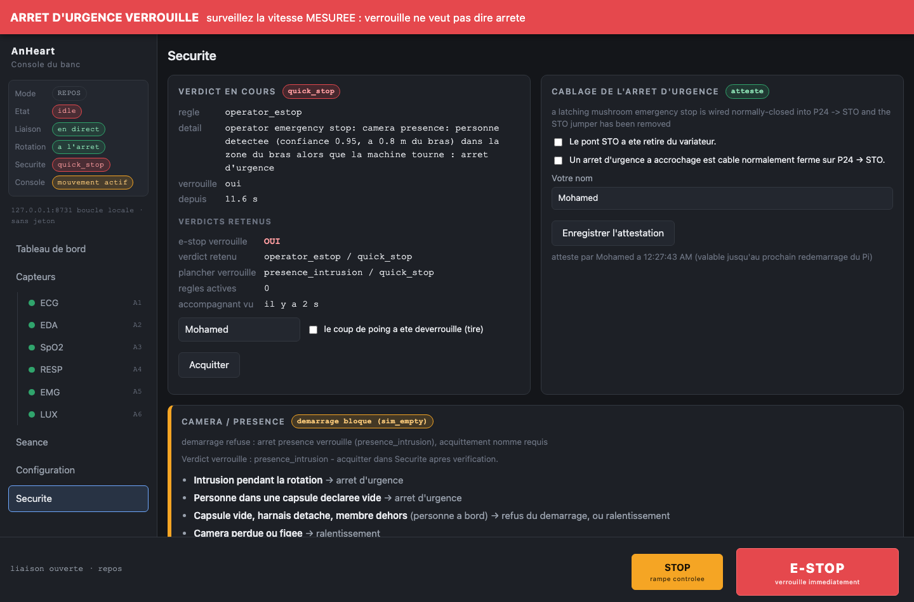

Repères :

1. Securite `quick_stop`, règle `operator_estop`, détail
   `operator emergency stop: camera presence: personne detectee (confiance 0.95, a 0.8 m du bras) dans la zone du bras alors que la machine tourne : arret d'urgence`.
2. `e-stop verrouille OUI` (en rouge) et
   `plancher verrouille presence_intrusion / quick_stop`.
3. Caméra : `demarrage bloque (sim_empty)`, avec
   `demarrage refuse : arret presence verrouille (presence_intrusion), acquittement nomme requis`
   et `Verdict verrouille : presence_intrusion - acquitter dans Securite apres verification.`
4. Après relance de la page, les deux cases de l'attestation apparaissent décochées,
   mais la pastille dit `atteste` : c'est la pastille qui fait foi.
5. En haut, le bandeau rouge **ARRET D'URGENCE VERROUILLE**, comme après un E-STOP de
   la page.

Que faire :

1. **Coup de poing** si la personne est encore près du bras.
2. Faites sortir la personne de la zone, vérifiez qu'il n'y a pas de blessé.
3. Attendez l'arrêt complet (Rotation `a l'arret`).
4. Acquittez (§13.6) **en cochant la case du coup de poing** : l'intrusion est traitée
   comme un arrêt d'urgence. Constaté : sans la case, refus ; avec la case,
   `cleared: operator_estop, presence_intrusion`.
5. La carte caméra doit revenir à `zone degagee`. La console exige que la zone soit
   vue dégagée pendant un moment avant d'accepter un démarrage.

Dans ce cas, la ligne `e-stop verrouille` affiche `OUI` : l'arrêt déclenché par la
caméra est un arrêt d'urgence comme celui de la page, et son acquittement exige la
case du coup de poing.

Autres refus de la caméra constatés : avec `PRESENCE_SOURCE=sim_occupied` (passager
vu dans la capsule), une séance **BANC** est refusée :
`demarrage refuse : une personne est vue dans la capsule alors que BANC (personne a bord : NON) est declare`

### 13.8 Le BITalino se déconnecte

> Constaté en simulation : déconnexion injectée pendant une séance manuelle à 5 tr/min.

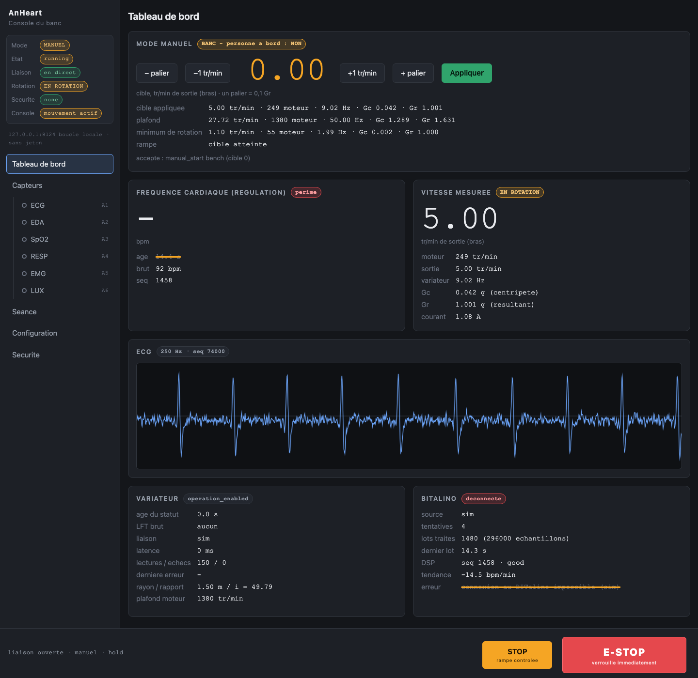

Repères :

1. Carte **BITalino** : pastille rouge `deconnecte`, `tentatives` qui monte (la console
   réessaie toutes les 5 s environ), `dernier lot 14.4 s`, `erreur` :
   `connexion au BITalino impossible (sim)`.
2. Carte **Frequence cardiaque (regulation)** : valeur absente, `age` barré (14,5 s),
   pastille grise `perime` : la mesure est trop vieille, quelle qu'ait été sa dernière
   qualité. Ne la lisez plus.
3. Barre latérale : les points des six capteurs deviennent creux et gris (périmés).
4. **Vitesse mesuree** `5.00` : en séance manuelle de banc, la perte de l'ECG
   **n'arrête pas** la machine (Securite reste `none`). La vitesse manuelle ne dépend
   pas du cœur.
5. Le tracé ECG reste affiché, figé : ne le lisez pas comme vivant.

Que faire :

1. En séance programmée (le cœur commande la vitesse) : faites **STOP** si la
   fréquence ne revient pas rapidement. Les règles cardiaques du superviseur
   réagissent à une fréquence périmée ; ce cas précis n'a pas été rejoué pour ce guide.
2. En séance manuelle : décidez s'il faut continuer sans surveillance cardiaque.
   Sans passager (banc), ce n'est pas un problème de sécurité.
3. Vérifiez le boîtier : allumé, batterie, distance, appairage Bluetooth
   (`/dev/rfcomm0` sur le Pi).
4. La console se reconnecte d'elle-même dès que le boîtier redevient joignable
   (compteur `reconnexions` avec un vrai boîtier). Si ce n'est pas le cas, arrêtez la
   séance, puis redémarrez la console.

### 13.9 Le variateur passe en défaut

> Constaté en simulation : défauts `ObF` (réarmable) et `OCF` (non réarmable)
> injectés au repos.

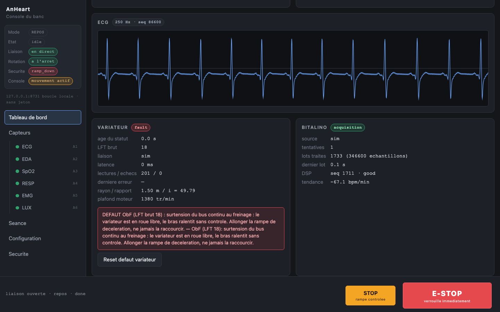

Repères :

1. Carte **Variateur**, pastille rouge `fault`.
2. `LFT brut 18` : le code brut lu sur le variateur.
3. Encadré rouge : `DEFAUT ObF (LFT brut 18) : surtension du bus continu au freinage : ...`
   (le code, puis ce qui s'est passé et quoi faire).
4. Bouton **Reset defaut variateur**.
5. Barre latérale : Securite `ramp_down` (règle `drive_fault`, verrouillée).

Lire le code : le mnémonique (`ObF`, `OCF`, `SLF1`...) est celui qu'affiche l'écran du
variateur sur son propre écran. La phrase qui suit dit ce qui s'est passé et quoi faire. La table
complète des codes est dans [raspberry-pi.md](../raspberry-pi.md).

**Réarmer ou pas ?** La console classe chaque défaut :

| Réarmables depuis la console (26) | Non réarmables : couper l'alimentation du variateur et inspecter (42) |
|---|---|
| `SLF1`, `SLF2`, `SLF3` (liaison perdue), `CnF`, `EPF1`, `EPF2`, `OHF` (surchauffe variateur), `OLF` (surcharge moteur), `ObF` (surtension au freinage), `OSF`, `PHF` (perte de phase), `USF` (sous tension), `COF`, `SSF`, `PtFL`, `OtFL`, `tJF`, `SrF`, `AI2F`, `LFF3`, `dLF`, `CSF`, `ULF`, `OLC`, `FbE`, `FbES` | `OCF` (surintensité), `SOF` (survitesse), `SCF1` à `SCF5` (courts circuits), `InF` et variantes, `EEF1`, `EEF2`, `CFF`, `CFI`, `CFI2`, `ILF`, `CrF`, `SPF`, `OPF1`, `OPF2`, `tnF`, `bLF`, `brF`, `ECF`, `PrF`, `FCF1`, `FCF2`, `LCF`, `dCF`, `HdF`, `HCF`, `ASF`, `SAFF`, tout code inconnu |

Pas à pas pour un défaut **réarmable** (constaté avec `ObF`) :

1. Attendez l'arrêt complet (Rotation `a l'arret`). Le reset est refusé si l'arbre
   tourne encore.
2. Lisez la phrase du défaut et **traitez la cause** (par exemple, pour `ObF` :
   allonger la rampe de décélération, jamais la raccourcir).
3. Assurez-vous qu'un nom figure dans un champ opérateur de la page (le reset prend le
   premier nom trouvé : Operateur du mode manuel, de la page Seance, ou de Securite).
   Sans nom : `an operator name is required ...`.
4. Cliquez **Reset defaut variateur**. La note dit
   `reset demande : fault_reset (le variateur doit le confirmer)`.
5. Vérifiez que la pastille du variateur quitte `fault` (constaté : `ready`).
6. Allez dans **Securite** et acquittez le verdict `drive_fault` (§13.6 ; la case du
   coup de poing n'est pas nécessaire ici). Constaté : `acquitte par Mohamed : drive_fault`.

L'ordre compte : le reset est accepté même si le verdict `drive_fault` est encore
verrouillé (c'est le seul verdict qu'il tolère), mais il est refusé si **un autre**
verdict attend (`reset refuse : acquitter d'abord le verdict <règle>`). Si vous
acquittez `drive_fault` avant le reset, le défaut toujours présent le reverrouille
aussitôt.

Pour un défaut **non réarmable** (constaté avec `OCF`) :

1. Le reset est refusé :
   `reset refuse : defaut OCF non rearmable depuis la console : couper l'alimentation du variateur et inspecter`.
2. L'acquittement de `drive_fault` réussit, mais le verdict revient immédiatement
   tant que le défaut est là, et tout démarrage est refusé.
3. Arrêtez la console (Ctrl C).
4. **Coupez l'alimentation du variateur** et inspectez la cause (pour `OCF` : blocage
   mécanique, bobinage en court circuit). Ne remettez pas sous tension sans avoir
   compris.
5. Remettez sous tension, relancez la console, refaites l'attestation (§13.10).

### 13.10 Redémarrer après une coupure

Trois cas.

**La page a perdu la console** (console arrêtée, réseau coupé, Pi planté) :

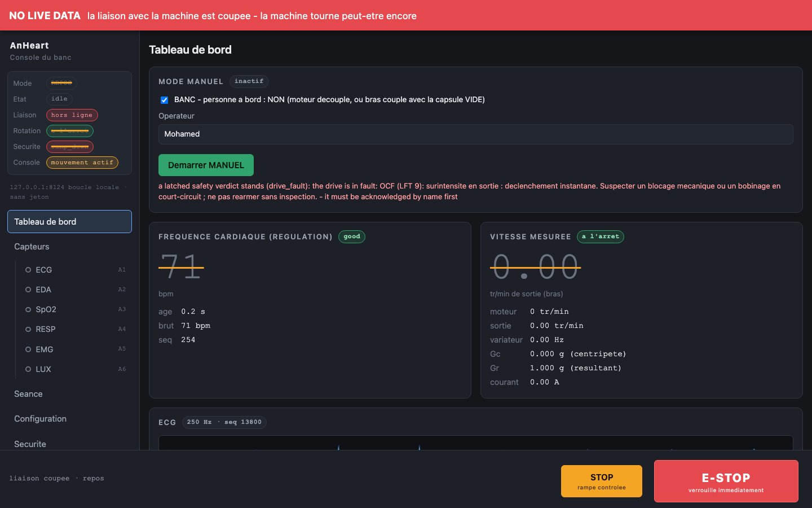

Repères :

1. Bandeau rouge **NO LIVE DATA** : `la liaison avec la machine est coupee - la machine tourne peut-etre encore`.
2. Liaison `hors ligne`, pastilles Mode, Rotation, Securite **barrées**.
3. Grands nombres barrés (`71`, `0.00`) : ce sont les dernières valeurs connues, pas
   les valeurs actuelles.
4. Points des capteurs creux et gris.
5. Pied de page : `liaison coupee · repos`.

Que faire :

1. **Considérez que la machine tourne sans doute encore.** Regardez le bras.
2. S'il tourne et que la console ne revient pas : **coup de poing**.
3. La page réessaie seule toutes les 1,5 s ; si la console revient, le bandeau
   disparaît.

**La console a été arrêtée puis relancée** (Ctrl C, coupure du Pi) :

1. Relancez la console (§3). Lisez la ligne de résumé.
2. Rechargez la page du navigateur.
3. Vérifiez **Rotation** `a l'arret`. Si la console trouve le variateur déjà en
   marche lors de l'inspection au repos ou au démarrage d'une séance, elle le
   met à zéro, refuse le démarrage et exige un
   acquittement (`demarrage refuse : variateur deja en marche (<n> tr/min), arret demande`).
4. **Refaites l'attestation** (§13.1) : elle a disparu avec l'ancien programme
   (constaté).
5. Regardez la page **Securite** : acquittez s'il reste un verdict.
6. Redémarrez la séance voulue. Rien ne reprend tout seul : une séance interrompue
   n'est jamais relancée automatiquement.

Une inspection initiale en cours reste prise en charge si la console est
interrompue pendant sa réponse. Un échec d'ouverture du lien ne permet aucune
écriture vers un variateur non vérifié. Si le lien a été acquis mais que l'état
du variateur est illisible, cet état reste **inconnu**, pas « au repos » : à la
fermeture, la console demande zéro et attend un arrêt mesuré avant de retirer
la commande de marche. Une nouvelle tentative de connexion qui échoue
n'efface pas cette incertitude. Un repos confirmé, lui, reste en lecture seule.

Si la fermeture ne peut pas confirmer l'arrêt, son rapport ne prétend pas que
la sortie est désactivée. La lecture périodique au repos ne continue pas après
cette fermeture. Ni une valeur ancienne à l'écran, ni le seul arrêt du
processus ne prouve alors l'arrêt de l'arbre ; aucune séance ne reprend seule.

**Coupure secteur du variateur** : au retour, le variateur peut afficher `USF`
(sous tension, réarmable) ; suivez §13.9.

## 14. Message affiché, ce qu'il veut dire, quoi faire

Où chercher : sous le bouton concerné (note rouge), dans une fenêtre d'alerte (STOP,
acquittement), ou dans la liste **Evenements** de la page Seance (`refused`). Les
messages sont reproduits tels que le code les écrit (sans accents, parfois en
anglais). Ceux marqués ✔ ont été vus pendant la préparation de ce guide.

### Au lancement (terminal)

| Message | Ce que ça veut dire | Quoi faire |
|---|---|---|
| ✔ `configuration: ARM_RADIUS_M: obligatoire, sans valeur par defaut ...` | rayon non fourni | ajouter `ARM_RADIUS_M=` avec la valeur mesurée |
| ✔ `configuration: UI_PORT: 8123 est le port de scripts/bench_console.py` | port réservé à l'outil de banc | garder 8080 ou un autre port |
| `configuration: UI_HOST/UI_PORT/UI_TOKEN: refusing to serve on '0.0.0.0' with a 5-character token: at least 16 characters are required off loopback` | page ouverte au réseau sans jeton assez long | mettre un `UI_TOKEN` d'au moins 16 caractères |
| `configuration: MOTOR_BACKEND: '' : attendu 'sim' ou 'serial'` | variable absente ou fausse | la renseigner |
| `configuration: ECG_SOURCE: ... attendu 'sim', 'serial' ou 'rfcomm'` | idem | la renseigner |
| `configuration: BITALINO_ADDRESS: ... ECG_SOURCE=serial attend un port serie (/dev/rfcomm0, COM4) ou une adresse MAC` | adresse du boîtier manquante ou au mauvais format | corriger `BITALINO_ADDRESS` |
| `configuration: MOTOR_MAX_RPM: <n> tr/min hors de 0..1380 (plaque signaletique)` | plafond supérieur à la plaque moteur | rester entre 0 et 1380 |
| `configuration: SENSORS: ECG obligatoire : la frequence cardiaque pilote le moteur` | ECG retiré de la liste | remettre `ECG` |
| `configuration: HR_CRITICAL_BPM: <n> bpm doit etre au-dessus de HR_HARD_MAX_BPM` | paliers cardiaques incohérents | décision médicale : corriger les deux valeurs |
| `configuration: CONVEX_URL: ... attendu https://<deploiement>.convex.site avec MACHINE_API_KEY` | clé du tableau de bord sans adresse valable | vider `MACHINE_API_KEY` ou corriger l'URL (`.convex.site`) |

### Dans la page : réponses immédiates

| Message | Ce que ça veut dire | Quoi faire |
|---|---|---|
| ✔ `cochez la declaration BANC (personne a bord : NON) avant de demarrer` | case BANC non cochée | vérifier que la capsule est vide, cocher |
| ✔ `an operator name is required: an unattributable session record is not one` | nom vide | taper votre nom (champ Operateur, ou votre nom en Securite) |
| ✔ `nobody has attested the emergency stop this boot: ...` | attestation pas faite depuis le démarrage | §13.1 |
| ✔ `both confirmations are required, separately: ...` | une seule case cochée | cocher les deux, seulement si les deux sont vraies |
| ✔ `a latched safety verdict stands (<règle>): <détail> - it must be acknowledged by name first` | un verdict attend | lire la règle, traiter la cause, §13.6 |
| `the machine is starting, not idle (pending: ...)` | double clic : une demande est déjà en attente | attendre une seconde |
| `the machine is running, not idle` | une séance tourne déjà | STOP d'abord |
| ✔ `no manual session is running (the machine is stopping)` (ou `idle`) | cible envoyée sans séance manuelle en cours | démarrer une séance manuelle |
| `the machine is <état>; try again in a moment` | cible ou reset envoyé pendant qu'une autre demande attend | réessayer |
| ✔ `STOP refuse : there is no session to end (the machine is idle)` | rien à arrêter | rien |
| ✔ `STOP refuse : the machine is already stopping` | arrêt déjà en cours | attendre |
| `the target must be a finite, non-negative output speed` | cible négative (API seulement) | corriger |
| ✔ `personne a bord refusee : OCCUPANCY_OCCUPIED_ENABLED=false (jalon M6, accords ingenierie et medical requis)` | personne à bord interdite par configuration | normal aujourd'hui ; utiliser BANC |
| ✔ `seances programmees desactivees sur cette console (jalon M5) : utiliser le mode MANUEL` | note de la page Seance ; aussi réponse 403 si `PROGRAMS_ENABLED=false` | mettre `PROGRAMS_ENABLED=true` si la séance est autorisée (jalon M5) |
| ✔ `no profile '<id>'; known: standard_30_min, standard_45_min` | profil inconnu (API) | choisir un profil de la liste |
| `'<id>' is not a well-formed profile id` | identifiant mal écrit | corriger |
| `training profile refused: ...` | profil ou durée refusés (constaté avec une durée de 20 min : `hold_too_short`, phase de maintien trop courte) | allonger la durée ou changer de profil |
| ✔ `acquittement refuse : nothing is latched to acknowledge` | rien à acquitter | rien |
| ✔ `the emergency stop is still latched: confirm the mushroom has been pulled back out (estop_released) before acknowledging` | case du coup de poing non cochée | tirer le coup de poing, cocher, acquitter |
| `... demanded GO_SILENT, which is one-way: ...` | verdict définitif pour ce processus | vérifier l'arrêt, redémarrer la console |
| `a valid x-anheart-token header is required` | jeton absent ou faux | page Configuration, saisir le bon jeton |
| `la demande d'arret d'urgence a echoue : ... - UTILISEZ L'ARRET CABLE` | l'E-STOP n'a pas atteint la console | **coup de poing** |
| `mouvement desactive : cette console est en lecture seule (jalon M1). ...` | console en lecture seule | n'arrive pas avec la console actuelle |

### Dans la liste Evenements (`refused`) : refus de la machine

| Message | Ce que ça veut dire | Quoi faire |
|---|---|---|
| ✔ `consigne refusee : 32.00 tr/min de sortie hors de 0 ou [55, 1380] tr/min moteur` | cible hors domaine, ni arrondie ni bornée | choisir une cible entre le minimum et le plafond |
| `consigne refusee : pas de session manuelle (<état>)` | plus de séance manuelle | redémarrer une séance |
| `consigne refusee : <détail>` | la séance manuelle se termine | attendre la fin, redémarrer |
| `demarrage refuse : la machine est deja <état>` | une séance existe déjà | STOP d'abord |
| `demarrage refuse : cablage de l'arret d'urgence non atteste` | attestation manquante | §13.1 |
| `demarrage refuse : verdict <règle> a acquitter (<détail>)` | verdict en attente | §13.6 |
| `demarrage refuse : seuil <nom> different de celui du superviseur` | les paliers cardiaques du profil ne sont pas ceux de `HR_HARD_MAX_BPM` / `HR_CRITICAL_BPM` | corriger le profil ou la configuration (décision médicale) |
| `demarrage refuse : variateur deja en marche (<n> tr/min), arret demande` | le variateur tournait déjà (ancien programme mort) | attendre l'arrêt, acquitter |
| `demarrage refuse : variateur en defaut (<code>, LFT <n>)` | défaut variateur présent | §13.9 |
| ✔ `demarrage refuse : age du passager requis pour une seance programmee` | âge vide | saisir l'âge |
| ✔ `demarrage refuse : passager de 15 ans, minimum 18 ans (MIN_RIDER_AGE)` | passager trop jeune | refus voulu (décision médicale pour changer) |
| `demarrage refuse : programme '<id>' inconnu sur cette machine` | profil absent (lancement distant) | enregistrer le profil sur le Pi |
| `demarrage refuse : programme inadapte a ce passager (<détail>)` | profil incompatible avec la FC max du passager | changer de profil |
| `demarrage refuse : programme a <n> tr/min moteur, au-dessus du plafond personne a bord (<m> tr/min)` | profil trop rapide pour une personne à bord | changer de profil |
| ✔ `personne a bord refusee : OCCUPANCY_OCCUPIED_ENABLED=false ...` | séance programmée sans autorisation « personne à bord » | voir §13.4 |
| `seances programmees desactivees (PROGRAMS_ENABLED=false, jalon M5) : utiliser MANUEL` | lancement distant sur une console qui ne les autorise pas | normal par défaut |
| ✔ `demarrage refuse : une personne est vue dans la capsule alors que BANC (personne a bord : NON) est declare` | caméra (simulée) voit quelqu'un en séance BANC | vider la capsule |
| `demarrage refuse : arret presence verrouille (<règle>), acquittement nomme requis` | verdict caméra en attente | §13.7 |
| `demarrage refuse : zone du bras degagee depuis <n> s seulement, <m> s requises` | la zone vient d'être dégagée | attendre quelques secondes |
| `demarrage refuse : la zone du bras n'est pas vue degagee (...)` | quelqu'un ou quelque chose dans la zone, ou image inexploitable | dégager la zone |
| `demarrage refuse : aucune image exploitable de la camera depuis <n> s` | caméra perdue | vérifier la caméra |
| ✔ `reset refuse : defaut OCF non rearmable depuis la console : couper l'alimentation du variateur et inspecter` | défaut non réarmable | §13.9 |
| ✔ `reset refuse : aucun defaut a acquitter (ready)` | pas de défaut (le reset précédent a déjà marché) | rien |
| `reset refuse : mouvement encore commande (<état>, <phase>)` | une séance est active | STOP, attendre |
| `reset refuse : acquitter d'abord le verdict <règle>` | un autre verdict attend | §13.6 puis reset |
| `reset refuse : l'arbre tourne encore (<n> tr/min moteur)` | pas encore arrêté | attendre l'arrêt |
| `reset refuse : <détail>` | le variateur n'a pas pris le reset | réessayer, sinon couper l'alimentation |

### Messages des règles de sécurité (ligne `detail` de Securite)

| Message (extrait) | Règle | Action de la machine |
|---|---|---|
| ✔ `operator emergency stop: console web: e-stop` | `operator_estop` | arrêt d'urgence, verrouillé |
| ✔ `the drive is in fault: <code> (LFT <n>): ...` | `drive_fault` | arrêt contrôlé, verrouillé |
| ✔ `operator emergency stop: camera presence: personne detectee ... : arret d'urgence` | caméra, intrusion | arrêt d'urgence, verrouillé |
| `une personne est vue dans la capsule alors que la seance est declaree BANC ... : arret d'urgence` | caméra | arrêt d'urgence |
| `... alors que la machine ... : arret controle, la zone du bras n'est plus surveillee` | caméra perdue | arrêt contrôlé |
| `la capsule est vue vide alors qu'une PERSONNE A BORD est declaree : arret controle` | caméra | arrêt contrôlé |
| `le harnais du passager est vu detache : arret controle` | caméra | arrêt contrôlé |
| `un membre du passager est vu hors de la capsule : arret controle` | caméra | arrêt contrôlé |
| `attendant_absent` | onglet fermé ou injoignable | gel après 60 s, arrêt contrôlé après 120 s |

## 15. FAQ et pièges

**La page affiche des nombres mais la machine tourne vraiment ?**
Regardez la pastille **Liaison** : `en direct` seulement si des données sont arrivées
il y a moins de 2 s. Puis **Rotation** et **Vitesse mesuree**, jamais la consigne.

**J'ai cliqué sur « +1 tr/min » et rien ne bouge.**
Normal : c'est un brouillon (nombre orange). Cliquez **Appliquer**.

**J'ai cliqué sur Appliquer, la page dit « cible envoyee », mais la cible n'a pas
changé.**
La machine a refusé après coup. Regardez la liste **Evenements** (page Seance) : un
`refused` orange dit pourquoi.

**Je ne peux pas dépasser 6 tr/min.**
Le plafond par défaut est `MOTOR_MAX_RPM=300` (tr/min moteur). Relevez-le par paliers
dans `.env` et relancez la console.

**Pourquoi 27,10 et pas 27 ?**
Les boutons partent du minimum de rotation (1,10) et ajoutent 1. Utilisez **−1 / +1**
et **− / + palier** pour approcher la valeur voulue ; la valeur exacte n'est possible
que par l'API.

**Le bouton « Demarrer la seance » reste gris.**
Trois raisons possibles : `PROGRAMS_ENABLED` n'est pas à `true`, pas d'attestation,
ou machine pas au repos. La commande du §13.4 fait la même chose par l'API.

**J'ai redémarré le Pi, tout est refusé.**
L'attestation ne survit pas à un redémarrage. Refaites §13.1.

**Puis-je démarrer une nouvelle séance manuelle après STOP ?**
Oui, quand le mode revient à `REPOS` et que la vitesse mesurée indique l'arrêt.
La carte manuelle rend alors les contrôles de démarrage, même si le dernier
enregistrement de séance est encore conservé. Pendant `ARRET`, elle garde les
informations de la séance qui s'arrête. Un verdict verrouillé doit toujours être
acquitté avant un nouveau départ.

Les champs de nom des formulaires partagent la saisie de l'opérateur courant.
Le nom déclaré au démarrage, manuel ou programmé, reste immédiatement en
`sessionStorage` dans cet onglet, sans attendre le signal de présence. Il est
réaffiché après un rechargement et attribue STOP et les autres commandes pendant
la rotation. Vider un champ de nom efface cette attribution retenue. Aucun nom n'est
déduit des événements d'une autre personne. Un nouvel onglet, ou un navigateur
qui bloque ce stockage, peut demander de saisir à nouveau le nom ; E-STOP ne
demande toujours aucun nom et reste immédiat. La fermeture de l'onglet efface
normalement ce stockage de session.

**Un enregistrement de profil est lent ou l'onglet est fermé pendant l'écriture.**
L'écriture sur disque s'effectue hors de la boucle moteur. Une écriture déjà
commencée finit avant qu'un autre éditeur puisse enregistrer. Rechargez les
profils : un second enregistrement avec une ancienne révision est refusé (409),
il ne doit pas écraser la première modification.

**Quels détails restent dans les journaux opérationnels ?**
Les logs de démarrage de séance, de fin de warmup, de refus et d'arrêt gardent
les événements, règles, actions, durées et révisions utiles au diagnostic sans
les identifiants du passager/opérateur, les valeurs de fréquence cardiaque ni
les motifs libres d'arrêt. Les traces nominatives d'attestation et d'acquittement
du câblage restent distinctes. Le détail autorisé du verdict reste disponible
dans la console ; les logs ne sont pas un dossier de santé.

**Le bandeau rouge « ARRET D'URGENCE VERROUILLE » reste affiché alors que la machine
est arrêtée.**
C'est voulu (§13.5) : il reste tant que le verdict est verrouillé et disparaît après
l'acquittement (§13.6). Pour savoir si la machine est arrêtée, lisez **Rotation** et
**Vitesse mesuree**.

**La fréquence cardiaque disparaît quand ça tourne vite (simulation).**
Constaté à 27 tr/min : le signal ECG simulé devient `noisy`. Sur la vraie machine, le
comportement n'a pas été mesuré.

**Je peux fermer l'onglet pendant une séance ?**
Non. Sans onglet ouvert, la règle `attendant_absent` gèle la vitesse après 60 s et
arrête la séance après 120 s. Et personne ne verrait les alertes.

**Deux écrans ouverts en même temps ?**
Possible (`clients telemetrie` le compte). Tous deux peuvent commander et arrêter.
Un écran trop lent est déconnecté (`clients evinces`) avec le message
`this screen fell behind and was disconnected; reload to resync` : rechargez la page.

**La console est reliée au tableau de bord alors que je voulais rester local.**
Un `.env` contient `MACHINE_API_KEY`. Forcez `MACHINE_API_KEY=` (vide) sur la ligne
de commande. Vérifiez `tableau de bord: aucun` dans la ligne de résumé.

**`No module named 'src'`.**
Vous avez lancé depuis la racine du dépôt. Faites `cd raspberry-pi` d'abord.

**Je lance aussi `scripts/bench_console.py` pour vérifier.**
Jamais en même temps que la console sur le même câble.

**Le coup de poing a été frappé, mais la page ne le montre pas.**
Normal : le logiciel ne voit pas ce contact. C'est pour cela que l'acquittement vous
demande de **déclarer** qu'il a été tiré.

**L'onglet du navigateur change de nom.**
Il porte le nom de la page affichée : `Tableau de bord - AnHeart`,
`Securite - AnHeart`, etc. « Console du banc », dans la barre latérale, est le nom de
la console.

## 16. Ce qui n'est pas testé sur la vraie machine

Pour être clair sur ce que ce guide garantit :

* **Tout a été rejoué en simulation seulement** (variateur, BITalino et caméra simulés).
  Aucune capture ne vient de la vraie centrifugeuse.
* **STO ponté** : sur la machine actuelle, l'entrée de sécurité du variateur est pontée.
  Même un arrêt d'urgence est une rampe. L'attestation du câblage est une déclaration
  que le logiciel ne vérifie pas.
* **Caméra** : seule une caméra simulée existe. Les règles de présence n'ont jamais vu
  une vraie image.
* **Personne à bord** : refusée par configuration (jalon M6). La séance programmée n'a
  été conduite qu'en simulation, avec un passager simulé.
* **Bouton « Demarrer la seance »** : corrigé ; il apparaît actif sur la capture
  `console-18`, reprise depuis, mais le clic n'a pas été rejoué dans la page.
* **Démarrage sur le Pi** (§3.4) : tiré de la configuration et du fichier
  `scripts/anheart.service`, non rejoué ; le service n'a pas été installé ni activé
  pour ce guide.
* **Perte de l'ECG en séance programmée** : non rejouée pour ce guide.
* **Reconnexion d'un vrai BITalino** : non rejouée (le simulateur utilisé ici reste
  déconnecté).
* **Durées** (montée à 27 tr/min en environ 1 min 45, arrêt en environ 1 min 40,
  STOP de séance programmée en environ 5 min) : mesurées sur le variateur simulé ; la
  vraie machine, avec sa rampe et son inertie, peut différer.

---

### Annexe : liste des captures

| Fichier | Ce qu'il montre |
|---|---|
| `img/console-01-tableau-de-bord-repos.png` | Tableau de bord au repos, barre latérale et pied de page |
| `img/console-02-securite-non-atteste.png` | page Securite avant l'attestation |
| `img/console-03-securite-atteste.png` | page Securite après l'attestation |
| `img/console-04-capteurs.png` | page Capteurs, six voies |
| `img/console-05-capteur-resp.png` | page du capteur RESP |
| `img/console-06-configuration.png` | page Configuration |
| `img/console-07-manuel-brouillon.png` | séance manuelle, brouillon 27,10 non appliqué |
| `img/console-08-manuel-rampe.png` | rampe de montée vers 27 tr/min |
| `img/console-09-manuel-27-atteint.png` | 27 tr/min atteints, ECG bruité |
| `img/console-10-seance-evenements-manuel.png` | page Seance pendant la séance manuelle, refus de 32 tr/min |
| `img/console-11-stop-rampe-arret.png` | rampe d'arrêt après STOP |
| `img/console-12-estop-verrouille.png` | E-STOP pendant la rampe d'arrêt |
| `img/console-13-securite-verdict-verrouille.png` | verdict E-STOP verrouillé, avant acquittement |
| `img/console-14-defaut-variateur.png` | défaut variateur ObF et bouton de reset |
| `img/console-15-liaison-coupee.png` | bandeau NO LIVE DATA, console arrêtée |
| `img/console-16-camera-intrusion.png` | intrusion détectée par la caméra simulée |
| `img/console-17-bitalino-deconnecte.png` | BITalino déconnecté pendant une séance manuelle |
| `img/console-18-seance-programme-previsualise.png` | page Seance, profil prévisualisé |
| `img/console-19-seance-programmee-en-cours.png` | séance programmée en cours (phase warmup) |
| `img/console-20-mobile.png` | vue mobile |
| `img/console-21-mobile-menu.png` | vue mobile, menu ouvert |

Pour les captures, la console a été lancée par un petit script hors dépôt qui appelle
`src.local_panel.main()` sans rien modifier et permet d'injecter, dans le **simulateur**
seulement, un défaut variateur, une déconnexion du BITalino ou une intrusion caméra.

Les captures `console-01` à `console-06` et `console-12` à `console-18` ont été
reprises le 5 octobre 2026, après les corrections d'affichage de la page, en rejouant
les mêmes procédures en simulation.
