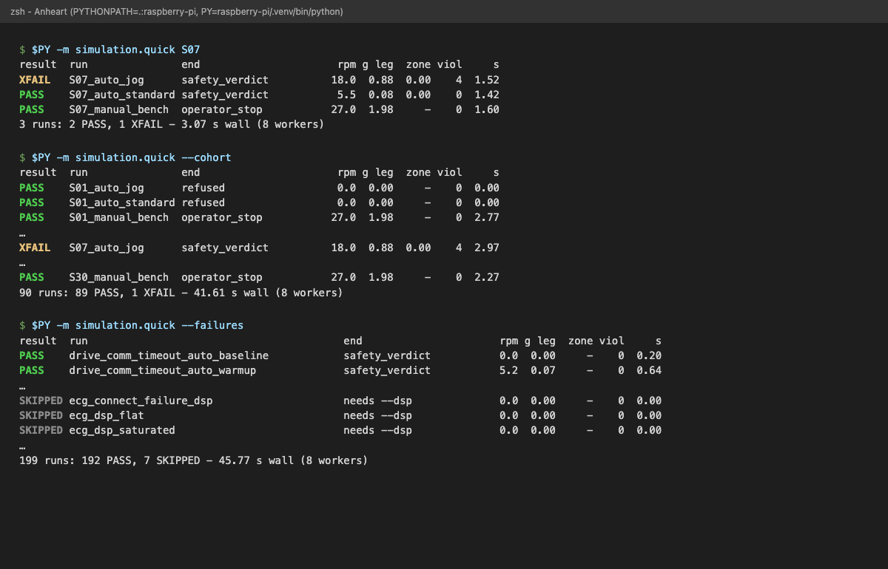
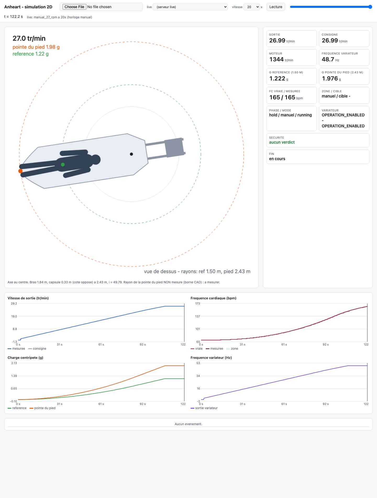
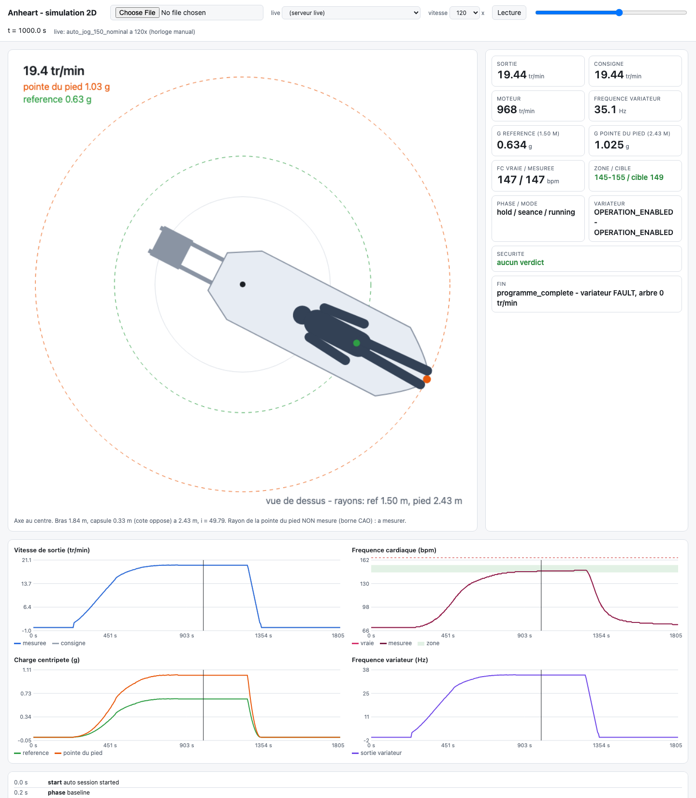
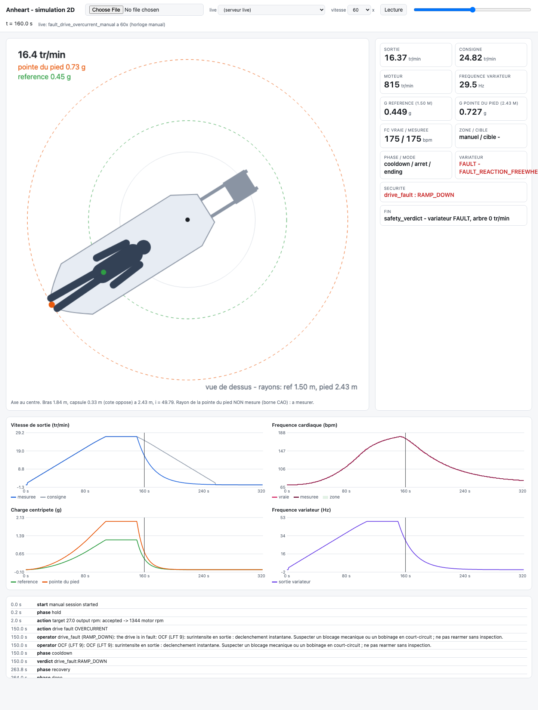
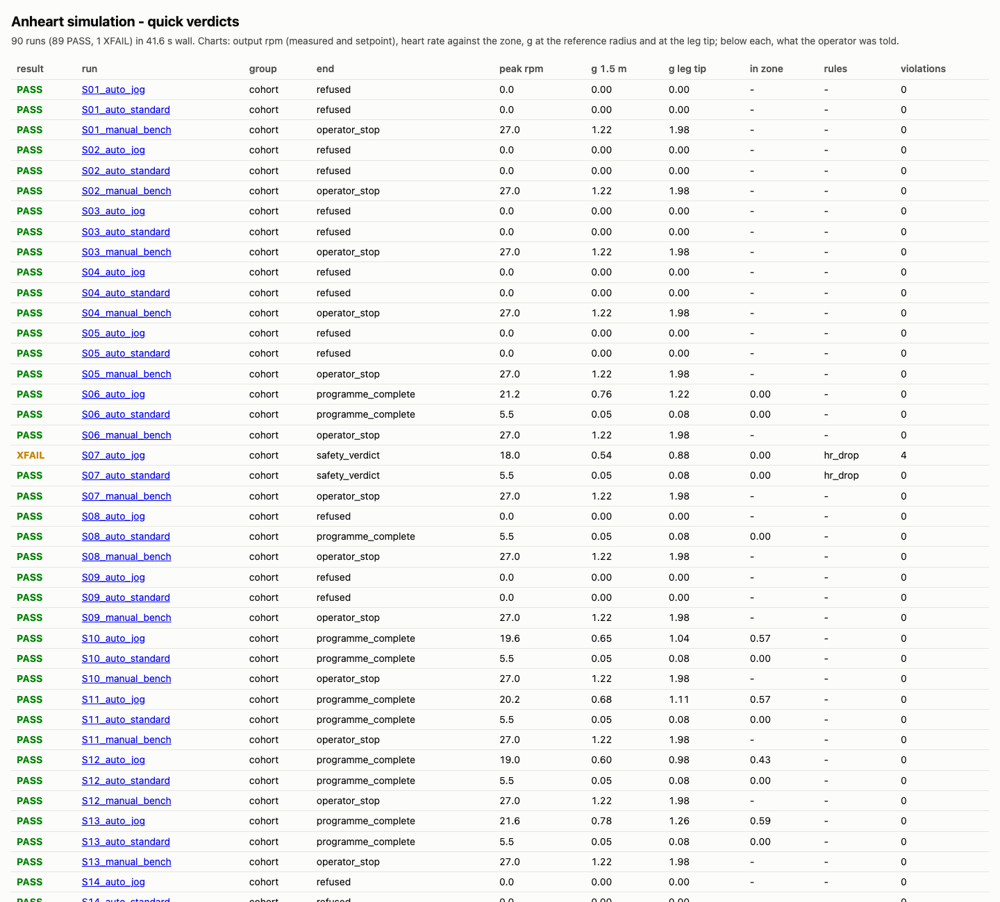
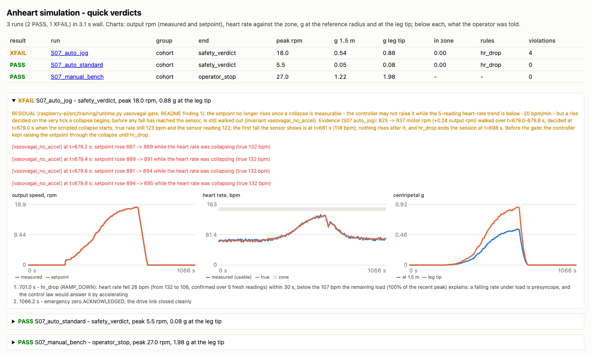
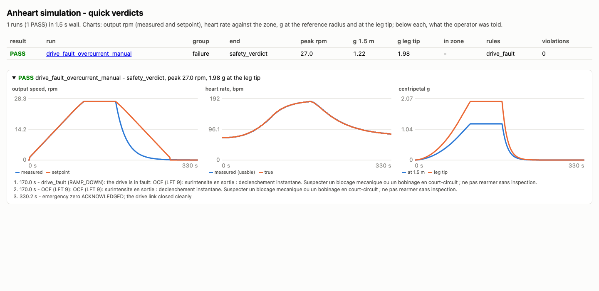

# Guide d'utilisation : le framework de test et de simulation

Mode d'emploi pas à pas, pour un ingénieur qui arrive dans l'équipe. Chaque
recette donne la commande exacte, une sortie **réellement obtenue** en la
lançant (Mac Apple silicon, 8 cœurs, 1er octobre 2026) et la façon de la lire.

Ce guide est orienté tâches. La référence complète (toutes les clés du schéma,
tous les invariants, toutes les familles de pannes) reste
[../framework-de-test.md](../framework-de-test.md) ; le détail technique en
anglais est dans [../../simulation/README.md](../../simulation/README.md). Les
termes (ttO, LFT, verdict, xfail) sont définis dans le
[glossaire](../glossaire.md).

## Sommaire

* [En une page](#en-une-page)
* [Installation pas à pas](#installation-pas-à-pas)
* [Recette 1 : vérifier que tout passe avant de pousser](#recette-1--vérifier-que-tout-passe-avant-de-pousser)
* [Recette 2 : des verdicts instantanés avec simulation.quick](#recette-2--des-verdicts-instantanés-avec-simulationquick)
* [Recette 3 : lancer un scénario complet et lire la trace](#recette-3--lancer-un-scénario-complet-et-lire-la-trace)
* [Recette 4 : ouvrir le visualiseur 2D](#recette-4--ouvrir-le-visualiseur-2d)
* [Recette 5 : lire le rapport HTML](#recette-5--lire-le-rapport-html)
* [Recette 6 : écrire un nouveau scénario JSON](#recette-6--écrire-un-nouveau-scénario-json)
* [Recette 7 : ajouter une personne, ajouter une panne](#recette-7--ajouter-une-personne-ajouter-une-panne)
* [Recette 8 : comprendre un échec](#recette-8--comprendre-un-échec)
* [Recette 9 : lancer un seul test du Pi, mesurer la couverture](#recette-9--lancer-un-seul-test-du-pi-mesurer-la-couverture)
* [Je veux... → commande](#je-veux--commande)
* [FAQ et pièges](#faq-et-pièges)

---

## En une page

**À quoi il sert.** À faire tourner le **vrai** logiciel de la machine
(`raspberry-pi/src` : loi de commande, superviseur de sécurité, profileur de
mouvement, toutes les sorties de séance) dans une boucle fermée où tout le
reste est simulé, puis à vérifier automatiquement que rien de dangereux ne
s'est produit. Il répond à des questions comme : « si le variateur déclenche
en surintensité à 27 tr/min, la machine s'arrête-t-elle proprement, et
l'opérateur est-il prévenu avec le bon code ? », en une seconde et demie, sans
matériel.

**Ce qu'il simule.**

| Élément | D'où il vient | Où |
|---|---|---|
| Géométrie de la machine (axe, bras 1,84 m, contrepoids, capsule 2,425 m) | **extraite de la vraie CAO** (`CAO/Gaura_Assy_2907.STEP`) | `simulation/cad/machine_geometry.json` |
| Variateur ATV320 (CiA402, rampes, roue libre, chien de garde ttO, 66 codes de défaut LFT) | simulateur de production `SimulatedDrive` | `raspberry-pi/src/motor/simulated.py` |
| Cœur du passager (réponse au g, retard, dérive, fatigue, malaise vagal, pic) | modèle de production `Physiology` | `raspberry-pi/src/sim/physiology.py` |
| ECG et BITalino (mode `dsp` : vraie chaîne BioSPPy) | `sim/bitalino.py`, `sim/ecg.py`, `signal_processing.py` | `raspberry-pi/src/` |
| Autres capteurs (EDA, SpO2, respiration, EMG, luminosité) | générateurs de signaux | `raspberry-pi/src/sim/signals/`, testés par `raspberry-pi/tests/test_sensor_*.py` |
| Caméra de présence (intrusion, scintillement, image figée, perte) | caméra scriptable `SimulatedPresence` | `raspberry-pi/src/presence/simulated.py`, testée par `raspberry-pi/tests/test_presence_*.py` |
| Pannes (199 cas : liaison, défauts variateur, ECG, processus, opérateur) | matrice d'injection | `simulation/failures.py` |
| 30 personnes fictives de 10 à 50 ans | cohorte tirée d'une graine | `simulation/cohort/` |

La caméra et les capteurs autres que l'ECG sont simulés **dans les tests du
Pi** (`raspberry-pi/tests/`), pas dans le harnais `simulation/` : celui-ci ne
fait que « pinger » la présence de l'opérateur.

**Deux suites, deux gates.**

| Suite | Dossier | Tests collectés | Gate |
|---|---|---|---|
| Tests du Pi | `raspberry-pi/tests/` | 3187 | `bash raspberry-pi/scripts/check.sh` |
| Tests de la simulation | `simulation/tests/` | 985 | `simulation/scripts/check.sh` |

**Ce qu'il ne prouve PAS.** Tout tourne contre des **modèles**. Un test vert
prouve que le code se comporte comme prévu face au variateur simulé, au cœur
simulé et à l'ECG simulé. Il ne prouve pas que le vrai ATV320, le vrai
BITalino, la vraie structure ou un vrai corps humain réagissent pareil. Deux
rayons ne viennent pas de la CAO et restent **à mesurer** : la pointe du pied
(2,4254 m par défaut, borne haute) et le rayon de référence (1,5 m). Les
profils « jog » de la simulation sont marqués *NOT clinically signed off*.
Aucun test n'est marqué `hardware` : aucun test automatique ne parle à du
matériel réel.

---

## Installation pas à pas

Il n'y a **qu'un seul environnement Python** pour les deux suites :
`raspberry-pi/.venv`, en Python 3.12.

### Étape 1 : cloner et se placer à la racine

```sh
git clone <url-du-dépôt> Anheart
cd Anheart
```

### Étape 2 : créer le venv

Avec `python3.12` dans le `PATH` :

```sh
cd raspberry-pi
python3.12 -m venv .venv
```

Sur un Mac où `python3.12` n'existe pas (c'était le cas sur la machine de
rédaction : `python3.12 not found`), `uv` fournit l'interpréteur. Le drapeau
`--seed` est **indispensable**, sinon le venv n'a pas de `pip` :

```sh
cd raspberry-pi
uv venv --python 3.12 --seed .venv
```

### Étape 3 : installer les dépendances

```sh
.venv/bin/pip install --upgrade pip
.venv/bin/pip install -r requirements-dev.txt
.venv/bin/pip install pyserial
.venv/bin/pip install --no-deps bitalino
```

Le module `bitalino` est à part, sans ses dépendances : sa métadonnée exige
`PyBluez-bitalino`, qui ne s'installe pas en Python 3.12 (voir la note en fin
de `requirements-dev.txt`).

Vérification (sortie obtenue sur un venv neuf, environ 1 minute
d'installation) :

```sh
.venv/bin/python -c "import bitalino, biosppy, hypothesis, pytest; print('imports ok')"
```

```text
imports ok
```

### Étape 4 : régler l'environnement de la simulation

Toutes les commandes `simulation.*` se lancent **depuis la racine du dépôt**,
avec la racine **et** `raspberry-pi/` dans le chemin d'import. Dans chaque
nouveau terminal :

```sh
cd /chemin/vers/Anheart
export PYTHONPATH=.:raspberry-pi
PY=raspberry-pi/.venv/bin/python
```

Toutes les recettes ci-dessous supposent ces trois lignes. Sans le
`PYTHONPATH`, vous obtenez `ModuleNotFoundError: No module named 'simulation'`
(ou `'src'`).

### Étape 5 : premier essai (2 secondes)

```sh
$PY -m simulation.quick manual_27_rpm
```

```text
result  run           end                      rpm g leg  zone viol     s
PASS    manual_27_rpm operator_stop           27.0  1.98     -    0  1.49
1 runs: 1 PASS - 1.50 s wall (8 workers)
report: /…/Anheart/simulation/out/report.html  data: /…/Anheart/simulation/out/report.json
```

Si vous voyez `PASS`, l'installation est bonne.

### Étape 6 (facultative) : l'environnement CAO

Seulement pour régénérer la géométrie depuis le fichier STEP. Il a son propre
venv :

```sh
cd simulation/cad
uv venv --python 3.12 .venv-cad && uv pip install --python .venv-cad/bin/python cadquery-ocp
.venv-cad/bin/python extract_geometry.py ../../CAO/Gaura_Assy_2907.STEP machine_geometry.json
```

Sans ce venv, le test de reproductibilité CAO est simplement **sauté**.

---

## Recette 1 : vérifier que tout passe avant de pousser

Deux gates, une par suite. Chacune enchaîne lint, format, deux
vérificateurs de types en mode strict, puis les tests avec couverture de
branches, **sans s'arrêter à la première erreur** : vous voyez tous les
dégâts d'un coup.

### La gate du Pi

```sh
cd raspberry-pi
bash scripts/check.sh
```

Lancez-la avec `bash` : le fichier n'a pas le bit exécutable dans git, et
`./scripts/check.sh` répond `permission denied`. Sous Windows :
`.\scripts\check.ps1`.

Sortie réelle (début et fin) :

```text
=== lint (ruff) ===
All checks passed!

=== format (ruff) ===
134 files already formatted

=== types (basedpyright, strict, zero Any) ===
0 errors, 0 warnings, 0 notes

=== types (mypy, strict) ===
Success: no issues found in 129 source files

=== tests + 100% branch coverage ===
…
src/training/runtime.py         1178      0    348      0   100%
src/training/safety.py           705      0    148      0   100%
…
TOTAL                          10386      0   2350      0   100%
Required test coverage of 100% reached. Total coverage: 100.00%
====================== 3187 passed in 1305.00s (0:21:44) =======================

GATE PASSED
```

Durée mesurée : 21 min 54 s au total.

### La gate de la simulation

Elle se lance de n'importe où, utilise `raspberry-pi/.venv` et règle elle-même
le `PYTHONPATH` :

```sh
simulation/scripts/check.sh
```

Sortie réelle (début et fin) :

```text
=== lint (ruff) ===
All checks passed!

=== format (ruff) ===
36 files already formatted

=== types (basedpyright, strict, zero Any) ===
0 errors, 0 warnings, 0 notes

=== types (mypy, strict) ===
Success: no issues found in 35 source files

=== scenario battery + coverage ===
…
harness.py             580      0    172      0   100%
invariants.py          314      0    130      0   100%
…
TOTAL                 2955      0    716      0   100%
Required test coverage of 100.0% reached. Total coverage: 100.00%
984 passed, 1 xfailed in 1598.36s (0:26:38)

GATE PASSED
```

Durée mesurée : 26 min 47 s au total. Le `1 xfailed` est le cas résiduel
S07 (recette 8) : il est attendu, la gate passe.

### Comment lire le résultat

* La dernière ligne fait foi : `GATE PASSED`, ou `GATE FAILED: <étapes>` qui
  nomme les étapes rouges (par exemple `GATE FAILED: format (ruff), types
  (mypy, strict)`). Le code de sortie vaut 0 ou 1.
* **Couverture.** La gate du Pi exige 100 % de branches sur la **chaîne de
  sécurité** (liste `[tool.coverage.report] include` de
  `raspberry-pi/pyproject.toml`) ; le reste du code web est mesuré sans
  bloquer. La gate simulation exige 100 % sur tout `simulation/`
  sauf `cad/`, `tests/` et `scripts/`. Une ligne ajoutée sans test fait donc
  échouer la gate, même si tous les tests passent.
* **Durée.** Comptez de 20 à 30 minutes par gate (22 et 27 minutes mesurées,
  les deux gates tournant en même temps sur la même machine). Pendant le
  travail, utilisez `simulation.quick` (recette 2) et des tests ciblés
  (recette 9) ; lancez les gates avant de pousser.
* Un format rouge se corrige avec `$PY -m ruff format .` depuis le dossier
  concerné (`raspberry-pi/` ou `simulation/`), puis relancez la gate.

---

## Recette 2 : des verdicts instantanés avec `simulation.quick`

`simulation.quick` prend le chemin rapide : modèle de capteur de FC direct,
un processus par cœur, horloge déterministe. Il affiche un tableau de
verdicts et écrit `report.json` et `report.html` (recette 5).

```text
usage: python -m simulation.quick [-h] [--cohort] [--failures] [--all] [--dsp]
                                  [--workers WORKERS] [--out OUT]
                                  [target]
```

La cible (`target`) est cherchée dans cet ordre : un cas de la matrice de
pannes, un scénario (par son nom ou par un chemin vers un `.json`), un
identifiant de personne (`S01` à `S30`).

### 2a. Un scénario

```sh
$PY -m simulation.quick manual_27_rpm
```

```text
result  run           end                      rpm g leg  zone viol     s
PASS    manual_27_rpm operator_stop           27.0  1.98     -    0  1.49
1 runs: 1 PASS - 1.50 s wall (8 workers)
```

Colonnes :

| Colonne | Sens |
|---|---|
| `result` | `PASS`, `FAIL`, `XFAIL`, `FIXED?` ou `SKIPPED` (voir ci-dessous) |
| `run` | nom de l'exécution |
| `end` | raison de fin (`operator_stop`, `safety_verdict`, `emergency_stop`, `programme_complete`, `shutdown`, `tick_exception`, `refused`) |
| `rpm` | pic de vitesse de sortie, tr/min |
| `g leg` | pic de g à la pointe du pied |
| `zone` | part du HOLD passée dans la zone cardiaque (`-` en manuel) |
| `viol` | nombre de violations (invariants ou attentes) |
| `s` | durée de l'exécution, secondes |

Un cas de panne se lance de la même façon :

```sh
$PY -m simulation.quick drive_fault_overcurrent_manual
```

```text
result  run                            end                      rpm g leg  zone viol     s
PASS    drive_fault_overcurrent_manual safety_verdict          27.0  1.98     -    0  1.46
1 runs: 1 PASS - 1.47 s wall (8 workers)
```

`safety_verdict` + `PASS` veut dire : la séance s'est terminée **par la
sécurité**, comme attendu, et tout ce qui devait être vrai l'est.

### 2b. Une personne de la cohorte (ses trois séances)

```sh
$PY -m simulation.quick S07
```

```text
result  run               end                      rpm g leg  zone viol     s
XFAIL   S07_auto_jog      safety_verdict          18.0  0.88  0.00    4  1.52
PASS    S07_auto_standard safety_verdict           5.5  0.08  0.00    0  1.42
PASS    S07_manual_bench  operator_stop           27.0  1.98     -    0  1.60
3 runs: 2 PASS, 1 XFAIL - 3.07 s wall (8 workers)
```

Chaque personne a trois séances : `auto_jog` (programme 145 à 155 bpm,
30 min), `auto_standard` (profil livré `standard_30_min`) et `manual_bench`
(27 tr/min au banc). Le `XFAIL` de S07 est le **seul défaut connu restant**
(recette 8).

### 2c. Toute la cohorte (30 personnes × 3 séances)

```sh
$PY -m simulation.quick --cohort
```

Début et fin de la sortie réelle :

```text
result  run               end                      rpm g leg  zone viol     s
PASS    S01_auto_jog      refused                  0.0  0.00     -    0  0.00
PASS    S01_auto_standard refused                  0.0  0.00     -    0  0.00
PASS    S01_manual_bench  operator_stop           27.0  1.98     -    0  2.77
…
PASS    S30_manual_bench  operator_stop           27.0  1.98     -    0  2.27
90 runs: 89 PASS, 1 XFAIL - 41.61 s wall (8 workers)
```

`refused` + `PASS` est normal : S01 a 10 ans, le programme **doit** être
refusé (âge minimum 18 ans par défaut). Le résultat attendu aujourd'hui est
**89 PASS, 1 XFAIL, 0 FAIL**. La durée varie de 20 à 45 s selon la charge de
la machine (41,6 s ici, une gate tournant en parallèle).

### 2d. La matrice de pannes (199 cas)

```sh
$PY -m simulation.quick --failures
```

Lignes non `PASS` et fin de la sortie réelle :

```text
SKIPPED ecg_connect_failure_dsp                     needs --dsp              0.0  0.00     -    0  0.00
SKIPPED ecg_dsp_flat                                needs --dsp              0.0  0.00     -    0  0.00
SKIPPED ecg_dsp_saturated                           needs --dsp              0.0  0.00     -    0  0.00
SKIPPED ecg_dsp_mains                               needs --dsp              0.0  0.00     -    0  0.00
SKIPPED ecg_dsp_stopped                             needs --dsp              0.0  0.00     -    0  0.00
SKIPPED ecg_dsp_corrupted                           needs --dsp              0.0  0.00     -    0  0.00
SKIPPED ecg_dsp_gaps                                needs --dsp              0.0  0.00     -    0  0.00
199 runs: 192 PASS, 7 SKIPPED - 45.77 s wall (8 workers)
```

Les 7 `SKIPPED` sont les cas qui ont besoin de la **vraie** chaîne ECG. Pour
les inclure (environ 15 s chacun) :

```sh
$PY -m simulation.quick --failures --dsp
```

### 2e. Tout d'un coup

```sh
$PY -m simulation.quick --all          # scénarios + pannes + cohorte
$PY -m simulation.quick --all --dsp    # idem, avec la vraie chaîne ECG
```



### Lire les statuts

| Statut | Sens | Que faire |
|---|---|---|
| `PASS` | aucun invariant ni attente violé | rien |
| `FAIL` | au moins une violation, sans défaut documenté | recette 8 |
| `XFAIL` | échoue **comme documenté** (`known_defect`) | rien, sauf si vous corrigez ce défaut |
| `FIXED?` | un défaut était documenté mais l'exécution passe | retirez la clé `known_defect` |
| `SKIPPED` | besoin du vrai DSP | relancez avec `--dsp` |

Code de sortie : 0 si tout est `PASS`, `XFAIL` ou `SKIPPED` ; 1 dès qu'il y a
un `FAIL` **ou un `FIXED?`**.

Options utiles : `--workers N` (0 = un par cœur, défaut), `--out DIR` (où
écrire les rapports, défaut `simulation/out/`).

---

## Recette 3 : lancer un scénario complet et lire la trace

`simulation.run` exécute un scénario, affiche un résumé détaillé et écrit la
**trace complète** (chaque tick, chaque trame envoyée au variateur, chaque
événement).

```sh
$PY -m simulation.run --list                 # les 60 scénarios
$PY -m simulation.run manual_27_rpm --csv    # un scénario, plus un CSV
$PY -m simulation.run --all                  # tous, plus simulation/out/summary.md
```

Sortie réelle de la deuxième commande (2,9 s) :

```text
arming: ttO: not verified over Modbus - check on the keypad (the Modbus timeout is the only watchdog outside this process; it must be set, and short (the simulator assumes 3 s))
arming: SLL: not verified over Modbus - check on the keypad (the response to a Modbus loss must be a ramp stop, never freewheel or 'ignore'; otherwise a dead link leaves the motor commanded)
operator stop requested: operator: stop button
session ending (operator_stop) at 200.000 s
emergency zero acknowledged: the drive is ramping down
shutdown complete: emergency zero ACKNOWLEDGED; the drive link closed cleanly
scenario manual_27_rpm (manual, ecg direct): 1558 ticks, 2629 drive frames
  start: ok; end: operator_stop; final: finished, drive FAULT, shaft 0 rpm
  peak 26.99 out rpm (1344 motor rpm, 48.7 Hz); g 1.222 at 1.500 m, 1.976 at the leg tip (2.425 m)
  peak setpoint rate 0.301, arm accel 0.281 out rpm/s (limit 0.25); peak arm g-dot 0.0201 g/s ref, 0.0324 g/s leg tip (limit 0.03)
  in zone -; rules []
  all invariants and expectations hold
  trace: /…/Anheart/simulation/out/manual_27_rpm.jsonl
```

### Lire le résumé, ligne par ligne

| Ligne | Ce qu'elle dit |
|---|---|
| `arming: ...` | avertissements du runtime au démarrage : deux paramètres du variateur ne se vérifient pas par Modbus. Normal en simulation, à contrôler sur le clavier du vrai variateur |
| lignes du runtime | le journal de la séance (STOP, fin, zéro d'urgence, fermeture) |
| `1558 ticks, 2629 drive frames` | nombre de pas de boucle (0,2 s chacun) et de trames Modbus envoyées |
| `start / end / final` | START accepté, raison de fin, état final ; `drive FAULT` à la fin est **normal** en simulation (le variateur simulé verrouille SLF par son ttO après la fermeture minimale) |
| `peak ...` | pic de vitesse de sortie, moteur, fréquence, et g aux deux rayons |
| `peak setpoint rate ... arm accel ... g-dot` | pentes mesurées. Les valeurs brutes peuvent dépasser la limite affichée de quelques centièmes : l'invariant tolère une marge |
| `in zone`, `rules` | part du HOLD dans la zone, règles de sécurité déclenchées |
| `all invariants and expectations hold` | **la ligne qui fait foi**. Sinon : `VIOLATIONS (n):` suivi de la liste |

Code de sortie : 0 si tout tient. Les traces vont dans
`simulation/out/<scénario>.jsonl` (+ `.csv` avec `--csv`), dossier ignoré par
git ; `--out DIR` les met ailleurs.

### Lire la trace

Un fichier JSONL : une ligne JSON par enregistrement, avec un champ `type`.

| `type` | Contenu |
|---|---|
| `meta` (1re ligne) | le scénario, les rayons, le rapport de réduction (49,79), les limites, la zone cardiaque |
| `row` | un tick : `t`, `state`, `mode`, `phase`, vitesses (consigne, LFRD, mesurée, sortie), `hertz`, `g_reference`, `g_leg_tip`, `hr_true`, `hr_live`, `target_bpm`, `safety_action`, `safety_rule`, `output_enabled`, `silent` |
| `frame` | une trame vers le variateur : `kind` (`speed`, `command`, `emergency_zero`, `open`, `close`...), `value`, `ok` |
| `event` | un événement : `start`, `phase`, `action`, `verdict`, `operator` (ce que l'opérateur a lu), `shutdown` |
| `final` (dernière ligne) | comment la machine a été laissée : `end_reason`, `sim_state`, `energised`, `shaft_motor_rpm` |

Requêtes `jq` utiles (sorties réelles sur `manual_27_rpm`) :

```sh
T=simulation/out/manual_27_rpm.jsonl
jq -c 'select(.type=="event")' $T                 # la chronologie
jq -c 'select(.type=="final")' $T                 # l'état final
jq -c 'select(.type=="row" and .t==150)|{t,phase,output_rpm,g_leg_tip,hr_true}' $T
```

```text
{"type":"event","t":0.0,"kind":"start","detail":"manual session started"}
{"type":"event","t":0.2,"kind":"phase","detail":"hold"}
{"type":"event","t":2.0,"kind":"action","detail":"target 27.0 output rpm: accepted -> 1344 motor rpm"}
{"type":"event","t":200.0,"kind":"action","detail":"OperatorStop"}
{"type":"event","t":200.0,"kind":"phase","detail":"cooldown"}
{"type":"event","t":306.2,"kind":"phase","detail":"recovery"}
{"type":"event","t":306.4,"kind":"phase","detail":"done"}
{"type":"event","t":311.6,"kind":"shutdown","detail":"emergency zero ACKNOWLEDGED; the drive link closed cleanly"}
{"type":"event","t":311.6,"kind":"operator","detail":"emergency zero ACKNOWLEDGED; the drive link closed cleanly"}
{"type":"final","runtime_state":"finished","end_reason":"operator_stop","stop_reason":"operator: stop button","silent":false,"runtime_output_enabled":false,"runtime_applied_rpm":0,"sim_state":"FAULT","energised":false,"lfrd_motor_rpm":0,"shaft_motor_rpm":0,"shutdown_detail":"emergency zero ACKNOWLEDGED; the drive link closed cleanly"}
{"t":150.0,"phase":"hold","output_rpm":26.9934,"g_leg_tip":1.9762,"hr_true":178}
```

La dernière ligne montre que, même au banc (personne à bord : non), le cœur
simulé répond au g : 178 bpm à 27 tr/min. Le temps `t` des lignes compte en secondes **depuis le START**. Pour une vue
graphique de la même trace, voir la recette 4.

---

## Recette 4 : ouvrir le visualiseur 2D

### Lancer le serveur

```sh
$PY -m simulation.live                 # port 8765 par défaut
$PY -m simulation.live --port 8733     # si 8765 est pris
```

```text
viewer on http://127.0.0.1:8733/  (live: ?live=<scenario>&speed=20)
```

Le serveur n'utilise que la bibliothèque standard et n'écoute que sur
`127.0.0.1`. Chaque onglet a sa propre exécution. Ctrl-C l'arrête.

### Les URL

| URL | Effet |
|---|---|
| `http://127.0.0.1:8765/?live=manual_27_rpm&speed=20` | séance manuelle à 27 tr/min, en direct, 20 fois plus vite que le réel |
| `http://127.0.0.1:8765/?live=auto_jog_150_nominal&speed=120` | séance AUTO « footing », zone 145 à 155 bpm (30 min simulées en 15 s environ) |
| `http://127.0.0.1:8765/?live=fault_drive_overcurrent_manual&speed=60` | panne : surintensité variateur à 27 tr/min |
| `http://127.0.0.1:8765/?live=manual_27_rpm&speed=5&clock=sim` | même séance sur l'horloge `SimClock` du code (voir ci-dessous) |
| `http://127.0.0.1:8765/?trace=out/manual_27_rpm.jsonl` | relecture d'une trace écrite par `simulation.run` |

Paramètres :

| Paramètre | Valeurs | Effet |
|---|---|---|
| `live` | nom de scénario | lance ce scénario en direct |
| `speed` | 0,1 à 200 (borné par le serveur), défaut 20 | accélération du temps. La liste de l'en-tête ne propose que 1, 5, 20, 60, 120 : une autre valeur fonctionne mais la liste reste vide |
| `clock` | `manual` (défaut) ou `sim` | `manual` : temps simulé déterministe. `sim` : horloge réelle accélérée ; gardez une vitesse modeste, une pause de la machine hôte devient un arrêt de boucle auquel le runtime réagit |
| `trace` | chemin **relatif au dossier `simulation/`** | le serveur ne sert que `simulation/`, donc la trace doit y être (en pratique `out/...`). Une trace écrite ailleurs avec `--out` se charge par le bouton fichier |

Sans serveur, ouvrez `simulation/viewer/index.html` dans le navigateur et
chargez un `.jsonl` avec le bouton fichier (le mode live est alors grisé).

### Séance manuelle à 27 tr/min



Capture prise à t = 122 s, le bras vient d'atteindre 27 tr/min. Ce que montre
chaque zone :

1. **En-tête.** Bouton fichier (charger une trace), liste `live` (lancer un
   scénario), `vitesse`, `Lecture`/`Pause`, barre de position. Dessous :
   l'instant affiché (`t = 122.2 s`) et la source (`live: manual_27_rpm a 20x
   (horloge manual)`).
2. **Vue de dessus (grand cadre).** L'axe est le point noir au centre ; le bras
   tourne dans le sens inverse des aiguilles d'une montre à la vitesse de
   sortie enregistrée. On voit les deux poutres, le **contrepoids** (carré
   gris, côté opposé), la **capsule** et la silhouette du passager allongé,
   tête vers l'axe, pieds vers l'extérieur. Trois cercles : gris plein =
   carénage ; **vert pointillé** = rayon de référence (1,5 m, point vert sur
   le passager) ; **orange pointillé** = pointe du pied (2,43 m, point orange
   au bout des pieds). En haut à gauche : **27.0 tr/min**, **pointe du pied
   1.98 g** (en orange) et **reference 1.22 g** (en vert). Le g au bout des
   jambes est plus élevé qu'au rayon de référence parce que le g croît comme
   le rayon. La légende du bas rappelle que la pointe du pied n'est **pas
   mesurée** (borne CAO).
3. **Tuiles (à droite).** `Sortie` et `Consigne` (tr/min de sortie), `Moteur`
   (tr/min moteur : 1344), `Frequence variateur` (48,7 Hz), `g reference` et
   `g pointe du pied` avec leur rayon, `FC vraie / mesuree` (le cœur simulé et
   ce que le capteur rapporte), `Zone / cible` (en manuel : `manuel / cible
   -`), `Phase / mode` (`hold / manuel / running`), `Variateur` (l'état vu par
   le runtime, puis celui du simulateur ; `(perimee)` si la lecture est
   vieille), `Securite` (verdict en cours, vert si aucun), `Fin` (comment la
   machine a été laissée ; `en cours` pendant l'exécution).
4. **Quatre courbes**, avec un curseur vertical à l'instant affiché : vitesse
   de sortie (mesurée en bleu, consigne en gris), fréquence cardiaque (vraie,
   mesurée, bande verte de la zone, lignes rouges pointillées pour FC max dure
   et critique), charge centripète (g de référence en vert, pointe du pied en
   orange), fréquence variateur (Hz).
5. **Liste d'événements** (en bas). En direct, elle se remplit **à la fin**
   de l'exécution (« Aucun evenement » avant). Cliquez un événement pour y
   placer le curseur.

### Séance AUTO « footing » vers 150 bpm



Curseur placé à t = 1000 s, en plein HOLD. La tuile `Zone / cible` passe en
vert (`145-155 / cible 149`) : la FC mesurée (147 bpm) est dans la zone. Le
régulateur tient 19,4 tr/min (968 tr/min moteur, 35,1 Hz), soit 1,03 g à la
pointe du pied. Sur la courbe cardiaque, la bande verte est la zone et la
ligne rouge pointillée la FC max dure (165 bpm). On lit les phases dans les
courbes : BASELINE à l'arrêt (0 à 180 s), WARMUP (montée), HOLD (plateau),
COOLDOWN (descente à 1260 s), RECOVERY. La tuile `Fin` montre l'état final de
l'exécution entière : `programme_complete - variateur FAULT, arbre 0 tr/min`.

### Une panne : surintensité variateur



Scénario `fault_drive_overcurrent_manual` : le variateur verrouille OCF
(LFT 9) à t = 150 s, à 27 tr/min. Curseur à t = 160 s :

* `Variateur` en rouge : `FAULT - FAULT_REACTION_FREEWHEEL` ;
* `Securite` en rouge : `drive_fault : RAMP_DOWN` ;
* `Phase / mode` : `cooldown / arret / ending` ;
* sur la courbe de vitesse, la **mesurée** (bleu) décroît plus vite que la
  **consigne** (gris) : en défaut, le moteur est en roue libre et ralentit
  seul, la consigne descend encore en rampe ;
* la liste d'événements montre ce que l'opérateur a lu : `OCF (LFT 9):
  surintensite en sortie : declenchement instantane. Suspecter un blocage
  mecanique ou un bobinage en court-circuit ; ne pas rearmer sans
  inspection.`

---

## Recette 5 : lire le rapport HTML

Chaque appel à `simulation.quick` écrit `simulation/out/report.html` (ou dans
`--out`), un fichier autonome, thèmes clair et sombre, en anglais. Ouvrez-le
dans un navigateur :

```sh
open simulation/out/report.html        # macOS
```

Attention : chaque appel **écrase** le rapport précédent du même dossier.
Pour garder plusieurs rapports, donnez un `--out` différent à chaque fois.

### Vue d'ensemble



* **En tête** : nombre d'exécutions par statut et durée totale (`90 runs (89
  PASS, 1 XFAIL) in 41.6 s wall`).
* **Le tableau** : `result`, `run` (lien vers le détail), `group` (`scenario`,
  `failure`, `cohort`), `end`, `peak rpm`, `g 1.5 m`, `g leg tip`, `in zone`,
  `rules` (règles de sécurité vues), `violations`. Commencez par la colonne
  `result` : tout ce qui n'est pas vert mérite un clic.

### Détail d'une exécution



Sous le tableau, une section repliable par exécution (cliquez son titre). De
haut en bas :

1. le texte du **défaut connu** (en orange) s'il y en a un ;
2. la liste des **violations** (en rouge), chacune avec son invariant entre
   crochets, l'instant et les valeurs : ici `[vasovagal_no_accel] at
   t=679.2 s: setpoint rose 887 -> 889 while the heart rate was collapsing` ;
3. trois petites courbes : vitesse de sortie (mesurée et consigne), FC
   (mesurée utilisable et vraie, contre la bande de zone), g à 1,5 m et à la
   pointe du pied ;
4. la liste numérotée des **messages opérateur**, c'est-à-dire ce que la
   console aurait affiché (verdicts avec leur phrase, défauts variateur avec
   mnémonique et code LFT, refus, bilan d'arrêt).

Pour une panne, c'est souvent la liste des messages qui compte le plus :



`report.json` contient les mêmes données pour un traitement automatique.

---

## Recette 6 : écrire un nouveau scénario JSON

Un scénario est un fichier `simulation/scenarios/<nom>.json`. Ajouter un
scénario, c'est ajouter un fichier : `simulation.run --list`, `simulation.quick`
et `test_battery.py` le découvrent seuls. Les fichiers qui commencent par `_`
(comme `_profiles.json`) ne sont pas des scénarios.

Le parseur **refuse toute clé inconnue** et liste tous les problèmes d'un coup.

### Étape 1 : écrire le fichier

JSON n'accepte pas de commentaires. Voici le fichier tel qu'il doit être
écrit, puis l'explication de chaque ligne.

```json
{
  "name": "manual_20_rpm_then_estop",
  "description": "Montee manuelle a 20 tr/min, E-STOP a 120 s, acquittement a 200 s.",
  "tags": ["manual", "estop"],
  "kind": "manual",
  "duration_s": 300,
  "teardown_s": 60,
  "preroll_s": 15,
  "geometry": {"reference_radius_m": 1.5, "leg_tip_radius_m": 2.4254},
  "manual": {"occupancy": "bench", "ceiling_motor_rpm": 1380},
  "ecg": {"mode": "direct", "period_s": 1.0, "noise_bpm": 0, "seed": 1},
  "drive": {"tto_s": 3.0, "acceleration_time_s": 10.0, "hsp_motor_rpm": 1380},
  "actions": [
    {"at_s": 2, "do": "manual_target", "output_rpm": 20.0, "expect": "accepted"},
    {"at_s": 120, "do": "estop"},
    {"at_s": 150, "do": "manual_target", "output_rpm": 10.0, "expect": "refused"},
    {"at_s": 200, "do": "acknowledge", "estop_released": true}
  ],
  "expect": {
    "end_reason": "emergency_stop",
    "rules": ["operator_estop"],
    "reaches_output_rpm": 20.0,
    "max_output_rpm": 20.05
  }
}
```

Explication, clé par clé :

| Clé | Ici | Pourquoi |
|---|---|---|
| `name` | `manual_20_rpm_then_estop` | identifiant ; donnez-lui le nom du fichier |
| `description`, `tags` | texte libre | pour les rapports et le tri |
| `kind` | `manual` | séance manuelle (`auto` : séance programmée pilotée par la FC, qui exige un `profile`) |
| `duration_s` | 300 | horizon après le START |
| `teardown_s` | 60 (défaut) | la machine continue sans personne après la sortie de la console : on vérifie qu'elle s'arrête seule |
| `preroll_s` | 15 (défaut) | console au repos avant le START |
| `geometry` | valeurs CAO par défaut | changez `leg_tip_radius_m` pour tester une autre taille de passager |
| `manual` | banc, plafond 1380 tr/min moteur | `occupancy: "occupied"` : une personne à bord (plafond plus bas) |
| `ecg` | mode `direct`, sans bruit | `dsp` : vraie chaîne ECG, plus lente |
| `drive` | ttO 3 s, rampe 10 s, HSP 1380 | ajoutez `initial_fault` pour un variateur déjà en défaut |
| action à 2 s | consigne 20 tr/min, **doit être acceptée** | |
| action à 120 s | E-STOP | |
| action à 150 s | consigne 10 tr/min, **doit être refusée** | après un E-STOP, rien ne doit repartir |
| action à 200 s | acquittement | |
| `expect` | fin par `emergency_stop`, règle `operator_estop` vue, 20 tr/min atteints, jamais plus de 20,05 | ce qui doit être vrai à la fin |

Les instants `at_s` des `actions` comptent **depuis le START**. Seuls `name`,
`kind` et `duration_s` sont obligatoires ; le reste a une valeur par défaut.
La liste complète des actions (`drive_fault`, `comms_loss`, `ecg_dropout`,
`loop_stall`, `clock_jump`...) et de leurs paramètres est dans
[../framework-de-test.md, section 8](../framework-de-test.md#8-écrire-un-nouveau-scénario-json).

Pour une séance AUTO, remplacez le bloc `manual` par un profil :

```json
{
  "name": "vasovagal_auto_hold",
  "kind": "auto",
  "duration_s": 1500,
  "profile": "jog_150_30_min",
  "subject_events": [{"event": "vasovagal_drop", "at_s": 915, "duration_s": 20}],
  "expect": {"rules": ["hr_drop"]}
}
```

Profils utilisables : ceux de `raspberry-pi/config/profiles.default.json`
(`standard_30_min`, `standard_45_min`) et ceux de
`simulation/scenarios/_profiles.json` (`jog_150_30_min`, `jog_150_short`).

### Étape 2 : le lancer

Pas besoin de le copier dans `scenarios/` pour l'essayer : les deux outils
acceptent un chemin.

```sh
$PY -m simulation.quick chemin/vers/manual_20_rpm_then_estop.json
```

```text
result  run                      end                      rpm g leg  zone viol     s
PASS    manual_20_rpm_then_estop emergency_stop          20.0  1.09     -    0  0.49
1 runs: 1 PASS - 0.50 s wall (8 workers)
```

```sh
$PY -m simulation.run chemin/vers/manual_20_rpm_then_estop.json
```

```text
operator emergency stop latched: operator: e-stop
session ending (emergency_stop) at 120.000 s
…
scenario manual_20_rpm_then_estop (manual, ecg direct): 1000 ticks, 1391 drive frames
  start: ok; end: emergency_stop; final: finished, drive FAULT, shaft 0 rpm
  peak 20.00 out rpm (996 motor rpm, 36.1 Hz); g 0.671 at 1.500 m, 1.085 at the leg tip (2.425 m)
  …
  in zone -; rules ['operator_estop']
  all invariants and expectations hold
```

### Étape 3 : une faute de frappe est refusée

Avec `ouput_rpm` au lieu de `output_rpm` et `reach_output_rpm` au lieu de
`reaches_output_rpm`, `simulation.run` s'arrête avant de rien lancer :

```text
ValueError: faute.json: actions[2]: unknown key 'ouput_rpm'; faute.json: actions[2]: missing 'output_rpm'; faute.json: expect: unknown key 'reach_output_rpm'
```

### Étape 4 : l'ajouter à la batterie

Copiez le fichier dans `simulation/scenarios/`, vérifiez
`$PY -m simulation.quick <nom>`, puis le test de batterie de ce seul
scénario :

```sh
$PY -m pytest simulation/tests/test_battery.py -k manual_20_rpm_then_estop
```

Pensez à ajouter sa ligne au tableau « The battery » de
`simulation/README.md`, puis lancez la gate simulation (recette 1).

---

## Recette 7 : ajouter une personne, ajouter une panne

### 7a. Ajouter une personne

`simulation/cohort/cohort.json` est **généré** à partir d'une graine. Un test
vérifie qu'il est identique à ce que produit `generate.py` et qu'il contient
exactement 30 personnes. **Ne l'éditez pas à la main.**

**Méthode recommandée : un scénario pour cette personne.** Partez des
nombres d'un sujet existant :

```sh
python3 -c "import json;print(json.load(open('simulation/cohort/cohort.json'))['subjects'][6])"
```

```text
{'subject_id': 'S07', 'age_years': 48, 'sex': 'female', 'fitness': 'average', 'condition': 'vasovagal_prone', 'hr_rest': 66, 'hr_max_tanaka': 174, 'hr_max': 175, 'k_g': 117.6, 'tau_up': 27.7, 'tau_down': 48.1, 'drift_max': 9.24, 'tau_drift': 581.0, 'fatigue': 0.047, 'ecg_noise_bpm': 1.62, 'ectopic_rate': 0.0, 'ectopic_bpm': 0.0, 'motion_noise_bpm_per_g': 0.0, 'vasovagal_at_s': 679.0}
```

Puis écrivez un scénario avec un bloc `subject` (le cœur), un bloc `ecg` (le
capteur) et, si besoin, des `subject_events`. Exemple complet, vérifié :

```json
{
  "name": "personne_s31_jog",
  "description": "Personne ajoutee a la main : 44 ans, forme moyenne, malaise vagal en HOLD.",
  "tags": ["auto", "subject", "jog"],
  "kind": "auto",
  "duration_s": 1810,
  "profile": "jog_150_30_min",
  "subject": {
    "hr_rest": 68, "hr_max": 178, "k_g": 112.0,
    "tau_up": 30.0, "tau_down": 52.0,
    "drift_max": 9.0, "tau_drift": 600.0, "fatigue": 0.05
  },
  "ecg": {"mode": "direct", "noise_bpm": 1.5, "seed": 31},
  "subject_events": [{"event": "vasovagal_drop", "at_s": 915, "duration_s": 20}],
  "expect": {
    "rules": ["hr_drop"],
    "forbid_rules": ["hr_critical"],
    "max_output_rpm": 27.8
  }
}
```

```sh
$PY -m simulation.quick chemin/vers/personne_s31_jog.json
```

```text
result  run              end                      rpm g leg  zone viol     s
PASS    personne_s31_jog safety_verdict          19.0  0.98  0.03    0  1.71
1 runs: 1 PASS - 1.73 s wall (8 workers)
```

`safety_verdict` est attendu : `hr_drop` a mis fin à la séance pendant le
malaise, et `hr_critical` ne s'est pas déclenché.

Correspondance entre un sujet de la cohorte et un scénario :

| Champ de `cohort.json` | Dans le scénario |
|---|---|
| `hr_rest`, `hr_max`, `k_g`, `tau_up`, `tau_down`, `drift_max`, `tau_drift`, `fatigue` | `subject` |
| `ecg_noise_bpm` | `ecg.noise_bpm` |
| `ectopic_rate`, `ectopic_bpm`, `motion_noise_bpm_per_g` | `ecg` |
| `vasovagal_at_s` | `subject_events: [{"event": "vasovagal_drop", "at_s": vasovagal_at_s + 15, "duration_s": 20}]` |
| condition `nonresponder` | `subject_events: [{"event": "nonresponder", "at_s": 0, "duration_s": 4000}]` |
| `age_years` | aucun équivalent : la barrière d'âge est testée par la cohorte et par les tests du Pi |

**Piège de temps.** Les `at_s` des `subject_events` comptent sur l'horloge
du cœur simulé, qui démarre **au début du pré-roulage**, 15 s avant le
START ; les `at_s` des `actions` comptent depuis le START. C'est pourquoi la
cohorte écrit `vasovagal_at_s + 15` (voir `_events` dans
`simulation/cohort/battery.py`) : S07 a `vasovagal_at_s = 679`, et ses
violations tombent bien à t = 679,2 s dans la trace.

**Autre méthode : agrandir la cohorte.** Modifiez `SIZE`, `MINORS` ou
`SPECIAL` dans `simulation/cohort/generate.py`, régénérez, puis mettez à jour
le test `test_the_cohort_spans_the_brief` (qui exige 30) et, si un nouveau
couple personne/séance montre un défaut connu, la table
`KNOWN_VASOVAGAL_ONSET` de `battery.py`. Tous les tirages viennent du même
générateur dans un ordre fixe : changer la taille change aussi les personnes
suivantes, et donc les tableaux de `simulation/README.md`.

```sh
$PY -m simulation.cohort.generate           # réécrit cohort.json
$PY -m simulation.cohort.generate --check   # code 0 si à jour, 1 sinon, sans rien afficher
$PY -m simulation.quick --cohort
```

### 7b. Ajouter une panne

Les 199 cas sont construits en Python dans `simulation/failures.py`, pas en
fichiers. Chaque cas est un `FailureCase` : un document de scénario (même
schéma que la recette 6) et ce qui doit être vrai après.

Où l'ajouter : dans la fonction de sa famille, `_drive_cases`, `_ecg_cases`,
`_process_cases` ou `_operator_cases`. Les trois premières remplissent une
liste `cases` ; `_operator_cases` renvoie directement une liste littérale
(`return [ ... ]`), ajoutez-y un élément. `cases()` rassemble tout, et le
test paramétré de `test_failures.py` découvre le nouveau cas seul.

Aides pour construire le document :

| Aide | Séance produite |
|---|---|
| `_manual(nom, actions)` | banc, montée à 27 tr/min à 2 s, STOP à 200 s, 330 s au total |
| `_auto(nom, actions, at=...)` | programme `jog_150_short`, horizon `at + 240` s (800 s maximum) |
| `_dsp(nom, signal)` | vraie chaîne ECG, signal corrompu à 120 s pendant 40 s |

Instants par phase : `AUTO_PHASES` (baseline 30, warmup 200, hold 500,
cooldown 690, recovery 750 s) et `MANUAL_PHASES` (ramp_up 40, at_speed 170,
ramp_down 230 s).

Exemple (à ajouter à la liste de `_operator_cases`) :

```python
FailureCase(
    name="operator_stop_twice_manual",
    category=Category.OPERATOR,
    description="Deux STOP a 1 s d'intervalle pendant la descente.",
    document=_manual(
        "operator_stop_twice_manual",
        [{"at_s": 201.0, "do": "operator_stop"}],
    ),
    end_reasons=frozenset({"operator_stop"}),   # raisons de fin permises
    messages=("emergency zero",),               # doit apparaître dans un message opérateur
    silent=False,                               # le runtime ne doit pas s'être tu
),
```

Champs principaux : `rules` (règles qui doivent se déclencher), `messages`
(sous-chaînes attendues dans les messages opérateur), `silent`, `at` et
`phase` (instant d'injection et phase attendue), `deadline` (avant quand les
règles doivent avoir tiré), `stopped_by` (avant quand l'arbre doit être
arrêté), `known_defect`. Le tableau complet est dans
[../framework-de-test.md, section 10.2](../framework-de-test.md#102-ajouter-une-panne).

Pour essayer un cas **avant** de modifier `failures.py`, un petit script
suffit (vérifié, il affiche `operator_stop_twice_manual -> PASS []`) :

```python
import asyncio
from simulation.failures import Category, FailureCase, _manual, judge, run_case

case = FailureCase(
    name="operator_stop_twice_manual",
    category=Category.OPERATOR,
    description="Deux STOP a 1 s d'intervalle pendant la descente.",
    document=_manual("operator_stop_twice_manual", [{"at_s": 201.0, "do": "operator_stop"}]),
    end_reasons=frozenset({"operator_stop"}),
    messages=("emergency zero",),
    silent=False,
)
violations = judge(case, asyncio.run(run_case(case)))
print(case.name, "->", "PASS" if not violations else "FAIL", [str(v) for v in violations])
```

```sh
PYTHONPATH=.:raspberry-pi raspberry-pi/.venv/bin/python essai_panne.py
```

Une fois le cas dans `failures.py` :

```sh
$PY -m simulation.quick operator_stop_twice_manual
$PY -m pytest simulation/tests/test_failures.py -k operator_stop_twice_manual
simulation/scripts/check.sh         # la couverture à 100 % doit tenir
```

Ajoutez aussi sa ligne au tableau de la matrice dans `simulation/README.md`.

---

## Recette 8 : comprendre un échec

### 8a. Un `FAIL` dans `simulation.quick` ou `simulation.run`

Exemple volontaire : le scénario de la recette 6 avec deux attentes fausses
(`end_reason` = `operator_stop` et `max_output_rpm` = 15).

```text
result  run              end                      rpm g leg  zone viol     s
FAIL    echec_volontaire emergency_stop          20.0  1.09     -    2  0.59
1 runs: 1 FAIL - 0.59 s wall (8 workers)
```

Démarche :

1. **Relancez la même cible avec `simulation.run`** pour avoir la liste des
   violations en clair :

   ```text
     VIOLATIONS (2):
       [expect_end]: ended emergency_stop, expected operator_stop
       [expect_max]: peak 20.00 > 15.0 out rpm
   ```

   Le nom entre crochets dit **qui** a parlé. `expect_*` et `forbid_rule` :
   une attente du scénario (bloc `expect`) n'est pas tenue. Les autres noms
   (`vasovagal_no_accel`, `setpoint_domain`, `exit_energised`...) sont des
   **invariants physiques**, vérifiés sur toute trace même sans bloc `expect`.
2. **Ouvrez le rapport HTML** (recette 5) : la section de l'exécution montre
   les violations, les courbes et les messages opérateur.
3. **Regardez l'instant** dans le visualiseur : relancez `simulation.run`
   (trace dans `simulation/out/`), puis ouvrez
   `http://127.0.0.1:8765/?trace=out/<scénario>.jsonl` et cliquez l'événement
   le plus proche de l'instant de la violation.
4. **Décidez** : l'attente était-elle fausse (corrigez le scénario) ou le code
   de `raspberry-pi/src` a-t-il un défaut ? Dans le second cas, ne touchez pas
   à l'invariant pour faire passer le test : corrigez le code, ou documentez
   le défaut (8c).

### 8b. Un test pytest qui casse

```sh
$PY -m pytest simulation/tests/test_failures.py -k drive_fault_overcurrent -x
```

`-x` s'arrête au premier échec ; `-rx` affiche aussi la raison des xfail.
Dans `simulation/`, la configuration ajoute déjà `-q` : n'en rajoutez pas, un
second `-q` supprime la ligne de bilan. Côté Pi, la configuration ajoute
`-v` ; `-q` y donne une sortie courte.

Si c'est `test_invariants.py` qui casse, c'est le **vérificateur** lui-même :
chaque invariant doit se déclencher sur une trace corrompue exprès. Un
vérificateur aveugle ne doit jamais passer en silence.

### 8c. Les xfail stricts

Un **xfail strict** (`pytest.mark.xfail(strict=True)`) est un test qui décrit
le **bon** comportement, que le code ne fournit pas encore :

* tant que le défaut existe, le test « échoue comme prévu » : la suite reste
  verte, et le défaut reste visible (`XFAIL`) dans chaque rapport ;
* le jour où le défaut est corrigé, le test passe, et `strict=True` le fait
  **devenir rouge** (`XPASS(strict)` dans pytest, `FIXED?` dans
  `simulation.quick`). Retirez alors la marque.

Dans ce dépôt, la marque vient de la clé `known_defect` : dans un scénario
JSON, dans un `FailureCase`, ou pour un couple de la cohorte dans la table
`KNOWN_VASOVAGAL_ONSET` de `simulation/cohort/battery.py`.

Démonstration : le scénario de la recette 6 (qui passe) avec en plus
`"known_defect": "exemple: defaut suppose"` :

```text
result  run            end                      rpm g leg  zone viol     s
FIXED?  defaut_corrige emergency_stop          20.0  1.09     -    0  0.52
1 runs: 1 FIXED? - 0.52 s wall (8 workers)
```

Code de sortie 1 : un défaut corrigé ne peut pas rester étiqueté « connu »
par oubli. `simulation.run` sur le même fichier affiche `all invariants and
expectations hold` puis `known defect: ...` et sort aussi en code 1 ; le
libellé `FIXED? remove known_defect` n'apparaît que dans le tableau de
`simulation.run --all`.

### 8d. Le cas résiduel S07

C'est le seul défaut connu restant. S07 : femme de 48 ans, sujette au malaise
vagal (effondrement scripté au début du HOLD de son footing).

Ce que fait le code aujourd'hui : un verrou du runtime interdit à la consigne
de **monter** tant que la tendance des cinq dernières lectures de FC est sous
-20 bpm/min (ou inconnue). Mais une petite montée **décidée au tick même où
l'effondrement commence**, avant que le capteur ne voie la moindre chute, va
encore jusqu'au bout. L'invariant `vasovagal_no_accel` le relève.

Ce que montre l'exécution réelle (`simulation.quick S07`, rapport HTML,
capture de la recette 5) : 4 violations de t = 679,2 s à 679,8 s, consigne
887 → 895 tr/min moteur alors que la FC vraie vaut 132 bpm, puis `hr_drop`
termine la séance (message opérateur à t = 701 s). Plus rien ne monte après
la première chute mesurée. Avant ce verrou, le régulateur accélérait pendant
tout l'effondrement.

Le texte du défaut (dans `battery.py`) cite d'autres chiffres (825 → 837
tr/min, FC 123 bpm, `hr_drop` à 698 s) : ils datent d'une version antérieure.
Fiez-vous à la sortie de l'exécution.

Pour le voir :

```sh
$PY -m simulation.quick S07
$PY -m pytest simulation/tests/test_cohort.py -k S07 -rx
```

```text
x.....                                                                   [100%]
=========================== short test summary info ============================
XFAIL simulation/tests/test_cohort.py::test_the_subject_session_holds_every_invariant[S07-auto_jog] - RESIDUAL (raspberry-pi/src/training/runtime.py vasovagal gate, README finding 1): …
5 passed, 196 deselected, 1 xfailed in 36.48s
```

Si un jour vous corrigez ce défaut, ce test deviendra rouge (`XPASS`) :
retirez l'entrée `("S07", SessionType.AUTO_JOG)` de `KNOWN_VASOVAGAL_ONSET`,
puis mettez à jour le constat n° 1 de `simulation/README.md` et la section 12
de [../framework-de-test.md](../framework-de-test.md).

---

## Recette 9 : lancer un seul test du Pi, mesurer la couverture

Tout se passe **depuis `raspberry-pi/`**, sans `PYTHONPATH`.

### Un fichier, un filtre, un test

```sh
cd raspberry-pi
.venv/bin/python -m pytest tests/test_safety.py -q                     # un fichier (182 tests)
.venv/bin/python -m pytest tests/test_safety.py -q -k collapse         # les noms qui contiennent "collapse"
.venv/bin/python -m pytest "tests/test_safety.py::test_a_falling_heart_rate_ends_the_session_although_it_reads_as_below_zone" -q
```

Sorties réelles des deux dernières :

```text
====================== 3 passed, 179 deselected in 0.31s =======================
```

```text
tests/test_safety.py .                                                   [100%]

============================== 1 passed in 0.17s ===============================
```

Pour trouver le nom exact d'un test :

```sh
.venv/bin/python -m pytest tests/test_safety.py --co -q | grep falling
```

Si `-k` ne sélectionne rien (`182 deselected / 0 selected`), le mot n'est dans
aucun nom de test : les noms décrivent un comportement
(`test_a_collapse_during_the_unload_is_still_caught`), pas une règle
(`hr_drop` ne sélectionne rien).

### Mesurer la couverture d'un module

```sh
.venv/bin/python -m pytest tests/test_safety.py -q \
  --cov=src.training.safety --cov-branch --cov-report=term-missing --cov-fail-under=0
```

```text
Name                     Stmts   Miss Branch BrPart  Cover   Missing
--------------------------------------------------------------------
src/training/safety.py     705      1    148      1    99%   1210, 1847->1849
--------------------------------------------------------------------
TOTAL                      705      1    148      1    99%
============================= 182 passed in 23.88s =============================
```

Comment lire : `Missing` donne les lignes jamais exécutées (`1210`) et les
branches jamais prises (`1847->1849` : de la ligne 1847, le saut vers 1849
n'a jamais eu lieu). Ici, 99 % avec ce seul fichier : les lignes manquantes
sont couvertes par d'autres fichiers de tests. Seule la gate complète
(recette 1) dit si le 100 % tient.

`--cov-fail-under=0` est nécessaire sur une exécution partielle : la
configuration impose 100 %, et sans lui pytest affiche `FAIL Required test
coverage of 100.0% not reached` et sort en erreur alors que les tests
passent.

Rapport HTML de couverture, ligne par ligne :

```sh
.venv/bin/python -m pytest tests/test_safety.py -q --cov=src.training.safety \
  --cov-branch --cov-fail-under=0 --cov-report=html:/tmp/htmlcov
open /tmp/htmlcov/index.html
```

### Un test de la simulation

Depuis la racine, avec `PYTHONPATH` et `PY` réglés :

```sh
$PY -m pytest simulation/tests/test_battery.py -k manual_27_rpm
$PY -m pytest simulation/tests/test_cohort.py -k S10
$PY -m pytest simulation/tests/test_failures.py -k drive_fault_overcurrent
```

---

## Je veux... → commande

Commandes `simulation` : depuis la racine, après `export PYTHONPATH=.:raspberry-pi`
et `PY=raspberry-pi/.venv/bin/python`. Commandes du Pi : depuis
`raspberry-pi/`.

| Je veux... | Commande |
|---|---|
| savoir si je peux pousser (Pi) | `bash scripts/check.sh` (dans `raspberry-pi/`) |
| savoir si je peux pousser (simulation) | `simulation/scripts/check.sh` |
| un verdict sur un scénario en 2 s | `$PY -m simulation.quick manual_27_rpm` |
| un verdict sur un fichier que j'écris | `$PY -m simulation.quick chemin/vers/fichier.json` |
| les trois séances d'une personne | `$PY -m simulation.quick S07` |
| toute la cohorte | `$PY -m simulation.quick --cohort` |
| toute la matrice de pannes | `$PY -m simulation.quick --failures` (ajoutez `--dsp` pour les 7 cas ECG réels) |
| absolument tout | `$PY -m simulation.quick --all --dsp` |
| garder un rapport à part | `$PY -m simulation.quick --cohort --out /tmp/rapport-cohorte` |
| la liste des scénarios | `$PY -m simulation.run --list` |
| la trace complète d'un scénario | `$PY -m simulation.run manual_27_rpm --csv` |
| la chronologie d'une trace | `jq -c 'select(.type=="event")' simulation/out/manual_27_rpm.jsonl` |
| voir la machine tourner | `$PY -m simulation.live` puis `http://127.0.0.1:8765/?live=manual_27_rpm&speed=20` |
| rejouer une trace | `http://127.0.0.1:8765/?trace=out/manual_27_rpm.jsonl` |
| vérifier que `cohort.json` est à jour | `$PY -m simulation.cohort.generate --check` |
| un seul test du Pi | `.venv/bin/python -m pytest "tests/test_safety.py::<nom>" -q` |
| la couverture d'un module | `.venv/bin/python -m pytest tests/test_safety.py -q --cov=src.training.safety --cov-branch --cov-report=term-missing --cov-fail-under=0` |
| compter les tests | `.venv/bin/python -m pytest --co -q \| tail -1` (Pi) ; `$PY -m pytest simulation/tests --co -q \| tail -15` (simulation, un compte par fichier) |
| les tests d'un scénario | `$PY -m pytest simulation/tests/test_battery.py -k <scénario>` |
| voir la raison des xfail | ajoutez `-rx` à la commande pytest |
| régénérer la géométrie CAO | recette d'installation, étape 6 |

---

## FAQ et pièges

**`ModuleNotFoundError: No module named 'simulation'` (ou `'src'`).**
Le `PYTHONPATH` manque, ou vous n'êtes pas à la racine. `export
PYTHONPATH=.:raspberry-pi` depuis la racine du dépôt.

**`permission denied: ./scripts/check.sh`.** Le script du Pi n'a pas le bit
exécutable dans git. Lancez `bash scripts/check.sh`. Celui de la simulation
est exécutable.

**`No module named pip` juste après avoir créé le venv avec `uv`.** Il manque
`--seed` : `uv venv --python 3.12 --seed .venv`.

**Chaque exécution affiche `drive FAULT` à la fin. Est-ce une panne ?** Non.
Le variateur simulé modélise une fermeture minimale : après la sortie de la
console, il verrouille SLF par son ttO. Le vrai `ATV320Drive.close` écrit la
séquence d'arrêt. Ce qui compte : `shaft 0 rpm` et `all invariants and
expectations hold`.

**Les lignes `arming: ttO: not verified over Modbus` sont-elles une
erreur ?** Non, ce sont des rappels : ttO et SLL ne se lisent pas par Modbus
et doivent être vérifiés sur le clavier du vrai variateur.

**`arm accel 0.281 out rpm/s (limit 0.25)` : la limite est dépassée ?** Ce
sont des pics bruts mesurés sur la vitesse de l'arbre. L'invariant tolère une
marge (précision de RFRD, arrondi d'un tr/min). La ligne `all invariants and
expectations hold` fait foi.

**Des cas `SKIPPED` dans `--failures`.** Ce sont les cas à vraie chaîne ECG.
Ajoutez `--dsp`.

**Le rapport HTML a changé tout seul.** Chaque `simulation.quick` écrase
`report.html` et `report.json` dans son dossier de sortie. Utilisez `--out`.

**`?trace=` affiche « trace illisible ».** Le serveur ne sert que le dossier
`simulation/`. Une trace écrite ailleurs (`simulation.run --out /tmp/x`) se
charge par le bouton fichier du visualiseur, pas par l'URL.

**La liste « vitesse » est vide dans le visualiseur.** Vous avez passé une
vitesse hors de la liste (1, 5, 20, 60, 120), par exemple `speed=200`. Elle
est bien appliquée ; seule la liste ne sait pas l'afficher.

**La liste d'événements reste vide en direct.** Elle se remplit à la fin de
l'exécution.

**Un vasovagal scripté tombe 15 s trop tôt.** Les `at_s` des
`subject_events` comptent depuis le début du pré-roulage, ceux des `actions`
depuis le START (recette 7a).

**`test_the_committed_cohort_is_exactly_what_the_seed_generates` échoue.**
`cohort.json` a été édité à la main. Annulez l'édition ou régénérez avec
`$PY -m simulation.cohort.generate`.

**Le test de reproductibilité CAO est « skipped ».** Normal sans
`simulation/cad/.venv-cad` ou sans le STEP (installation, étape 6).

**`-k hr_drop` ne sélectionne aucun test du Pi.** Les noms de tests décrivent
des comportements. Cherchez avec `--co -q | grep <mot>`.

**Couverture partielle en erreur alors que les tests passent.** Ajoutez
`--cov-fail-under=0` (recette 9).

**Pas de ligne de bilan dans `simulation/tests`.** Vous avez ajouté `-q`
alors que la configuration le met déjà. Retirez-le.

**La batterie complète de la simulation est longue.** Les scénarios `dsp` et
les séances de 30 min dominent. Pendant le travail : `simulation.quick` et
`-k` ; la gate avant de pousser.

**Les durées de ce guide ne correspondent pas aux miennes.** Elles ont été
mesurées sur un Mac à 8 cœurs, parfois avec une autre tâche en parallèle.
`simulation.quick` utilise un processus par cœur : moins de cœurs, plus long.

**Un test vert veut-il dire que la machine est sûre ?** Non. Il veut dire que
le code se comporte comme prévu face aux modèles. Les essais sur la vraie
machine, avec le vrai variateur et des rayons mesurés, restent
indispensables.
