# Guide d'utilisation du tableau de bord web Anheart (marque affichée : « Gaura »)

Ce guide est un **mode d'emploi pas à pas** du site web destiné aux clients :
administrateurs, gestionnaires (coachs, médecins, responsables de salle) et
patients (les personnes qui montent dans la machine). Il explique chaque page,
chaque bouton et chaque message, puis donne des procédures numérotées pour les
tâches courantes.

> **À lire avant tout : état réel du site (2 octobre 2026).**
>
> - Le site est **en production** avec une **version précédente** du code et
>   de Convex (la base de données et le serveur) : gestion des comptes, des
>   machines, séances d'enregistrement ECG, rapports.
> - Ce guide décrit le **nouveau code** : séances auto, droits de lancement,
>   programmes, physiologie, page **Mes machines**, vue en direct de
>   l'entraînement, nouvelles routes de la machine. Ce code **n'est pas encore
>   en production** ; il y arrivera au **redéploiement** (ticket Linear
>   **ANH-82**). D'ici là, les pages en ligne peuvent différer de ce guide.
> - Depuis le 1er octobre 2026, ce nouveau code tourne sur le serveur de
>   **développement**. Ses fonctions (lancement auto, refus, arrêt à distance,
>   droits, télémétrie) y ont été **testées de bout en bout** avec une machine
>   simulée : voir [deploiement.md](../deploiement.md#4-essai-de-bout-en-bout-du-1er-octobre-2026).
> - Le 2 octobre 2026, **toutes les pages du tableau de bord ont été ouvertes
>   dans un navigateur**, en local, contre le serveur de développement, avec
>   trois comptes de démonstration (un administrateur, un gestionnaire, une
>   patiente) et une machine **simulée**. Les **captures d'écran de ce guide
>   sont réelles** et viennent de cette séance. Aucune page n'a planté.
> - Le texte, lui, a d'abord été écrit **à partir du code**. Il n'a pas été
>   relu ligne à ligne contre les écrans : là où une capture et le texte
>   divergent, **la capture fait foi**. Les écarts déjà relevés sont au
>   [§9.4](#94-ce-que-les-vrais-écrans-ont-montré-2-octobre-2026).
> - Chaque page garde son **schéma de mise en page en texte**, sous la capture :
>   il nomme les zones que la capture montre.
> - Rien de ceci n'a été fait sur la production, ni avec une vraie machine.
> - Plusieurs défauts trouvés à la lecture du code peuvent bloquer l'usage réel.
>   Ils sont signalés au fil du texte par **Attention** et regroupés au
>   [§9 État actuel](#9-état-actuel-ce-qui-manque-ce-qui-est-fragile).

Documents liés : la référence technique [tableau-de-bord.md](../tableau-de-bord.md),
le backend [convex.md](../convex.md), la [sécurité](../securite.md), le
[glossaire](../glossaire.md), et le guide de la console de la machine
[guide-console-locale.md](guide-console-locale.md).

---

## Sommaire

1. [Le site en bref](#1-le-site-en-bref)
2. [Les rôles et ce que chacun peut faire](#2-les-rôles-et-ce-que-chacun-peut-faire)
3. [Premiers pas : se connecter, changer de langue, naviguer](#3-premiers-pas--se-connecter-changer-de-langue-naviguer)
4. [Visite guidée, page par page](#4-visite-guidée-page-par-page)
5. [Procédures pas à pas](#5-procédures-pas-à-pas)
6. [Le lien avec la machine](#6-le-lien-avec-la-machine)
7. [Tableau des messages : ce qui s'affiche, ce que cela veut dire, quoi faire](#7-tableau-des-messages)
8. [Questions fréquentes](#8-questions-fréquentes)
9. [État actuel : ce qui manque, ce qui est fragile](#9-état-actuel-ce-qui-manque-ce-qui-est-fragile)

---

## 1. Le site en bref

### 1.1 À quoi sert le site

Le site est le **tableau de bord à distance** de la centrifugeuse. Depuis un
ordinateur ou une tablette, n'importe où, il permet de :

- gérer les **comptes** (qui est administrateur, gestionnaire, patient) ;
- enregistrer les **machines** et suivre leur état (en ligne, hors ligne, en
  séance) ;
- dire **qui a le droit de lancer** des séances sur quelle machine ;
- renseigner la **physiologie** d'un patient (FC max, année de naissance) ;
- **lancer une séance auto** (la fréquence cardiaque pilote la vitesse) ;
- **suivre une séance en direct** (fréquence cardiaque, vitesse du bras,
  charge en g, phase) ;
- **demander l'arrêt** d'une séance ;
- consulter l'**historique** et les **rapports**.

### 1.2 Ce que le site ne fait pas

| Le site ne peut pas | Pourquoi, et où le faire |
|---|---|
| Démarrer une séance **manuelle** (vitesse choisie par l'opérateur). | Volontaire : le manuel se démarre **uniquement à la console de la machine**, par quelqu'un qui se tient à côté. Le site l'affiche partout : « Manuel : uniquement depuis la console de la machine ». |
| Arrêter la machine **instantanément**. | Le bouton du site est une **demande** : la machine la lit toutes les 3 s environ, puis décélère sur sa rampe de sécurité. L'arrêt d'urgence est **sur la machine**. |
| Créer ou modifier un **programme**. | Les programmes sont écrits à la console de la machine, puis recopiés sur le site en lecture seule. |
| Forcer un départ. | La machine revérifie tout et peut refuser. |
| Parler directement à la machine. | Le site écrit et lit dans Convex ; la machine (un Raspberry Pi) interroge Convex de son côté. |

### 1.3 Cinq mots à connaître

| Mot | Sens |
|---|---|
| **Séance auto** | Séance sur un **programme** enregistré. La machine ajuste seule la vitesse pour garder la fréquence cardiaque du pratiquant dans la **zone cible** du programme. C'est la seule séance lançable depuis le site. |
| **Séance manuelle** | L'opérateur choisit la vitesse à la console. Jamais lancée depuis le site ; visible sur le site une fois démarrée. |
| **Séance d'enregistrement** | Ancien mode, enregistrement ECG seul, sans entraînement. **Retiré** : le site ne permet plus d'en créer. Les anciennes séances restent visibles en lecture seule, avec le badge « Enregistrement ». |
| **Pratiquant** | La personne à bord. C'est en général un patient. |
| **FC max** | Fréquence cardiaque maximale du pratiquant. Mesurée, ou à défaut estimée par l'âge (formule de Tanaka : 208 moins 0,7 fois l'âge). Sert à vérifier qu'un programme n'est pas trop intense. |

Le détail des termes techniques est dans le [glossaire](../glossaire.md).

---

## 2. Les rôles et ce que chacun peut faire

### 2.1 Les trois rôles

Le code connaît exactement **trois rôles** (champ `users.role` dans Convex).
Le site les affiche ainsi :

| Valeur dans le code | Libellé affiché | Pour qui |
|---|---|---|
| `admin` | **Administrateur** | L'équipe Anheart, ou le responsable principal d'un site. |
| `gestionnaire` | **Gestionnaire** | Coach, médecin, kinésithérapeute, responsable de salle : il gère **ses** machines et **ses** patients. |
| `user` | **Patient** | La personne qui s'entraîne. |

Il n'existe **pas** de rôle « coach » ou « médecin » distinct : ce sont des
gestionnaires.

**Comment on obtient un rôle.** Toute personne qui s'inscrit reçoit le rôle
**Patient**. Seul un administrateur peut changer un rôle (page
[Paramètres](#420-paramètres)). Le **tout premier** administrateur se nomme à la
main dans la console d'administration de Convex (voir
[procédure P1](#p1-nommer-le-premier-administrateur)).

**Les liens qui comptent.** Un gestionnaire ne voit que :

- les **machines** qu'un administrateur lui a attribuées ;
- les **patients** qui lui sont rattachés (ceux qu'il a créés lui même, ou ceux
  qu'un administrateur lui a attribués).

Un patient ne voit que **ses propres séances**, et seulement les machines sur
lesquelles on lui a donné le **droit de lancement**.

### 2.2 Tableau rôle × page × actions

« Voit » : la page s'affiche avec des données. « Vide » : la page s'ouvre mais
les listes sont vides (le serveur ne renvoie rien). « Refus » : la page affiche
un message d'accès refusé.

| Page (adresse) | Administrateur | Gestionnaire | Patient |
|---|---|---|---|
| Accueil `/fr` | Voit. Bouton « Accéder au tableau de bord ». | Idem. | Idem. |
| Tableau de bord `/fr/dashboard` | Voit : Machines en ligne, Sessions actives, Utilisateurs, Sessions récentes. | Voit : Machines en ligne, Sessions actives, Patients, Sessions récentes. | Voit : Sessions actives, Sessions récentes (les siennes). |
| Gestionnaires `/fr/dashboard/gestionnaires` | Voit tous les gestionnaires ; ouvre une fiche ; **Assigner des machines**, **Assigner des patients**. | Refus. | Refus. |
| Utilisateurs `/fr/dashboard/users` | Voit tous les comptes, filtre par rôle. | Pas dans le menu. Par l'adresse : ne voit que ses patients. | Pas dans le menu. Par l'adresse : ne voit que lui même. |
| Fiche utilisateur `/fr/dashboard/users/{id}` | Voit tout compte ; **Modifier** (patients) ; **Supprimer** (tout sauf soi) ; carte **Physiologie**. | Ses patients (et lui même) : **Modifier**, **Supprimer** (patients seulement), **Physiologie**. | Sa propre fiche, en lecture. |
| Paramètres `/fr/dashboard/settings` | Voit ; **Mettre à jour le Rôle**. | Refus. | Refus. |
| Patients `/fr/dashboard/patients` | Voit tous les patients ; **Nouveau patient** ; **Modifier**. | Voit ses patients ; **Nouveau patient** (rattaché à lui automatiquement) ; **Modifier**. | Pas dans le menu. |
| Fiche patient `/fr/dashboard/patients/{id}` | **Modifier**, **Supprimer**, **Physiologie**, historique. | Idem pour ses patients. | Pas prévu. |
| Machines `/fr/dashboard/machines` | Voit toutes les machines ; **Nouvelle machine** ; **Afficher les machines supprimées**. | Voit ses machines, sans création. | Pas dans le menu. Par l'adresse : liste vide. |
| Détail machine `/fr/dashboard/machines/{id}` | Tout : **Lancer une séance auto**, **Modifier**, **Droits de lancement**, **Régénérer**, **Supprimer**, **Restaurer**. | Ses machines : idem sauf **Restaurer**. | Pas prévu (« Machine not found »). |
| Mes machines `/fr/dashboard/my-machines` | Toutes les machines ; **Lancer une séance auto**, **Détails**. | Ses machines ; idem. | Les machines où il a le droit ; **Lancer une séance auto** pour lui même. |
| Sessions `/fr/dashboard/sessions` | Toutes les séances. | Séances de ses machines. | Ses séances. |
| Séance en direct `/fr/dashboard/sessions/{id}/live` | Voit ; **Annuler la séance** / **Arrêter la séance**. | Séances de ses machines ; idem. | Ses séances ; idem. |
| Détail séance `/fr/dashboard/sessions/{id}` | Voit. | Séances de ses machines. | Ses séances. |
| Rapports `/fr/dashboard/reports` | Séances terminées ; **Voir**. | Séances terminées de ses machines. | Ses séances terminées. |

### 2.3 Qui peut lancer une séance auto, pour qui

```
Administrateur ──► sur n'importe quelle machine, pour lui même ou n'importe quel patient
Gestionnaire   ──► sur ses machines, pour lui même ou n'importe lequel de SES patients
Patient        ──► pour lui même seulement, sur les machines où il a le droit de lancement
```

Point souvent mal compris : le **droit de lancement** ne concerne que le cas où
**le patient lance lui même**. Un gestionnaire peut lancer une séance pour l'un
de ses patients sur l'une de ses machines **même si ce patient n'a pas le droit
de lancement** sur cette machine.

### 2.4 Qui peut donner le droit de lancement

```
Administrateur ──► à n'importe quel patient, sur n'importe quelle machine
Gestionnaire   ──► à un patient qu'il gère, sur une machine qu'il gère
Patient        ──► à personne
```

Le droit ne se donne qu'à un compte **Patient** : administrateurs et
gestionnaires l'ont déjà par leur rôle.

---

## 3. Premiers pas : se connecter, changer de langue, naviguer

### 3.1 Se connecter (Clerk)

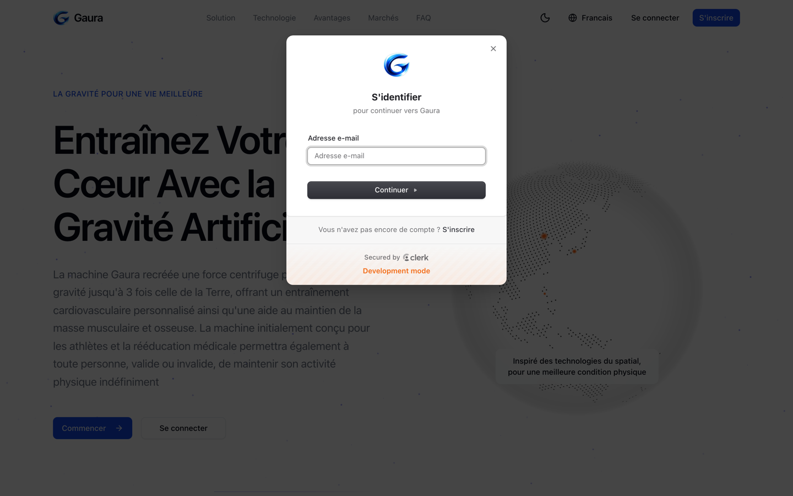

*Capture réelle, serveur de développement, 2 octobre 2026.*

La connexion est gérée par **Clerk**, un service externe. Les fenêtres de
connexion et d'inscription sont celles de Clerk, traduites en français.

1. Ouvrez l'adresse du site suivie de `/fr` (par exemple `https://<site>/fr`).
2. En haut à droite, cliquez **Se connecter** (compte existant) ou
   **S'inscrire** (nouveau compte). Au centre de la page, les mêmes actions
   s'appellent **Se connecter** et **Commencer**.
3. Une fenêtre Clerk s'ouvre par dessus la page. Suivez ses étapes (adresse,
   mot de passe ou code reçu par courriel, selon la configuration Clerk).
4. La fenêtre se ferme. **Restez quelques secondes sur la page d'accueil** :
   c'est elle qui crée votre fiche dans la base de données au premier passage.
   Le bouton central devient **Accéder au tableau de bord**.
5. Cliquez **Accéder au tableau de bord**. Vous arrivez sur `/fr/dashboard`.

> **Attention : ne sautez pas l'étape 4 au premier passage.** Si, juste après
> votre toute première inscription, vous allez directement sur une adresse du
> tableau de bord (par un favori ou le lien « Tableau de bord » du menu du
> haut), votre fiche n'existe pas encore dans la base. La page d'accueil du
> tableau de bord s'affiche vide (« Bienvenue, » sans prénom), et les autres
> pages plantent (voir [§7](#7-tableau-des-messages)). Revenez sur `/fr`,
> attendez quelques secondes, puis recommencez.

**Toute adresse du tableau de bord exige d'être connecté.** Si vous ouvrez
`/fr/dashboard/...` sans être connecté, Clerk vous envoie d'abord vers sa page
de connexion.

**Se déconnecter.** En haut à droite du tableau de bord, cliquez sur votre
avatar rond (menu Clerk), puis **Se déconnecter**. Le même menu donne accès à
la gestion du compte Clerk (adresse, mot de passe).

### 3.2 Changer de langue

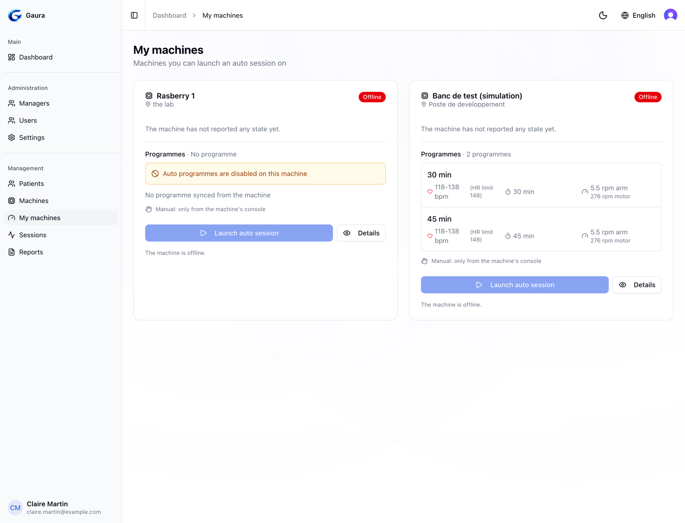

*Capture réelle, serveur de développement, 2 octobre 2026.*

- Le bouton **globe** en haut à droite (page d'accueil et tableau de bord)
  affiche la langue courante, **Francais** ou **English**. Cliquez, puis
  choisissez l'autre langue. La page se recharge à la même place, dans l'autre
  langue.
- La langue est aussi dans l'adresse : `/fr/...` ou `/en/...`. Changer ces deux
  lettres à la main a le même effet.
- La langue par défaut est le français.
- Les fenêtres Clerk suivent la langue de la page.
- Le champ « Langue » d'une fiche patient (FR ou EN) **ne change pas** la
  langue du site : il est seulement enregistré.

> Quelques textes restent en anglais quelle que soit la langue : les messages
> du serveur, le nom « Unknown », certains libellés des fiches utilisateur et
> gestionnaire. Ils sont signalés page par page. La fiche machine et les
> fiches de séance sont traduites depuis ANH-123.
>
> **Les captures de ce guide datent du 2 octobre 2026, avant cette
> traduction.** Quand une capture montre un ancien libellé anglais, le texte et
> les schémas font foi ; une phrase le rappelle sous chaque capture concernée.
>
> **Elles sont aussi antérieures au retrait de l'ancien mode d'enregistrement
> ECG.** Le bouton « Nouvelle session », le bloc ECG des séances, le bouton
> « Télécharger PDF » et les champs Fréquence, Intervalle et Canaux d'une
> machine, qu'elles montrent encore, n'existent plus.

### 3.3 Le thème clair ou sombre

Le bouton **soleil / lune** à côté du globe bascule entre thème clair et thème
sombre. Au départ, le site suit le réglage de votre système.

### 3.4 Naviguer : la barre latérale

La barre latérale (à gauche) change selon votre rôle.

```
┌──────────────────────────┐
│ [logo] Gaura             │  ← clic : retour au Tableau de bord
├──────────────────────────┤
│ Principal                │
│   ▣ Tableau de bord      │  ← tous les rôles
├──────────────────────────┤
│ Administration           │  ← administrateur seulement
│   ▣ Gestionnaires        │
│   ▣ Utilisateurs         │
│   ▣ Paramètres           │
├──────────────────────────┤
│ Gestion                  │  ← administrateur et gestionnaire
│   ▣ Patients             │
│   ▣ Machines             │
│   ▣ Mes machines         │
│   ▣ Sessions             │
│   ▣ Rapports             │
├──────────────────────────┤
│ Ma Santé                 │  ← patient seulement
│   ▣ Mes machines         │
│   ▣ Sessions             │
│   ▣ Rapports             │
├──────────────────────────┤
│ (JD) Jean Dupont         │  ← initiales, nom et adresse du compte connecté
│      jean@exemple.fr     │     (simple rappel, pas de menu)
└──────────────────────────┘
```

- L'entrée de la page courante est surlignée.
- **Replier la barre** : bouton en haut à gauche de la zone principale (icône
  panneau), ou raccourci clavier **Ctrl + B** (Windows, Linux) ou **Cmd + B**
  (Mac). Repliée, elle ne montre que les icônes ; survolez une icône pour voir
  son nom. Ce choix est mémorisé 7 jours dans le navigateur.
- Sur téléphone, la barre s'ouvre par dessus la page avec le même bouton.

### 3.5 Naviguer : le fil d'Ariane

En haut de la zone principale, à côté du bouton de repli, un **fil d'Ariane**
montre où vous êtes, par exemple :

```
Tableau de bord  ›  Machines  ›  Détails
Tableau de bord  ›  Sessions  ›  Détails  ›  En direct
```

Chaque élément sauf le dernier est cliquable. Particularités du code actuel :

- un identifiant (machine, séance, compte) s'affiche **« Détails »** ;
- la vue en direct s'affiche **« En direct »** ;
- sur la page Tableau de bord elle même, le fil d'Ariane est caché.

Les captures de ce guide, antérieures à la traduction, montrent encore
« Details » et « Live », et « Details » à la place de « Gestionnaires ».

### 3.6 Tout se met à jour tout seul

Les pages sont **en temps réel** : quand une donnée change dans Convex (une
machine passe en ligne, une séance démarre, un point de télémétrie arrive),
l'écran se met à jour sans recharger la page. Il n'y a **aucun bouton
« Actualiser »**. Recharger la page (F5) ne fait pas de mal, mais n'est pas
nécessaire.

Pendant un chargement, des **rectangles gris animés** occupent la place des
blocs : c'est normal.

---

## 4. Visite guidée, page par page

Chaque section donne : l'adresse, qui y a accès, un schéma de la page, puis
chaque bloc, bouton, champ et message. Les libellés entre guillemets sont ceux
affichés en français (fichier `messages/fr.json`). Les textes en anglais
écrits en dur dans le code sont reproduits tels quels et signalés « (anglais) ».

Conventions des schémas : `[ Bouton ]`, `( Badge )`, `<champ>`, `▾` liste
déroulante. Les schémas écrivent les plages « 118 à 138 bpm » ; l'écran les
affiche avec un tiret entre les deux nombres. Une valeur absente s'affiche
« - ».

### 4.1 Page d'accueil


*Capture réelle, serveur de développement, 2 octobre 2026.*

**Adresse** : `/fr` (publique). **Pour qui** : tout le monde.

```
┌───────────────────────────────────────────────────────────────────────┐
│ [logo] Gaura   Solution Technologie Avantages Marchés FAQ             │
│                                  ☀  🌐 Francais  Se connecter [S'inscrire]│
├───────────────────────────────────────────────────────────────────────┤
│ LA GRAVITÉ POUR UNE VIE MEILLEURE                                     │
│ Entraînez Votre Cœur Avec la Gravité Artificielle        (globe animé)│
│ La machine Gaura recrée une force centrifuge ...                      │
│ [ Commencer → ]  [ Se connecter ]                                     │
│   (connecté : [ Accéder au tableau de bord → ])                       │
├───────────────────────────────────────────────────────────────────────┤
│ Explication Physique (01 02 03) · Entraînement Cardiaque Contrôlé     │
│ Cas d'usage · Bénéfice de la solution · Prêt à Transformer ... ?      │
├───────────────────────────────────────────────────────────────────────┤
│ Pied de page : Produit, Ressources, Contact, Confidentialité, Conditions│
└───────────────────────────────────────────────────────────────────────┘
```

| Élément | Effet |
|---|---|
| Liens du haut (Solution, Technologie, Avantages, Marchés) | Font défiler la page d'accueil jusqu'à la section. **FAQ** ouvre `/fr/faq`. |
| **Se connecter** / **S'inscrire** (haut), **Se connecter** / **Commencer** (centre) | Ouvrent la fenêtre Clerk. Visibles seulement déconnecté. |
| **Tableau de bord** (haut, connecté) | Va sur `/fr/dashboard`. Ne crée pas votre fiche : au tout premier passage, utilisez plutôt le bouton central (voir [§3.1](#31-se-connecter-clerk)). |
| **Accéder au tableau de bord** (centre, connecté) | Va sur `/fr/dashboard`. Sa seule présence à l'écran crée votre fiche si elle manque. |
| Avatar (connecté) | Menu Clerk : gérer le compte, se déconnecter. |

> **Texte commercial à ne pas prendre pour une spécification.** Depuis
> ANH-123, l'accueil et la FAQ ne citent plus aucun chiffre d'intensité :
> « L'intensité se règle par la vitesse de rotation, dans les limites fixées
> par le logiciel de la machine. » Pour mémoire, le plafond du logiciel est la
> vitesse nominale du moteur (environ 2,1 g au bout des jambes, à vide), et
> un plafond provisoire de 1,2 g avec une personne à bord. Voir [securite.md](../securite.md).
> La capture ci-dessus est antérieure à ce changement : elle montre encore
> « jusqu'à 3 fois celle de la Terre ».

**Sans configuration, rien ne s'affiche.** Sans `.env.local` (URL Convex et
clés Clerk), le site lancé en local n'affiche aucune page, pas même l'accueil :

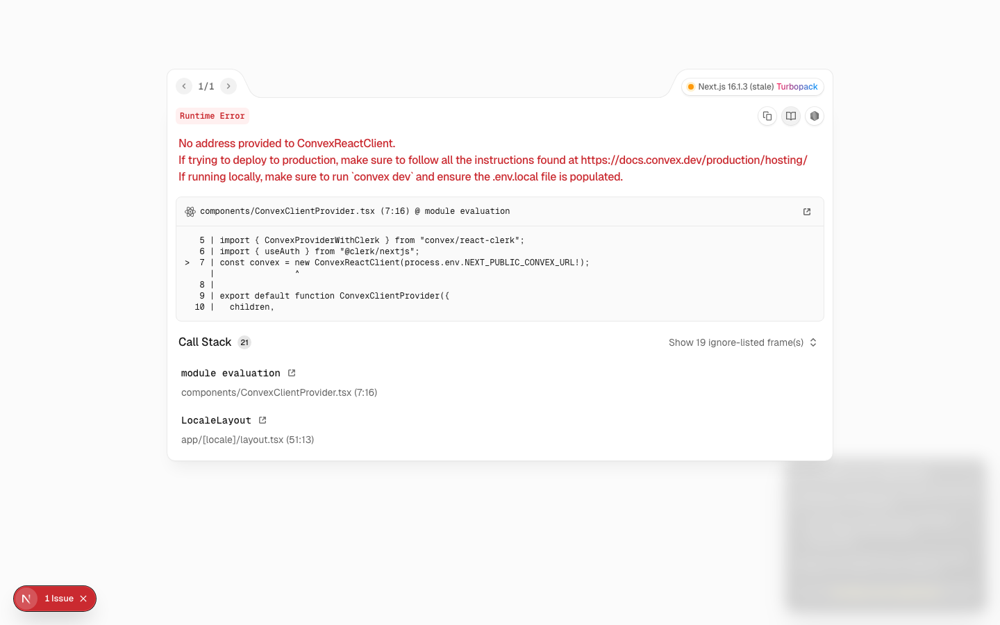

Ce cas est propre à un lancement local sans clés ; un client ne le voit pas.
La configuration nécessaire est décrite dans
[deploiement.md](../deploiement.md#53-lancer-le-site-en-local-sur-le-convex-de-développement).

### 4.2 FAQ, Confidentialité, Conditions

**Adresses** : `/fr/faq`, `/fr/privacy`, `/fr/terms` (publiques).

- **FAQ** : « Questions fréquemment posées », questions classées par thème
  (Questions Générales, Technologie et Entraînement, Bienfaits pour la Santé,
  Applications Médicales, Athlètes et Performance), bouton **Nous Contacter**
  et **Retour à l'accueil**. Clic sur une question : la réponse se déplie.
- **Politique de Confidentialité** et **Conditions Générales d'Utilisation** :
  textes à lire, lien **Retour à l'accueil**.

Ces pages ne demandent pas de connexion et n'ont aucune action.

### 4.3 Tableau de bord (page d'accueil connectée)

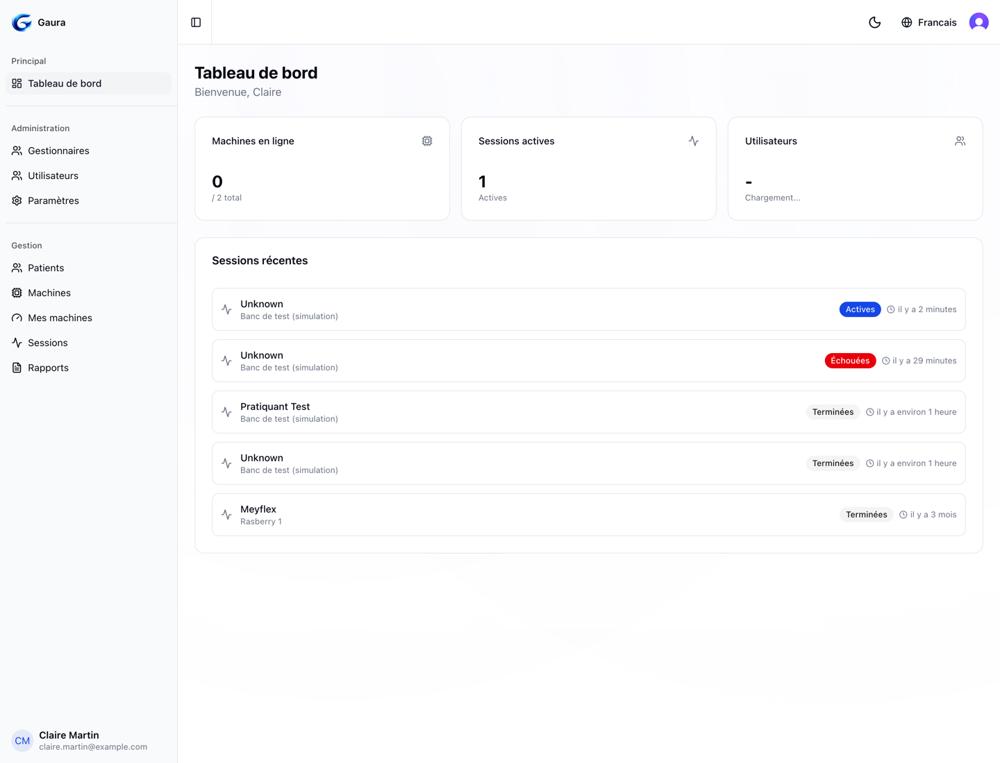

*Administrateur (Claire Martin), une séance en cours.*

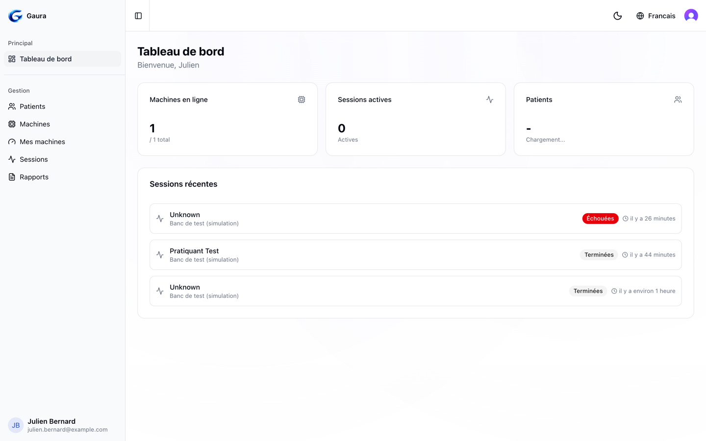

*Gestionnaire (Julien Bernard) : la barre latérale n'a plus le groupe Administration.*

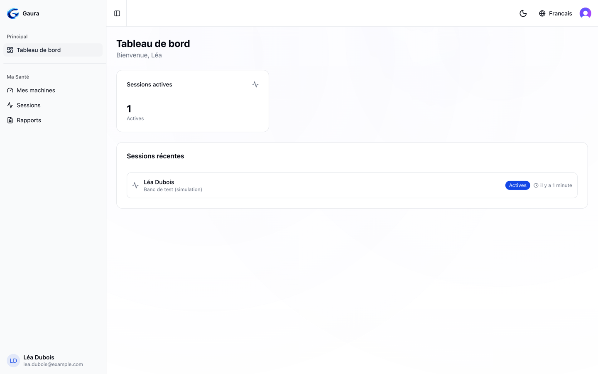

*Patient (Léa Dubois) : groupe « Ma Santé » seulement.* *Capture réelle, serveur de développement, 2 octobre 2026.*

*Captures antérieures à la traduction (ANH-123) : elles montrent encore les badges de statut au pluriel (« Actives », « Terminées », « Échouées »).*

**Adresse** : `/fr/dashboard`. **Pour qui** : tous.

```
┌───────────────────────────────────────────────────────────────────────┐
│ Tableau de bord                                                        │
│ Bienvenue, Jean                                                        │
│                                                                        │
│ ┌─────────────────────┐ ┌─────────────────────┐ ┌─────────────────────┐│
│ │ Machines en ligne ▢ │ │ Sessions actives  ∿ │ │ Utilisateurs     👥 ││
│ │ 2                   │ │ 1                   │ │ -                   ││
│ │ / 3 total           │ │ Actives             │ │ Chargement...       ││
│ └─────────────────────┘ └─────────────────────┘ └─────────────────────┘│
│  (admin, gestionnaire)       (tous)            (admin : Utilisateurs,  │
│                                                 gestionnaire : Patients)│
│ ┌───────────────────────────────────────────────────────────────────┐ │
│ │ Sessions récentes                                                  │ │
│ │ ∿ Marie Martin         (Active)       🕑 il y a 3 minutes           │ │
│ │   Centrifugeuse Paris                                              │ │
│ │ ∿ Paul Durand          (Terminée)     🕑 il y a 2 jours             │ │
│ │   ...  (5 lignes au plus)                                          │ │
│ └───────────────────────────────────────────────────────────────────┘ │
└───────────────────────────────────────────────────────────────────────┘
```

| Bloc | Contenu | Clic |
|---|---|---|
| **Machines en ligne** (administrateur, gestionnaire) | Nombre de machines affichées « En ligne », puis « / N total ». Une machine **en séance** n'est **pas** comptée comme en ligne, et une machine sort du compte 90 s après son dernier signal. | Ouvre **Machines**. |
| **Sessions actives** | Nombre de séances actives **parmi les 10 plus récentes** que vous pouvez voir. Sous le nombre : « Actives ». | Ouvre **Sessions**. |
| **Utilisateurs** (administrateur) ou **Patients** (gestionnaire) | Affiche toujours « - » et « Chargement... » : **ce compteur n'est pas programmé**. | Ouvre **Utilisateurs** ou **Patients**. |
| **Sessions récentes** | Les 5 dernières séances visibles : nom du pratiquant, machine, badge de statut, ancienneté (« il y a 3 minutes »). « Aucune session trouvée » s'il n'y en a pas. | Séance active : ouvre la **vue en direct**. Sinon (en attente, terminée, échouée) : ouvre le **détail**. |

Badges de statut d'une séance, ici et dans toutes les listes :

| Badge | Sens |
|---|---|
| **En attente** (contour) | Créée, pas encore démarrée par la machine. |
| **Active** (plein) | En cours. |
| **Terminée** (gris) | Finie normalement. |
| **Échouée** (rouge) | Refusée, annulée, ou finie sur un incident. |

Les onglets de la page **Sessions** gardent le pluriel (Actives, Terminées,
Échouées). Un statut que le site ne connaît pas s'afficherait tel quel.

### 4.4 Machines (liste)

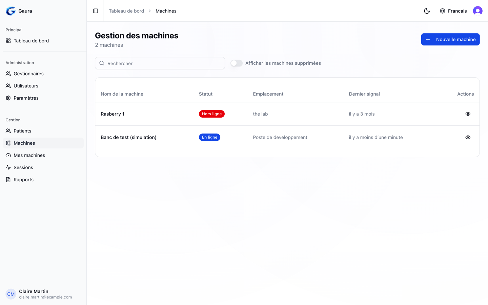

*Capture réelle, serveur de développement, 2 octobre 2026.*

**Adresse** : `/fr/dashboard/machines`. **Pour qui** : administrateur (toutes
les machines), gestionnaire (les siennes). Un patient y voit une liste vide.

```
┌───────────────────────────────────────────────────────────────────────┐
│ Gestion des machines                               [ + Nouvelle machine ]│
│ 3 machines                                          (administrateur)   │
│                                                                        │
│ 🔍 <Rechercher>        ◯ Afficher les machines supprimées (admin)      │
│ ┌────────────────────────────────────────────────────────────────────┐│
│ │ Nom de la machine │ Statut      │ Emplacement │ Dernier signal │Actions││
│ │ Centri Paris      │ (En ligne)  │ Salle 2     │ il y a 8 s.    │  👁  ││
│ │ Centri Lyon       │ (Hors ligne)│ -           │ il y a 3 jours │  👁  ││
│ │ Centri Test       │ (En session)│ Atelier     │ il y a 5 s.    │  👁  ││
│ └────────────────────────────────────────────────────────────────────┘│
└───────────────────────────────────────────────────────────────────────┘
```

| Élément | Effet |
|---|---|
| **Nouvelle machine** (administrateur seulement) | Ouvre la fenêtre de création ([§4.5](#45-fenêtre-nouvelle-machine--modifier)). |
| **Rechercher** | Filtre la liste sur tout le texte des lignes (nom, lieu...). |
| **Afficher les machines supprimées** (administrateur) | Interrupteur : ajoute les machines supprimées, avec le badge **Supprimée** (rouge). |
| Ligne ou icône **œil** | Ouvre le détail de la machine. |
| Clic sur un en tête de colonne | N'a pas d'effet visible (tri non branché dans les en têtes). |

Badges de statut d'une machine :

| Badge | Sens |
|---|---|
| **En ligne** (plein) | La machine a donné signe de vie il y a moins de 90 s, et n'est pas en séance. |
| **En session** (gris) | Une séance tourne sur la machine. |
| **Hors ligne** (rouge) | Aucun signal depuis 90 s, ou jamais connectée. Le site le recalcule chaque seconde : le badge change 90 s après le dernier signal, sans attendre le serveur ([§6.2](#62-ce-qui-vient-de-la-machine-et-avec-quel-délai)). Une machine neuve est hors ligne tant que son Raspberry Pi n'a pas envoyé de signal. |
| **Supprimée** (rouge) | Machine désactivée (suppression douce), restaurable par un administrateur. |

« Dernier signal » vaut « - » tant que la machine n'a jamais envoyé de signal.
Sinon il avance tout seul, chaque seconde, même quand la machine se tait.

S'il n'y a aucune machine : « Aucune machine trouvée » et, pour
l'administrateur, un second bouton **Nouvelle machine**.

<a id="45-fenêtre-nouvelle-machine--modifier"></a>

### 4.5 Fenêtre « Nouvelle machine » / « Modifier »

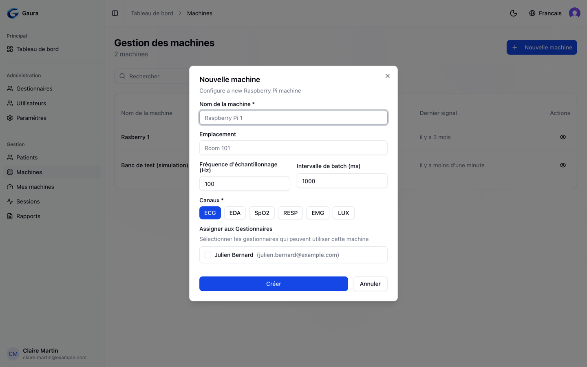

*Capture réelle, serveur de développement, 2 octobre 2026.*

*Capture antérieure à la traduction (ANH-123) : elle montre encore la description en anglais et l'exemple « Room 101 ».*

*Capture antérieure au retrait de l'ancien mode d'enregistrement ECG : elle montre encore les champs Fréquence d'échantillonnage, Intervalle de batch et Canaux, retirés de la fenêtre.*

S'ouvre depuis **Machines** (bouton **Nouvelle machine**) ou depuis le détail
d'une machine (bouton **Modifier** de la carte Configuration).

```
┌──────────────────────────────────────────────────┐
│ Nouvelle machine                                  │
│ Configurer une nouvelle machine Raspberry Pi      │
│                                                  │
│ Nom de la machine *   <Raspberry Pi 1>           │
│ Emplacement           <Salle 101>                │
│ Assigner aux Gestionnaires                        │
│   Sélectionner les gestionnaires qui peuvent ...  │
│   ☐ Claire Petit   ☐ Marc Roux                    │
│                                                  │
│ [ Créer ]   [ Annuler ]                          │
└──────────────────────────────────────────────────┘
```

| Champ | À savoir |
|---|---|
| **Nom de la machine** * | Obligatoire (message « Le nom est obligatoire » s'il est vide). |
| **Emplacement** | Facultatif. Affiché sous le nom partout. |
| **Assigner aux Gestionnaires** | Cases à cocher, visibles seulement pour un administrateur et s'il existe des gestionnaires. **Le premier coché devient « Propriétaire ».** |

Boutons : **Créer** (ou **Enregistrer** en modification), **Annuler**.

**Après « Créer »**, la fenêtre devient :

```
┌──────────────────────────────────────────────────┐
│ Clé API                                           │
│ ⚠ Cette clé ne sera affichée qu'une seule fois!   │
│ ┌──────────────────────────────────────────────┐ │
│ │ gk_3f9a...  (longue chaîne)                  │ │
│ └──────────────────────────────────────────────┘ │
│ [ ⧉ Copier ]          [ Fermer ]                  │
└──────────────────────────────────────────────────┘
```

**Copiez la clé tout de suite** (bouton **Copier**, qui devient « Copié! »
pendant 2 s) et gardez la en lieu sûr. Une fois la fenêtre fermée, **personne ne
pourra la relire**, pas même un administrateur. Elle doit être recopiée dans le
fichier de configuration du Raspberry Pi (voir [procédure P5](#p5-enregistrer-une-machine-et-installer-sa-clé)).

**Après « Enregistrer »** (modification), la fenêtre se ferme et la carte
Configuration du détail affiche « Machine mise à jour avec succès ». Un
gestionnaire enregistre ainsi le nom et le lieu de sa machine sans erreur. La
liste **Assigner aux Gestionnaires** n'est envoyée au serveur que par un
administrateur, et seulement s'il l'a changée. L'ordre compte : un
gestionnaire décoché puis recoché passe en fin de liste, et le premier de la
liste devient « Propriétaire ». Si le serveur refuse, son message s'affiche en
rouge en haut de la fenêtre, qui reste ouverte.

> **Attention (gestionnaire qui modifie une machine) : corrigé dans le code le
> 6 octobre 2026, pas encore en production.** Tant que le redéploiement n'a
> pas eu lieu, le site en ligne garde l'ancien comportement : le bouton
> **Enregistrer** applique bien le nom, le lieu et la configuration, puis
> affiche un message d'erreur rouge en haut de la fenêtre (« Unauthorized.
> Required roles: admin. Your role: gestionnaire »), **alors que les
> changements sont déjà enregistrés**. Fermez la fenêtre et vérifiez la carte
> Configuration.

### 4.6 Détail d'une machine

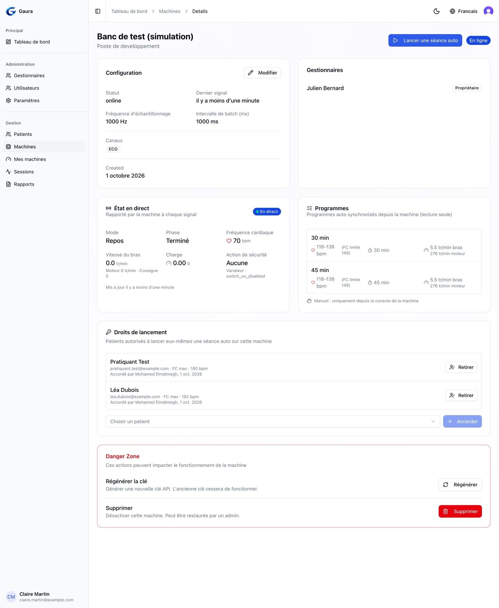

*Machine en ligne, au repos.*

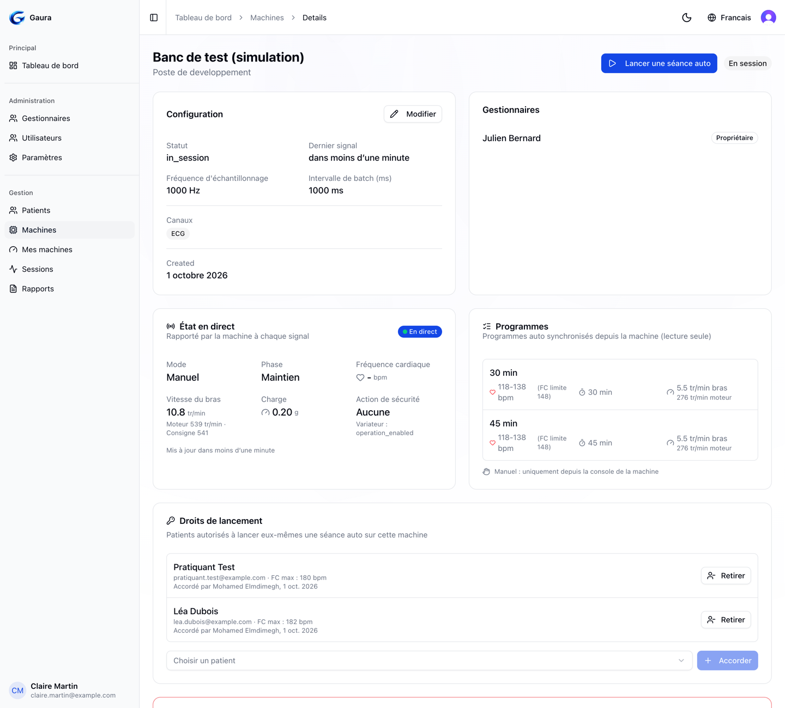

*La même machine pendant une séance manuelle.*

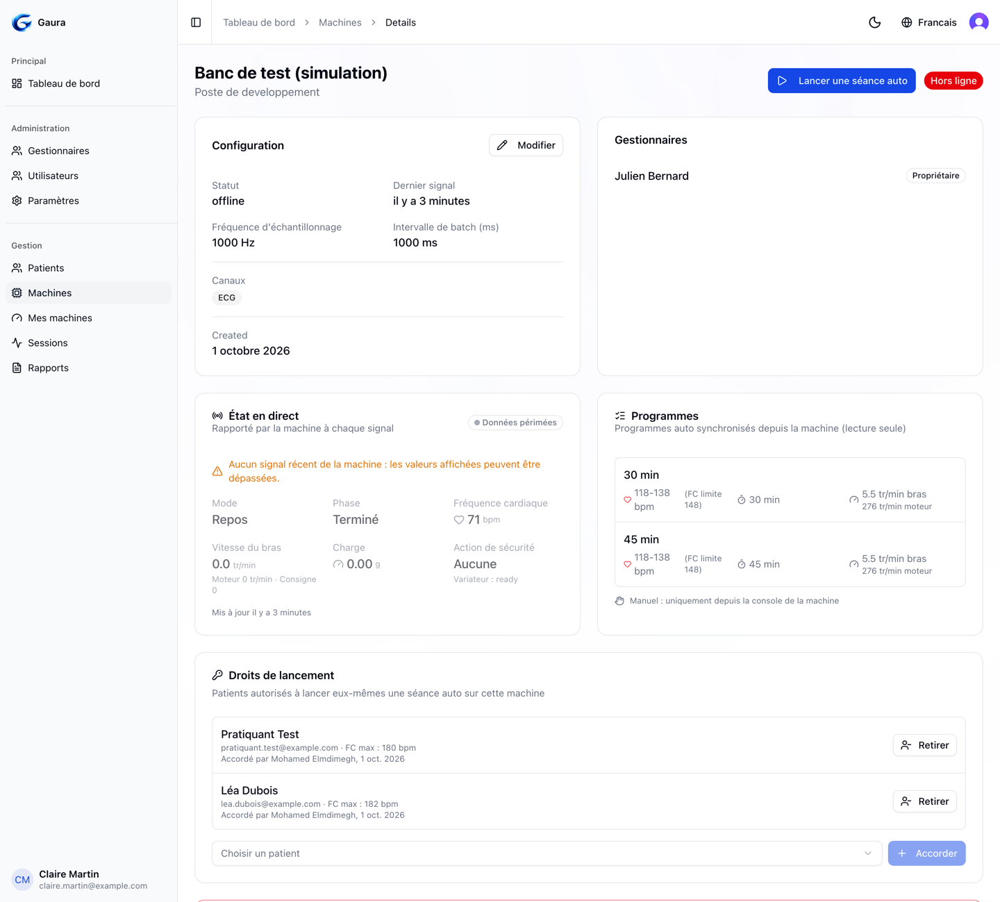

*La même machine plus de 90 s après l'arrêt de sa console.* *Capture réelle, serveur de développement, 2 octobre 2026.*

*Captures antérieures à la traduction (ANH-123) : toutes trois montrent encore « Details » dans le fil d'Ariane, le statut brut (`online`, `offline`), « Created », « Danger Zone » et l'état brut du variateur.*

*Capture antérieure au retrait de l'ancien mode d'enregistrement ECG : la carte Configuration y montre encore la fréquence, l'intervalle et les canaux.*

**Adresse** : `/fr/dashboard/machines/{id}`. **Pour qui** : administrateur,
gestionnaire de la machine. Sinon : « Machine introuvable » et lien
**Retour**.

```
┌───────────────────────────────────────────────────────────────────────┐
│ ⚠ Supprimée  Supprimée le: 1 oct. 2026 10:02   [ ↺ Restaurer ] (admin) │ ← si supprimée
│                                                                        │
│ Centri Paris                          [ ▶ Lancer une séance auto ] (En ligne)│
│ Salle 2                                                                │
│ ┌───────────────────────────────┐ ┌───────────────────────────────┐   │
│ │ Configuration     [ ✎ Modifier ]│ │ Gestionnaires                 │   │
│ │ Statut En ligne  Dernier signal│ │ Claire Petit   (Propriétaire) │   │
│ │ Créée le 1 octobre 2026        │ │ Marc Roux                     │   │
│ └───────────────────────────────┘ └───────────────────────────────┘   │
│ ┌───────────────────────────────┐ ┌───────────────────────────────┐   │
│ │ ⦿ État en direct   (● En direct)│ │ ☰ Programmes                  │   │
│ │ Rapporté par la machine à ...  │ │ Programmes auto synchronisés ..│   │
│ │ Mode      Phase    Fréquence c.│ │ 30 min                        │   │
│ │ Repos     Inactif  ♥ 72 bpm    │ │ ♥ 118 à 138 bpm (FC limite 148)│   │
│ │ Vitesse du bras  Charge  Action│ │ ⏱ 30 min  ⌚ 5.5 tr/min bras   │   │
│ │ 0.0 tr/min       1.00 g  Aucune│ │            276 tr/min moteur  │   │
│ │ Moteur 0 · Consigne 0  Variateur│ │ ✋ Manuel : uniquement depuis  │   │
│ │ Mis à jour il y a 8 secondes   │ │   la console de la machine    │   │
│ └───────────────────────────────┘ └───────────────────────────────┘   │
│ ┌───────────────────────────────────────────────────────────────────┐ │
│ │ 🔑 Droits de lancement                                              │ │
│ │ Patients autorisés à lancer eux mêmes une séance auto ...          │ │
│ │ Marie Martin                                        [ Retirer ]    │ │
│ │ marie@ex.fr · FC max : 181 bpm                                     │ │
│ │ Accordé par Claire Petit, 28 sept. 2026                            │ │
│ │ <Choisir un patient ▾>                               [ + Accorder ]│ │
│ └───────────────────────────────────────────────────────────────────┘ │
│ ┌───────────────────────────────────────────────────────────────────┐ │
│ │ Zone de danger                                                     │ │
│ │ Ces actions peuvent impacter le fonctionnement de la machine       │ │
│ │ Régénérer la clé                                    [ ↻ Régénérer ]│ │
│ │ Supprimer                                           [ 🗑 Supprimer ]│ │
│ └───────────────────────────────────────────────────────────────────┘ │
└───────────────────────────────────────────────────────────────────────┘
```

#### En tête

- Nom et lieu de la machine, badge de statut ([§4.4](#44-machines-liste)).
- **Lancer une séance auto** (administrateur, gestionnaire ; caché si la
  machine est supprimée) : ouvre la fenêtre de lancement
  ([§4.8](#48-fenêtre-lancer-une-séance-auto)).

#### Bandeau « Supprimée »

Visible seulement pour une machine supprimée (donc seulement par un
administrateur, les autres ne la voient plus). Date de suppression, bouton
**Restaurer** : fenêtre « Restaurer cette machine? », « Cela réactivera la
machine et la rendra à nouveau disponible. », boutons **Annuler** et
**Restaurer**. Une machine supprimée ne montre plus ni état en direct, ni
programmes, ni droits, ni zone de danger.

#### Carte « Configuration »

Statut (« En ligne », « Hors ligne » ou « En session » ; une valeur que le
site ne connaît pas s'afficherait telle quelle), Dernier signal, « Créée le »
(date de création), puis « Version logicielle » et « Contrat machine » : ce
que la machine a annoncé à son dernier signal (« - » tant qu'elle n'a rien
annoncé), avec la ligne « Versions annoncées il y a ... ». Le site affiche ces
versions sans les comparer à une version attendue. Bouton **Modifier** : fenêtre du
[§4.5](#45-fenêtre-nouvelle-machine--modifier).

#### Carte « Gestionnaires »

Liste des gestionnaires de la machine ; badge **Propriétaire** sur le premier
attribué. Lecture seule ici (pour changer : fenêtre **Modifier**, ou fiche du
gestionnaire). La carte est cachée si la machine n'a aucun gestionnaire.

#### Carte « État en direct »

Sous titre : « Rapporté par la machine à chaque signal ». Tout ce qui s'y trouve
vient du Raspberry Pi, envoyé toutes les 10 s environ.

| Indicateur | Contenu |
|---|---|
| Badge **En direct** (point vert clignotant) | Le serveur a reçu le dernier état il y a moins de 90 s. |
| Badge **Données périmées** (gris) | Le dernier état a 90 s ou plus. Les valeurs sont grisées et une ligne orange dit « Aucun signal récent de la machine : les valeurs affichées peuvent être dépassées. » Le badge revient à **En direct** dès l'état suivant. |
| **Mode** | Repos, Manuel, Séance, Arrêt. |
| **Phase** | Mesure de référence, Échauffement, Maintien, Retour au calme, Récupération, Inactif, Terminé. |
| **Fréquence cardiaque** | En bpm, cœur rouge si la valeur est fraîche. Un tiret « - » à la place du nombre quand la machine n'a pas de fréquence cardiaque fiable : le site n'affiche jamais une vieille valeur comme actuelle. |
| **Vitesse du bras** | tr/min du bras (une décimale). Dessous : « Moteur N tr/min · Consigne N » (la consigne est en tr/min moteur). |
| **Charge** | En g, deux décimales. |
| **Action de sécurité** | « Aucune » en temps normal. Sinon en orange avec un bouclier : « Vitesse figée » (`freeze`), « Réduction » (`reduce`), « Décélération » (`ramp_down`), « Arrêt rapide (rampe du variateur) » (`quick_stop`), « Mise en silence (arrêt par le variateur) » (`go_silent`). Dessous : « Variateur : ... », l'état du variateur traduit (Non prêt, Mise en marche verrouillée, Prêt, Enclenché, En fonctionnement, Défaut, Communication perdue). Une valeur que le site ne connaît pas s'affiche telle quelle. |
| « Mis à jour il y a ... » | Âge du dernier état, recalculé chaque seconde. |

« La machine n'a encore rapporté aucun état. » : la machine n'a jamais envoyé
d'état (neuve, ou jamais connectée depuis la console d'entraînement).

> Quand une machine se tait, le passage en « Données périmées » arrive 90 s
> après son dernier état, et son **statut** passe « Hors ligne » à la même
> seconde : le site les recalcule chaque seconde, sans attendre qu'une donnée
> change. Sur une page déjà ouverte, c'est à la seconde près ; sur une page
> que vous venez d'ouvrir, cela peut prendre jusqu'à 107 s
> ([§6.2](#62-ce-qui-vient-de-la-machine-et-avec-quel-délai)). Il compte sur l'**heure du serveur**,
> pas sur celle de votre poste : une horloge de poste en avance ou en retard
> ne change rien à ce que vous voyez. Vous ne verrez « En ligne » à côté de
> « Données périmées » que pour une machine qui envoie encore ses signaux
> mais plus son état.

#### Carte « Programmes »

Sous titre : « Programmes auto synchronisés depuis la machine (lecture seule) ».
Un programme par ligne :

- son **nom** (par exemple « 30 min ») ;
- cœur rouge : **zone cible** en bpm (valeur basse et haute), et entre
  parenthèses **FC limite** (le seuil que la machine ne doit pas dépasser) ;
- chronomètre : **durée** (« 30 min », « 1 h 05 ») ;
- jauge : **vitesse max** en tr/min bras, et dessous en tr/min moteur.

Messages possibles :

- encadré orange « **Programmes auto désactivés sur cette machine** » : la
  machine a déclaré qu'elle n'accepte pas de séance auto ; les programmes sont
  grisés et aucun lancement n'est possible ;
- « **Aucun programme synchronisé depuis la machine** » ;
- toujours, en bas : « Manuel : uniquement depuis la console de la machine ».

On ne peut ni ajouter ni modifier un programme ici (voir [procédure P9](#p9-préparer-un-programme-exemple--footing-150-à-155-bpm)).

#### Carte « Droits de lancement »

Visible par l'administrateur et le gestionnaire de la machine. Sous titre :
« Patients autorisés à lancer eux mêmes une séance auto sur cette machine ».

- Chaque patient autorisé : nom, adresse, « FC max : N bpm » (ou « FC max non
  renseignée »), « Accordé par {nom}, {date} », bouton **Retirer**.
- « Aucun patient ne détient ce droit. » si la liste est vide.
- En bas : liste **Choisir un patient** (administrateur : tous les patients ;
  gestionnaire : ses patients seulement ; ceux qui ont déjà le droit sont
  exclus ; « Aucun autre patient éligible » si personne ne reste) et bouton
  **Accorder**.
- **Retirer** ouvre « Retirer le droit de lancement ? », « {nom} ne pourra plus
  lancer de séance auto sur cette machine. », boutons **Annuler** et
  **Retirer**.
- Une erreur du serveur s'affiche dans un encadré rouge en haut de la carte.

<a id="carte-zone-de-danger"></a>

#### Carte « Zone de danger »

« Ces actions peuvent impacter le fonctionnement de la machine ».

| Bouton | Effet |
|---|---|
| **Régénérer** (ligne « Régénérer la clé », « Générer une nouvelle clé API. L'ancienne clé cessera de fonctionner. ») | Fenêtre de confirmation (« La clé API actuelle sera invalidée immédiatement. La machine devra être reconfigurée avec la nouvelle clé. »), **Annuler** / **Confirmer**. Après **Confirmer**, la nouvelle clé s'affiche **une seule fois** comme à la création. **La machine cesse aussitôt de communiquer** jusqu'à ce que la nouvelle clé soit installée sur son Raspberry Pi. |
| **Supprimer** (ligne « Désactiver cette machine. Peut être restaurée par un admin. ») | Grisé si la machine est **En session**. Fenêtre « Supprimer cette machine? », « Cette machine sera désactivée. Un administrateur pourra la restaurer ultérieurement si nécessaire. », **Annuler** / **Supprimer**. En cas de succès, retour à la liste des machines. |

> **Refus de suppression.** Si le serveur refuse (séance en attente sur la
> machine, par exemple), la fenêtre reste ouverte et un **message d'échec**
> s'affiche en bas à droite de l'écran (depuis ANH-156 ; avant, rien ne
> s'affichait). Cherchez alors une séance « En attente » sur cette machine dans
> **Sessions**, annulez la, puis recommencez.

### 4.7 Mes machines

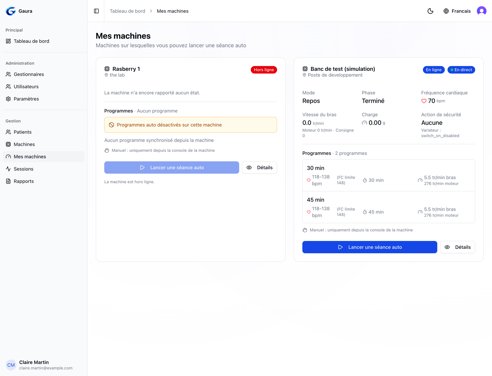

*Administrateur : toutes les machines. À gauche une machine hors ligne dont les programmes auto sont désactivés ; le bouton de lancement y est grisé.*

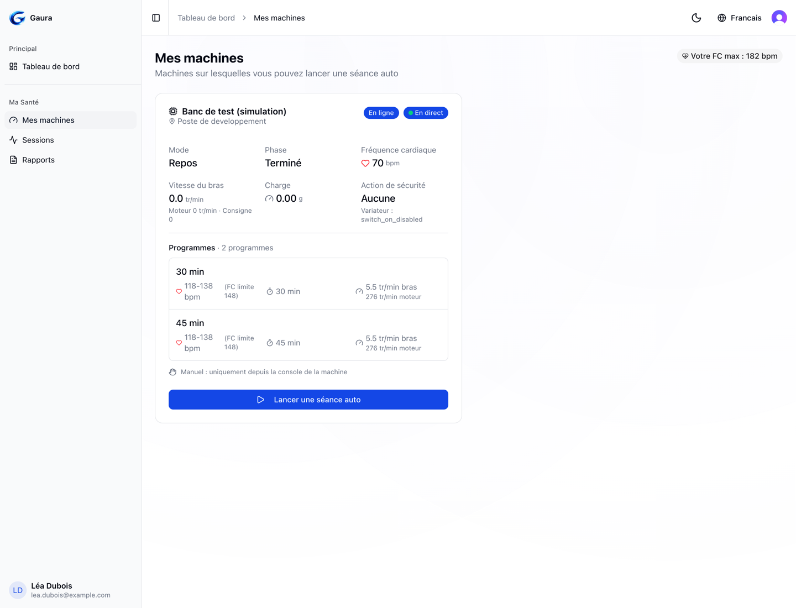

*Patient : seulement la machine où il a le droit de lancement, avec sa FC max en haut à droite.* *Capture réelle, serveur de développement, 2 octobre 2026.*

**Adresse** : `/fr/dashboard/my-machines`. **Pour qui** : tous. C'est **la
page de lancement**, surtout pour les patients.

```
┌───────────────────────────────────────────────────────────────────────┐
│ Mes machines                                   (♡ Votre FC max : 181 bpm)│ ← patient
│ Machines sur lesquelles vous pouvez lancer une séance auto            │
│ ┌───────────────────────────────────────────────────────────────────┐ │
│ │ ⚠ Votre FC max n'est pas renseignée : demandez à votre gestionnaire│ │ ← patient sans
│ │   de la saisir avant de lancer une séance auto.                    │ │   FC max
│ └───────────────────────────────────────────────────────────────────┘ │
│ ┌─────────────────────────────────┐ ┌─────────────────────────────────┐│
│ │ ▢ Centri Paris  (En ligne)(● En direct)│ ▢ Centri Lyon     (Hors ligne)││
│ │ ⌖ Salle 2                        │ │ La machine n'a encore rapporté ││
│ │ Mode Phase Fréquence cardiaque   │ │ aucun état.                    ││
│ │ Vitesse du bras Charge Action    │ │ ───────────────────────────── ││
│ │ ───────────────────────────────  │ │ Programmes · Aucun programme   ││
│ │ Programmes · 2 programmes        │ │ ...                            ││
│ │  30 min  ♥ 118 à 138 bpm ...     │ │ [ ▶ Lancer une séance auto ]   ││
│ │  45 min  ♥ 118 à 138 bpm ...     │ │        (grisé)                 ││
│ │ ✋ Manuel : uniquement depuis ... │ │ La machine est hors ligne.     ││
│ │ [ ▶ Lancer une séance auto ] [👁 Détails]│                          ││
│ └─────────────────────────────────┘ └─────────────────────────────────┘│
└───────────────────────────────────────────────────────────────────────┘
```

Quelles machines sont listées :

- administrateur : toutes les machines non supprimées ;
- gestionnaire : ses machines ;
- patient : celles où il a le **droit de lancement**.

| Élément | Contenu ou effet |
|---|---|
| Badge **Votre FC max : N bpm** (patient) | La FC max retenue pour vous (mesurée, ou estimée par l'âge sans le préciser ici). En rouge « Non renseignée » si rien n'est saisi. |
| Encadré orange (patient) | « Votre FC max n'est pas renseignée : demandez à votre gestionnaire de la saisir avant de lancer une séance auto. » |
| Carte machine | Nom, lieu, badge de statut, badge **En direct** si l'état a moins de 90 s ; les mêmes indicateurs que la carte « État en direct » ([§4.6](#carte--état-en-direct-)). À 90 s sans nouveau signal : statut **Hors ligne**, badge **Données périmées**, valeurs grisées et « Aucun signal récent de la machine : les valeurs affichées peuvent être dépassées. » Un peu plus tard, quand le serveur retire l'état : « Aucun état en direct : la machine n'envoie plus de signal. » Pour une machine qui n'a jamais envoyé d'état : « La machine n'a encore rapporté aucun état. » |
| « Programmes · N programmes » | La liste des programmes de la machine, comme sur le détail. « Aucun programme » si vide. |
| **Lancer une séance auto** | Ouvre la fenêtre de lancement. **Grisé** si la machine n'est pas « En ligne », si les programmes sont désactivés, ou s'il n'y a aucun programme. |
| **Détails** (administrateur, gestionnaire) | Ouvre le détail de la machine. |
| Sous le bouton | « La machine est déjà en séance. » ou « La machine est hors ligne. » selon le cas. |

Page vide :

- patient : « Vous n'avez encore aucun droit de lancement. Un gestionnaire doit
  vous accorder le droit de lancer des séances sur une machine. » ;
- autres : « Aucune machine disponible. ».

<a id="48-fenêtre-lancer-une-séance-auto"></a>

### 4.8 Fenêtre « Lancer une séance auto »

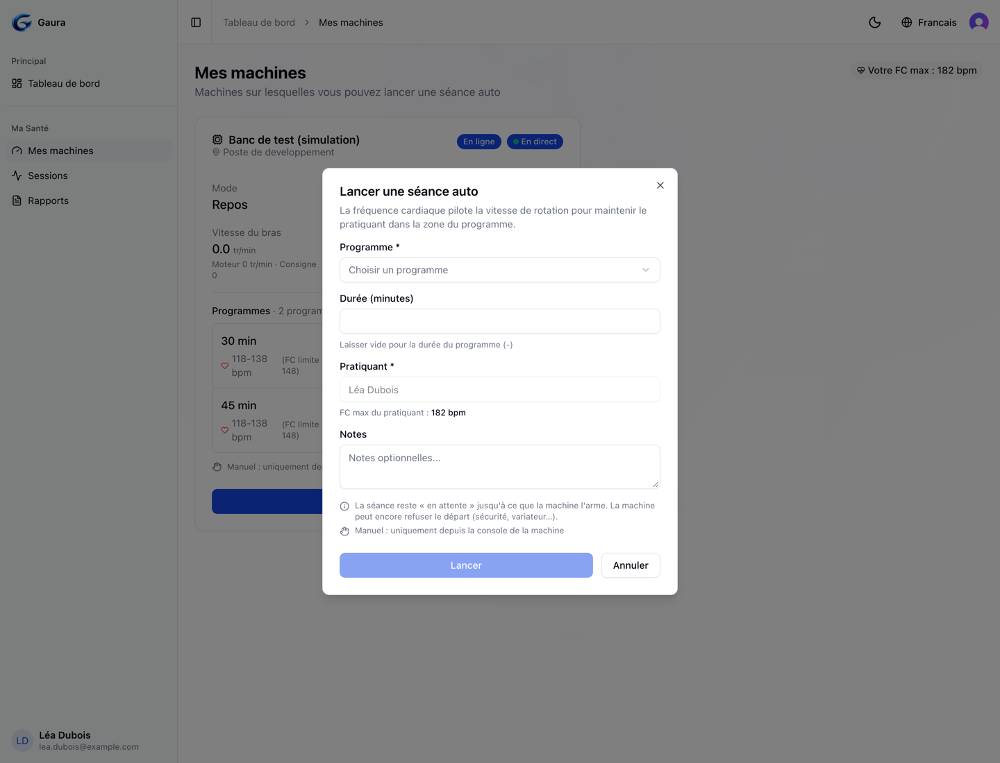

*Ouverte par un patient : le pratiquant est imposé (lui-même) et sa FC max est affichée.*

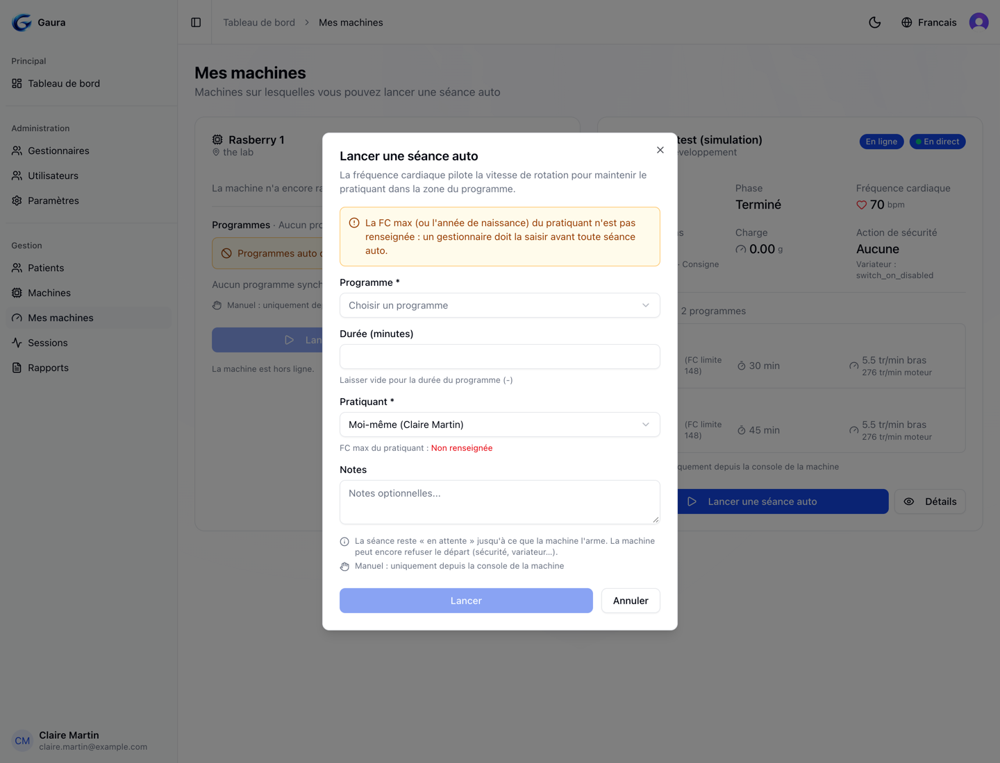

*Ouverte par un administrateur : le pratiquant proposé d'abord est lui-même. Sa FC max n'étant pas renseignée, l'avertissement s'affiche et **Lancer** reste grisé tant qu'un autre pratiquant n'est pas choisi.* *Capture réelle, serveur de développement, 2 octobre 2026.*

S'ouvre depuis **Mes machines** ou le détail d'une machine.

```
┌──────────────────────────────────────────────────────────────┐
│ Lancer une séance auto                                        │
│ La fréquence cardiaque pilote la vitesse de rotation pour     │
│ maintenir le pratiquant dans la zone du programme.            │
│ ┌──────────────────────────────────────────────────────────┐ │
│ │ ⓘ (encadré orange si un blocage : voir tableau plus bas)  │ │
│ └──────────────────────────────────────────────────────────┘ │
│ Programme *        <Choisir un programme ▾>                   │
│   Zone cible 118 à 138 bpm · FC limite 148 bpm · Vitesse max  │
│   5.5 tr/min bras                                             │
│ Durée (minutes)    <30>                                       │
│   Laisser vide pour la durée du programme (30 min)            │
│ Pratiquant *       <Moi-même (Jean Dupont) ▾>                 │
│   FC max du pratiquant : 181 bpm (estimée)                    │
│ ┌──────────────────────────────────────────────────────────┐ │
│ │ ⚠ (encadré rouge si la zone est trop haute pour ce        │ │
│ │   pratiquant)                                             │ │
│ └──────────────────────────────────────────────────────────┘ │
│ Notes              <Notes optionnelles...>                    │
│ ⓘ La séance reste « en attente » jusqu'à ce que la machine   │
│   l'arme. La machine peut encore refuser le départ ...       │
│ ✋ Manuel : uniquement depuis la console de la machine        │
│ [ Lancer                                   ]  [ Annuler ]     │
└──────────────────────────────────────────────────────────────┘
```

| Champ | Contenu |
|---|---|
| **Programme** * | Les programmes de la machine : « nom · zone · durée ». Une fois choisi, une ligne rappelle la zone cible, la FC limite et la vitesse max du bras. |
| **Durée (minutes)** | Vide : durée du programme (« Laisser vide pour la durée du programme (30 min) »). Sinon un nombre positif, sinon « La durée doit être un nombre positif » en rouge et **Lancer** grisé. |
| **Pratiquant** * | Patient : son propre nom, non modifiable. Administrateur et gestionnaire : liste « Moi-même (Prénom Nom) », puis les patients (administrateur : tous ; gestionnaire : les siens). |
| « FC max du pratiquant : ... » | La valeur retenue, avec « (estimée) » si elle vient de l'âge. « Non renseignée » en rouge si inconnue. « Non disponible ici, vérifiée par le serveur au lancement » si le site ne peut pas la lire. |
| **Notes** | Facultatif. Enregistré avec la séance. |

**Blocages** (encadré orange, bouton **Lancer** grisé) :

| Message | Cause | Quoi faire |
|---|---|---|
| « Vous ne pouvez pas lancer de séance sur cette machine. » | La machine n'est pas dans vos machines lançables. | Demander le droit de lancement (patient) ou l'attribution de la machine (gestionnaire). |
| « La machine est hors ligne. » | Pas de signal depuis plus de 90 s. | Vérifier que la machine est allumée, connectée à Internet, et que sa console tourne. |
| « La machine est déjà en séance. » | Une séance tourne. | Attendre la fin, ou l'arrêter. |
| « Programmes auto désactivés sur cette machine : seules les séances manuelles, depuis la console de la machine, sont possibles. » | La machine refuse les séances auto (réglage de la machine). | Voir [§6.5](#65-pourquoi-programmes-auto-désactivés-sur-cette-machine). |
| « Aucun programme n'a été synchronisé depuis la machine. » | Aucun programme reçu. | Créer un programme à la console de la machine. |
| « La FC max (ou l'année de naissance) du pratiquant n'est pas renseignée : un gestionnaire doit la saisir avant toute séance auto. » | Ni FC max ni année de naissance. | [Procédure P7](#p7-renseigner-la-fc-max-et-lannée-de-naissance). |
| « L'année de naissance du pratiquant n'est pas renseignée : un gestionnaire doit la saisir avant toute séance auto. » | FC max saisie mais pas l'année de naissance. L'année est **toujours** obligatoire (contrôle de l'âge). | Idem. |
| « Séance auto réservée aux pratiquants d'au moins 18 ans. » | Pratiquant trop jeune. | Aucune séance auto possible. |

**Avertissements** (encadré rouge, le bouton **Lancer** reste actif mais le
serveur refusera) :

- « La zone monte à {zone haute} bpm, au delà de 90 % de la FC max du
  pratiquant ({FC max} bpm → plafond {plafond} bpm). Le serveur refusera ce
  lancement. »
- « La FC limite du programme ({FC limite} bpm) dépasse la FC max du
  pratiquant ({FC max} bpm). Le serveur refusera ce lancement. »

Les deux règles : **zone haute ≤ 90 % de la FC max** (arrondi à l'entier
inférieur) et **FC limite du programme ≤ FC max**.

> Pour « Moi-même », la fenêtre ne contrôle pas l'âge à l'avance : c'est le
> serveur qui refusera si votre année de naissance manque.

**Après « Lancer »** : le serveur refait tous les contrôles ; en cas de refus,
son message (en anglais, voir [§7](#7-tableau-des-messages)) s'affiche en rouge
en haut de la fenêtre. En cas de succès, la fenêtre se ferme et vous arrivez
sur la **vue en direct** de la nouvelle séance, au statut **en attente**.

### 4.9 Sessions (liste)

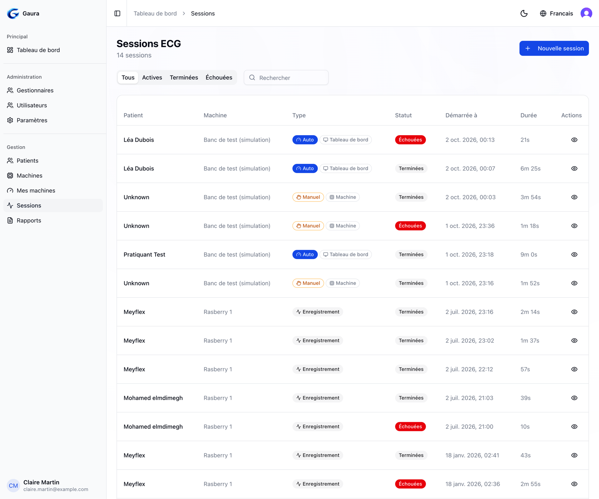

*Les trois types de séance. Une séance démarrée à la machine apparaît avec le patient « Unknown ». Une séance annulée avant le départ apparaît au statut échoué.*

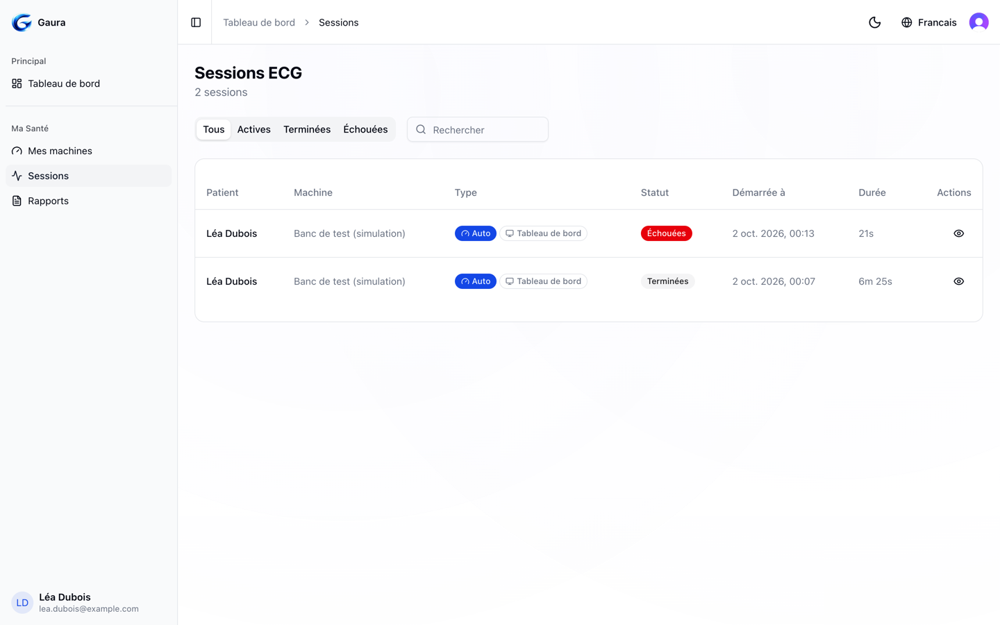

*La même page vue par un patient.* *Capture réelle, serveur de développement, 2 octobre 2026.*

*Captures antérieures à la traduction (ANH-123) : elles montrent encore les statuts de ligne au pluriel (« Terminées », « Échouées ») ; ils s'affichent maintenant au singulier.*

*Capture antérieure au retrait de l'ancien mode d'enregistrement ECG : la première montre encore le bouton « Nouvelle session », retiré.*

**Adresse** : `/fr/dashboard/sessions`. **Pour qui** : tous (chacun voit ce
que ses droits permettent).

```
┌───────────────────────────────────────────────────────────────────────┐
│ Sessions ECG                                                           │
│ 12 sessions                                                            │
│ [ Tous | Actives | Terminées | Échouées ]   🔍 <Rechercher>            │
│ ┌────────────────────────────────────────────────────────────────────┐│
│ │Patient │Machine │Type              │Statut     │Démarrée à │Durée │Actions││
│ │Marie M.│Centri P│(Auto)(Tableau de bord)│(Active) │1 oct. 10:02│12 minutes│[⦿ Voir en direct]││
│ │Unknown │Centri P│(Manuel)(Machine) │(Terminée) │30 sept. 9:10│25m 3s│ 👁 ││
│ │Paul D. │Centri L│(Enregistrement)  │(Échouée)  │29 sept. 15:00│4s    │ 👁 ││
│ └────────────────────────────────────────────────────────────────────┘│
└───────────────────────────────────────────────────────────────────────┘
```

Le titre dit « Sessions ECG » (hérité), mais la page liste **toutes** les
séances : auto, manuelles, et les anciens enregistrements ECG (en lecture
seule).

| Élément | Effet |
|---|---|
| Onglets **Tous**, **Actives**, **Terminées**, **Échouées** | Filtrent par statut. Il n'y a **pas d'onglet « En attente »** : les séances en attente ne se voient que sous **Tous**. |
| **Rechercher** | Filtre sur le texte des lignes. |
| Colonne **Patient** | Nom du pratiquant. « Unknown » pour une séance démarrée à la machine sans pratiquant connu. |
| Colonne **Type** | Badge **Auto** (jauge), **Manuel** (main, ambre) ou **Enregistrement** (courbe) ; badge d'origine **Tableau de bord** (écran) ou **Machine** (puce). |
| **Démarrée à** | Date et heure. |
| **Durée** | Séance finie : durée (« 25m 3s »). Séance non finie : temps écoulé depuis le début (« 12 minutes »). |
| **Voir en direct** (séance active) | Ouvre la vue en direct. |
| Icône **œil** (autres statuts) | Ouvre le détail. |
| Clic sur la ligne | Même effet. |

La liste montre au plus les 100 séances les plus récentes. « Aucune session
trouvée » si vide. Cette page ne crée aucune séance : une séance auto se lance
depuis une machine ([§4.8](#48-fenêtre-lancer-une-séance-auto)), une séance
manuelle depuis la console.

<a id="410-fenêtre-nouvelle-session-enregistrement-ecg"></a>

### 4.10 Fenêtre « Nouvelle session » (retirée)

Cette fenêtre créait une séance de l'ancien mode d'enregistrement ECG. Elle a
été retirée avec ce mode : le bouton **Nouvelle session** n'existe plus, et le
site ne crée une séance que par **Lancer une séance auto**.

> **Attention : séance « Enregistrement » restée en attente.** Si une telle
> séance a été créée avant le retrait, elle reste **en attente**, le site
> n'offre **aucun bouton pour l'annuler**, et tant qu'elle existe, **tout
> lancement auto sur cette machine est refusé** (« A session is already waiting
> for this machine ») et la machine ne peut pas être supprimée. Une migration,
> à exécuter une fois au redéploiement, passe ces séances au statut
> **Échouée** avec le motif « legacy mode retired » (voir
> [convex.md](../convex.md#migration-du-retrait-de-lancien-mode-ecg)). Elle n'a
> encore été exécutée sur aucun serveur.

### 4.11 Vue en direct d'une séance

**Adresse** : `/fr/dashboard/sessions/{id}/live`. **Pour qui** : le pratiquant,
l'administrateur, le gestionnaire de la machine. Sinon « Session introuvable »
et **Retour**.

La page a plusieurs visages selon le type et le statut de la séance.

*Captures antérieures à la traduction (ANH-123) : celles de cette section montrent encore le fil d'Ariane « Details › Live » et l'en-tête « Started ... ago ».*

*Capture antérieure au retrait de l'ancien mode d'enregistrement ECG : celles de cette section montrent encore le badge « Connecting... » et, sous le panneau, le bloc ECG, retirés tous les deux.*

#### a) Séance auto en attente

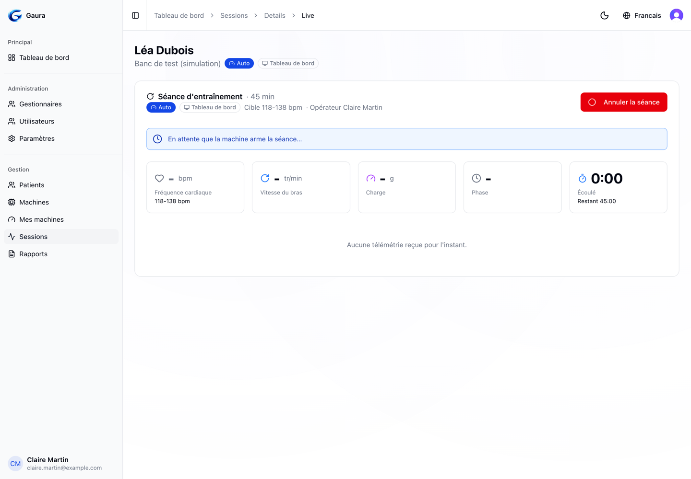


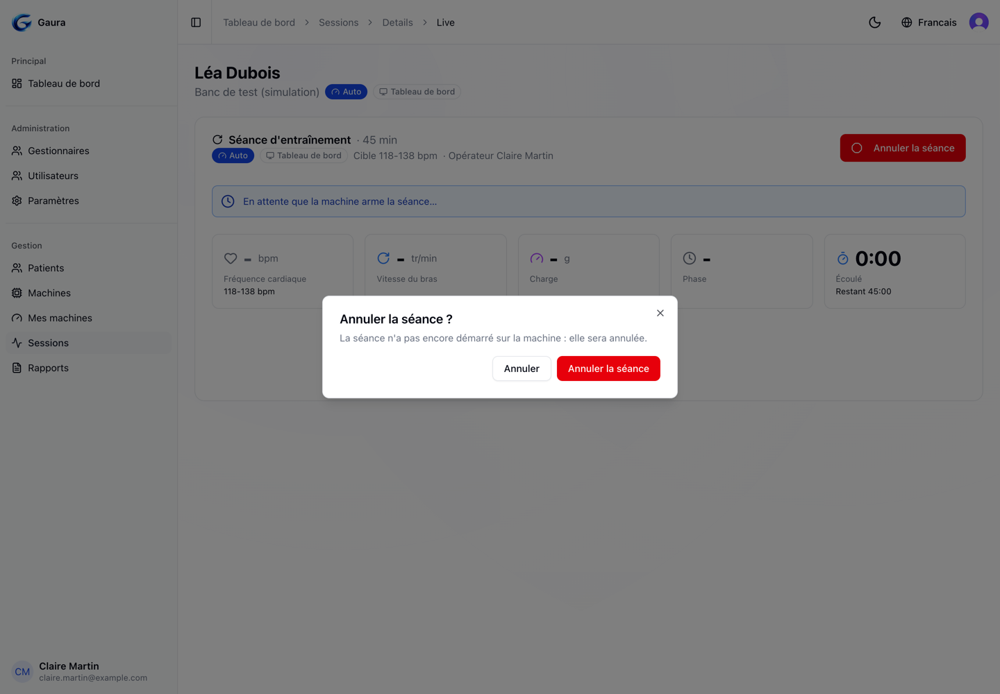


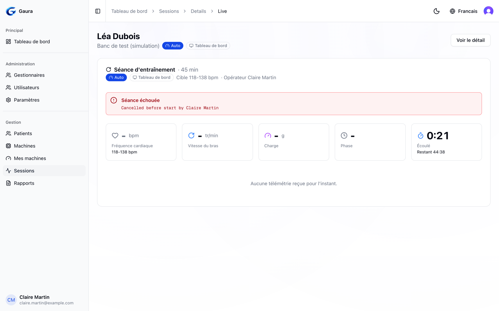

*En attente, confirmation d'annulation, puis la séance annulée (le motif s'affiche en anglais).* *Capture réelle, serveur de développement, 2 octobre 2026.*

```
┌───────────────────────────────────────────────────────────────────────┐
│ Marie Martin                                                           │
│ Centri Paris (Auto) (Tableau de bord)                                  │
│ ┌───────────────────────────────────────────────────────────────────┐ │
│ │ ↻ Séance d'entraînement · 30 min                [ ⯃ Annuler la séance ]│ │
│ │ (Auto)(Tableau de bord) Cible 118 à 138 bpm · Opérateur Claire Petit│ │
│ │ ┌───────────────────────────────────────────────────────────────┐ │ │
│ │ │ 🕑 En attente que la machine arme la séance…                   │ │ │
│ │ └───────────────────────────────────────────────────────────────┘ │ │
│ │ [ - bpm ][ - tr/min ][ - g ][ - Phase ][ 0:00 Écoulé           ] │ │
│ │  Fréquence  Vitesse   Charge            Restant 30:00             │ │
│ │ Aucune télémétrie reçue pour l'instant.                           │ │
│ └───────────────────────────────────────────────────────────────────┘ │
└───────────────────────────────────────────────────────────────────────┘
```

(Un tiret « - » à la place d'un nombre signifie : valeur absente.)

En temps normal, cet état dure **quelques secondes** : la machine interroge le
serveur toutes les 3 s. S'il dure, voir [§6.3](#63-si-la-machine-est-hors-ligne).

**Annuler la séance** : fenêtre « Annuler la séance ? », « La séance n'a pas
encore démarré sur la machine : elle sera annulée. », **Annuler** (ferme la
fenêtre) ou **Annuler la séance** (confirme). La séance passe au statut
**Échouée** avec le motif « Cancelled before start by {nom} ».

#### b) Séance auto ou manuelle active

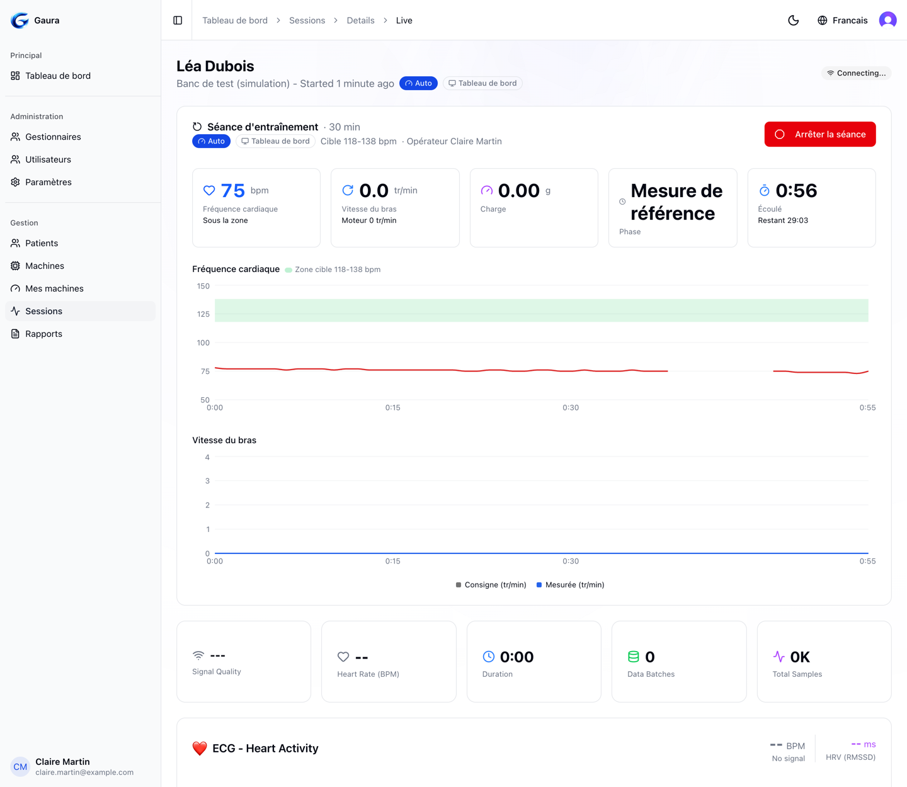

*Séance auto, phase « Mesure de référence » : le bras ne tourne pas encore.*

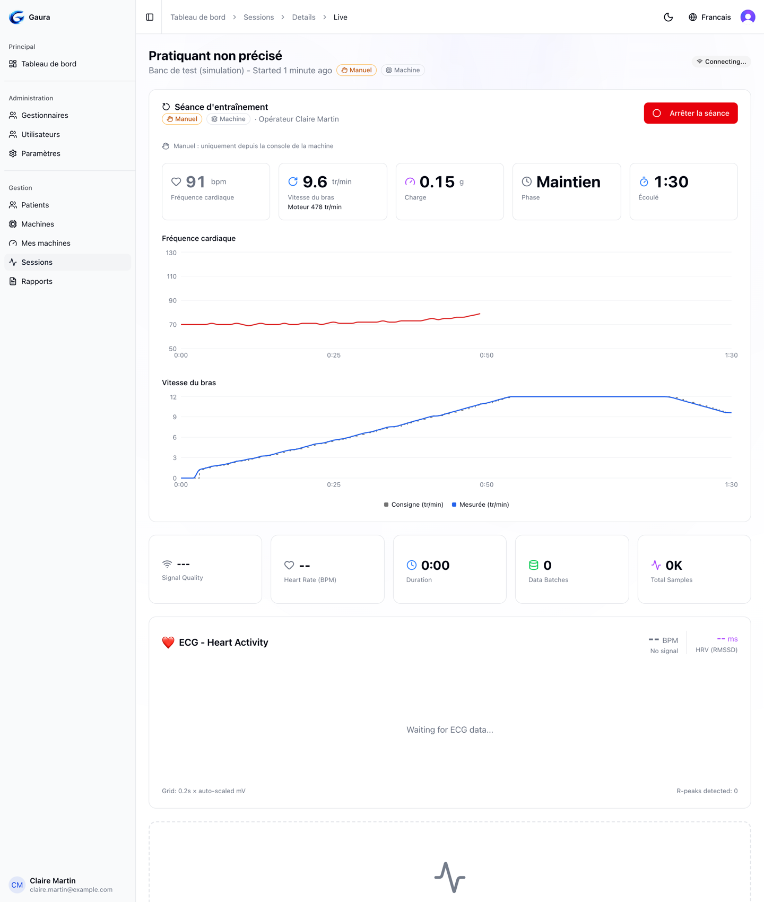

*Séance manuelle démarrée à la console : la courbe « Vitesse du bras » montre la montée sur la rampe, le palier, puis un ralentissement décidé par le superviseur de la machine.*

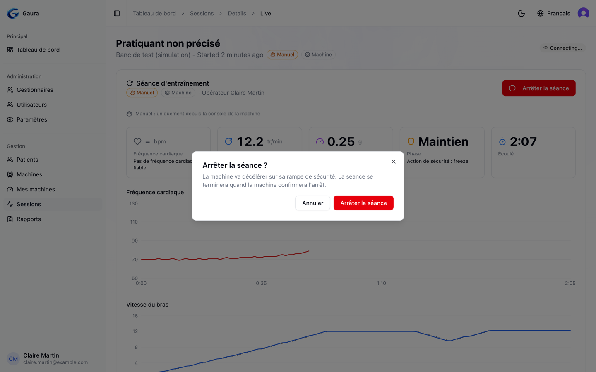


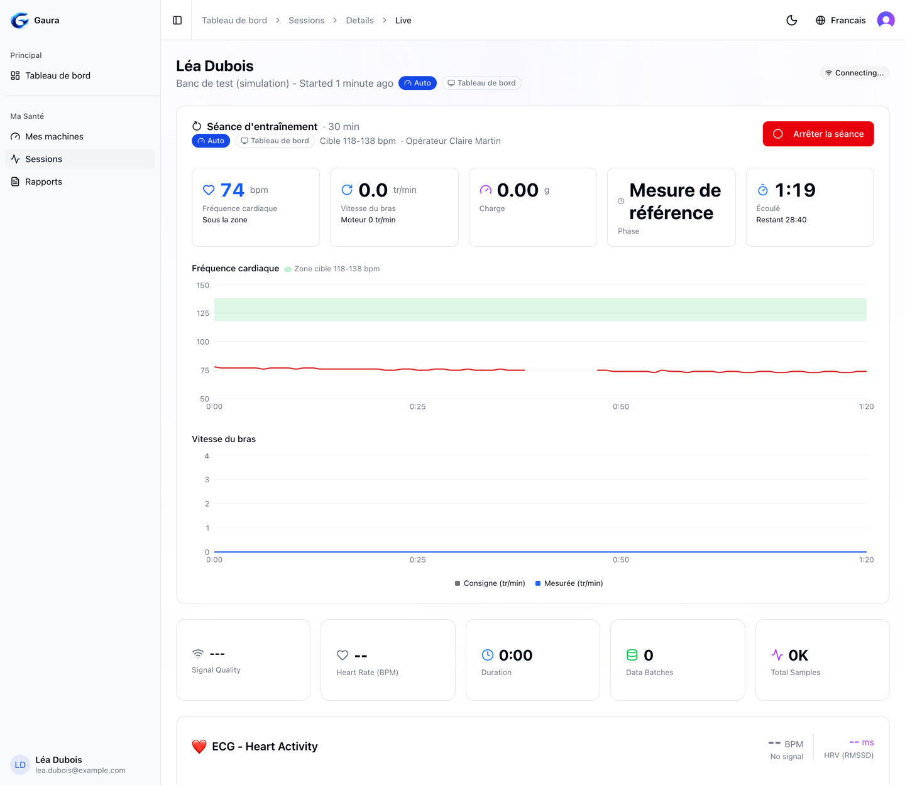

*La confirmation d'arrêt, et la même séance auto vue par le patient.* *Capture réelle, serveur de développement, 2 octobre 2026.*

```
┌───────────────────────────────────────────────────────────────────────┐
│ Marie Martin                                                           │
│ Centri Paris • Démarrée il y a 3 minutes (Auto)(Tableau de bord)       │
│ ┌───────────────────────────────────────────────────────────────────┐ │
│ │ ↻ Séance d'entraînement · 30 min              [ ⯃ Arrêter la séance ]│ │
│ │ (Auto)(Tableau de bord) Cible 118 à 138 bpm · Opérateur Claire Petit│ │
│ │ ┌────────┐┌─────────┐┌───────┐┌──────────────┐┌────────────────┐  │ │
│ │ │♥ 128 bpm││↻ 4.2 tr/min││◔ 1.35 g││🕑 Maintien   ││⏱ 12:05         │  │ │
│ │ │Fréquence││Vitesse du ││Charge  ││Phase         ││Écoulé          │  │ │
│ │ │cardiaque││bras       ││        ││              ││Restant 17:55   │  │ │
│ │ │Dans la  ││Moteur 209 ││        ││              ││                │  │ │
│ │ │zone     ││tr/min     ││        ││              ││                │  │ │
│ │ └────────┘└─────────┘└───────┘└──────────────┘└────────────────┘  │ │
│ │ Fréquence cardiaque  ▬ Zone cible 118 à 138 bpm                     │ │
│ │ 150┤          ╭╮                                                  │ │
│ │ 138┤▒▒▒▒▒▒▒▒▒╭╯╰─╮▒▒▒▒▒▒▒▒▒▒  (bande verte = zone cible)           │ │
│ │ 118┤▒▒▒▒▒▒╭──╯   ╰──────▒▒▒▒                                       │ │
│ │  80┤──────╯                                                       │ │
│ │    0:00      4:00      8:00      12:00                            │ │
│ │ Vitesse du bras                                                    │ │
│ │   ┄┄┄┄ Consigne (tr/min)   ──── Mesurée (tr/min)                   │ │
│ └───────────────────────────────────────────────────────────────────┘ │
└───────────────────────────────────────────────────────────────────────┘
```

**En tête de page** : nom du pratiquant (ou « Pratiquant non précisé »),
machine, « Démarrée il y a ... », badges de type et d'origine.

**Panneau « Séance d'entraînement »** :

| Élément | Contenu |
|---|---|
| Titre | « Séance d'entraînement · {programme} ». L'icône tourne tant que la séance est active, qu'aucun arrêt n'est demandé et que le dernier point a été reçu et mesuré depuis moins de 20 s. |
| Bandeau orange « Aucun signal récent de la machine : les valeurs affichées peuvent être dépassées. » | Séance active sans point reçu par le serveur depuis 20 s (recalculé chaque seconde, sur l'heure du serveur : l'horloge de votre poste ne compte pas). Les cinq indicateurs sont grisés ; fréquence cardiaque, vitesse et charge passent à « - » ; la phase garde sa dernière valeur. Tout revient au premier point actuel. |
| Bandeau orange « La machine envoie, mais ses mesures ne sont pas datées de maintenant (rattrapage après une coupure de liaison, ou horloge de la machine déréglée) : les valeurs affichées peuvent être dépassées. » | La machine envoie, mais le dernier point reçu a été **mesuré** il y a 20 s ou plus, ou porte une date postérieure à sa réception. Deux causes : la machine **rattrape** une coupure de liaison (elle renvoie ses points en attente, les plus anciens d'abord), ou son **horloge est déréglée**. Mêmes indicateurs grisés et « - ». Les courbes, elles, se complètent. Le bandeau part au premier point mesuré depuis moins de 20 s ; s'il ne part pas alors que la machine tourne normalement, faites vérifier l'heure de la machine. |
| Ligne sous le titre | Badges Auto / Manuel et Tableau de bord / Machine ; « Cible {bas}-{haut} bpm » ; « · Opérateur {nom} ». |
| **Fréquence cardiaque** | Dernière valeur **fraîche** (moins de 20 s). Couleur et texte : **vert « Dans la zone »**, **bleu « Sous la zone »**, **rouge « Au-dessus de la zone »**. Un tiret « - » et « Pas de fréquence cardiaque fiable » si la machine n'en a pas. |
| **Vitesse du bras** | tr/min du bras ; dessous « Moteur N tr/min ». |
| **Charge** | g. |
| **Phase** | Mesure de référence, Échauffement, Maintien, Retour au calme, Récupération, Terminé ; avec un bouclier orange et « Action de sécurité : ... » si la machine applique une action de sécurité. |
| **Écoulé** | Chronomètre depuis le départ réel ; dessous « Restant » (durée prévue moins écoulé). |
| Courbe **Fréquence cardiaque** | FC dans le temps (ligne rouge) sur la **bande verte de la zone cible**. Une absence de FC reste un **trou** dans la ligne. Survoler la courbe affiche l'instant et la valeur. |
| Courbe **Vitesse du bras** | **Mesurée** (ligne pleine bleue) et **Consigne** (tirets gris, convertie en tr/min bras). |
| Axe horizontal | Temps depuis le début (minutes:secondes). Au plus la dernière heure. |
| « Aucune télémétrie reçue pour l'instant. » | Aucun point encore arrivé. |

Les points arrivent **par paquets toutes les 5 s environ** : les grands
chiffres et les courbes avancent par à coups de 5 s, c'est normal.

**Arrêter la séance** (bouton rouge, visible par le pratiquant, l'administrateur
et le gestionnaire de la machine) : fenêtre « Arrêter la séance ? », « La
machine va décélérer sur sa rampe de sécurité. La séance se terminera quand la
machine confirmera l'arrêt. », **Annuler** ou **Arrêter la séance**. Ensuite :

- le bouton devient grisé avec un sablier ;
- un bandeau orange « **Arrêt demandé, décélération en cours…** » reste affiché ;
- **le bras tourne encore** pendant la décélération ;
- quand la machine confirme, la séance passe au statut **Terminée** et le
  panneau affiche « Séance terminée ».

> **Ce bouton n'est pas un arrêt d'urgence.** En cas de danger, utilisez
> l'arrêt d'urgence **sur la machine**.

**Séance manuelle** : même panneau, mention « Manuel : uniquement depuis la
console de la machine ». Elle peut être **arrêtée** depuis le site (la machine
décélère), jamais démarrée.

Sous le panneau, la page n'affiche rien d'autre : la console d'entraînement
n'envoie pas l'ECG brut au site, seulement la télémétrie.

#### c) Séance d'entraînement terminée ou échouée

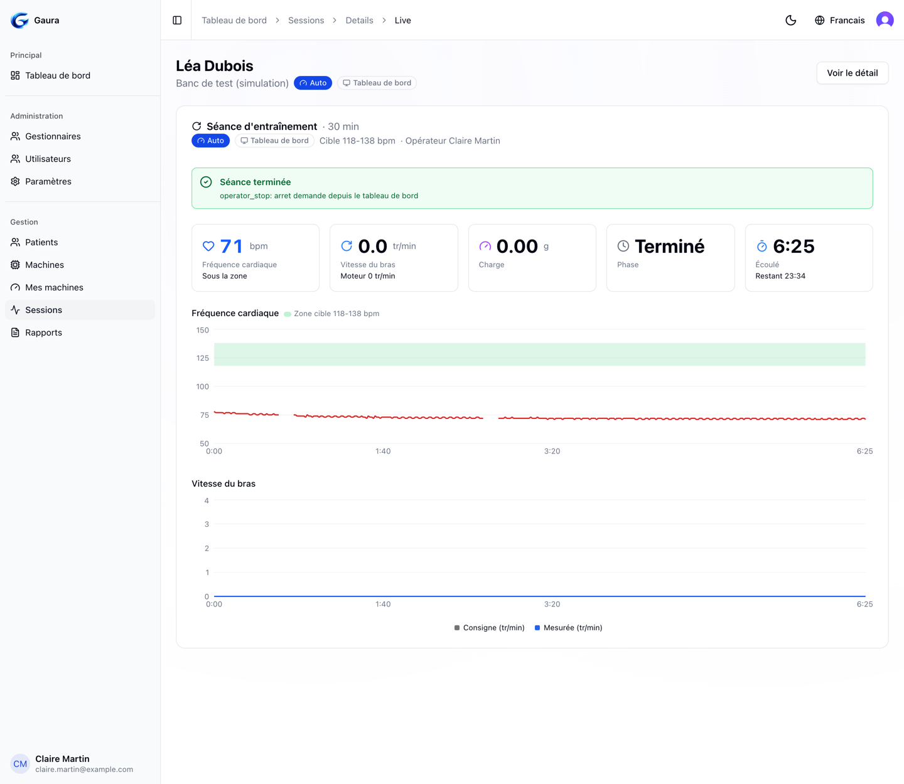

*Capture réelle, serveur de développement, 2 octobre 2026.*

Même en tête, bouton **Voir le détail**, et le panneau avec un bandeau :

- vert « **Séance terminée** » et le motif de fin (par exemple
  `programme_complete`) ;
- rouge « **Séance échouée** » et le motif (par exemple « refusee par la
  machine : ... »).

#### d) Séance de l'ancien mode d'enregistrement ECG

Pas de vue en direct. La page affiche « Cette séance vient de l'ancien mode
d'enregistrement ECG : elle n'a pas de vue en direct. » et le bouton **Voir le
détail de la session**.

### 4.12 Détail d'une séance

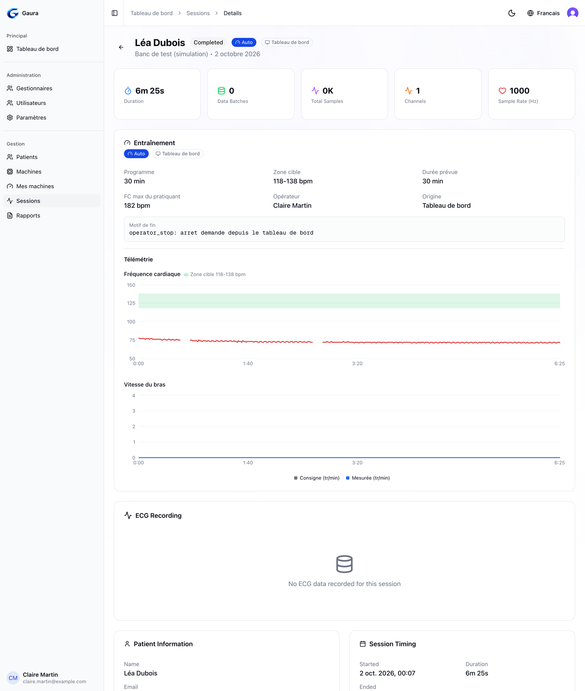

*Capture réelle, serveur de développement, 2 octobre 2026.*

*Capture antérieure à la traduction (ANH-123) : elle montre encore le badge « Completed » et les titres « Patient Information », « Session Timing ».*

*Capture antérieure au retrait de l'ancien mode d'enregistrement ECG : elle montre encore les cinq cartes du haut (« Duration », « Data Batches », « Total Samples »...), le bloc « ECG Recording » et la carte de l'appareil d'enregistrement, retirés.*

**Adresse** : `/fr/dashboard/sessions/{id}`. **Pour qui** : comme la vue en
direct.

```
┌───────────────────────────────────────────────────────────────────────┐
│ ← Marie Martin (Terminée)(Auto)(Tableau de bord)   [⦿ Voir en direct]*│
│   Centri Paris • 1 octobre 2026                                        │
│ ┌───────────────────────────────────────────────────────────────────┐ │
│ │ ⚠ Session échouée ... (si échouée : motif en police fixe)          │ │
│ │ 🕑 En attente de l'appareil ... (si en attente)                    │ │
│ └───────────────────────────────────────────────────────────────────┘ │
│ ┌───────────────────────────────────────────────────────────────────┐ │
│ │ ◔ Entraînement      (Auto)(Tableau de bord)                        │ │
│ │ Programme 30 min   Zone cible 118 à 138 bpm   Durée prévue 30 min  │ │
│ │ FC max du pratiquant 181 bpm  Opérateur Claire Petit  Origine ...  │ │
│ │ Motif de fin : programme_complete                                  │ │
│ │ Télémétrie : courbes Fréquence cardiaque et Vitesse du bras        │ │
│ └───────────────────────────────────────────────────────────────────┘ │
│ Informations patient · Chronologie de la session · Notes de session   │
└───────────────────────────────────────────────────────────────────────┘
 * « Voir en direct » : si la séance d'entraînement est active ou en attente.
```

| Bloc | Contenu |
|---|---|
| En tête | Flèche retour (vers **Sessions**), nom du pratiquant, badge de statut (Active, Terminée, En attente, Échouée), badges de type et d'origine, machine et date. **Voir en direct** si la séance d'entraînement est active ou en attente. |
| « Session échouée » | Si échouée : texte générique et **motif précis** en police fixe. |
| « En attente de l'appareil » | Séance d'entraînement en attente : « En attente que la machine arme la séance… ». |
| Carte **Entraînement** (séances auto et manuelles) | **Programme**, **Zone cible**, **Durée prévue**, **FC max du pratiquant**, **Opérateur**, **Origine** (Tableau de bord / Machine), encadré **Motif de fin** (rouge si échouée), puis **Télémétrie** : les mêmes deux courbes que la vue en direct, pour toute la séance (jusqu'à 2 heures). « Aucune télémétrie reçue pour l'instant. » si rien n'a été reçu. |
| Carte **Ancien enregistrement ECG** (séances de l'ancien mode seulement, à la place de la carte Entraînement) | « Cette séance vient de l'ancien mode d'enregistrement ECG, retiré du logiciel. Elle est conservée en lecture seule. » ; « Canaux enregistrés » ; puis, si des données existent, « Lots de données », « Durée des données » et « Données enregistrées de ... à ... ». Sinon « Aucune donnée ECG enregistrée pour cette session ». Le tracé n'est plus affiché. |
| « Informations patient », « Chronologie de la session », « Notes de session » | Nom et adresse, début, durée (« En cours » pour une séance d'entraînement non finie), fin, « Démarrée par », notes. |

**Lire le motif de fin** (champ « Motif de fin ») :

| Motif | Sens |
|---|---|
| `programme_complete` | Le programme est allé au bout. Séance **Terminée**. |
| commence par `operator_stop` | Arrêt demandé (site ou console), suivi de la raison. **Terminée**. |
| `emergency_stop` | Arrêt d'urgence. **Échouée**. |
| commence par `safety_verdict` | La sécurité de la machine a arrêté la séance (variateur, communication, chute de FC, dépassement...). **Échouée**. |
| `tick_exception`, `shutdown` | Erreur logicielle, ou arrêt de la console. **Échouée**. |
| « refusee par la machine : ... » | La machine a refusé le départ ; la suite dit pourquoi (voir [§7](#7-tableau-des-messages)). |
| « la boucle n'a ni demarre ni refuse » | La machine a pris la demande mais n'a ni démarré ni refusé en 60 s. |
| « Cancelled before start by {nom} » | Annulée depuis le site avant le départ. |

Ces motifs sont écrits par la machine, sans accents ni traduction.

### 4.13 Patients (liste) et fenêtres patient

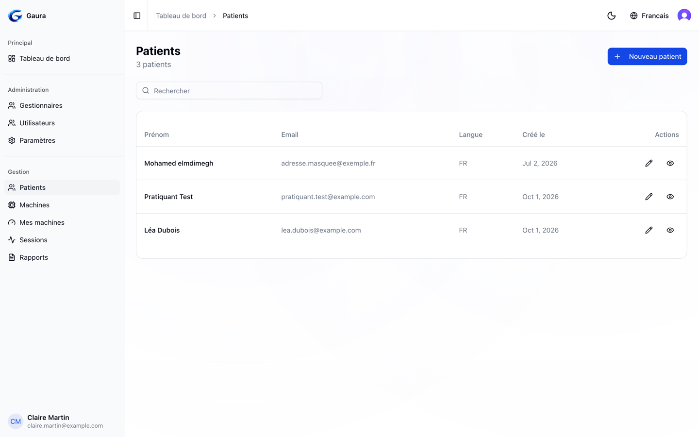


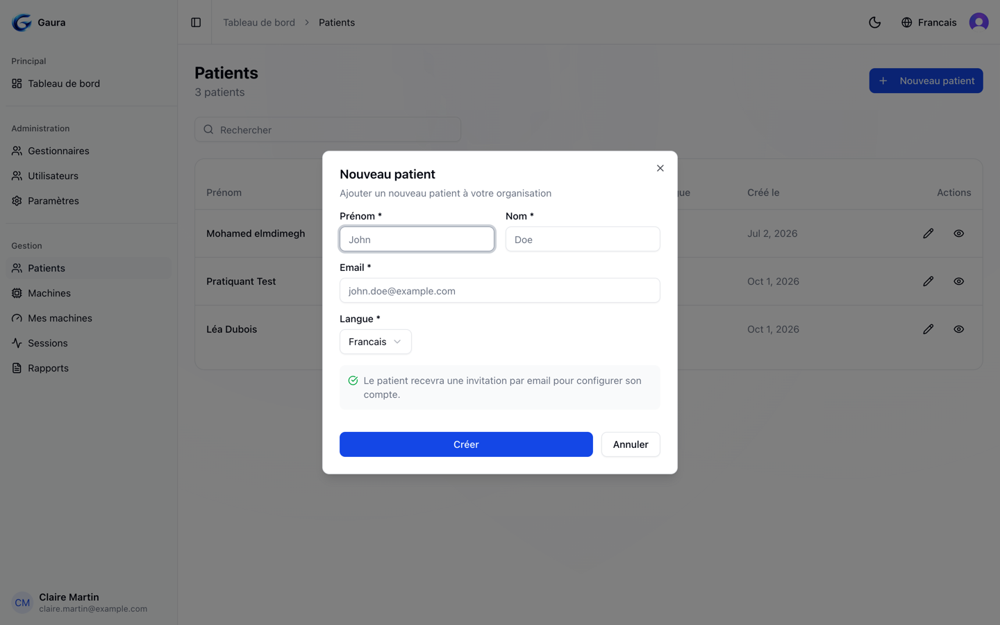


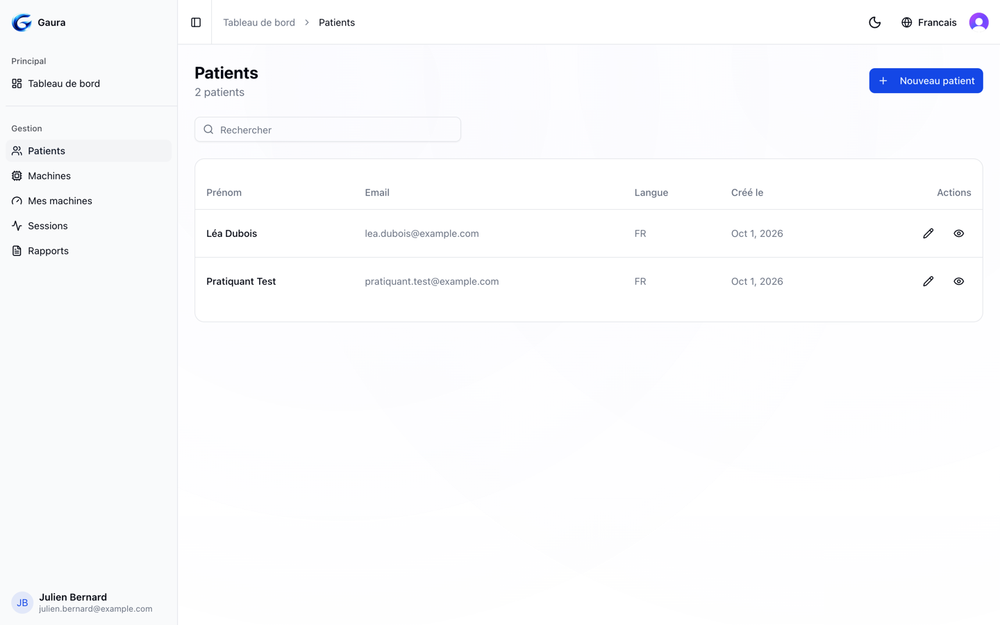

*Administrateur, fenêtre de création, puis la liste d'un gestionnaire (ses patients seulement).* *Capture réelle, serveur de développement, 2 octobre 2026.*

**Adresse** : `/fr/dashboard/patients`. **Pour qui** : administrateur (tous les
patients), gestionnaire (les siens).

```
┌───────────────────────────────────────────────────────────────────────┐
│ Patients                                         [ + Nouveau patient ] │
│ 8 patients                                                             │
│ 🔍 <Rechercher>                                                        │
│ ┌────────────────────────────────────────────────────────────────────┐│
│ │ Prénom          │ Email          │ Langue │ Créé le     │ Actions  ││
│ │ Marie Martin    │ marie@ex.fr    │ FR     │ 28 sept. 2026│ ✎  👁   ││
│ └────────────────────────────────────────────────────────────────────┘│
└───────────────────────────────────────────────────────────────────────┘
```

- La colonne **Prénom** affiche le prénom **et** le nom.
- **Crayon** : fenêtre **Modifier le patient**. **Œil** ou clic sur la ligne :
  fiche patient.
- « Aucun patient trouvé » et un bouton **Nouveau patient** si la liste est vide.

**Fenêtre « Nouveau patient »** (« Ajouter un nouveau patient à votre
organisation ») : **Prénom** *, **Nom** *, **Email** *, **Langue** * (Francais
ou English), note « Le patient recevra une invitation par email pour configurer
son compte. », boutons **Créer** et **Annuler**. Erreurs de saisie en anglais :
« First name is required », « Last name is required », « Invalid email
address ».

> **Attention : aucune invitation n'est envoyée.** Malgré la note, le code
> n'envoie aucun courriel. Et si la personne crée ensuite elle même un compte
> avec la même adresse, elle obtient une **seconde** fiche, sans lien avec la
> première. Voir [procédure P3](#p3-créer-une-fiche-patient-sans-compte) pour
> choisir la bonne méthode.

Un patient créé par un **gestionnaire** lui est rattaché automatiquement. Un
patient créé par un **administrateur** n'est rattaché à **aucun** gestionnaire
(la fenêtre ne propose pas de choix) : il faut ensuite passer par la fiche du
gestionnaire ([§4.18](#418-fiche-dun-gestionnaire)).

**Fenêtre « Modifier le patient »** (« Mettre à jour les informations du
patient ») : mêmes champs, **Email** grisé (non modifiable), bouton
**Enregistrer**.

### 4.14 Fiche patient

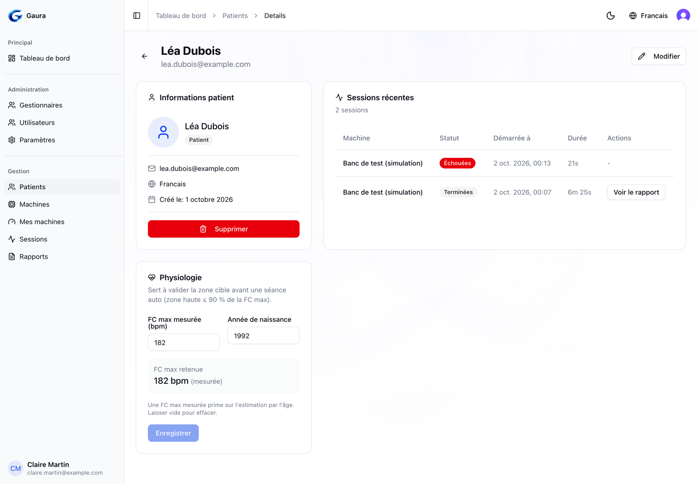

*Capture réelle, serveur de développement, 2 octobre 2026.*

*Capture antérieure à la traduction (ANH-123) : elle montre encore « Details » dans le fil d'Ariane et les statuts au pluriel (« Échouées », « Terminées »).*

**Adresse** : `/fr/dashboard/patients/{id}`. **Pour qui** : administrateur,
gestionnaire du patient. Sinon « Aucun utilisateur trouvé » et **Retour**.

```
┌───────────────────────────────────────────────────────────────────────┐
│ ← Marie Martin                                           [ ✎ Modifier ]│
│   marie@ex.fr                                                          │
│ ┌──────────────────────┐ ┌──────────────────────────────────────────┐ │
│ │ 👤 Informations patient│ │ ∿ Sessions récentes                      │ │
│ │ (◯) Marie Martin      │ │ 3 sessions                               │ │
│ │     (Patient)         │ │ Machine │Statut │Démarrée à│Durée│Actions│ │
│ │ ✉ marie@ex.fr         │ │ Centri P│(Active) │1 oct.  │5 min│[Voir en direct]│ │
│ │ 🌐 Francais           │ │ Centri P│(Terminée) │28 sept.│30m│[Voir le rapport]│ │
│ │ 📅 Créé le: 28 sept.  │ │ Centri P│(Échouée) │27 sept.│0s │ -     │ │
│ │ [ 🗑 Supprimer ]      │ └──────────────────────────────────────────┘ │
│ └──────────────────────┘                                              │
│ ┌──────────────────────┐                                              │
│ │ ♡ Physiologie        │                                              │
│ │ Sert à valider la zone cible avant une séance auto (zone haute ≤ 90 %│
│ │ de la FC max).       │                                              │
│ │ FC max mesurée (bpm)  Année de naissance                             │
│ │ <      >              <1985 >                                        │
│ │ FC max retenue                                                       │
│ │ 181 bpm (estimée (208 − 0,7 × âge))                                  │
│ │ Une FC max mesurée prime sur l'estimation par l'âge. Laisser vide    │
│ │ pour effacer.                                                        │
│ │ [ Enregistrer ]                                                      │
│ └──────────────────────┘                                              │
└───────────────────────────────────────────────────────────────────────┘
```

| Bloc | Contenu et actions |
|---|---|
| En tête | Flèche retour vers **Patients**, nom, adresse, bouton **Modifier** (fenêtre du [§4.13](#413-patients-liste-et-fenêtres-patient)). |
| **Informations patient** | Nom, badge de rôle, adresse, langue, date de création. Bouton **Supprimer** : fenêtre « Êtes-vous sûr de vouloir supprimer cet utilisateur? », texte anglais « This action cannot be undone... », **Annuler** / **Supprimer**. La suppression est **définitive** ; en cas de refus, un message d'échec s'affiche en bas à droite de l'écran. |
| **Sessions récentes** | Les 10 dernières séances du patient visibles par vous : machine, statut, début, durée. Action : **Voir en direct** (active), **Voir le rapport** (terminée, ouvre le détail), « - » sinon. Une séance échouée ou en attente s'ouvre depuis **Sessions**. |
| **Physiologie** | Voir ci dessous. |

**Carte « Physiologie »** :

| Élément | Règle |
|---|---|
| **FC max mesurée (bpm)** | Nombre entier entre 100 et 220, sinon « La FC max doit être comprise entre 100 et 220 bpm ». Vide : pas de FC max mesurée. |
| **Année de naissance** | L'âge obtenu (année en cours moins année saisie) doit être entre 10 et 100 ans, sinon « Année de naissance invalide ». |
| **FC max retenue** | Aperçu de ce que le serveur utilisera : la FC max mesurée si elle existe (« mesurée »), sinon l'estimation par l'âge (« estimée (208 − 0,7 × âge) »), sinon « Non renseignée ». |
| **Enregistrer** | Actif seulement après une modification valide. N'envoie que les champs touchés. Pendant l'envoi : sablier ; après : « Enregistré » avec une coche. Une erreur du serveur s'affiche en rouge en haut de la carte. |

Pour **effacer** une valeur : videz le champ, puis **Enregistrer**.

### 4.15 Utilisateurs (liste)

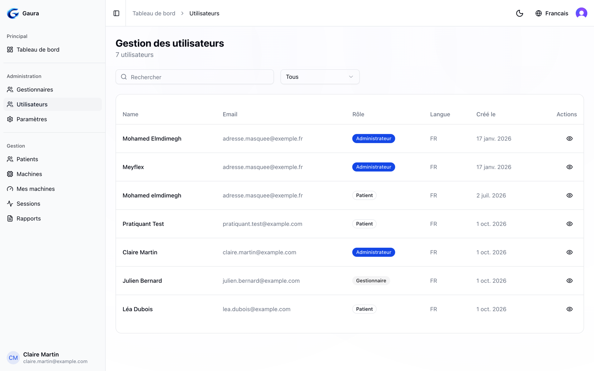

*Les adresses des comptes qui existaient avant l'essai sont masquées sur la capture.* *Capture réelle, serveur de développement, 2 octobre 2026.*

*Capture antérieure à la traduction (ANH-123) : elle montre encore l'en-tête de colonne « Name ».*

**Adresse** : `/fr/dashboard/users`. **Pour qui** : administrateur (menu
Administration).

```
┌───────────────────────────────────────────────────────────────────────┐
│ Gestion des utilisateurs                                               │
│ 14 utilisateurs                                                        │
│ 🔍 <Rechercher>          <Tous ▾>  (Tous, Administrateur, Gestionnaire, Patient)│
│ ┌────────────────────────────────────────────────────────────────────┐│
│ │ Nom            │ Email       │ Rôle            │ Langue │ Créé le │ 👁 ││
│ │ Jean Dupont    │ jean@ex.fr  │ (Administrateur)│ FR     │ ...     │ 👁 ││
│ │ Claire Petit   │ claire@ex.fr│ (Gestionnaire)  │ FR     │ ...     │ 👁 ││
│ │ Marie Martin   │ marie@ex.fr │ (Patient)       │ FR     │ ...     │ 👁 ││
│ └────────────────────────────────────────────────────────────────────┘│
└───────────────────────────────────────────────────────────────────────┘
```

- La liste déroulante filtre par rôle.
- Clic sur une ligne ou sur l'œil : fiche utilisateur.
- **Il n'y a pas de bouton de création ici.** Les comptes se créent par
  inscription (Clerk) ou par **Nouveau patient** (page Patients).

### 4.16 Fiche utilisateur

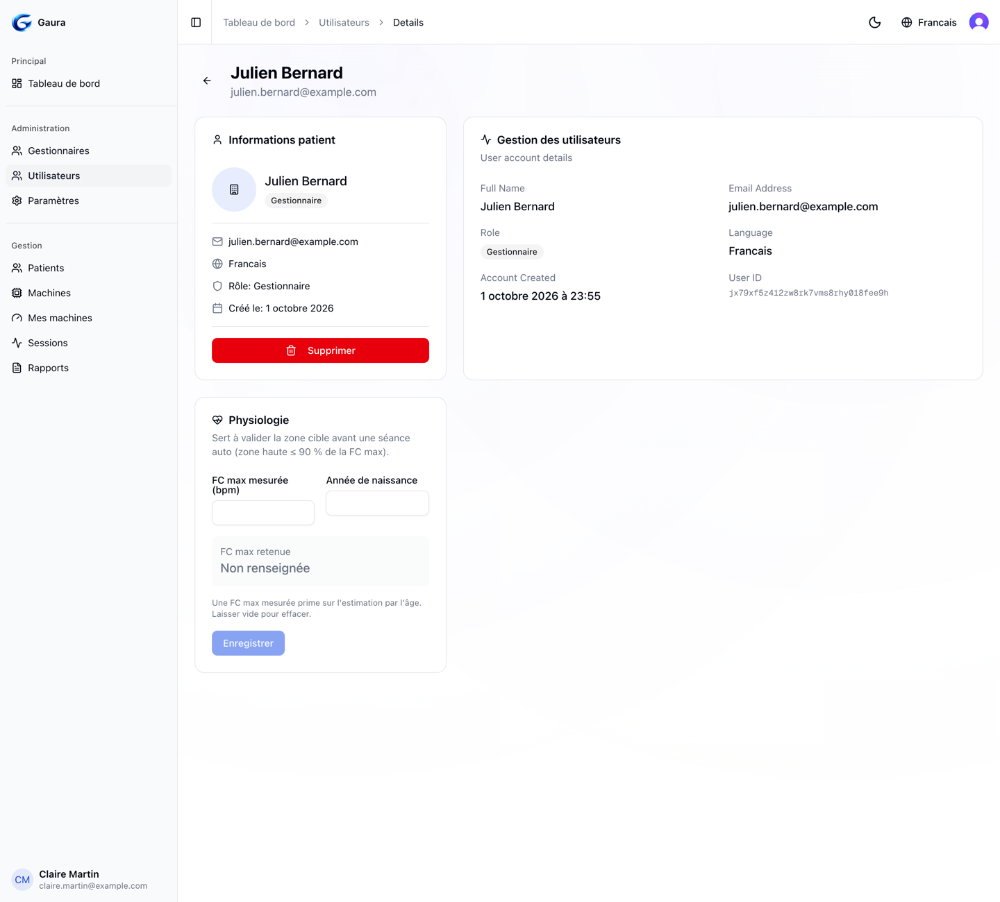

*Capture réelle, serveur de développement, 2 octobre 2026.*

**Adresse** : `/fr/dashboard/users/{id}`.

Même structure que la fiche patient ([§4.14](#414-fiche-patient)), avec ces
différences :

- le bouton **Modifier** n'apparaît que pour un **Patient** ;
- **Supprimer** : l'administrateur peut supprimer tout compte **sauf le sien** ;
  un gestionnaire seulement ses patients ;
- pour un administrateur ou un gestionnaire, la grande carte de droite affiche
  des détails en anglais (Full Name, Email Address, Role, Language, Account
  Created, User ID) au lieu des séances ;
- la carte **Physiologie** s'affiche pour **tout** compte que vous gérez, y
  compris administrateurs et gestionnaires. C'est **le seul endroit** où un
  administrateur ou un gestionnaire peut saisir **sa propre** FC max et son
  année de naissance (utile pour lancer « Moi-même »). Un gestionnaire n'a pas
  d'entrée de menu vers sa propre fiche : il faut l'adresse exacte.

### 4.17 Gestionnaires (liste)

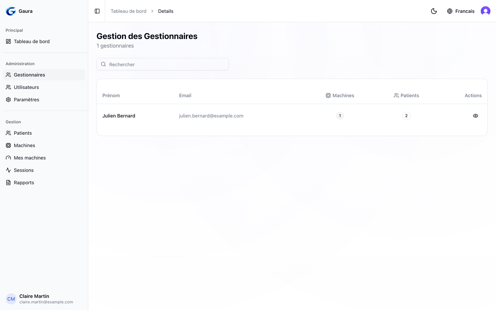

*Capture réelle, serveur de développement, 2 octobre 2026.*

*Capture antérieure à la traduction (ANH-123) : elle montre « Details » dans le fil d'Ariane à la place de « Gestionnaires ».*

**Adresse** : `/fr/dashboard/gestionnaires`. **Pour qui** : administrateur.
Sinon : « Une erreur est survenue: Admin access required ».

```
┌───────────────────────────────────────────────────────────────────────┐
│ Gestion des Gestionnaires                                              │
│ 2 gestionnaires                                                        │
│ 🔍 <Rechercher>                                                        │
│ ┌────────────────────────────────────────────────────────────────────┐│
│ │ Prénom       │ Email        │ ▢ Machines │ 👥 Patients │ Actions   ││
│ │ Claire Petit │ claire@ex.fr │    (2)     │    (5)      │   👁      ││
│ └────────────────────────────────────────────────────────────────────┘│
└───────────────────────────────────────────────────────────────────────┘
```

Nombres de machines et de patients attribués. Clic : fiche du gestionnaire.
« Aucun gestionnaire trouvé » si aucun compte n'a ce rôle (pour en créer un :
[procédure P2](#p2-créer-un-compte-et-lui-donner-un-rôle)).

### 4.18 Fiche d'un gestionnaire

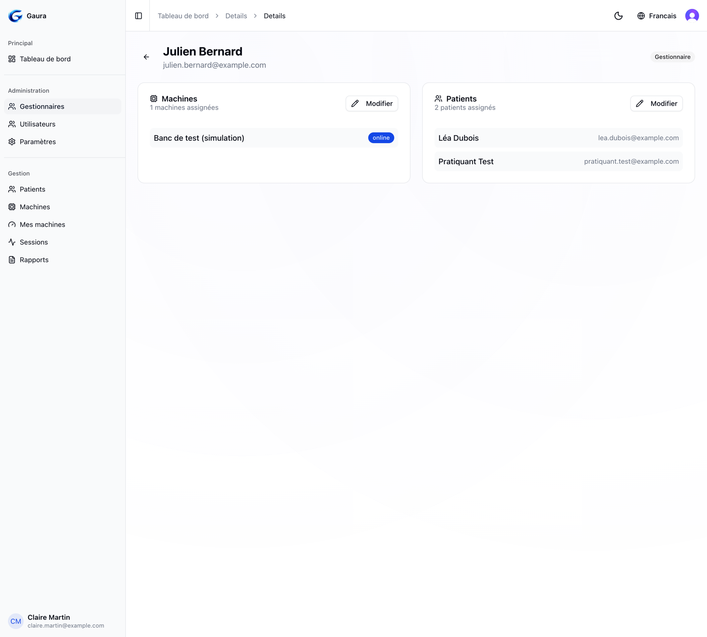

*Capture réelle, serveur de développement, 2 octobre 2026.*

*Capture antérieure à la traduction (ANH-123) : elle montre le fil d'Ariane « Details › Details » et le statut brut `online`.*

**Adresse** : `/fr/dashboard/gestionnaires/{id}`. **Pour qui** :
administrateur (sinon « Admin access required » ; identifiant inconnu :
« Gestionnaire not found »).

```
┌───────────────────────────────────────────────────────────────────────┐
│ ← Claire Petit                                          (Gestionnaire) │
│   claire@ex.fr                                                         │
│ ┌──────────────────────────────┐ ┌──────────────────────────────────┐ │
│ │ ▢ Machines       [ ✎ Modifier ]│ │ 👥 Patients         [ ✎ Modifier ]│ │
│ │ 2 machines assignées          │ │ 5 patients assignés              │ │
│ │ Centri Paris       (En ligne) │ │ Marie Martin      marie@ex.fr    │ │
│ │ Centri Lyon       (Hors ligne)│ │ ...                              │ │
│ └──────────────────────────────┘ └──────────────────────────────────┘ │
└───────────────────────────────────────────────────────────────────────┘
```

- **Modifier** (Machines) : fenêtre **Assigner des Machines**, « Sélectionner
  les machines auxquelles ce gestionnaire peut accéder », une case par machine
  (avec son statut : En ligne, Hors ligne, En session), **Annuler** /
  **Enregistrer**. Les cases cochées deviennent la liste des machines de ce
  gestionnaire : cocher une machine la lui attribue, la décocher la lui
  retire. Les autres gestionnaires de ces machines gardent leur accès. La
  fiche confirme ensuite, par exemple « Machines enregistrées : 1 ajoutée,
  1 retirée. ». Si le serveur refuse, son message s'affiche en rouge dans la
  fenêtre, qui reste ouverte.
- **Modifier** (Patients) : fenêtre **Assigner des Patients**, « Sélectionner
  les patients que ce gestionnaire peut gérer », une case par patient,
  **Annuler** / **Enregistrer**. La liste cochée **remplace** la précédente :
  décocher un patient le retire à ce gestionnaire.
- « Aucune machine assignée », « Aucun patient assigné » si vide.

> **Attention : corrigé dans le code le 6 octobre 2026, pas encore en
> production.** Tant que le redéploiement n'a pas eu lieu, la fenêtre
> **Assigner des Machines** en ligne garde son ancien comportement :
> 1. Pour **chaque** machine cochée, **Enregistrer** remplace **tous** les
>    gestionnaires de cette machine par ce seul gestionnaire : les autres
>    gestionnaires de la machine **perdent leur accès**, sans avertissement.
> 2. **Décocher** une machine ne retire **rien**.
>
> D'ici là, attribuez les machines par la fenêtre **Modifier** du **détail de
> la machine** (cases « Assigner aux Gestionnaires », qui gèrent correctement
> la liste complète). Voir
> [procédure P6](#p6-attribuer-des-machines-à-un-gestionnaire).

### 4.19 Rapports

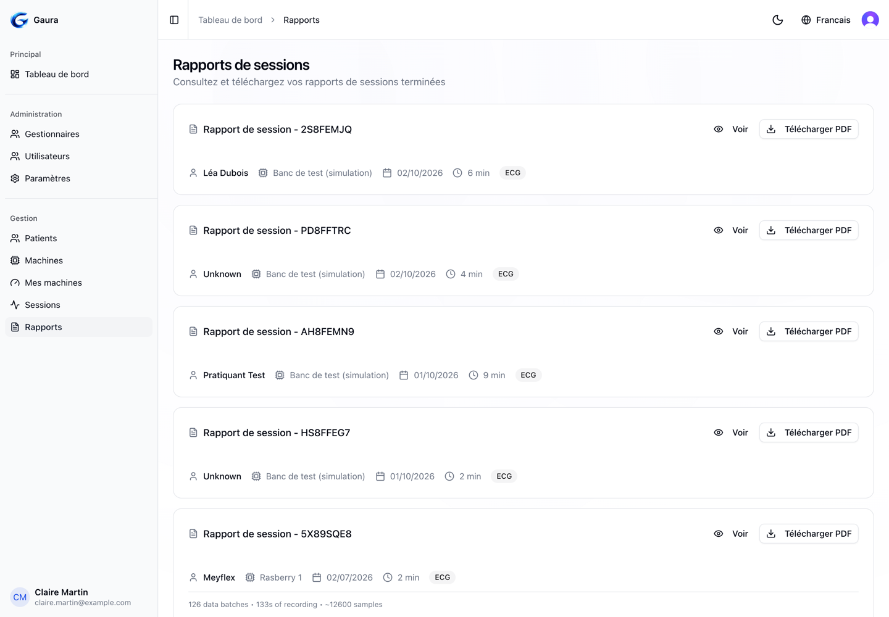

*Capture réelle, serveur de développement, 2 octobre 2026.*

*Capture antérieure au retrait de l'ancien mode d'enregistrement ECG : elle montre encore le bouton « Download PDF », le badge du canal et la ligne « 126 data batches • 133s of recording • ~12600 samples », retirés.*

**Adresse** : `/fr/dashboard/reports`. **Pour qui** : tous.

```
┌───────────────────────────────────────────────────────────────────────┐
│ Rapports de sessions                                                   │
│ Consultez vos sessions terminées                                       │
│ ┌───────────────────────────────────────────────────────────────────┐ │
│ │ 🗎 Rapport de session - 7K2QX9A1                            [👁 Voir] │ │
│ │ 👤 Marie Martin  ▢ Centri Paris  📅 01/10/2026  🕑 30 min           │ │
│ └───────────────────────────────────────────────────────────────────┘ │
└───────────────────────────────────────────────────────────────────────┘
```

- Une carte par séance **terminée** (pas les échouées) que vous pouvez voir, au
  plus parmi les 100 plus récentes. Titre : « Rapport de session » et les 8
  derniers caractères de l'identifiant.
- **Voir** : ouvre le détail de la séance ([§4.12](#412-détail-dune-séance)).
- Il n'y a plus de bouton **Télécharger PDF** : l'ancien rapport, construit
  sur les données ECG, a été retiré avec le mode d'enregistrement. Le rapport
  d'une séance d'entraînement n'existe pas encore sur le site.

### 4.20 Paramètres

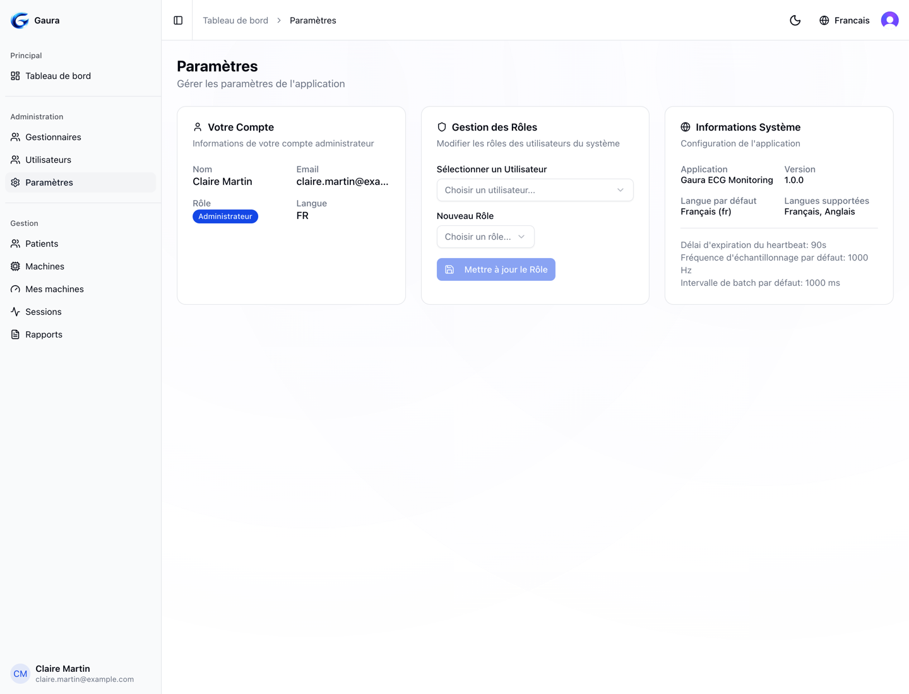

*Capture réelle, serveur de développement, 2 octobre 2026.*

**Adresse** : `/fr/dashboard/settings`. **Pour qui** : administrateur. Sinon :
« Accès refusé. Réservé aux administrateurs. ».

```
┌───────────────────────────────────────────────────────────────────────┐
│ Paramètres                                                             │
│ Gérer les paramètres de l'application                                  │
│ ┌────────────────────┐ ┌─────────────────────────┐ ┌─────────────────┐│
│ │ 👤 Votre Compte     │ │ 🛡 Gestion des Rôles     │ │ 🌐 Informations  ││
│ │ Informations de     │ │ Modifier les rôles des  │ │ Système          ││
│ │ votre compte admin. │ │ utilisateurs du système │ │ Application :    ││
│ │ Nom   Jean Dupont   │ │ Sélectionner un Utilisateur│ Gaura ECG Monitoring│
│ │ Email jean@ex.fr    │ │ <Choisir un utilisateur...▾>│ Version 1.0.0   ││
│ │ Rôle (Administrateur)│ │ Nouveau Rôle            │ │ Langue par défaut││
│ │ Langue FR           │ │ <Choisir un rôle...▾>   │ │ Français (fr)    ││
│ │                     │ │ [ 💾 Mettre à jour le Rôle ]│ Langues supportées│
│ │                     │ │                         │ │ Français, Anglais││
│ │                     │ │                         │ │ Délai d'expiration││
│ │                     │ │                         │ │ du heartbeat: 90s││
│ └────────────────────┘ └─────────────────────────┘ └─────────────────┘│
└───────────────────────────────────────────────────────────────────────┘
```

| Carte | Contenu |
|---|---|
| **Votre Compte** | Vos nom, adresse, rôle, langue. Lecture seule. |
| **Gestion des Rôles** | **Sélectionner un Utilisateur** (tous les comptes sauf vous, « Nom - Rôle »), **Nouveau Rôle** (Administrateur, Gestionnaire, Patient), bouton **Mettre à jour le Rôle** (« Chargement... » pendant l'envoi). En cas de succès, les deux listes se vident et le message « Rôle mis à jour. » s'affiche en bas à droite de l'écran ; en cas d'échec, un message d'échec s'affiche au même endroit. |
| **Informations Système** | Valeurs affichées pour information, **pas des réglages** : nom de l'application, version, langues, « Délai d'expiration du heartbeat: 90s ». |

Il n'y a **aucun autre réglage** sur le site : ni notifications, ni mot de passe
(géré par Clerk, menu de l'avatar), ni réglage de machine (fait sur la
machine).

---

## 5. Procédures pas à pas

Chaque procédure donne : **Qui**, **Prérequis**, **Étapes**, **Ce que vous devez
voir**, **Si ça ne marche pas**. Les messages du serveur sont en anglais ; leur
sens est au [§7](#7-tableau-des-messages).

Ordre conseillé pour une première installation : P1, P2, P5, P6, P4 (ou P3),
P7, P8, P9, P10.

### P1. Nommer le premier administrateur

**Qui** : la personne qui installe le service (accès à la console
d'administration Convex). **Prérequis** : Convex et Clerk déployés
(voir [convex.md §8](../convex.md#8-déployer)). Sur le site déjà en
production, cette étape est normalement faite : ne la refaites que pour un
nouveau déploiement.

1. Inscrivez vous sur le site (**S'inscrire**), comme au [§3.1](#31-se-connecter-clerk).
2. Restez quelques secondes sur la page d'accueil (création de votre fiche).
3. Ouvrez la console d'administration Convex du déploiement, table `users`.
4. Trouvez votre ligne (par votre adresse), passez `role` à `admin`.
5. Revenez sur le site et rechargez la page.

**Ce que vous devez voir** : la section **Administration** (Gestionnaires,
Utilisateurs, Paramètres) dans la barre latérale.

**Si ça ne marche pas** : si votre ligne n'existe pas, repassez par la page
d'accueil connectée (étape 2). Aucune autre méthode n'existe : le site n'a pas
d'amorçage automatique du premier administrateur.

### P2. Créer un compte et lui donner un rôle

**Qui** : la personne concernée, puis un administrateur. **Prérequis** : un
administrateur existe.

1. La personne ouvre `/fr`, clique **S'inscrire** (ou **Commencer**) et suit
   la fenêtre Clerk.
2. Elle reste quelques secondes sur la page d'accueil. Son compte existe
   maintenant avec le rôle **Patient**.
3. L'administrateur ouvre **Paramètres**.
4. **Sélectionner un Utilisateur** : il choisit la personne.
5. **Nouveau Rôle** : **Gestionnaire** (ou **Administrateur**, ou **Patient**).
6. Il clique **Mettre à jour le Rôle**.

**Ce que vous devez voir** : les deux listes se vident et le message « Rôle mis
à jour. » s'affiche en bas à droite de l'écran. Dans **Utilisateurs**,
la personne porte le nouveau badge. La personne, en rechargeant, voit le menu
de son rôle.

**Si ça ne marche pas** :

- la personne n'apparaît pas dans la liste : elle n'est pas passée par la page
  d'accueil après l'inscription (étape 2) ;
- un message d'échec s'affiche en bas à droite de l'écran : l'envoi a échoué ;
  rechargez **Paramètres** et recommencez ; vérifiez que vous êtes bien
  administrateur.

Il n'existe **pas d'invitation par courriel** : envoyez vous même l'adresse du
site à la personne.

### P3. Créer une fiche patient sans compte

**Qui** : administrateur ou gestionnaire.

Deux méthodes, à choisir selon le cas :

| Le patient va t'il se connecter lui même au site ? | Méthode |
|---|---|
| **Oui** (il lancera lui même ses séances, consultera ses rapports) | **Ne créez pas de fiche.** Faites lui suivre la [procédure P2](#p2-créer-un-compte-et-lui-donner-un-rôle) (il reste Patient), puis rattachez le à son gestionnaire ([P4](#p4-rattacher-des-patients-à-un-gestionnaire)). |
| **Non** (seul le gestionnaire lance pour lui) | Créez une fiche comme ci dessous. |

Étapes (fiche sans compte) :

1. **Patients** → **Nouveau patient**.
2. Saisissez **Prénom**, **Nom**, **Email**, **Langue**.
3. **Créer**.

**Ce que vous devez voir** : la fenêtre se ferme, le patient apparaît dans la
liste. Créé par un gestionnaire, il lui est rattaché ; créé par un
administrateur, il n'est rattaché à personne (faites [P4](#p4-rattacher-des-patients-à-un-gestionnaire)).

**Si ça ne marche pas** : message rouge en haut de la fenêtre.

- « Email already in use by an existing ... account (...) » : l'adresse est
  déjà prise. Cherchez la personne dans **Patients** ou **Utilisateurs**.
- « Invalid email format » ou « Invalid email address » : corrigez l'adresse.

> Cette fiche **ne peut jamais servir à se connecter**. Si la personne s'inscrit
> plus tard avec la même adresse, elle obtient une seconde fiche, vide, sans
> droits ni physiologie. Il faudra alors tout ressaisir sur la nouvelle fiche
> et supprimer l'ancienne.

### P4. Rattacher des patients à un gestionnaire

**Qui** : administrateur.

1. **Gestionnaires** → cliquez le gestionnaire.
2. Carte **Patients** → **Modifier**.
3. Cochez **tous** les patients que ce gestionnaire doit gérer (la liste
   remplace la précédente ; ceux déjà rattachés sont précochés).
4. **Enregistrer**.

**Ce que vous devez voir** : « N patients assignés » et la liste à jour. Le
gestionnaire voit ces patients dans **Patients**.

**Si ça ne marche pas** : la fenêtre reste ouverte et un message d'échec
s'affiche en bas à droite de l'écran. Rechargez la page et recommencez.

Un patient peut avoir plusieurs gestionnaires : cochez le chez chacun.

### P5. Enregistrer une machine et installer sa clé

**Qui** : administrateur, avec l'accès au Raspberry Pi de la machine.

1. **Machines** → **Nouvelle machine**.
2. **Nom de la machine** (par exemple « Centri Paris »), **Emplacement**.
3. **Assigner aux Gestionnaires** : cochez le ou les gestionnaires (le premier
   coché sera « Propriétaire »).
4. **Créer**.
5. **Copiez la clé** (**Copier**) et gardez la en lieu sûr. **Fermer**.
6. Sur le Raspberry Pi, dans le fichier `raspberry-pi/.env`, renseignez :
   `MACHINE_API_KEY=<la clé>` et `CONVEX_URL=https://<déploiement>.convex.site`
   (voir [guide-console-locale.md](guide-console-locale.md)).
7. Redémarrez la console de la machine.

**Ce que vous devez voir** : dans la minute, la machine passe **En ligne** dans
**Machines**, la carte **État en direct** se remplit (badge **En direct**) et la
carte **Programmes** liste les programmes de la machine.

**Si ça ne marche pas** :

- la machine reste **Hors ligne** : clé mal recopiée, adresse Convex fausse
  (elle finit par `.convex.site`, pas `.convex.cloud`), ou pas d'accès
  Internet ;
- vous avez perdu la clé : [P16](#p16-régénérer-la-clé-supprimer-restaurer-une-machine),
  **Régénérer**.

### P6. Attribuer des machines à un gestionnaire

**Qui** : administrateur.

Méthode **sûre** (recommandée) :

1. **Machines** → la machine → carte **Configuration** → **Modifier**.
2. Dans **Assigner aux Gestionnaires**, cochez **tous** les gestionnaires qui
   doivent y accéder, et seulement eux.
3. **Enregistrer**.

**Ce que vous devez voir** : la carte **Gestionnaires** du détail liste
exactement les personnes cochées.

Autre méthode, depuis la fiche du gestionnaire : **Gestionnaires** → le
gestionnaire → carte **Machines** → **Modifier**, cochez les machines qu'il
doit gérer, décochez les autres, puis **Enregistrer**. Seul ce gestionnaire
change : les autres gestionnaires de ces machines gardent leur accès.

> Tant que le redéploiement n'a pas eu lieu, n'utilisez pas cette seconde
> méthode sur le site en ligne : la fenêtre **Assigner des Machines** y retire
> encore leur accès aux autres gestionnaires des machines cochées et ne sait
> pas retirer une machine (voir [§4.18](#418-fiche-dun-gestionnaire)).

### P7. Renseigner la FC max et l'année de naissance

**Qui** : administrateur, ou gestionnaire du patient. **Le patient ne peut pas
le faire lui même.**

1. **Patients** → le patient (ou **Utilisateurs** → le compte).
2. Carte **Physiologie**.
3. **FC max mesurée (bpm)** : si une FC max a été **mesurée** (épreuve
   d'effort), saisissez la (100 à 220). Sinon laissez vide.
4. **Année de naissance** : **toujours** la saisir. Elle est obligatoire pour
   toute séance auto, même avec une FC max mesurée.
5. Vérifiez **FC max retenue**.
6. **Enregistrer**.

**Ce que vous devez voir** : le bouton affiche « Enregistré » avec une coche.
Dans le détail de chaque machine où le patient a le droit de lancement, la
ligne affiche « FC max : N bpm ».

**Exemple** : né en 1985, sans FC max mesurée, en 2026 : âge 41, FC max
retenue arrondie à 179 bpm (« estimée »).

**Si ça ne marche pas** :

- « La FC max doit être comprise entre 100 et 220 bpm », « Année de naissance
  invalide » : corrigez la saisie ;
- « Only a manager can set physiology » : vous êtes Patient ;
- « You do not manage this user » : ce patient n'est pas rattaché à vous
  ([P4](#p4-rattacher-des-patients-à-un-gestionnaire)).

> **À vérifier au redéploiement.** Une version antérieure du code bloquait
> probablement l'affichage du tableau de bord pour tout compte dont la FC max
> ou l'année de naissance était saisie (la lecture de « l'utilisateur
> connecté » ne déclarait pas ces deux champs). Le code actuel les déclare :
> après le redéploiement, vérifiez qu'un patient dont la physiologie est
> saisie ouvre bien son tableau de bord.

### P8. Donner ou retirer le droit de lancer des séances sur une machine

**Qui** : administrateur, ou gestionnaire de la machine **et** du patient.
**Prérequis** : le patient a un compte (P2) et lui est rattaché (P4). Utile
seulement si le patient doit lancer **lui même**.

Donner le droit :

1. **Machines** → la machine → carte **Droits de lancement**.
2. **Choisir un patient** → le patient.
3. **Accorder**.

**Ce que vous devez voir** : le patient apparaît dans la liste avec sa FC max
et « Accordé par {vous}, {date} ». Côté patient, la machine apparaît dans
**Mes machines**.

Retirer le droit :

1. Même carte, ligne du patient → **Retirer**.
2. Fenêtre « Retirer le droit de lancement ? » → **Retirer**.

**Ce que vous devez voir** : la ligne disparaît ; la machine disparaît de
**Mes machines** chez le patient. Une séance déjà en cours n'est pas arrêtée.

**Si ça ne marche pas** (encadré rouge dans la carte) :

- « Launch rights are granted to users; managers and admins already have
  them » : la personne n'est pas Patient ;
- « You do not manage this user » : patient non rattaché à vous ;
- « Only an admin or a manager of this machine can grant launch rights » :
  machine non attribuée à vous ;
- le patient n'est pas dans la liste : il n'est pas rattaché à vous, ou il a
  déjà le droit.

### P9. Préparer un programme (exemple : footing 150 à 155 bpm)

**Qui** : l'opérateur de la machine, **à la console de la machine**, avec
l'accord médical. **Le site ne permet pas de créer un programme.**

À savoir d'abord :

- La machine est livrée avec deux programmes, « 30 min » et « 45 min », zone
  **118 à 138 bpm**, FC limite 148 bpm. Il n'y a **pas** de programme
  « footing » tout prêt.
- Une zone vers 150 bpm demande de relever les seuils cardiaques de la machine
  (FC limite et FC critique) : c'est une **décision médicale**, prise dans la
  configuration de la machine. Un programme qui ne porte pas les seuils de la
  machine est refusé et **n'apparaît pas** sur le site.

Étapes :

1. À la console de la machine, créez le programme (par exemple nom
   « Footing », zone basse 150, zone haute 155, FC limite choisie avec le
   médecin). Voir [guide-console-locale.md](guide-console-locale.md).
2. Assurez vous que la machine accepte les séances auto (voir
   [§6.5](#65-pourquoi-programmes-auto-désactivés-sur-cette-machine)).
3. Sur le site, ouvrez le détail de la machine, carte **Programmes**.

**Ce que vous devez voir** : une ligne « Footing », cœur « 150 à 155 bpm (FC
limite ...) », sa durée et sa vitesse max.

**Quels pratiquants peuvent le suivre.** Le serveur exige zone haute ≤ 90 % de
la FC max (arrondi inférieur) :

- 155 bpm demande une FC max d'**au moins 173 bpm** (90 % de 173 = 155,7,
  arrondi à 155) ;
- avec la seule année de naissance (estimation), cela correspond à un âge d'au
  plus **50 ans** (208 moins 0,7 × 50 = 173) ;
- et la FC limite du programme ne doit pas dépasser la FC max du pratiquant.

Pour un pratiquant de 60 ans sans FC max mesurée (estimée à 166 bpm), le
plafond est 149 bpm : ce footing sera refusé avec le message « La zone monte à
155 bpm, au delà de 90 % de la FC max du pratiquant (166 bpm → plafond 149
bpm). Le serveur refusera ce lancement. »

### P10. Lancer une séance auto à distance

**Qui** : administrateur ou gestionnaire (pour un patient ou lui même) ;
patient (pour lui même, avec le droit de lancement).

**Prérequis** :

- la machine est **En ligne**, pas en séance, programmes auto activés, au moins
  un programme ;
- le pratiquant a une **année de naissance** et une FC max retenue (P7), et au
  moins 18 ans ;
- le programme est compatible avec sa FC max (P9) ;
- **une personne est à côté de la machine** : le pratiquant doit être installé
  et la machine prête. Le site ne voit pas la machine.

Étapes :

1. **Mes machines** (ou **Machines** → la machine).
2. Sur la carte de la machine : **Lancer une séance auto**.
3. **Programme** : choisissez (par exemple « Footing · 150 à 155 bpm · 30 min »).
4. **Durée (minutes)** : laissez vide pour la durée du programme, ou saisissez
   une durée.
5. **Pratiquant** : le patient (ou « Moi-même »). Un patient n'a pas le choix.
6. Vérifiez la ligne « FC max du pratiquant » et l'absence d'encadré rouge ou
   orange.
7. **Notes** si besoin.
8. **Lancer**.

**Ce que vous devez voir** :

1. la fenêtre se ferme et la **vue en direct** s'ouvre : « En attente que la
   machine arme la séance… » ;
2. en **3 à 10 s** environ, la séance passe active : l'icône tourne, le
   chronomètre **Écoulé** part, la phase affiche « Mesure de référence » ;
3. les premiers points de courbe arrivent **dans les 5 à 10 s**.

**Si ça ne marche pas** :

- **Lancer** grisé avec un encadré orange : lisez le message
  ([§4.8](#48-fenêtre-lancer-une-séance-auto)) ;
- message rouge dans la fenêtre après **Lancer** : refus du serveur (en
  anglais, voir [§7](#7-tableau-des-messages)) ;
- la séance passe **Échouée** avec « refusee par la machine : ... » : la
  machine a refusé ; lisez la suite du motif ([§7](#7-tableau-des-messages)) ;
- la séance reste en attente plus d'une minute : voir
  [§6.3](#63-si-la-machine-est-hors-ligne) ; annulez la
  ([P12](#p12-annuler-ou-arrêter-une-séance-à-distance)).

### P11. Suivre une séance en direct

**Qui** : le pratiquant, l'administrateur, le gestionnaire de la machine.

1. Ouvrez la séance : **Tableau de bord** → **Sessions récentes** (ligne
   active), ou **Sessions** → **Voir en direct**.
2. Lisez le panneau **Séance d'entraînement** ([§4.11](#411-vue-en-direct-dune-séance)).

**Ce que vous devez voir** :

- **Fréquence cardiaque** en vert « Dans la zone » la plupart du temps en phase
  **Maintien** ; bleu « Sous la zone » normal pendant l'échauffement ;
- la courbe de vitesse **Mesurée** suit la **Consigne** avec un léger retard ;
- **Restant** décompte.

**Signaux d'alerte** :

| Vous voyez | Sens | Quoi faire |
|---|---|---|
| Tiret « - » et « Pas de fréquence cardiaque fiable » | La machine ne reçoit plus de FC fiable (capteur, électrodes), ou aucun point depuis 20 s. | Prévenir la personne à côté de la machine. La machine applique sa propre sécurité. |
| Rouge « Au-dessus de la zone » qui dure | La FC dépasse la zone. | La machine réduit d'elle même ; surveiller ; arrêter si besoin. |
| Bouclier orange et « Action de sécurité : ... » | La machine applique une action de sécurité. | Suivre ; l'action est décidée par la machine. |
| Chiffres figés, plus de nouveaux points, puis au bout de 20 s le bandeau « Aucun signal récent de la machine : les valeurs affichées peuvent être dépassées. » | Liaison Internet de la machine coupée, ou machine arrêtée. | Voir [§6.3](#63-si-la-machine-est-hors-ligne). |
| Chiffres remplacés par « - » sous le bandeau « La machine envoie, mais ses mesures ne sont pas datées de maintenant… », alors que les courbes avancent | La machine rattrape une coupure de liaison, ou son horloge est déréglée. | Attendre la fin du rattrapage (5 s par tranche de 5 minutes de coupure). Si le bandeau reste : faire vérifier l'heure de la machine ; d'ici là, suivre la séance à la machine. |

### P12. Annuler ou arrêter une séance à distance

**Qui** : le pratiquant, l'administrateur, le gestionnaire de la machine.

Séance **en attente** :

1. Ouvrez sa **vue en direct** (depuis **Sessions**, onglet **Tous** →
   ligne → détail → **Voir en direct**).
2. **Annuler la séance** → confirmez **Annuler la séance**.

**Ce que vous devez voir** : bandeau rouge « Séance échouée » et « Cancelled
before start by {nom} ».

Séance **active** :

1. Vue en direct → **Arrêter la séance** (bouton rouge).
2. Confirmez **Arrêter la séance**.

**Ce que vous devez voir** : bandeau « Arrêt demandé, décélération en cours… »,
bouton grisé. En **3 s** environ, la machine commence à décélérer ; quand le
bras est arrêté et la séance close, bandeau vert « Séance terminée » (motif
commençant par `operator_stop`).

**Si ça ne marche pas** :

- « Not authorized to stop this session » : vous n'êtes ni le pratiquant ni
  gestionnaire de cette machine ;
- le bandeau « Arrêt demandé » reste longtemps : la machine ne reçoit pas la
  demande (liaison coupée). **Arrêtez à la machine** (console ou arrêt
  d'urgence).

> **Rappel** : le bouton du site n'est pas un arrêt d'urgence et ne marche que
> si la machine est joignable.

### P13. Consulter l'historique et une séance terminée

**Qui** : tous (dans la limite de leurs droits).

1. **Sessions**. Onglet **Terminées** ou **Échouées** (ou **Tous**).
2. **Rechercher** : tapez un nom de patient ou de machine.
3. Cliquez la ligne.
4. Sur le détail, lisez la carte **Entraînement** : programme, zone, durée
   prévue, FC max, opérateur, origine, **Motif de fin**, courbes.

**Ce que vous devez voir** : les deux courbes de toute la séance. Les cartes
ECG sont vides pour une séance d'entraînement : c'est normal.

Pour l'historique d'un seul patient : **Patients** → le patient → carte
**Sessions récentes** (10 dernières).

**Si ça ne marche pas** :

- « Session introuvable » : vous n'avez pas accès à cette séance ;
- une séance démarrée à la machine apparaît avec « Unknown » en patient, et
  **n'apparaît pas** chez le patient : la machine n'envoie pas encore le
  pratiquant (voir [§6.4](#64-séances-démarrées-à-la-machine-manuelles-ou-auto)).

### P14. Lire les rapports

**Qui** : tous.

1. **Rapports**.
2. Repérez la séance (nom, machine, date, durée).
3. **Voir** pour ouvrir le détail.

**Ce que vous devez voir** : le détail de la séance, avec la carte
**Entraînement** et ses courbes.

**Limite** : le site ne produit plus de fichier PDF (l'ancien rapport ECG a été
retiré avec le mode d'enregistrement). Pour garder une trace, faites une
capture d'écran de la carte **Entraînement** ou imprimez la page du navigateur.

### P15. Régler les paramètres (changer un rôle)

**Qui** : administrateur. Voir [P2](#p2-créer-un-compte-et-lui-donner-un-rôle),
étapes 3 à 6.

Précautions :

- vous ne pouvez pas changer **votre propre** rôle (vous n'êtes pas dans la
  liste) : demandez à un autre administrateur ;
- passer un gestionnaire en Patient ne retire pas ses rattachements existants :
  retirez lui d'abord ses machines et patients ;
- passer un patient en Gestionnaire fait tomber son droit de lancement en
  tant que patient, mais il obtient les droits d'un gestionnaire (sur **ses**
  machines, à attribuer).

### P16. Régénérer la clé, supprimer, restaurer une machine

**Qui** : administrateur, ou gestionnaire de la machine (sauf **Restaurer** :
administrateur).

Régénérer la clé (clé perdue ou compromise) :

1. Détail de la machine → **Zone de danger** → **Régénérer** → **Confirmer**.
2. Copiez la nouvelle clé (**Copier**), **Fermer**.
3. Installez la sur le Raspberry Pi (`MACHINE_API_KEY`) et redémarrez sa
   console.

**Ce que vous devez voir** : la machine repasse **En ligne** après
l'installation. Entre les deux, elle est coupée du site.

Supprimer :

1. Vérifiez qu'aucune séance n'est **en attente** ou **active** sur la machine.
2. **Zone de danger** → **Supprimer** → **Supprimer**.

**Ce que vous devez voir** : retour à la liste ; la machine n'y est plus (sauf
avec **Afficher les machines supprimées**, administrateur).

**Si ça ne marche pas** : bouton grisé (machine **En session**), ou rien ne se
passe (séance en attente, refus muet ; voir [§4.6](#carte-zone-de-danger)).

Restaurer (administrateur) :

1. **Machines** → **Afficher les machines supprimées** → la machine.
2. Bandeau **Supprimée** → **Restaurer** → **Restaurer**.

**Ce que vous devez voir** : le bandeau disparaît, les cartes reviennent.

---

## 6. Le lien avec la machine

### 6.1 Qui parle à qui

```
 Navigateur (site)            Convex (serveur)               Raspberry Pi (machine)
 ─────────────────            ────────────────               ──────────────────────
 Lancer une séance ─────────► séance « en attente »
                                        ◄──────────────────  « une séance m'attend ? » (toutes les 3 s)
                                        ───────────────────► la séance
                                        ◄──────────────────  « démarrée » ou « refusée : ... »
 Vue en direct ◄──────────── état de la machine ◄──────────  signal + état (toutes les 10 s)
 Courbes ◄───────────────── télémétrie ◄──────────────────── points 1 par seconde, envoyés
                                                              par paquets toutes les 5 s
 Arrêter la séance ────────► « arrêt demandé »
                                        ◄──────────────────  « dois je m'arrêter ? » (toutes les 3 s)
                                        ◄──────────────────  « séance finie : motif »
 Programmes ◄────────────── programmes ◄────────────────────  à chaque modification sur la machine
```

Le site ne parle **jamais** directement à la machine. C'est toujours la machine
qui appelle le serveur. Conséquence : **si la machine ne peut pas joindre
Internet, le site ne peut rien lui demander.**

### 6.2 Ce qui vient de la machine, et avec quel délai

| Information sur le site | Origine | Délai typique |
|---|---|---|
| Statut **En ligne** | Signal de la machine | Signal toutes les 10 s. |
| Statut **Hors ligne** | Site, sur l'heure du serveur | 90 s après le dernier signal sur une page déjà ouverte ; jusqu'à 107 s sur une page qui vient de s'ouvrir (voir « Les horloges »). Le serveur, lui, ne l'écrit qu'à sa vérification, chaque minute : entre 1,5 et 2,5 min après le dernier signal. D'ici là il accepte encore un lancement. |
| Carte **État en direct** (mode, phase, FC, vitesses, charge, action de sécurité, variateur) | Machine, avec chaque signal | Toutes les 10 s. |
| **Données périmées** | Site, sur l'heure du serveur | 90 s après le dernier état sur une page déjà ouverte ; jusqu'à 107 s sur une page qui vient de s'ouvrir. Sur le panneau de la vue en direct : 20 s après le dernier point reçu par le serveur, jusqu'à 37 s sur une page qui vient de s'ouvrir. |
| **Programmes** et « Programmes auto désactivés » | Machine | À chaque modification sur la machine, et au démarrage de sa console. |
| Passage **en attente → active** | Machine | La machine interroge toutes les 3 s. |
| Refus d'une machine qui n'a ni démarré ni refusé | Machine | 60 s après la prise en charge. |
| Grands chiffres et courbes de la vue en direct | Machine (télémétrie) | Un point par seconde, envoyés par paquets toutes les 5 s : en temps normal, le chiffre affiché a quelques secondes de retard. Un chiffre n'est affiché que s'il a été reçu **et** mesuré depuis moins de 20 s. Après une coupure de liaison, la machine renvoie d'abord ses points en attente (jusqu'à une heure, 300 par paquet, les plus anciens d'abord) : les courbes se complètent, les grands chiffres restent à « - » sous un bandeau jusqu'au premier point mesuré depuis moins de 20 s (une douzaine de paquets, soit une minute, pour une heure de coupure). |
| « Pas de fréquence cardiaque fiable » | Machine, ou site si aucun point reçu et mesuré depuis 20 s | Immédiat. |
| Prise en compte de **Arrêter la séance** | Machine | La machine vérifie toutes les 3 s, puis décélère sur sa rampe (plusieurs secondes). |
| Passage au statut **Terminée** / **Échouée** | Machine | Quand la machine a fini (bras arrêté). |

Le site **ne recalcule aucune mesure** : il affiche ce que la machine envoie.
Les seuls calculs du site sont des **vérifications à l'avance** (FC max, zone,
âge) que le serveur et la machine refont de toute façon, et l'**âge des
données** : chaque seconde, il dit « En direct » ou « Données périmées »,
« En ligne » ou « Hors ligne ».

**Les horloges.** Pour cet âge, le site ne lit pas l'heure de votre poste. Le
serveur date ce qu'il reçoit (chaque signal, chaque paquet de points) et joint
sa propre heure à chaque réponse ; le site y ajoute le temps qu'il a compté
depuis. L'heure de la machine ne sert qu'au panneau de la vue en direct, pour
dire quand un point a été **mesuré**. Ce qu'il reste à savoir :

- **Délai le plus long, en chiffres.** Sur une page déjà ouverte : 90 s pour
  une machine, 20 s pour le panneau, à la seconde près. Sur une page que vous
  venez d'ouvrir : jusqu'à **107 s** pour une machine et **37 s** pour le
  panneau, parce que le serveur peut redonner une réponse calculée jusqu'à
  17 s plus tôt (valeur lue dans le code de Convex, non garantie, non
  mesurée). S'y ajoutent, sans avoir été mesurés : le temps de trajet de la
  réponse jusqu'à votre navigateur, et le temps pendant lequel un onglet mis
  en sommeil par le navigateur garde une réponse sans la traiter. Après avoir
  rouvert un onglet resté longtemps en arrière-plan, attendez le signal
  suivant (10 s) avant de vous fier à l'écran ;
- si l'heure du poste est avancée d'un coup pendant que la page est ouverte,
  tout paraît périmé jusqu'au signal suivant (10 s au plus pour une machine
  qui envoie) ;
- **panneau de la vue en direct, horloge de la machine.** Si elle retarde de
  plus de 15 s environ, ou avance de plus de 5 s environ, le panneau affiche
  le bandeau « La machine envoie, mais ses mesures ne sont pas datées de
  maintenant… » et aucun chiffre, alors que la machine envoie normalement.
  C'est voulu : le site ne peut pas distinguer une mesure ancienne d'une
  mesure mal datée, et ce bandeau signale un défaut à faire corriger. Si
  l'horloge de la machine **recule** pendant une séance, le panneau peut
  afficher « Aucun signal récent » jusqu'à ce qu'elle ait rattrapé son
  ancienne valeur. Un seul cas va dans l'autre sens : horloge de la machine en
  avance **et** points renvoyés après une coupure ; un chiffre peut alors
  passer pour actuel jusqu'à 20 s plus cette avance après sa mesure. L'axe des
  courbes et, pour une séance démarrée à la console, le chronomètre restent à
  l'heure de la machine.

### 6.3 Si la machine est hors ligne

| Situation | Ce qui se passe | Quoi faire |
|---|---|---|
| Machine hors ligne **avant** le lancement | Le bouton **Lancer une séance auto** est grisé (**Mes machines**), ou le serveur refuse (« Machine is offline »). | Vérifier l'alimentation, le réseau, et que la console de la machine tourne. |
| Machine qui se coupe **pendant** l'attente | La séance reste **en attente** : personne ne la prend. | **L'annuler** ([P12](#p12-annuler-ou-arrêter-une-séance-à-distance)). **Ne la laissez pas traîner** : si la machine revient en ligne plus tard, elle la prendra et tentera de démarrer, même des heures après. |
| Liaison perdue **pendant** une séance | La séance reste « Active » sur le site ; les chiffres se figent puis, au bout de 20 s, sont remplacés par « - » et grisés sous le bandeau « Aucun signal récent de la machine : les valeurs affichées peuvent être dépassées. » ; à 90 s, l'état de la machine passe « Données périmées » et son statut « Hors ligne », à la même seconde. La machine, elle, continue selon ses propres règles de sécurité. Elle garde jusqu'à une heure de points et les renvoie au retour de la liaison, les plus anciens d'abord, 300 toutes les 5 s. **Pendant ce rattrapage, l'écran ne montre aucun chiffre comme actuel** : les courbes se complètent, les grands chiffres restent à « - » sous le bandeau « La machine envoie, mais ses mesures ne sont pas datées de maintenant… », qui part au premier point mesuré depuis moins de 20 s. | Le bouton **Arrêter** du site n'atteindra pas la machine : **agir à la machine**. |
| Arrêt demandé pendant une coupure | La demande attend sur le serveur ; la machine l'exécutera à son retour si la séance tourne encore. | Agir à la machine. |

### 6.4 Séances démarrées à la machine (manuelles ou auto)

Une séance démarrée **à la console de la machine** (manuelle, ou auto choisie
sur place) est **déclarée** par la machine au serveur une fois partie. Elle
n'apparaît donc pas pareil :

| Point | Séance lancée depuis le site | Séance démarrée à la machine |
|---|---|---|
| Badge d'origine | **Tableau de bord** | **Machine** |
| Passage par « en attente » | Oui | Non : elle arrive directement **active** |
| Pratiquant | Toujours connu | **Pas transmis aujourd'hui** : « Unknown » dans les listes, « Pratiquant non précisé » sur la séance |
| Visible par le patient | Oui, dans ses séances et rapports | **Non** (elle n'est rattachée à aucun patient) |
| Visible par l'administrateur et le gestionnaire de la machine | Oui | Oui |
| Arrêt depuis le site | Oui | Oui (la machine décélère), si la machine est joignable |
| Opérateur | Nom de la personne connectée au site | Nom saisi à la console |
| Notes | Saisies au lancement | « Occupancy: ... » si l'occupation a été déclarée à la console |

Une séance **manuelle** porte en plus la mention « Manuel : uniquement depuis la
console de la machine » ; sa carte **Entraînement** n'a en général ni zone ni
programme (champs affichés « - »).

<a id="65-pourquoi-programmes-auto-désactivés-sur-cette-machine"></a>

### 6.5 Pourquoi « Programmes auto désactivés sur cette machine »

C'est la **machine** qui le dit, d'après sa configuration. Avec la
configuration livrée, les séances auto sont **désactivées** (réglages
`PROGRAMS_ENABLED=false` et `OCCUPANCY_OCCUPIED_ENABLED=false` sur le Raspberry
Pi). C'est voulu tant que les validations d'ingénierie et médicales ne sont pas
faites. Le site ne peut pas changer ce réglage : il se modifie sur la machine,
par la personne habilitée (voir [guide-console-locale.md](guide-console-locale.md)).

### 6.6 Ce que la machine revérifie au départ

Même si le site et le serveur ont accepté, la machine peut refuser le départ.
Elle revérifie notamment : le câblage de l'arrêt d'urgence attesté depuis le
démarrage de la console, l'absence d'alerte de sécurité en attente
d'acquittement, que la console est libre, que les séances auto et « personne à
bord » sont autorisées, que le programme respecte ses plafonds, la zone par
rapport à la FC max du pratiquant, et l'âge. Un refus donne une séance
**Échouée** avec « refusee par la machine : » suivi de la raison.

---

## 7. Tableau des messages

### 7.1 Messages du site (en français)

| Message affiché | Où | Signification | Quoi faire |
|---|---|---|---|
| « Chargement... » | Partout | Données en cours d'arrivée. Sur la carte Utilisateurs / Patients du tableau de bord, s'affiche **toujours** (compteur non programmé). | Attendre ; ignorer sur cette carte. |
| « Aucune machine trouvée » | Machines | Aucune machine visible pour vous. | Administrateur : en créer une (P5). Gestionnaire : en demander l'attribution (P6). |
| « Aucune session trouvée » | Sessions, fiches | Aucune séance visible. | Normal au début. |
| « Aucun patient trouvé » | Patients | Aucun patient rattaché. | Créer (P3) ou rattacher (P4). |
| « Aucun utilisateur trouvé » | Fiche patient ou utilisateur | Compte inexistant ou hors de vos droits. | Vérifier le lien ; demander le rattachement. |
| « Aucun gestionnaire trouvé » | Gestionnaires | Aucun compte Gestionnaire. | P2. |
| « Aucun rapport disponible pour le moment » | Rapports | Aucune séance terminée visible. | Normal au début. |
| « Accès refusé. Réservé aux administrateurs. » | Paramètres | Vous n'êtes pas administrateur. | Demander à un administrateur. |
| « Une erreur est survenue: Admin access required » | Gestionnaires | Idem. | Idem. |
| « La machine n'a encore rapporté aucun état. » | Détail machine, Mes machines | Aucun état reçu de cette machine. | Vérifier que la console de la machine tourne et que sa clé est installée. |
| « Aucun état en direct : la machine n'envoie plus de signal. » | Mes machines | Machine hors ligne : elle a déjà envoyé des signaux, plus depuis 90 s. | Vérifier la machine et son réseau. |
| « Données périmées » + « Aucun signal récent de la machine : les valeurs affichées peuvent être dépassées. » | État en direct, Mes machines | 90 s sans nouvel état. Le statut de la machine est alors « Hors ligne ». | Vérifier la machine et son réseau. |
| « Aucun signal récent de la machine : les valeurs affichées peuvent être dépassées. » (bandeau) | Vue en direct | Séance active sans point reçu depuis 20 s. | Voir [§6.3](#63-si-la-machine-est-hors-ligne). |
| « La machine envoie, mais ses mesures ne sont pas datées de maintenant (rattrapage après une coupure de liaison, ou horloge de la machine déréglée) : les valeurs affichées peuvent être dépassées. » (bandeau) | Vue en direct | La machine envoie des points mesurés il y a 20 s ou plus : rattrapage après une coupure, ou horloge de la machine déréglée. | Attendre la fin du rattrapage. Si le bandeau reste, faire vérifier l'heure de la machine et suivre la séance à la machine. |
| « Programmes auto désactivés sur cette machine » | Programmes, Mes machines | La machine refuse les séances auto. | [§6.5](#65-pourquoi-programmes-auto-désactivés-sur-cette-machine). |
| « Aucun programme synchronisé depuis la machine » | Programmes | Aucun programme reçu. | Créer un programme à la console (P9). |
| « Aucun patient ne détient ce droit. » | Droits de lancement | Liste vide. | P8 si un patient doit lancer lui même. |
| « Aucun autre patient éligible » | Droits de lancement | Tous vos patients ont déjà le droit, ou aucun n'est rattaché. | P4. |
| « Vous n'avez encore aucun droit de lancement... » | Mes machines (patient) | Aucune machine autorisée. | Demander à son gestionnaire (P8). |
| « Aucune machine disponible. » | Mes machines | Aucune machine (administrateur, gestionnaire). | P5, P6. |
| « Votre FC max n'est pas renseignée : demandez à votre gestionnaire... » | Mes machines (patient) | Pas de FC max retenue. | Le gestionnaire fait P7. |
| « Vous ne pouvez pas lancer de séance sur cette machine. » | Fenêtre de lancement | Machine hors de vos machines lançables. | P6 ou P8. |
| « La machine est hors ligne. » | Fenêtre de lancement, Mes machines | Pas de signal. | [§6.3](#63-si-la-machine-est-hors-ligne). |
| « La machine est déjà en séance. » | Idem | Séance en cours. | Attendre ou arrêter. |
| « Programmes auto désactivés sur cette machine : seules les séances manuelles, depuis la console de la machine, sont possibles. » | Fenêtre de lancement | Voir plus haut. | [§6.5](#65-pourquoi-programmes-auto-désactivés-sur-cette-machine). |
| « Aucun programme n'a été synchronisé depuis la machine. » | Fenêtre de lancement | Idem. | P9. |
| « La FC max (ou l'année de naissance) du pratiquant n'est pas renseignée... » | Fenêtre de lancement | Physiologie absente. | P7. |
| « L'année de naissance du pratiquant n'est pas renseignée... » | Fenêtre de lancement | Année absente (obligatoire). | P7. |
| « Séance auto réservée aux pratiquants d'au moins 18 ans. » | Fenêtre de lancement | Trop jeune. | Aucune séance auto. |
| « La zone monte à ... bpm, au delà de 90 % de la FC max du pratiquant ... Le serveur refusera ce lancement. » | Fenêtre de lancement | Programme trop intense pour ce pratiquant. | Choisir un programme plus doux, ou mesurer la FC max réelle (P7). |
| « La FC limite du programme (...) dépasse la FC max du pratiquant (...). Le serveur refusera ce lancement. » | Fenêtre de lancement | Idem. | Idem. |
| « La durée doit être un nombre positif » | Fenêtre de lancement | Durée invalide. | Corriger ou vider. |
| « En attente que la machine arme la séance… » | Vue en direct, détail | La machine n'a pas encore pris la séance. | Attendre quelques secondes ; au delà d'une minute, [§6.3](#63-si-la-machine-est-hors-ligne). |
| « Arrêt demandé, décélération en cours… » | Vue en direct | Arrêt demandé, la machine décélère. | Attendre ; si cela dure, agir à la machine. |
| « Pas de fréquence cardiaque fiable » | Vue en direct, État en direct | Pas de FC fraîche. | Vérifier le capteur ; prévenir la personne à côté. |
| « Aucune télémétrie reçue pour l'instant. » | Vue en direct, détail | Aucun point reçu. | Normal les premières secondes ; sinon liaison coupée. |
| « Séance échouée » + motif | Vue en direct | Voir [§4.12](#412-détail-dune-séance). | Lire le motif. |
| « Séance terminée » + motif | Vue en direct | Fin normale. | Aucune. |
| « La FC max doit être comprise entre 100 et 220 bpm » | Physiologie | Saisie hors bornes. | Corriger. |
| « Année de naissance invalide » | Physiologie | Âge hors de 10 à 100 ans. | Corriger. |
| « Cette clé ne sera affichée qu'une seule fois! » | Création ou régénération de clé | Avertissement. | Copier la clé maintenant. |

### 7.2 Messages du serveur (en anglais, affichés tels quels)

Ils s'affichent dans un encadré rouge de la fenêtre ou de la carte concernée
et, depuis ANH-156, dans un message d'échec en bas à droite de l'écran (le seul
affichage pour les actions sans encadré : suppressions, rôle, assignations).

| Message | Signification | Quoi faire |
|---|---|---|
| « Machine is offline » | La machine est hors ligne au moment du lancement. | [§6.3](#63-si-la-machine-est-hors-ligne). |
| « Machine is already in a session » | Séance en cours sur la machine. | Attendre ou arrêter. |
| « A session is already waiting for this machine » | Une séance **en attente** existe déjà (la vôtre, celle d'un collègue, ou un enregistrement ECG oublié). | Dans **Sessions** onglet **Tous**, trouver la séance en attente et l'annuler (P12). Si c'est un « Enregistrement » de l'ancien mode, voir [§4.10](#410-fenêtre-nouvelle-session-enregistrement-ecg). |
| « This machine does not accept programmed sessions yet (manual only, at the machine) » | Séances auto désactivées sur la machine. | [§6.5](#65-pourquoi-programmes-auto-désactivés-sur-cette-machine). |
| « This programme is not on the machine » | Le programme a été retiré de la machine entre temps. | Rouvrir la fenêtre et choisir un programme présent. |
| « The rider's max heart rate (or birth year) must be set by a manager before an auto session » | Physiologie absente. | P7. |
| « The rider's birth year must be set by a manager before an auto session » | Année de naissance absente. | P7. |
| « Rider is N: auto sessions require at least 18 years » | Pratiquant de moins de 18 ans (le serveur compte l'âge en supposant l'anniversaire pas encore passé). | Aucune séance auto. |
| « Zone up to N bpm exceeds 90% of this rider's max heart rate (... → ceiling ... bpm) » | Zone trop haute pour ce pratiquant. | Autre programme, ou FC max mesurée. |
| « Programme hard maximum N bpm is above this rider's max heart rate (N bpm) » | FC limite du programme au dessus de la FC max. | Idem. |
| « Duration must be positive » | Durée nulle ou négative. | Corriger. |
| « You can only launch a session for yourself » | Un patient a tenté de lancer pour un autre. | Seul un gestionnaire peut lancer pour autrui. |
| « You have not been given the right to launch sessions on this machine » | Patient sans droit de lancement. | P8. |
| « Not authorized to use this machine » | Gestionnaire sans cette machine. | P6. |
| « Not authorized to launch a session for this rider » | Patient non rattaché au gestionnaire. | P4. |
| « Machine not found » | Machine supprimée ou inexistante. | Vérifier dans **Machines**. |
| « Rider not found » | Compte du pratiquant supprimé. | Choisir un autre pratiquant. |
| « Not authorized to stop this session » | Ni pratiquant ni gestionnaire de la machine. | Demander au gestionnaire. |
| « Session not found » (dans une fenêtre) | Séance supprimée. | Recharger. |
| « Only an admin or a manager of this machine can grant launch rights » / « ... revoke launch rights » | Machine non attribuée à vous. | P6. |
| « Launch rights are granted to users; managers and admins already have them » | La personne n'est pas Patient. | Inutile de lui donner le droit. |
| « You do not manage this user » | Patient non rattaché à vous. | P4. |
| « User not found » | Compte supprimé. | Recharger. |
| « Only a manager can set physiology » | Un patient a tenté de saisir sa physiologie. | Demander au gestionnaire. |
| « Max heart rate must be within 100-220 bpm » | FC max hors bornes. | Corriger. |
| « Birth year gives an implausible age » | Âge hors de 10 à 100 ans. | Corriger. |
| « Email already in use by an existing ... account (...) » | Adresse déjà utilisée. | Retrouver la fiche existante. |
| « Invalid email format » | Adresse sans « @ ». | Corriger. |
| « Unauthorized. Required roles: admin. Your role: gestionnaire » | Action réservée à l'administrateur. Sur le site en ligne, tant que le redéploiement n'a pas eu lieu, ce message s'affiche aussi à la fin de **Modifier** une machine par un gestionnaire, alors que la modification est enregistrée (voir [§4.5](#45-fenêtre-nouvelle-machine--modifier)). | Vérifier ce qui a été enregistré ; demander à un administrateur. |
| « Not authorized to manage this machine » | Machine non attribuée à vous. | P6. |
| « Cannot delete machine with active session » / « Cannot delete machine with pending sessions » | Suppression impossible (message d'échec en bas à droite de l'écran, voir [§4.6](#carte-zone-de-danger)). | Attendre la fin ou annuler la séance en attente. |
| « Cannot delete your own account » | Tentative de suppression de soi. | Demander à un autre administrateur. |
| « User not found in database. Please complete registration. » | Votre fiche n'existe pas encore. | Revenir sur `/fr`, attendre quelques secondes ([§3.1](#31-se-connecter-clerk)). |
| « Not authenticated » | Session Clerk expirée. | Se reconnecter. |

> **En production**, Convex peut masquer le texte des erreurs qui ne sont pas
> déclarées comme messages destinés à l'utilisateur. Les messages du
> lancement, de l'arrêt, des droits et de la physiologie restent lisibles ; les
> autres (création de patient, machines, rôles) perdent alors leur texte :
> depuis ANH-156 le site affiche à la place « L'action a échoué. Réessayez.
> Référence à transmettre si le problème persiste : … », la référence étant
> l'identifiant de requête Convex. Non vérifié, faute de déploiement.

### 7.3 Motifs de refus envoyés par la machine

Ils suivent « refusee par la machine : » dans le motif d'une séance échouée.

| Suite du motif | Signification | Quoi faire (à la machine) |
|---|---|---|
| « cablage de l'arret d'urgence non atteste depuis le demarrage de la console » | Après chaque démarrage de sa console, la machine exige qu'un opérateur atteste le câblage de l'arrêt d'urgence. | Faire l'attestation à la console, puis relancer. |
| « verdict de securite ... a acquitter a la console » | Une alerte de sécurité attend d'être acquittée. | Acquitter à la console, puis relancer. |
| « console occupee (...) » | La console est déjà utilisée (séance, réglage). | Libérer la console, puis relancer. |
| autre texte | Refus de la machine sur le programme, la zone, l'âge ou l'occupation. | Lire le texte ; voir [guide-console-locale.md](guide-console-locale.md). |
| « la boucle n'a ni demarre ni refuse » (sans préfixe) | La machine a pris la demande mais rien ne s'est passé en 60 s. | Vérifier la machine ; relancer. |

### 7.4 Pages qui plantent

| Ce que vous voyez | Cause probable | Quoi faire |
|---|---|---|
| Page blanche « Application error: a client-side exception has occurred » (ou écran d'erreur rouge en développement) | Une donnée demandée a été refusée par le serveur : fiche utilisateur absente (premier passage), ou autre refus inattendu. | Repasser par `/fr` ; si cela persiste, noter la page et l'heure et le signaler à l'équipe. |
| « No address provided to ConvexReactClient » | Site lancé sans configuration Convex (développement). | Configurer `.env.local` (voir [convex.md](../convex.md)). |
| « Machine introuvable », « Session introuvable » (texte seul, avec **Retour**) | Élément inexistant ou hors de vos droits. | **Retour** ; vérifier vos attributions. |

---

## 8. Questions fréquentes

**Je me suis inscrit mais je ne vois presque rien.**
Vous êtes Patient par défaut. Sans droit de lancement, **Mes machines** est
vide. Demandez à un administrateur de vous donner un rôle (P2) ou à votre
gestionnaire de vous donner le droit de lancement (P8).

**J'ai reçu la note « Le patient recevra une invitation par email ». Où est le
courriel ?**
Aucun courriel n'est envoyé : la fonction n'existe pas encore. Voir P3.

**Pourquoi ne puis je pas lancer une séance manuelle depuis le site ?**
Par sécurité : en manuel, c'est l'opérateur qui décide de la vitesse, et il doit
être à côté de la machine. Le site ne lance que des séances auto, où la machine
se règle seule sur la fréquence cardiaque et applique ses protections.

**Le bouton « Arrêter la séance » arrête t'il la machine tout de suite ?**
Non. C'est une demande, prise en compte en 3 s environ, puis la machine
décélère sur sa rampe. En cas de danger, utilisez l'arrêt d'urgence de la
machine.

**Pourquoi ma séance reste « en attente » ?**
La machine ne l'a pas encore prise : elle est hors ligne, sa console est
occupée, ou elle n'accepte pas de séance auto. Au bout d'une minute, annulez la
(P12) et vérifiez la machine.

**Pourquoi « Programmes auto désactivés sur cette machine » ?**
C'est la configuration de la machine, désactivée par défaut jusqu'aux
validations. Voir §6.5.

**Je ne trouve pas mon programme « footing ».**
Il faut le créer à la console de la machine, et il doit respecter les seuils
cardiaques de la machine, sinon il n'apparaît pas. Voir P9.

**Le site dit que la zone est trop haute pour mon patient. Que faire ?**
La zone haute doit rester sous 90 % de sa FC max. Choisissez un programme plus
doux, ou faites mesurer sa FC max réelle et saisissez la (P7) : une FC max
mesurée remplace l'estimation par l'âge.

**Pourquoi l'année de naissance est obligatoire alors que j'ai saisi une FC
max mesurée ?**
Elle sert au contrôle de l'âge (18 ans minimum), refait par le serveur et par
la machine.

**Un patient de 18 ans est refusé.**
Le serveur calcule l'âge avec la seule année de naissance, en supposant que
l'anniversaire n'est pas encore passé : quelqu'un né en 2008 est compté 17 ans
pendant toute l'année 2026.

**Pourquoi mon patient ne voit pas la séance qu'il a faite à la machine ?**
Une séance démarrée à la console n'est pas encore rattachée au patient (§6.4).
Son gestionnaire la voit, avec « Unknown ».

**Où est le rapport PDF d'une séance ?**
Il n'y en a plus : l'ancien rapport ne savait lire que l'ECG, que la console
d'entraînement n'envoie pas, et il a été retiré. Ouvrez le détail de la séance
(**Voir**) : les courbes y sont.

**Faut il recharger la page pour voir les nouvelles valeurs ?**
Non, tout se met à jour seul. Les courbes avancent par paquets de 5 s.

**Les captures montrent « Details » et « Live » dans le fil d'Ariane.**
Elles sont antérieures à la traduction (ANH-123) : le site affiche maintenant
« Détails », « En direct » et « Gestionnaires ».

**Comment un gestionnaire saisit il sa propre FC max pour lancer « Moi-même » ?**
Par sa propre fiche `/fr/dashboard/users/{son identifiant}` (carte
Physiologie). Il n'y a pas d'entrée de menu ; et voir l'avertissement de P7.

**Peut on utiliser le site sur téléphone ?**
Oui en principe (mise en page adaptative, barre latérale en tiroir), mais cela
n'a jamais été essayé.

**Qui voit les données de santé d'un patient ?**
Le patient, les administrateurs, et les gestionnaires des machines où il a
fait ses séances (pour les séances) ou ses gestionnaires (pour sa fiche).

---

<a id="9-état-actuel-ce-qui-manque-ce-qui-est-fragile"></a>

## 9. État actuel : ce qui manque, ce qui est fragile

### 9.1 En production aujourd'hui, et au redéploiement

**En production aujourd'hui** : le site Next.js et une version précédente de
Convex (comptes, rôles, gestionnaires, machines, séances d'enregistrement ECG,
rapports PDF).

**Au redéploiement (ANH-82)** : le nouveau Convex (`convex/training.ts`,
nouveau schéma avec physiologie, droits de lancement, programmes, état en
direct et télémétrie, nouvelles routes de la machine) et les nouvelles pages
(Mes machines, fenêtre de lancement, vue en direct de l'entraînement, cartes
État en direct, Programmes, Droits de lancement, Physiologie, Entraînement).

| Sujet | État |
|---|---|
| Nouveau code en production | **Pas encore** : attend le redéploiement (**ANH-82**). |
| Ouverture du nouveau code dans un navigateur contre un vrai serveur | **Faite le 2 octobre 2026**, en local, contre le serveur de développement : les 17 pages du tableau de bord, les fenêtres, les trois rôles. Voir le [§9.4](#94-ce-que-les-vrais-écrans-ont-montré-2-octobre-2026). |
| Tests du site | Unitaires seulement : règles de `lib/` et retrait de l'ancien mode ECG (`npm run test:ecg`), fraîcheur de l'état en direct, statut et dernier signal, avec les horloges du poste et de la machine décalées (`npm run test:site`). **Aucun** test dans un navigateur ni de bout en bout. |
| Lancement auto de bout en bout (serveur, machine simulée, moteur simulé) | **Exécuté le 1er octobre 2026** sur le serveur de développement, sans passer par les pages du site : lancement, refus, télémétrie, arrêt à distance. Voir [deploiement.md](../deploiement.md#4-essai-de-bout-en-bout-du-1er-octobre-2026). |
| Lancement auto observé sur les pages du site | **Fait le 2 octobre 2026** : séance en attente, active, arrêtée, annulée, vues par l'administrateur et par la patiente. Le lancement lui-même a été envoyé au serveur sans cliquer le bouton **Lancer**. |
| Lancement auto sur une vraie machine | **Jamais exécuté.** |
| Premier administrateur, clés des machines sur le nouveau Convex | À vérifier au redéploiement : les comptes et machines existants de la version en production devraient être conservés si le même déploiement Convex est mis à jour. |
| Captures d'écran réelles des pages du tableau de bord | **Faites** (37 captures, dossier `img/`, fichiers `site-*.png`). À refaire sur la production après le redéploiement. |

### 9.2 Défauts trouvés à la lecture du code (par gravité)

| # | Défaut | Effet pour l'utilisateur | Contournement |
|---|---|---|---|
| 1 | (Corrigé dans le code le 1er octobre 2026, à vérifier au redéploiement.) La lecture de « l'utilisateur connecté » ne déclarait ni FC max ni année de naissance. | Aurait bloqué le tableau de bord de tout compte dont la physiologie est saisie. | Vérifier après le redéploiement avec un patient dont la physiologie est saisie. |
| 2 | (Corrigé dans le code le 6 octobre 2026, à vérifier au redéploiement.) **Assigner des Machines** (fiche gestionnaire) remplaçait tous les gestionnaires de chaque machine cochée, et ne retirait rien quand on décochait. | Des gestionnaires perdaient l'accès sans le savoir. | Jusqu'au redéploiement : passer par **Modifier** sur le détail de la machine (P6). |
| 3 | (Corrigé par le retrait de l'ancien mode d'enregistrement ECG : le bouton **Nouvelle session** n'existe plus.) Une séance « Enregistrement » créée avant ce retrait et restée en attente n'est prise par aucune console, et le site ne sait pas l'annuler. | La machine concernée reste **inlançable** et **non supprimable** tant que la migration n'est pas passée. | Exécuter la migration du retrait de l'ancien mode ([§4.10](#410-fenêtre-nouvelle-session-enregistrement-ecg)). |
| 4 | (Corrigé dans le code le 6 octobre 2026, à vérifier au redéploiement.) Un gestionnaire qui **Modifiait** une machine recevait une erreur alors que la modification était enregistrée. | Confusion. | Jusqu'au redéploiement : vérifier la carte Configuration. |
| 5 | Pas d'invitation par courriel ; une fiche créée par **Nouveau patient** ne peut jamais servir à se connecter, et une inscription ultérieure crée un doublon. | Données éparpillées sur deux fiches. | Choisir la méthode (P3). |
| 6 | Séances démarrées à la machine sans pratiquant. | « Unknown », invisibles pour le patient. | Aucun. |
| 7 | Une séance **en attente** n'expire jamais côté serveur. | Si la machine revient en ligne des heures après, elle peut tenter de démarrer une séance oubliée. | Toujours annuler une séance en attente inutile. |
| 8 | Plusieurs actions échouaient **sans message** : suppression de machine, suppression de compte, changement de rôle, assignation de patients. (Corrigé le 6 octobre 2026 pour l'assignation de machines, qui affiche une confirmation ou le message du serveur. Corrigé par ANH-156 pour les autres : chaque action qui écrit dans la base affiche un message de succès ou d'échec en bas à droite de l'écran. Non vérifié dans un navigateur.) | L'utilisateur croyait que rien ne se passait. | Jusqu'au redéploiement : recharger et vérifier. |
| 9 | Messages du serveur en anglais, et peut être masqués en production. (Depuis ANH-156, un message masqué est remplacé par « L'action a échoué. Réessayez. Référence à transmettre si le problème persiste : … ». La traduction des messages du serveur reste à faire.) | Messages peu compréhensibles. | Tableau du §7.2. |
| 10 | Compteur Utilisateurs / Patients du tableau de bord non programmé ; « Sessions actives » compté sur les 10 dernières séances seulement. | Chiffres faux ou absents. | Regarder les listes. |
| 11 | Listes des patients et gestionnaires : le serveur prend les 50 à 100 séances **les plus récentes de toute la base**, puis filtre. | Sur une base active, un patient ou un gestionnaire peut ne pas voir ses séances plus anciennes. | Aucun. |
| 12 | (Retirés avec l'ancien mode d'enregistrement ECG.) Le rapport PDF, sans télémétrie, et les cartes ECG, inutiles sur les séances d'entraînement, n'existent plus. Il n'y a pas encore de rapport pour une séance d'entraînement. | Pas de fichier à télécharger. | Utiliser le détail de la séance. |
| 13 | Textes non traduits. (Corrigé par ANH-123 pour la fiche machine, le fil d'Ariane, les fiches de séance, la fenêtre de régénération de clé, la vue ECG et le rapport.) Restent en anglais : la confirmation de suppression d'un compte, la fiche d'un administrateur ou d'un gestionnaire, les messages d'accès des pages Gestionnaires, les erreurs de saisie du formulaire patient. | Quelques écrans encore mi français mi anglais. | Aucun. |
| 14 | Motifs de fin bruts (`programme_complete`, `operator_stop`...). (Corrigé par ANH-123 pour les actions de sécurité et l'état du variateur, désormais traduits.) | Moins lisible. | Tableaux des §4.6 et §4.12. |
| 15 | « Mis à jour il y a ... » et « En direct » ne se rafraîchissent qu'au changement de donnée ; « Données périmées » peut tarder jusqu'à environ 2,5 min. (Corrigé par ANH-160 : ces trois affichages sont recalculés chaque seconde, « Données périmées » apparaît 90 s après le dernier état.) Le statut « En ligne », le compteur « Machines en ligne » et « Dernier signal » restaient au rythme du serveur : corrigé par ANH-193, ils sont recalculés chaque seconde, sur l'heure du serveur.) Reste : le serveur accepte encore un lancement sur une machine muette depuis moins de 2,5 min environ, depuis la fenêtre ouverte sur le détail de cette machine. | Une séance lancée sur une machine muette reste « en attente ». | L'annuler ([§6.3](#63-si-la-machine-est-hors-ligne)). |
| 16 | (Sans objet depuis le retrait de l'ancien mode d'enregistrement ECG.) La fenêtre **Nouvelle machine** proposait 100 Hz par défaut alors que le serveur et **Paramètres** annonçaient 1000 Hz : ni l'une ni l'autre n'affichent plus de fréquence. | Aucun. | Aucun. |
| 17 | Mutations sans écran : rattacher ou détacher un seul gestionnaire d'un patient ou d'une machine, modifier son propre profil. | Moins de souplesse. | Passer par les assignations complètes. |

### 9.3 Écarts entre le code et la référence `docs/tableau-de-bord.md`

Pour le mainteneur de la documentation technique :

- elle ne signale pas le défaut de **Assigner des Machines** (§9.2 n°2), ni
  l'erreur affichée au gestionnaire qui modifie une machine (n°4) ;
- elle dit que la fenêtre bloque le lancement pour un pratiquant de moins de 18
  ans : ce contrôle ne vaut que pour un patient choisi dans la liste, pas pour
  « Moi-même » ;
- elle ne précise pas qu'un gestionnaire peut lancer pour ses patients **sans**
  qu'ils aient le droit de lancement ;
- son encadré d'en tête dit le site en production avec une version précédente
  de Convex, mais son tableau du §8 indique encore « Déploiement Convex /
  Clerk : Pas fait » ;
- elle ne signale pas l'absence d'expiration d'une séance en attente (§9.2
  n°7).

### 9.4 Ce que les vrais écrans ont montré (2 octobre 2026)

Constats faits en ouvrant les pages, en local, contre le serveur de
développement. Comptes de démonstration : Claire Martin (administratrice),
Julien Bernard (gestionnaire), Léa Dubois (patiente, FC max 182, née en 1992).
Machine : « Banc de test (simulation) », une console de Pi en simulation
complète. Rien ici ne concerne une vraie machine.

**Ce qui marche comme le guide le décrit**

- Les 17 pages du tableau de bord s'ouvrent sans erreur pour un administrateur ;
  le gestionnaire et la patiente voient bien une barre latérale réduite.
- La page **Mes machines** d'un patient ne montre que la machine où il a le
  droit de lancement, avec sa FC max.
- Une séance auto lancée passe par « En attente que la machine arme la
  séance… », puis devient active avec le nom du pratiquant, sa zone, le nom du
  lanceur ; la FC, la vitesse du bras et la charge se mettent à jour seules.
- Une séance **manuelle** démarrée à la console apparaît sur le site avec les
  badges « Manuel » et « Machine », et sa courbe de vitesse.
- **Arrêter la séance** et **Annuler la séance** demandent une confirmation.
- L'état d'une machine dont la console est arrêtée passe « Hors ligne ».

**Écarts et défauts visibles**

Ces constats datent du 2 octobre 2026. Depuis, ANH-123 a corrigé les constats
1 à 3 et les statuts au pluriel du constat 8 ; le constat 4 a disparu avec le
retrait de l'ancien mode d'enregistrement ECG (le bloc ECG n'existe plus).

| # | Constat | Où |
|---|---|---|
| 1 | **Textes restés en anglais** sur un site réglé en français : « Started 1 minute ago », « Connecting... », « Signal Quality », « Heart Rate (BPM) », « Duration », « Data Batches », « Total Samples », « ECG - Heart Activity », « Waiting for ECG data... », « No signal ». | Vue en direct |
| 2 | Idem : badge « Completed », « Channels », « Sample Rate (Hz) », « ECG Recording », « No ECG data recorded for this session », « Patient Information », « Session Timing », « Name », « Started », « Ended ». | Détail d'une séance |
| 3 | Idem : en-tête de colonne « Name », libellé « Created », statut « online » affiché brut, fil d'Ariane « Details » et « Live ». | Utilisateurs, détail d'une machine, toutes les pages de détail |
| 4 | **Le bloc ECG s'affiche pour une séance d'entraînement**, alors que la console n'envoie pas d'ECG pour ces séances : cinq compteurs à zéro, « Connecting... » qui ne se termine jamais, « Waiting for ECG data... ». | Vue en direct, détail |
| 5 | Le **motif de fin** s'affiche tel que la machine l'envoie : `operator_stop: arret demande depuis le tableau de bord`. Une séance annulée affiche « Cancelled before start by Claire Martin ». | Vue en direct, détail |
| 6 | Une séance **annulée avant le départ** est rangée dans « Échouées », avec un bandeau rouge « Séance échouée ». | Sessions, vue en direct |
| 7 | Une séance démarrée à la machine a pour patient **« Unknown »** dans la liste, et « Pratiquant non précisé » dans la vue en direct. | Sessions |
| 8 | La page s'appelle **« Sessions ECG »** alors qu'elle liste aussi les séances d'entraînement. Les statuts de la colonne sont au pluriel (« Terminées », « Échouées »). | Sessions |
| 9 | Fenêtre de lancement ouverte par un administrateur : le pratiquant proposé d'abord est **lui-même**. S'il n'a pas de FC max, l'avertissement « La FC max… n'est pas renseignée » s'affiche dès l'ouverture, avant qu'il ait choisi un patient. | Lancer une séance auto |
| 10 | Sur le détail d'une machine **hors ligne**, le bouton **Lancer une séance auto** reste affiché en bleu, comme s'il était utilisable (sur **Mes machines** il est grisé). Il n'a pas été cliqué ; le serveur refuse de toute façon une machine hors ligne. | Détail d'une machine |
| 11 | En développement, chaque page signale une différence entre le rendu serveur et le rendu navigateur (« hydration mismatch »). Sans effet visible. | Toutes |

**Ce que la machine simulée a montré, et qui ne vient pas du site**

Pendant les séances de démonstration, la fréquence cardiaque produite par
l'ECG simulé de la console devenait par moments « non fiable » (règle
`hr_stale` du superviseur) : la courbe de FC a des trous, et en séance manuelle
la vitesse a été réduite après le palier. C'est le superviseur de la machine
qui fait son travail face à un signal simulé bruité ; le site l'affiche
fidèlement. Voir [deploiement.md](../deploiement.md#4-essai-de-bout-en-bout-du-1er-octobre-2026).

**Ce qui n'a pas été fait**

- Les formulaires n'ont pas été soumis depuis le navigateur (création de
  machine, de patient, changement de rôle, accord d'un droit, clic sur
  **Lancer**) : les fenêtres ont été ouvertes et capturées, les écritures ont
  été faites par la ligne de commande.
- Le thème sombre, l'affichage sur téléphone, la FAQ et les pages légales n'ont
  pas été capturés.
- Les défauts du [§9.2](#92-défauts-trouvés-à-la-lecture-du-code-par-gravité)
  n'ont pas été rejoués un par un.

---

*Guide rédigé à partir du code de la branche `feat/pi-training-session`
(1er octobre 2026), illustré de captures réelles prises le 2 octobre 2026 sur le
serveur de développement. Texte et schémas mis à jour le 6 octobre 2026 pour
ANH-123 (écrans traduits, statistiques ECG lues dans les données), sans
nouvelle capture. À relire ligne à ligne contre les écrans, et à
recapturer sur la production après le redéploiement (ANH-82, ANH-83).*
