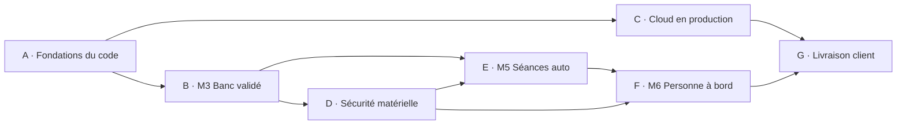

# Roadmap logicielle Anheart : de l'état actuel au produit livré chez les clients

> Source de vérité des tâches : le projet Linear **Roadmap Software** (équipe Gaura).
> Ce document explique la logique de la roadmap, l'ordre des jalons, les fils de travail et comment suivre le projet.
> Mis à jour le 2 octobre 2026 (revue chef de projet : 27 tickets ajoutés ANH-127 à ANH-153, 20 sous-tickets ANH-154 à ANH-173, 3 fermés comme remplacés, 10 fils de travail, étiquettes Fil / Taille / Qui / Matériel).
>
> **Deux documents Linear à lire avant de prendre un ticket :** *Processus de développement* (branches `develop` et `main`, une PR par ticket, un développeur et deux reviewers agents, CI verte, commentaire de clôture) et *File d'exécution pour les agents* (l'ordre des tickets).
>
> **Une release** (passage de `develop` à `main`) suit [release.md](release.md) : versions `pi-X.Y.Z`, `cloud-X.Y.Z` et `web-X.Y.Z`, changelog, check-list, niveau de validation de chaque version du Pi.

## 1. Où on en est

| Couche | État |
|---|---|
| Raspberry Pi (console locale, pilotage, sécurité) | **Fait et testé en simulation** : ~3190 tests, 100 % de branches sur la chaîne de sécurité, 66 défauts variateur gérés, 6 capteurs, caméra/présence prête (simulée), âge minimum, séances auto/manuel. **Jamais validé sur la vraie machine avec ces fonctions.** Pas de persistance disque des séances, pas de version logicielle envoyée, console protégée par un seul jeton partagé. |
| Simulation (`simulation/`) | **Fait** : géométrie issue de la CAO, 66 scénarios, cohorte de 30 personnes de 10 à 50 ans, 199 pannes toutes réussies, visualiseur 2D, résultat instantané. Ne sait pas encore rejouer une séance réelle. |
| Convex | **Version précédente en production.** Le nouveau schéma (`convex/training.ts`, droits de lancement, télémétrie, champs de séance auto/manuel) est **déployé sur le développement** depuis le 1er octobre 2026 et testé de bout en bout avec une console simulée ([deploiement.md](deploiement.md)). Il reste à **redéployer la production** (ANH-82). Aucun test Convex, pas d'organisations, pas d'audit, pas de version de contrat. |
| Tableau de bord (site) | **Site Next.js déjà en production** (ancienne version). Les nouvelles pages (machine en direct, droits de lancement, séances auto) tournent en local contre le Convex de développement : toutes ouvertes dans un navigateur le 2 octobre 2026, captures réelles dans le guide. Pas encore déployées, pas de test automatisé. Défauts relevés dans ANH-122 (scindé en ANH-154 à ANH-160). |
| Déploiement | **Simulation hébergée** en ligne (`anheart-simulation.vercel.app`). **Image Docker du Pi** prête et essayée en simulation, jamais sur un vrai Pi. Pas de CI, pas de CD, pas d'OTA, pas de supervision. Le processus de release est écrit et outillé ([release.md](release.md)), mais aucune release n'a encore été faite. |
| Sécurité matérielle | **Hors de cette roadmap** (projet Roadmap Hardware) : STO ponté, pas de frein, pas d'arrêt dans la capsule, pas de porte ni de capteur de harnais. La partie logicielle correspondante (lecture des entrées, règles, pré-vol) reste ici, codée en simulation d'abord (ANH-92 à ANH-97). |
| Médical et réglementaire | **Rien de signé** : toutes les valeurs médicales sont des placeholders. |

En jalons : le **logiciel** est entre M3 et M5, la **machine** est à M3 (banc, capsule vide).

## 2. Les 7 jalons, dans l'ordre

| Jalon | Objectif | Condition de sortie |
|---|---|---|
| **A · Fondations du code** | Ne plus risquer de perdre le travail ; tester automatiquement chaque changement ; versionner | Code commité et relu sur `develop`, CI obligatoire avec tests Convex, contrat Pi ↔ Convex versionné, processus de release, format d'enregistrement v2 et boîte noire, ancien mode ECG retiré |
| **B · M3, banc validé** | Vérifier le logiciel sur la vraie machine, capsule vide | Paramètres variateur figés, temps d'arrêt et coupure secteur mesurés, défauts réels vérifiés, **décision go/no-go sur l'ECG en rotation**, Pi installé et durci |
| **C · Cloud en production** | Convex et site déployés, sûrs, multi-organisation, conformes | Déployé, multi-organisation (Clerk Organizations), E2E verts, avis données de santé obtenu, statut réglementaire qualifié, catalogue de programmes, configuration centralisée, enregistrements déposés et rejouables, parcours passager complet (roster, identité, authentification, pré-vol, aptitude, incidents) |
| **D · Sécurité matérielle intégrée** | Aucune sécurité ne repose sur le seul logiciel | Partie logicielle de STO, frein, arrêt capsule, harnais/porte, caméra, survitesse codée en simulation et validée au banc après le câblage (hors roadmap logicielle) |
| **E · M5, séances auto validées** | Autoriser les séances pilotées par la FC | Décisions médicales signées (fichier signé vérifié au démarrage), profils cliniques publiés par le catalogue, régulation réglée, retour passager collecté, revue go/no-go enregistrée dans le registre machine |
| **F · M6, personne à bord** | Premier passager | Analyse de risques, revue sécurité machine, procédures, protocole réalisé, revue enregistrée dans le registre machine |
| **G · Livraison client** | Produit autonome chez les clients | Mise en service par code d'appairage, OTA signé avec retour arrière, vues de flotte et alertes, carnet de bord, sauvegardes, doc client, audit externe, pilote réussi |

## 3. Les dix fils de travail

Les jalons disent *quand* une chose est due. Un agent travaille par *fil* : une suite ordonnée de tickets du même sujet (étiquette Linear « Fil »). Chaque fil a un critère de fin (document Linear « File d'exécution pour les agents », section D).

| Fil | Sujet | Tickets principaux |
|---|---|---|
| T1 Fondations | commit sur `develop`, CI avec tests Convex, contrat versionné, release, retrait de l'ancien mode ECG | ANH-71, 72, 125, 132, 133, 134, 135, 74, 73 |
| T2 Cloud | redéploiement, multi-organisation, corrections du site, E2E, clés, débit, audit, messages, CI/CD, sauvegardes | ANH-82, 121, 114, 154 à 160, 83, 165, 166, 167, 90, 123, 126, 118 |
| T3 Enregistrement et rejeu | format v2 partagé Pi / simulation, boîte noire, synchro par journal, dépôt Convex Storage, rejeu, rapports | ANH-127, 128, 129, 130, 131, 89 |
| T4 Programmes et config | paramètres médicaux signés, catalogue (équipe Anheart seule), publication revalidée par le Pi, configuration centralisée, prescription | ANH-139, 137, 138, 141, 140 |
| T5 Parcours passager | roster, identité à l'armement, confirmation physique, pré-vol, aptitude et consentement, incidents, retour passager | ANH-84, 144, 85, 142, 143, 145, 146, 101 |
| T6 Banc | variateur, temps d'arrêt et coupure secteur, défauts, ECG en rotation, capteurs et batterie, affichage console, régulation | ANH-76, 77, 78, 79, 80, 124, 100 |
| T7 Sécurité matérielle | partie logicielle de STO, frein, bouton capsule, interlocks, caméra, survitesse | ANH-92 à 97 |
| T8 Médical | avis données de santé, statut réglementaire, décisions médicales, profils, revues go/no-go, analyse de risques, procédures, premier passager | ANH-172, 173, 105, 98, 99, 102, 103, 104, 106, 107 |
| T9 Flotte | image Pi, registre machine, santé, carnet de bord, vues de flotte, OTA, mise en service, doc client, pilote | ANH-161 à 164, 147, 148, 149, 150, 168 à 171, 115, 119, 120 |
| T10 Sécurité logicielle | modèle de menaces, durcissement du Pi, authentification de la console, dépendances, secrets, audit externe | ANH-136, 151, 152, 153 |

## 4. Le chemin critique

1. **ANH-71** commiter sur `develop` → **ANH-72 + ANH-132** CI avec tests Convex.
2. **ANH-82 + ANH-121** redéployer Convex en production avec les clés hachées → **ANH-114** multi-organisation (Clerk Organizations).
3. **ANH-127 → 128 → 129** enregistrement v2 : toute l'analyse après incident en dépend.
4. **ANH-172** avis données de santé et **ANH-105** statut réglementaire : deux décisions humaines à obtenir en premier au jalon C.
5. **ANH-76 → ANH-77** paramètres variateur et temps d'arrêt ; **ANH-79** ECG en rotation : *si l'ECG n'est pas exploitable en rotation, le mode auto doit être repensé*. C'est le plus gros risque technique du projet.
6. **ANH-98 → ANH-139** décisions médicales signées et vérifiées par le logiciel.
7. **ANH-102** revue go/no-go M5 → **ANH-107** premier passager → **ANH-120** pilote client.

## 5. Comment suivre le projet

- **Linear** : projet *Roadmap Software*, vue par jalon (A → G) et par fil (étiquette « Fil »). Chaque ticket suit le gabarit : Objectif, Contexte, Exigences `EX-n`, Hors périmètre, Critères d'acceptation, Dépendances, Risque pour la personne à bord, Étiquettes. Un ticket n'est Done que si sa PR est fusionnée avec l'avis indépendant sur son commit de tête (statut de commit `agent-review/R1`), la CI verte et le commentaire de clôture.
- **Étiquettes** : domaine (`Raspberry Pi`, `Convex`, `Tableau de bord`, `Sécurité`, `Simulation & tests`, `Validation banc`, `Médical & réglementaire`, `Déploiement & exploitation`, `Documentation`), **Fil** (T1 à T10), **Taille** (S, M, L, XL), **Qui** (agent, humain), **Matériel** (aucun, banc). Filtre pour un agent : `agent` + `aucun`.
- **Priorités** : Urgent = chemin critique ou risque pour une personne ; Haute = nécessaire au jalon ; Moyenne = amélioration du jalon.
- **Documents Linear** : *Processus de développement*, *File d'exécution pour les agents*, *Roadmap logicielle : guide de suivi*, *Architecture fonctionnelle cible*, *Architecture DB*, *Stack technique*, *Documentation Anheart : sommaire*.
- **Règles d'équipe** :
  - toute PR passe la CI (gates Pi, simulation, Convex, site, audit) et reçoit un avis indépendant, enregistré comme statut de commit `agent-review/R1` sur son commit de tête ;
  - toute PR qui change un comportement met à jour `docs/` ;
  - une release suit [release.md](release.md), et une machine ne reçoit qu'une version du Pi validée pour son état ;
  - rien de ce qui touche la chaîne de sécurité (`raspberry-pi/src/training`, `src/motor`, `src/ecg_pipeline.py`, `src/presence`, `src/record`, `src/preflight.py`, `convex/training.ts`, `convex/lib/auth.ts`, `convex/http.ts`) n'est fusionné sans que les deux reviewers écrivent quels invariants ils ont vérifiés ;
  - le Pi décide : tout ce qui descend du cloud est revalidé par le Pi ;
  - une clé de sûreté change à deux, et sur place ;
  - une valeur `[MED]` ne change qu'avec une décision médicale écrite et signée ;
  - `PROGRAMS_ENABLED` et `OCCUPANCY_OCCUPIED_ENABLED` ne passent à `true` que par une revue enregistrée dans le registre machine (ANH-102, ANH-107) ;
  - aucune donnée de santé hors des endroits décidés par ANH-172 ;
  - toute séance réelle est rejouée ; un écart inexpliqué est un ticket ;
  - pas de serveur à maintenir : Convex, Vercel, Clerk, GitHub Actions, OTA hébergé.
- **Revue hebdomadaire** : avancement par fil et par jalon, tickets bloqués, risques nouveaux (à ajouter comme tickets), relecture de `docs/menaces.md` à chaque jalon.

## 6. Documentation liée

- [`docs/README.md`](README.md) : sommaire de la documentation technique.
- [`docs/securite.md`](securite.md) : ce que le logiciel garantit et ne garantit pas.
- [`docs/deploiement.md`](deploiement.md) : état du déploiement Convex, Vercel et Docker.
- [`docs/release.md`](release.md) : versions des trois composants, changelog, check-list de release, version validée par machine.
- [`simulation/README.md`](../simulation/README.md) : framework de test, batterie, cohorte, matrice de pannes.
- À créer par les tickets : `docs/enregistrement.md` (ANH-127), `docs/programmes.md` (ANH-137), `docs/menaces.md` (ANH-136), `docs/pi-image.md` (ANH-161), `docs/exploitation.md` (ANH-150), `docs/secrets.md` (ANH-153), `docs/consentement.md` (ANH-143).
